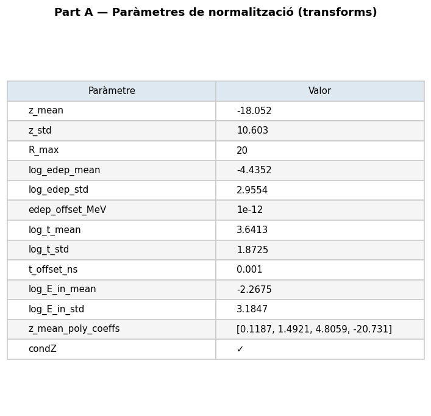
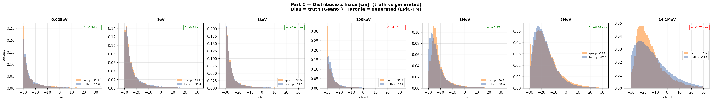
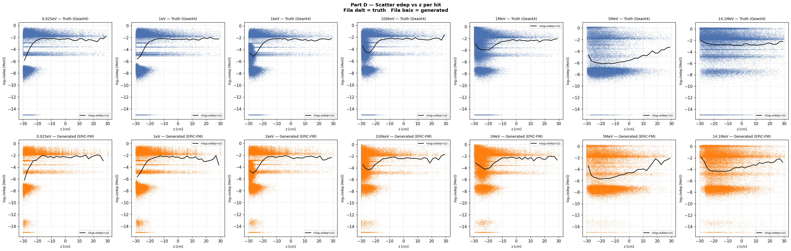
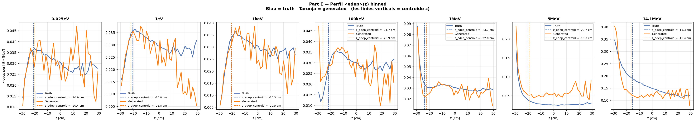

# run_018 — bins=16, 200k

❌ Degradat

## Motivació

Mateixos paràmetres que run_015 però amb 200k iteracions. Verificar si 100k són suficients o calen més per a Model B convergeixi completament.

## Configuració

| Paràmetre | Valor |
|-----------|-------|
| Iteracions | 200000 |
| feature_scale | 2.0 |
| global_dim | 64 |
| batch_size | 256 |
| Learning rate | 0.0003 |
| n_energy_bins | 16 |
| focal_gamma | 0.0 |
| sum_scale_nmax | True |

## Mètriques per energia

| Energia | edep_z_bias | W1(z) | W1(log_edep) | peak_r0 |
|---------|-------------|-------|--------------|---------|
| (|·| < 2.0) | (< 1.0) | (< 0.10) | (> 0.70) |
| 0.025eV    | ✅ 0.50     | ✅ 0.347    | ❌ 0.2852   | ✅ 2.030    |
| 1eV        | ✅ -0.94    | ✅ 0.729    | ✅ 0.0555   | ✅ 1.346    |
| 1keV       | ✅ -0.19    | ✅ 0.083    | ✅ 0.0156   | ✅ 1.007    |
| 100keV     | ❌ -4.23    | ⚠️ 1.130    | ⚠️ 0.1584   | ✅ 0.993    |
| 1MeV       | ✅ 1.71     | ✅ 0.929    | ⚠️ 0.1130   | ✅ 0.976    |
| 5MeV       | ✅ 1.68     | ✅ 0.936    | ❌ 0.6624   | ✅ 1.209    |
| 14.1MeV    | ✅ -1.04    | ❌ 2.206    | ❌ 1.3450   | ✅ 0.739    |
| **Mitjana** | **1.47** | **0.91** | **0.376** | **1.186** |

### Interpretació

- **edep_z_bias**: desplaçament del centroid d'energia. < 2cm = acceptable.
- **W1(z)**: distància W1 en z. < 1cm = acceptable, < 2cm = warning.
- **W1(log_edep)**: distància W1 en edep logarítmic. < 0.10 = acceptable.
- **peak_r0_ratio**: proporció del peak a r=0. > 0.70 = acceptable.

## Gràfics

### A — Transforms

Distribucions de features normalitzades (vs real).



### B — Z per energia (truth)

Distribució de z per energia en les dades de veritat.


### C — Z físic

Distribució de z en unitats físiques (truth vs generated).



### D — Scatter edep vs z

Relació entre edep i z (scatter plots).



### E — Perfil edep vs z

Perfil de edep al llarg de z.



### F — Summary

Resum textual de mètriques.

```
=================================================================
PART F — Resum diagnosi biaix edep_z
=================================================================

z_global_mean  = -18.052 cm
z_global_std   = 10.603 cm

Si el model aprèn distribucions en espai normalitzat i el pull
de la cascada ràpida (z_mean_fast - z_global_mean)/z_global_std
és gran (> 1.5σ), el model ha de desplaçar molt el z i pot
quedar un biaix residual consistent.

Energies amb biaix observat a run_001:
  1 MeV:    edep_z_bias = -2.14 cm   z_peak_bias = +1.03 cm
  5 MeV:    edep_z_bias = -2.54 cm   z_peak_bias = +1.03 cm
 14.1 MeV:  edep_z_bias = -2.48 cm   z_peak_bias = +0.81 cm

Paradoxa: z_peak_bias > 0 però edep_z_bias < 0
→ El pic geomètric és lleugerament massa lluny PERÒ
  l'energia es concentra massa a prop de z=0.
→ Possible distorsió de la correlació edep(z), no només desplaçament rígid.

Comprovació clau (Part C):
  Si el biaix Δz ja existeix en espai NORMALITZAT → error del model.
  Si el biaix només apareix en espai FÍSIC        → error del transform.

Veure figures:
  B_z_per_energy_truth.png  → quantifica el 'pull' de normalització
  C_z_norm_vs_phys.png      → on apareix el biaix (norm vs físic)
  D_edep_vs_z_scatter.png   → correlació edep(z) per hit
  E_edep_z_profile.png      → perfil <edep>(z) binnat truth vs gen
```

## Runs comparats

[013](run_013.md) [014](run_014.md) [015](run_015.md) [016](run_016.md) [017](run_017.md) 

---

[← Torna a l'índex](../index.md)
