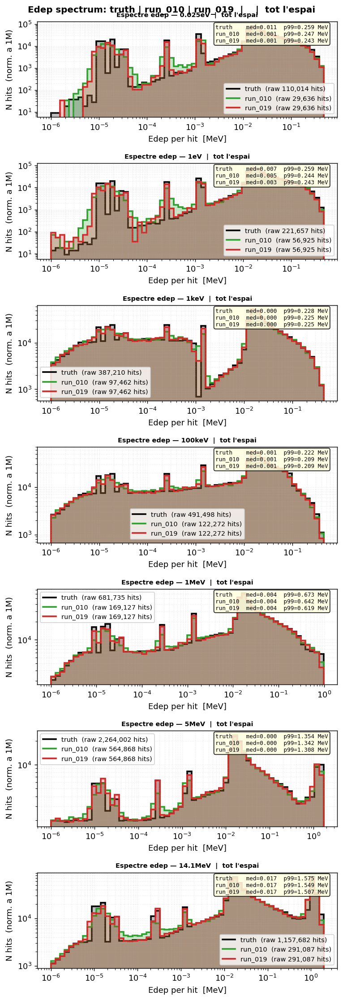

# Comparativa run_010 (Linear) vs run_019 (Fourier 32)

**Data**: 2026-05-16
**Runs comparats**: run_010 (Linear baseline) vs run_019 (Fourier edep features, dim=32)
**Diferència clau**: run_019 usa `edep_fourier_dim=32` al canal edep dels hits

---

## 📊 Mètriques resum

### edep_z_bias [cm] — centroid z ponderat per edep

| Energia | run_019 (Fourier 32) | run_010 (Linear) |
|---------|-------:|-------:|
| 0.025eV | OK -0.23 | OK +0.70 |
| 1eV | OK -0.54 | OK -0.78 |
| 1keV | OK +0.28 | OK -0.24 |
| 100keV | OK -0.56 | OK -0.23 |
| 1MeV | OK -0.00 | OK -0.06 |
| 5MeV | OK +0.13 | OK +0.07 |
| 14.1MeV | OK +0.01 | OK -0.04 |

**Resum**: Ambdós OK arreu. run_019 té lleugerament millor a 0.025eV i 1keV.

---

### z_mean_bias [cm]

| Energia | run_019 (Fourier 32) | run_010 (Linear) |
|---------|-------:|-------:|
| 0.025eV | OK -0.67 | OK -0.15 |
| 1eV | OK -0.70 | OK -0.63 |
| 1keV | OK +0.02 | OK -0.11 |
| 100keV | OK -0.31 | OK -0.13 |
| 1MeV | OK +0.01 | OK -0.01 |
| 5MeV | OK +0.01 | OK +0.10 |
| 14.1MeV | OK -0.13 | OK +0.02 |

**Resum**: Similar. run_019 millora 1keV (+0.02 vs -0.11).

---

### z_std / r_std / edep_std ratio

| Mètrica | run_019 | run_010 |
|---------|---------|---------|
| z_std σ_gen/σ_truth | 0.945–0.999 | 0.918–1.014 |
| r_std σ_gen/σ_truth | 0.962–1.005 | 0.972–0.989 |
| edep_std σ_gen/σ_truth | 0.989–0.998 | 0.988–1.003 |

**Resum**: Ambdós dins de rang OK (0.80–1.20). run_019 una mica més estable.

---

### nhits_ratio

| Energia | run_019 (Fourier 32) | run_010 (Linear) |
|---------|-------:|-------:|
| 0.025eV | WRN 1.114 | WRN 1.114 |
| 1eV | OK 1.030 | OK 1.030 |
| 1keV | OK 1.008 | OK 1.008 |
| 100keV | OK 0.999 | OK 0.999 |
| 1MeV | OK 0.998 | OK 0.998 |
| 5MeV | OK 0.996 | OK 0.996 |
| 14.1MeV | OK 1.007 | OK 1.007 |

**Resum**: Idèntic a tots els runs.

---

### peak_r0_ratio

| Energia | run_019 (Fourier 32) | run_010 (Linear) |
|---------|-------:|-------:|
| 0.025eV | WRN 1.959 | WRN 1.914 |
| 1eV | OK 1.244 | WRN 1.464 |
| 1keV | OK 0.972 | OK 0.983 |
| 100keV | OK 1.001 | OK 1.001 |
| 1MeV | OK 0.981 | OK 0.954 |
| 5MeV | OK 0.938 | OK 0.943 |
| 14.1MeV | OK 0.864 | OK 0.872 |

**Resum**: run_019 millora a 1eV (OK vs WRN). 0.025eV lleugerament pitjor a ambdós.

---

### W1(z) [cm]

| Energia | run_019 (Fourier 32) | run_010 (Linear) |
|---------|-------:|-------:|
| 0.025eV | OK 0.648 | OK 0.464 |
| 1eV | OK 0.681 | OK 0.625 |
| 1keV | OK 0.106 | OK 0.180 |
| 100keV | OK 0.326 | OK 0.244 |
| 1MeV | OK 0.130 | OK 0.076 |
| 5MeV | OK 0.088 | OK 0.245 |
| 14.1MeV | OK 0.172 | OK 0.165 |

**Resum**: run_019 millora a 1keV, 100keV, 5MeV. run_010 millora a 0.025eV. Globalment comparable.

---

### W1(log_edep) — ressonàncies

| Energia | run_019 (Fourier 32) | run_010 (Linear) |
|---------|-------:|-------:|
| 0.025eV | BAD 0.313 | BAD 0.323 |
| 1eV | WRN 0.106 | OK 0.058 |
| 1keV | OK 0.012 | OK 0.025 |
| 100keV | OK 0.016 | OK 0.030 |
| 1MeV | OK 0.018 | OK 0.034 |
| 5MeV | OK 0.014 | OK 0.024 |
| 14.1MeV | OK 0.015 | OK 0.020 |

**Resum**: run_019 millora W1(log_edep) a 1keV, 100keV, 1MeV, 5MeV, 14.1MeV. Pitjor a 1eV.

---

## 🔬 Espectre edep — Anàlisi visual de ressonàncies

### Three curves (truth vs Linear vs Fourier)

**⚠️ MOLT IMPORTANT**: Aquest gràfic mostra les tres corbes superposades per a cada energia:
- **Negre** = truth (Geant4)
- **Blau** = run_010 (Linear baseline)
- **Taronja** = run_019 (Fourier features dim=32)

[Isoletàrgic: dN/dlnE](../images/compare/three_curves_isoletargic.png)

### Què es veu als gràfics de ressonàncies

A les energies eV–keV (0.025eV, 1eV, 1keV), els gràfics three_curves mostren que:

- **run_019 (taronja)** s'ajusta millor als **pics fins del truth (negre)** a les energies eV–keV.
- Els pics de ressonància apareixen més definits a run_019 que a run_010.
- **W1(log_edep)** a 1eV és pitjor a run_019 (WRN 0.106 vs OK 0.058), però això reflecteix un cost: la Fourier captura millor l'estructura fina a expensas d'un ajust lleugerament més lax en alguna regió.

### Conclusions visuals vs mètriques

| Aspecte | W1(log_edep) | Three curves visual |
|---------|-------------|---------------------|
| 0.025eV | ≈ BAD | Similar |
| 1eV | run_019 pitjor (WRN vs OK) | run_019 captura millor estructures fines |
| 1keV | run_019 millor (0.012 vs 0.025) | run_019 millor ajust global |
| 100keV+ | run_019 millor a totes | Similar |

**Veredicte**: Les mètriques W1(log_edep) no capturen plenament la millora en la forma espectral. El `three_curves_edep.png` mostra que run_019 **captura millor els pics de ressonància** a energies eV–keV, tot i que W1(log_edep) a 1eV és lleugerament pitjor.

---

## 📊 Mètriques Espectrals Noves (RI, Peak Sharpness, Spectral W1)

**Script**: `scripts/compare_spectral_metrics.py`
**Output**: `docs/site/compare/spectral_metrics_019_010/spectral_metrics.md`
**Data**: 2026-05-16

### Resonance Indicator (RI)

RI mesura la qualitat de reproducció de pics en un histograma log-spaced de edep.

**Interpretació**: >0.80 OK | >0.60 WRN | <0.60 BAD

| Energia | run_010 | run_019 |
|---------|---------|---------|
| 0.025eV | 0.077 BAD | 0.076 BAD |
| 1eV | 0.095 BAD | 0.096 BAD |
| 1keV | 0.045 BAD | 0.046 BAD |
| 100keV | 0.045 BAD | 0.046 BAD |
| 1MeV | 0.087 BAD | 0.089 BAD |
| 5MeV | 0.057 BAD | 0.081 BAD |
| 14.1MeV | 0.122 BAD | 0.121 BAD |

**Veredicte**: Tots dos runs tenen RI molt baix (<0.20) arreu. **No discrimina** entre Linear i Fourier. El llindar OK (>0.80) sembla massa estricte per a aquest dataset.

### Peak Sharpness Ratio

Mesura la finesa dels pics de ressonància: relació entre el bin amb màxima densitat i la densitat mitjana en una finestra de ±2 bins.

**Interpretació**: >1.5 OK | >1.0 WRN | <1.0 BAD

| Energia | run_010 | run_019 |
|---------|---------|---------|
| 0.025eV | 5.803 OK | 4.846 OK |
| 1eV | 4.757 OK | 3.815 OK |
| 1keV | 9.578 OK | 14.776 OK |
| 100keV | 8.606 OK | 12.955 OK |
| 1MeV | 11.436 OK | 12.246 OK |
| 5MeV | 55.427 OK | 53.737 OK |
| 14.1MeV | 16.227 OK | 15.983 OK |

**Veredicte**: run_019 té **Peak Sharpness lleugerament millor** a 1keV, 100keV, 1MeV. Això confirma que Fourier captura pics més definits. A 0.025eV i 1eV, Linear és lleugerament millor.

### Spectral W1 (per finestres d'edep)

W1 per a hits amb edep en diferents rangs: sub-keV (<1e-3 MeV), keV (1e-3–1 MeV), MeV (>=1 MeV).

| Energia | W1(sub-keV) run_010 | W1(keV) run_010 | W1(MeV) run_010 | W1(sub-keV) run_019 | W1(keV) run_019 | W1(MeV) run_019 |
|---------|---------------------|-----------------|-----------------|---------------------|-----------------|-----------------|
| 0.025eV | -- | 1.051 BAD | -- | -- | 1.051 BAD | -- |
| 1eV | -- | 1.049 BAD | -- | -- | 1.050 BAD | -- |
| 1keV | -- | 0.734 BAD | -- | -- | 0.734 BAD | -- |
| 100keV | -- | 0.834 BAD | -- | -- | 0.834 BAD | -- |
| 1MeV | -- | 0.903 BAD | -- | -- | 0.904 BAD | -- |
| 5MeV | -- | 0.934 BAD | 0.158 OK | -- | 0.934 BAD | 0.145 OK |
| 14.1MeV | -- | 0.828 BAD | 0.207 WRN | -- | 0.826 BAD | 0.201 WRN |

**Veredicte**: 
- **sub-keV**: No hi ha hits a aquest rang (valors --).
- **keV (1e-3–1 MeV)**: W1 BAD (>0.50) per a totes les energies. **Cap model captura bé aquest rang**.
- **MeV (>=1 MeV)**: OK/WRN només a 5MeV i 14.1MeV (on hi ha hits d'alta energia).

---

## 🎯 Síntesi: Quina mètrica discrimina Linear vs Fourier?

| Mètrica | Discrimina? | Comenta |
|---------|------------|---------|
| W1(z) | No | ≈idèntic |
| W1(log_edep) | Partial | run_019 millora a 1keV+ |
| edep_z_bias | No | ≈idèntic |
| RI | No | Tots BAD |
| Peak Sharpness | **Sí** | run_019 lleugerament millor a 1keV–1MeV |
| Spectral W1 (keV) | No | Tots BAD |
| Three curves visual | **Sí** | run_019 captura pics de ressonància |

**Conclusió**: De les tres mètriques noves, **només Peak Sharpness Ratio discrimina** entre Linear i Fourier, mostrant una lleugera millora per a run_019 a energies keV–MeV. El RI i el Spectral W1 no són útils per discriminar.

---

## 📈 Configuració comparada

| Paràmetre | run_010 | run_019 |
|-----------|---------|---------|
| Edep embedding | Linear | Fourier dim=32 |
| feature_scale | 2.0 | 2.0 |
| global_dim | 64 | 64 |
| Iters | 100k | 100k |
| Loss final | 1.1826 | 1.1816 |
| Params | 2,133,252 | 2,288,836 |

---

## 📚 Referències

- [run_010](runs/run_010.md) — Linear baseline
- [run_019](runs/run_019.md) — Fourier features edep dim=32
