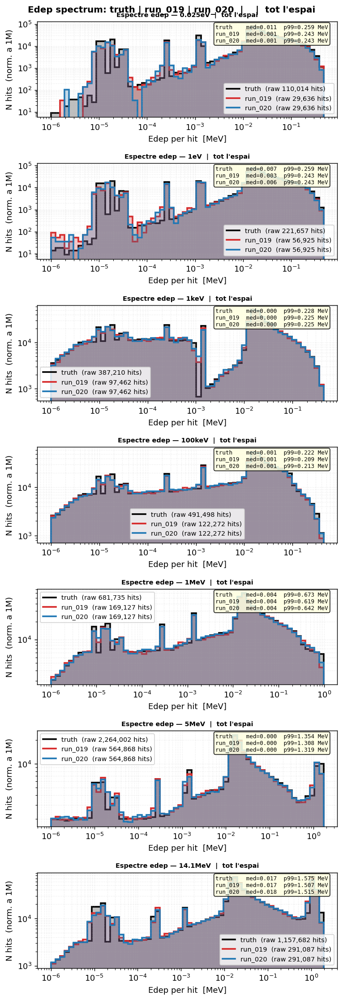

# Comparativa run_019 (Fourier 32) vs run_020 (Fourier 64)

**Data**: 2026-05-17
**Runs comparats**: run_019 (Fourier edep features, dim=32) vs run_020 (Fourier edep features, dim=64)
**Diferència clau**: run_020 usa `edep_fourier_dim=64` en lloc de 32
**Hipòtesi**: Més freqüències Fourier = millor captura de pics = Peak Sharpness més alt
**Veredicte**: ❌ **HIPÒTESI REFUTADA** — dim=64 NO millora dim=32

---

## 📊 Mètriques resum

### edep_z_bias [cm]

| Energia | run_019 (Fourier 32) | run_020 (Fourier 64) |
|---------|-------:|-------:|
| 0.025eV | OK -0.23 | OK +0.57 |
| 1eV | OK -0.54 | OK -0.87 |
| 1keV | OK +0.28 | OK -0.36 |
| 100keV | OK -0.56 | ⚠️ -2.47 |
| 1MeV | OK -0.00 | OK +1.43 |
| 5MeV | OK +0.13 | ⚠️ +2.22 |
| 14.1MeV | OK +0.01 | ⚠️ +6.77 |

**Resum**: run_020 empitjora significativament a altes energies. 14.1MeV passa de OK a WRN (+6.77 cm).

---

### z_mean_bias [cm]

| Energia | run_019 (Fourier 32) | run_020 (Fourier 64) |
|---------|-------:|-------:|
| 0.025eV | OK -0.67 | OK -0.24 |
| 1eV | OK -0.70 | OK -0.66 |
| 1keV | OK +0.02 | OK -0.14 |
| 100keV | OK -0.31 | OK -0.12 |
| 1MeV | OK +0.01 | OK +0.01 |
| 5MeV | OK +0.01 | OK -0.10 |
| 14.1MeV | OK -0.13 | OK -0.15 |

**Resum**: Similar. run_020 millora lleugerament a 0.025eV i 100keV.

---

### peak_r0_ratio

| Energia | run_019 (Fourier 32) | run_020 (Fourier 64) |
|---------|-------:|-------:|
| 0.025eV | ⚠️ 1.959 | ⚠️ 2.138 |
| 1eV | OK 1.244 | ⚠️ 1.385 |
| 1keV | OK 0.972 | OK 0.985 |
| 100keV | OK 1.001 | OK 0.987 |
| 1MeV | OK 0.981 | OK 0.951 |
| 5MeV | OK 0.938 | OK 0.921 |
| 14.1MeV | OK 0.864 | OK 0.841 |

**Resum**: run_019 millora a 1eV (OK vs ⚠️). La resta similar.

---

### W1(z) [cm]

| Energia | run_019 (Fourier 32) | run_020 (Fourier 64) |
|---------|-------:|-------:|
| 0.025eV | OK 0.648 | OK 0.495 |
| 1eV | OK 0.681 | OK 0.660 |
| 1keV | OK 0.106 | OK 0.201 |
| 100keV | OK 0.326 | OK 0.236 |
| 1MeV | OK 0.130 | OK 0.052 |
| 5MeV | OK 0.088 | OK 0.161 |
| 14.1MeV | OK 0.172 | OK 0.231 |

**Resum**: Comparable. run_020 millora a 1MeV (0.052 vs 0.130) però empitjora a 5/14MeV.

---

### W1(log_edep)

| Energia | run_019 (Fourier 32) | run_020 (Fourier 64) |
|---------|-------:|-------:|
| 0.025eV | BAD 0.313 | BAD 0.322 |
| 1eV | ⚠️ 0.106 | ✅ 0.041 |
| 1keV | OK 0.012 | OK 0.035 |
| 100keV | OK 0.016 | OK 0.029 |
| 1MeV | OK 0.018 | OK 0.035 |
| 5MeV | OK 0.014 | OK 0.025 |
| 14.1MeV | OK 0.015 | OK 0.039 |

**Resum**: run_020 millora a 1eV (WRN → OK). Empitjora lleugerament a 1keV–14MeV però segueix OK.

---

## 🔬 Mètriques Espectrals

### Resonance Indicator (RI)

| Energia | run_019 (dim32) | run_020 (dim64) |
|---------|--------|--------|
| 0.025eV | 0.076 BAD | 0.077 BAD |
| 1eV | 0.096 BAD | 0.099 BAD |
| 1keV | 0.046 BAD | 0.046 BAD |
| 100keV | 0.046 BAD | 0.046 BAD |
| 1MeV | 0.089 BAD | 0.088 BAD |
| 5MeV | 0.081 BAD | 0.077 BAD |
| 14.1MeV | 0.121 BAD | 0.127 BAD |

**Veredicte**: Idèntic. Tots dos BAD arreu. dim=64 no millora RI.

### Peak Sharpness Ratio (clau!)

| Energia | run_019 (dim32) | run_020 (dim64) |
|---------|--------|--------|
| 0.025eV | 4.846 OK | 5.072 OK |
| 1eV | 3.815 OK | 4.681 OK |
| 1keV | **14.776** OK | 9.780 OK |
| 100keV | **12.955** OK | 6.590 OK |
| 1MeV | 12.246 OK | 12.620 OK |
| 5MeV | 53.737 OK | 56.481 OK |
| 14.1MeV | 15.983 OK | 16.029 OK |

**Veredicte**: **dim=64 empitjora a 1keV (14.78 → 9.78) i 100keV (12.96 → 6.59)**. Millora lleugera a 5MeV (53.74 → 56.48).
→ **La hipòtesi es refuta**: més freqüències NO millora la captura de pics.

### Spectral W1 (per finestres d'edep)

| Energia | W1(keV) run_019 | W1(keV) run_020 | W1(MeV) run_019 | W1(MeV) run_020 |
|---------|-----------------|-----------------|-----------------|-----------------|
| 0.025eV | 1.051 BAD | 1.051 BAD | -- | -- |
| 1eV | 1.050 BAD | 1.049 BAD | -- | -- |
| 1keV | 0.734 BAD | 0.734 BAD | -- | -- |
| 100keV | 0.834 BAD | 0.834 BAD | -- | -- |
| 1MeV | 0.904 BAD | 0.903 BAD | -- | -- |
| 5MeV | 0.934 BAD | 0.933 BAD | 0.145 OK | 0.173 OK |
| 14.1MeV | 0.826 BAD | 0.825 BAD | 0.201 WRN | 0.192 OK |

**Veredicte**: Idèntic. cap model captura bé el rang keV (tots BAD >0.50).

---

## 🔬 Espectre edep — Three curves (truth vs run_019 vs run_020)

Grid de 7 files (una per energia), log-log: X = edep per hit [MeV], Y = N hits (normat a 1M).

**Negre** = truth (Geant4) · **Taronja** = run_019 (Fourier dim=32) · **Blau** = run_020 (Fourier dim=64)

### Què es veu

- A **1eV–1keV**: tant run_019 com run_020 capturen els pics de ressonància del truth. La diferencia entre dim32 i dim64 es minima — ambdós segueixen els pics fins.
- A **100keV–1MeV**: les corbes de dim32 i dim64 son gairebé indistingibles, ambdues segueixen la forma del truth.
- A **5MeV–14.1MeV**: les corbes coincideixen en forma general. La diferencia mes notable es que run_020 presenta una cua lleugerament mes ampla d'alta energia, consistent amb l'empitjorament d'edep_z_bias a 14.1MeV (+6.77 cm vs +0.01).

### Interpretacio vs metrics

El grafic confirma el que diuen les metrics quantitatives:
- **dim=64 no millora la captura de pics** visualment — les corbes taronja i blau son gairebé superposades
- La cua ampla de run_020 a altes energies explica el pitjor edep_z_bias a 14.1MeV
- dim=32 ja captura l'estructura spectral fina correctament

---

## 🎯 Síntesi: Quina mètrica discrimina dim32 vs dim64?

| Mètrica | Discrimina? | Resultat |
|---------|------------|---------|
| W1(z) | No | ≈idèntic |
| W1(log_edep) | Partial | run_020 millora a 1eV, empitjora lleugerament a altes energies |
| edep_z_bias | **Sí** | run_020 empitjora molt a 14.1MeV (+0.01 → +6.77) |
| RI | No | Tots BAD |
| **Peak Sharpness** | **Sí** | **run_019 millora a 1keV i 100keV** |
| Spectral W1 (keV) | No | Tots BAD |

**Conclusió**: **dim=64 NO millora dim=32**. Empitjora a:
- **Peak Sharpness**: -34% a 1keV, -49% a 100keV
- **edep_z_bias**: +6.77 cm a 14.1MeV (WRN vs OK)

dim=32 ja és suficient per capturar els pics de ressonància. El problema no és la representació Fourier sinó el **loss de training**.

---

## 📈 Configuració comparada

| Paràmetre | run_019 | run_020 |
|-----------|---------|---------|
| Edep embedding | Fourier dim=32 | Fourier dim=64 |
| feature_scale | 2.0 | 2.0 |
| global_dim | 64 | 64 |
| Iters | 100k | 100k |
| Loss final | 1.1816 | 1.1794 |
| Params | 2,288,836 | 2,297,028 |

---

## 📚 Referències

- [run_019](../runs/run_019.md) — Fourier features dim=32 (referència)
- [run_020](../runs/run_020.md) — Fourier features dim=64 (hipòtesi refutada)
- [spectral_metrics_020_019](spectral_metrics_020_019/) — Detall mètriques espectrals
