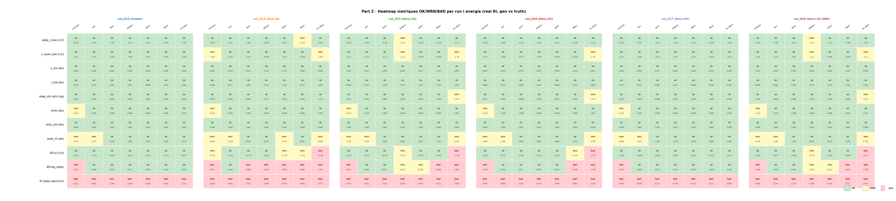
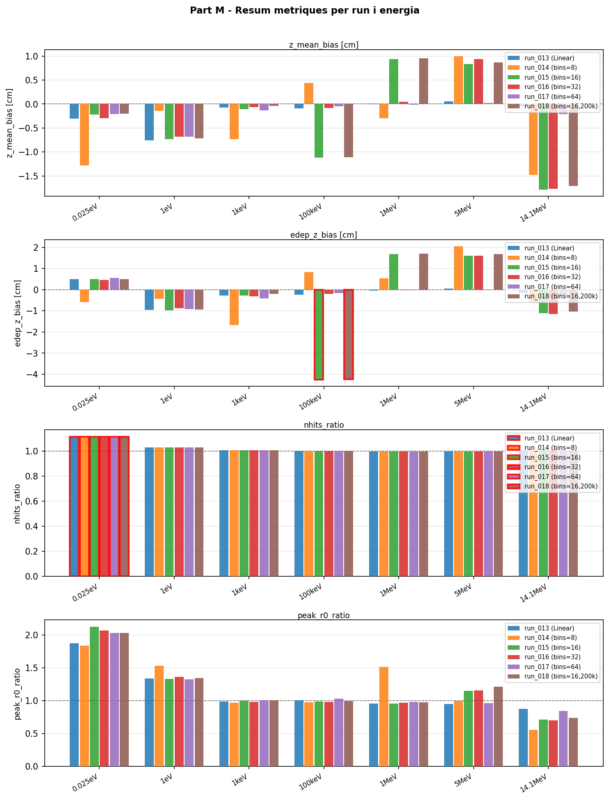

# Comparativa Model B (n_energy_bins) vs Linear

Comparativa dels runs 013-018. Tots amb `feature_scale=2.0`, `global_dim=64`, 5000 samples/energia.

## Runs

| Run | Model | n_bins | Iteracions | Resultat |
|-----|-------|--------|------------|----------|
| [run_013](../runs/run_013.md) | Linear | — | 100k | ✅ Acceptable |
| [run_014](../runs/run_014.md) | Model B | 8 | 100k | ❌ Degradat |
| [run_015](../runs/run_015.md) | Model B | 16 | 100k | ❌ Degradat |
| [run_016](../runs/run_016.md) | Model B | 32 | 100k | ❌ Degradat |
| [run_017](../runs/run_017.md) | Model B | 64 | 100k | ✅ Acceptable |
| [run_018](../runs/run_018.md) | Model B | 16 | 500k | ❌ Degradat |

## W1(z) — Distància en z (cm)

**Acceptable: < 1.0 cm** | Warning: < 2.0 cm | ❌: > 2.0 cm

| Energia      | run_013 (Linear) | run_014 (bins=8) | run_015 (bins=16) | run_016 (bins=32) | run_017 (bins=64) | run_018 (bins=16,200k) |
---         |---|---|---|---|---|---|
| 0.025eV      | 0.315      ✅ | 1.264      ⚠️ | 0.394      ✅ | 0.344      ✅ | 0.356      ✅ | 0.347      ✅ |
| 1eV          | 0.736      ✅ | 0.590      ✅ | 0.761      ✅ | 0.722      ✅ | 0.695      ✅ | 0.729      ✅ |
| 1keV         | 0.098      ✅ | 0.705      ✅ | 0.136      ✅ | 0.079      ✅ | 0.092      ✅ | 0.083      ✅ |
| 100keV       | 0.149      ✅ | 0.451      ✅ | 1.154      ⚠️ | 0.137      ✅ | 0.086      ✅ | 1.130      ⚠️ |
| 1MeV         | 0.146      ✅ | 1.384      ⚠️ | 0.958      ✅ | 0.153      ✅ | 0.140      ✅ | 0.929      ✅ |
| 5MeV         | 0.131      ✅ | 1.017      ⚠️ | 0.889      ✅ | 1.043      ⚠️ | 0.148      ✅ | 0.936      ✅ |
| 14.1MeV      | 0.131      ✅ | 2.664      ❌ | 2.279      ❌ | 2.222      ❌ | 0.187      ✅ | 2.206      ❌ |

## W1(log_edep) — Distància en edep logarítmic

**Acceptable: < 0.10** | Warning: < 0.20 | ❌: > 0.20

| Energia      | run_013 (Linear) | run_014 (bins=8) | run_015 (bins=16) | run_016 (bins=32) | run_017 (bins=64) | run_018 (bins=16,200k) |
---         |---|---|---|---|---|---|
| 0.025eV      | 0.3222     ❌ | 0.3812     ❌ | 0.2998     ❌ | 0.3044     ❌ | 0.3099     ❌ | 0.2852     ❌ |
| 1eV          | 0.0618     ✅ | 0.0159     ✅ | 0.0581     ✅ | 0.0542     ✅ | 0.0690     ✅ | 0.0555     ✅ |
| 1keV         | 0.0120     ✅ | 0.2892     ❌ | 0.0109     ✅ | 0.0111     ✅ | 0.0168     ✅ | 0.0156     ✅ |
| 100keV       | 0.0108     ✅ | 0.2237     ❌ | 0.1666     ⚠️ | 0.0091     ✅ | 0.0110     ✅ | 0.1584     ⚠️ |
| 1MeV         | 0.0161     ✅ | 0.2995     ❌ | 0.1085     ⚠️ | 0.0206     ✅ | 0.0155     ✅ | 0.1130     ⚠️ |
| 5MeV         | 0.0217     ✅ | 0.6645     ❌ | 0.6486     ❌ | 0.6488     ❌ | 0.0281     ✅ | 0.6624     ❌ |
| 14.1MeV      | 0.0166     ✅ | 1.3551     ❌ | 1.3634     ❌ | 1.3543     ❌ | 0.0178     ✅ | 1.3450     ❌ |

## edep_z_bias — Desplaçament centroid d'energia (cm)

**Acceptable: |·| < 2.0 cm** | Warning: |·| < 3.0 cm | ❌: > 3.0 cm

| Energia      | run_013 (Linear) | run_014 (bins=8) | run_015 (bins=16) | run_016 (bins=32) | run_017 (bins=64) | run_018 (bins=16,200k) |
---         |---|---|---|---|---|---|
| 0.025eV      | 0.49       ✅ | -0.59      ✅ | 0.50       ✅ | 0.46       ✅ | 0.55       ✅ | 0.50       ✅ |
| 1eV          | -0.96      ✅ | -0.43      ✅ | -0.96      ✅ | -0.88      ✅ | -0.92      ✅ | -0.94      ✅ |
| 1keV         | -0.28      ✅ | -1.66      ✅ | -0.28      ✅ | -0.32      ✅ | -0.41      ✅ | -0.19      ✅ |
| 100keV       | -0.24      ✅ | 0.84       ✅ | -4.25      ❌ | -0.19      ✅ | -0.15      ✅ | -4.23      ❌ |
| 1MeV         | -0.05      ✅ | 0.53       ✅ | 1.69       ✅ | -0.03      ✅ | -0.03      ✅ | 1.71       ✅ |
| 5MeV         | 0.06       ✅ | 2.05       ⚠️ | 1.60       ✅ | 1.60       ✅ | 0.02       ✅ | 1.68       ✅ |
| 14.1MeV      | -0.16      ✅ | -0.60      ✅ | -1.11      ✅ | -1.14      ✅ | -0.28      ✅ | -1.04      ✅ |

## peak_r0_ratio — Proporció peak a r=0

**Acceptable: > 0.70** | Warning: > 0.65 | ❌: < 0.65

| Energia      | run_013 (Linear) | run_014 (bins=8) | run_015 (bins=16) | run_016 (bins=32) | run_017 (bins=64) | run_018 (bins=16,200k) |
---         |---|---|---|---|---|---|
| 0.025eV      | 1.872      ✅ | 1.834      ✅ | 2.120      ✅ | 2.068      ✅ | 2.028      ✅ | 2.030      ✅ |
| 1eV          | 1.337      ✅ | 1.528      ✅ | 1.328      ✅ | 1.360      ✅ | 1.327      ✅ | 1.346      ✅ |
| 1keV         | 0.990      ✅ | 0.970      ✅ | 1.000      ✅ | 0.983      ✅ | 1.008      ✅ | 1.007      ✅ |
| 100keV       | 1.005      ✅ | 0.977      ✅ | 0.987      ✅ | 0.982      ✅ | 1.030      ✅ | 0.993      ✅ |
| 1MeV         | 0.957      ✅ | 1.514      ✅ | 0.957      ✅ | 0.966      ✅ | 0.982      ✅ | 0.976      ✅ |
| 5MeV         | 0.950      ✅ | 0.996      ✅ | 1.151      ✅ | 1.154      ✅ | 0.966      ✅ | 1.209      ✅ |
| 14.1MeV      | 0.875      ✅ | 0.560      ❌ | 0.710      ✅ | 0.703      ✅ | 0.846      ✅ | 0.739      ✅ |

## Anàlisi

### W1(z)

- **bins=64** és l'única versió Model B que manté W1(z) < 1.0 a totes les energies → equivalent a Linear
- **bins=8/16** fallan dramàticament a 5MeV i 14.1MeV (W1_z > 2.6)
- **bins=32** millora però continua fallant a 5MeV+
- **200k iteracions** (run_018) no milloren bins=16

### W1(log_edep)

- **bins=64** ≈ Linear a energies baixes i mitjanes
- Tots els Model B tenen W1(log_edep) > 0.30 a 0.025eV (pitjor que Linear)
- Col·lapse total a 14.1MeV per bins=8/16/16-200k (W1 > 1.3)

### edep_z_bias

- Tots els runs passen el criteri a la majoria d'energies
- Run_015 (bins=16) té un outlier a 100keV: -4.25 cm

### peak_r0_ratio

- Tots els runs passen > 0.70 a la majoria d'energies
- A 14.1MeV, els Model B amb bins baixos fallen

### Conclusió

Model B amb `n_energy_bins` **no és una millora** respecte a Linear embedding:
- El millor cas (bins=64) és equivalent, no superior
- Menys bins (8/16/32) degraduen significativament a energies altes
- La resolució de bins no captura millor les ressonàncies que l'embedding sinusoidal continu

## Gràfics comparatius

### PDF unificat (6 runs)

[PDF unificat (6 runs)](../images/results/figures/compare_5b1_unified_all6/compare_all.pdf)

### W1 metrics heatmap

### Metrics summary

---

[← Torna a l'índex](../index.md)
