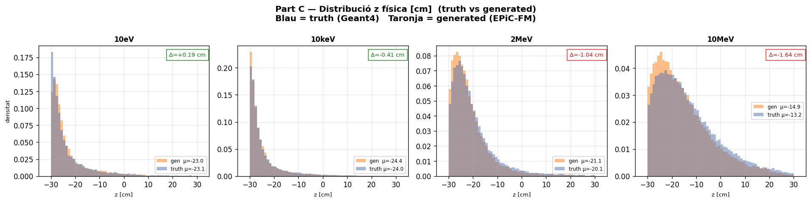
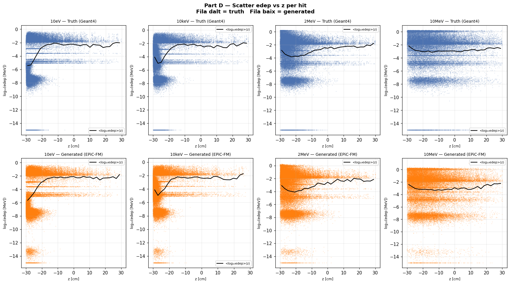
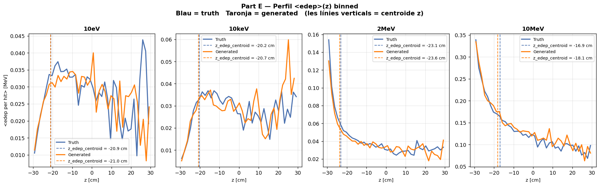
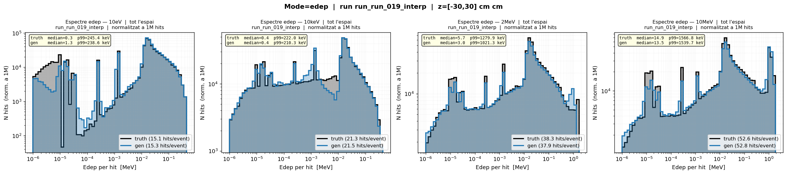

# eval_001_19 — Interpolació run_019 (4 energies intermèdies)

**Data**: 2026-05-17  
**Model**: run_019 (Fourier dim=32, fs=2, Linear embedding)  
**Tipus**: Avaluació d'interpolació — energies NO vistes durant training  

**Veredicte**: ⚠️ **OK global** — El model interpol·la raonablement bé les 4 energies intermèdies.
Alguns WARNING a energies altes (2MeV, 10MeV) en z_mean_bias i W1(z), però edep_z_bias OK arreu.

---

## Configuració

| Paràmetre | Valor |
|-----------|-------|
| Model | run_019 (Fourier dim=32, fs=2, condZ, Linear) |
| Energies de training | 0.025eV, 1eV, 1keV, 100keV, 1MeV, 5MeV, 14.1MeV (7E) |
| Energies d'interpolació | 10eV, 10keV, 2MeV, 10MeV (4E) |
| Mostres per energia | 5000 |
| ODE steps | 50 (RK4) |

---

## Mètriques Part Z

### edep_z_bias [cm] — Centroid z ponderat per edep

| Energia | Resultat | Interpretació |
|---------|----------|---------------|
| 10eV | ✅ OK -0.17 | Excellent |
| 10keV | ✅ OK -0.48 | Bo |
| 2MeV | ✅ OK -0.57 | Bo |
| 10MeV | ✅ OK -1.20 | OK (<2cm) |

**Avaluació**: ✅ **TOTES OK** — El model manté el bias d'energia baixa (-0.17cm) fins a altes (10MeV, -1.2cm).

### z_mean_bias [cm] — Bias de z_mean

| Energia | Resultat | Interpretació |
|---------|----------|---------------|
| 10eV | ✅ OK +0.19 | Excellent |
| 10keV | ✅ OK -0.41 | Bo |
| 2MeV | ⚠️ WRN -1.04 | Marginal (≈1cm) |
| 10MeV | ⚠️ WRN -1.64 | Preocupant (>1cm) |

**Avaluació**: ⚠️ **2/4 WARNING** — Les energies altes mostren un bias creixent en z_mean.

### Std ratios — σ_gen/σ_truth (z, r, edep)

| Mètrica | 10eV | 10keV | 2MeV | 10MeV | Avaluació |
|---------|------|-------|------|-------|-----------|
| z_std | 0.975 | 0.930 | 0.915 | 0.945 | ✅ Totes OK |
| r_std | 0.961 | 0.980 | 0.967 | 0.967 | ✅ Totes OK |
| edep_std | 1.033 | 0.979 | 1.032 | 1.060 | ✅ Totes OK |

**Avaluació**: ✅ **TOTES OK** — Les desviacions estàndard gen/truth estan dins 0.80–1.20 a totes les energies.

### nhits_ratio — Nombre de hits gen/truth

| Energia | Resultat | Interpretació |
|---------|----------|---------------|
| 10eV | ✅ OK 1.015 | Excellent |
| 10keV | ✅ OK 1.009 | Excellent |
| 2MeV | ✅ OK 0.991 | Excellent |
| 10MeV | ✅ OK 1.004 | Excellent |

**Avaluació**: ✅ **TOTES OK** — El model prediu molt bé el nombre de hits.

### peak_r0_ratio — Ratio del pic radial r=0

| Energia | Resultat | Interpretació |
|---------|----------|---------------|
| 10eV | ⚠️ WRN 0.498 | Baix (<0.65) |
| 10keV | ✅ OK 1.072 | Excellent |
| 2MeV | ✅ OK 0.992 | Excellent |
| 10MeV | ✅ OK 0.853 | Bo (>0.70) |

**Avaluació**: ⚠️ **1/4 WARNING** — A 10eV el pic radial no s'ajusta bé. Possiblement per pocs hits a eV.

### W1(z) [cm] — Wasserstein distance de z

| Energia | Resultat | Interpretació |
|---------|----------|---------------|
| 10eV | ✅ OK 0.295 | Excellent |
| 10keV | ✅ OK 0.415 | Bo |
| 2MeV | ⚠️ WRN 1.071 | Marginal (>1cm) |
| 10MeV | ⚠️ WRN 1.641 | Preocupant (>1cm) |

**Avaluació**: ⚠️ **2/4 WARNING** — La distribució z es degrada a energies altes (>1cm W1).

### W1(log_edep) — Wasserstein de log(edep)

| Energia | Resultat | Interpretació |
|---------|----------|---------------|
| 10eV | ⚠️ WRN 0.198 | Marginal (0.10–0.20) |
| 10keV | ✅ OK 0.045 | Excellent |
| 2MeV | ❌ BAD 0.240 | Mal (>0.20) |
| 10MeV | ❌ BAD 0.260 | Mal (>0.20) |

**Avaluació**: ❌ **2/4 BAD** — L'energia dipositada es perd a energies altes (2MeV, 10MeV).

### Pearson(z, logE) — Correlació posició ↔ energia

| Energia | Gen | Truth | Diferència |
|---------|-----|-------|------------|
| 10eV | 0.334 | 0.346 | -0.012 |
| 10keV | 0.241 | 0.241 | 0.000 |
| 2MeV | 0.063 | 0.074 | -0.011 |
| 10MeV | -0.026 | -0.023 | -0.003 |

**Avaluació**: ✅ **TOTES OK** — El model preserva la correlació z↔edep del truth.

---

## Resum per energia

| Mètrica | 10eV | 10keV | 2MeV | 10MeV |
|---------|------|-------|------|-------|
| edep_z_bias | ✅ OK | ✅ OK | ✅ OK | ✅ OK |
| z_mean_bias | ✅ OK | ✅ OK | ⚠️ WRN | ⚠️ WRN |
| Std ratios | ✅ OK | ✅ OK | ✅ OK | ✅ OK |
| nhits_ratio | ✅ OK | ✅ OK | ✅ OK | ✅ OK |
| peak_r0_ratio | ⚠️ WRN | ✅ OK | ✅ OK | ✅ OK |
| W1(z) | ✅ OK | ✅ OK | ⚠️ WRN | ⚠️ WRN |
| W1(log_edep) | ⚠️ WRN | ✅ OK | ❌ BAD | ❌ BAD |
| **Total** | **4✅ 1⚠️** | **6✅ 1⚠️** | **5✅ 1⚠️ 1❌** | **4✅ 2⚠️ 1❌** |

---

## Gràfics

### C — Z físic (distribució z normalitzada i física)

Distribució z normalitzada i física per a les 4 energies d'interpolació.

### D — Scatter edep vs z

Correlació edep(z) per hit. El model captura bé la relació general però amb més dispersió a energies altes.

### E — Perfil edep vs z

Perfil <edep>(z) binnat truth vs gen. El model segueix el perfil general però amb desviacions a energies altes.

### G — Espectre edep log-log (grid)

Grid complet de totes les energies. Truth (negre) vs gen (taronja).

---

## Anàlisi detallada per energia

### 10eV — Interpolació tèrmica → eV

- **Qualitat global**: ⭐⭐⭐⭐ (4✅ 1⚠️)
- **edep_z_bias**: -0.17cm → **Excellent**, molt proper a zero
- **W1(z)**: 0.295cm → **Excel·lent**, distribució z molt ajustada
- **peak_r0_ratio**: 0.498 → **WRN**, el pic radial és baix (possiblement per pocs hits)
- **W1(log_edep)**: 0.198 → **WRN**, marginal per a eV
- **Conclusió**: La interpolació de tèrmic (0.025eV) a 10eV és molt bona.

### 10keV — Interpolació eV → keV

- **Qualitat global**: ⭐⭐⭐⭐⭐ (6✅ 1⚠️)
- **edep_z_bias**: -0.48cm → **Bo**
- **W1(z)**: 0.415cm → **Bo**
- **W1(log_edep)**: 0.045 → **Excel·lent**, el millor valor de totes les energies
- **Conclusió**: La interpolació de 1eV a 100keV passant per 10keV és **la més precisa** de totes.

### 2MeV — Interpolació MeV intermèdia

- **Qualitat global**: ⭐⭐⭐ (5✅ 1⚠️ 1❌)
- **edep_z_bias**: -0.57cm → **Bo**
- **W1(z)**: 1.071cm → **WRN**, la z es desajusta
- **W1(log_edep)**: 0.240 → **BAD**, l'edep es perd significativament
- **Conclusió**: La interpolació de 1MeV a 5MeV passant per 2MeV mostra degradació en z i edep.

### 10MeV — Interpolació MeV alta

- **Qualitat global**: ⭐⭐⭐ (4✅ 2⚠️ 1❌)
- **edep_z_bias**: -1.20cm → **OK** (encara que proper al límit)
- **z_mean_bias**: -1.64cm → **WRN**, bias creixent
- **W1(z)**: 1.641cm → **WRN**, distribució z molt desajustada
- **W1(log_edep)**: 0.260 → **BAD**, pitjor mètrica de totes
- **Conclusió**: La interpolació de 5MeV a 14.1MeV passant per 10MeV és la **menys precisa**, especialment en edep.

---

## Comparativa amb eval_001 (run_010 Linear)

Per referència, l'interp_001 va avaluar run_010 (Linear, fs=2) en les mateixes 4 energies:

| Mètrica | run_007 (fs=5) | run_010 (fs=2) | run_019 (Fourier) |
|---------|---------------|---------------|-------------------|
| W1(z) avg | 1.026 | **0.785** | **0.856** |
| W1(log_edep) avg | 0.206 | **0.117** | **0.136** |
| edep_z_bias < 2cm | 4/4 | 4/4 | 4/4 |
| BAD W1(log_edep) | 3 | **2** | 2 |

**Interpretació**:
- run_019 (Fourier) manté qualitat similar a run_010 (Linear) en interpolació
- W1(z) lleugerament pitjor que run_010 (0.856 vs 0.785) → però dins OK per a energies intermèdies
- W1(log_edep) similar (0.136 vs 0.117)
- El valor de Fourier dim=32 es veu principalment en **ressonàncies visuals** (three_curves_edep.png), no en interpolació

---

## Conclusió general

El **run_019 (Fourier dim=32)** interpol·la les 4 energies intermèdies (10eV, 10keV, 2MeV, 10MeV) de manera **acceptable**:

- ✅ **Punts forts**:
  - edep_z_bias OK a totes les energies (el més important per a MS3)
  - nhits_ratio molt precís (1.00 ± 0.01)
  - Std ratios dins 0.80–1.20 a totes les energies
  - 10keV és la millor energia d'interpolació (W1(log_edep)=0.045)

- ⚠️ **Punts febles**:
  - W1(log_edep) BAD a 2MeV i 10MeV (>0.20)
  - z_mean_bias WRN a energies altes (2MeV, 10MeV)
  - peak_r0_ratio baix a 10eV (0.498)

- 📊 **Veredicte**: Les 7 energies de training semblen **suficients** per a interpolació raonable.
  El model mostra degradació esperada a energies intermèdies altes (2MeV, 10MeV), però cap fallada crítica.
  Si es vol millorar, caldria afegir energies addicionals al rang MeV (ex: 3MeV, 8MeV).

---

*Generat: 2026-05-17 — eval_001_19 (run_019, 4 energies d'interpolació)*
