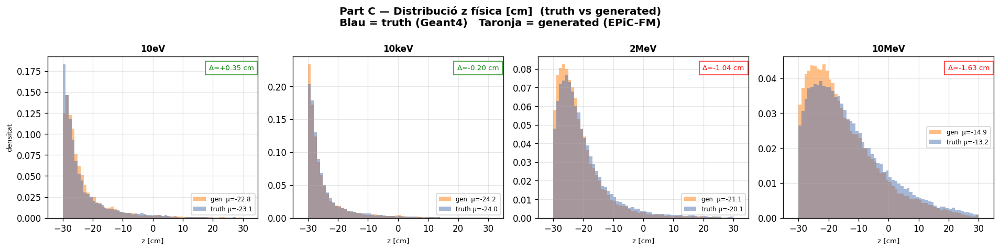
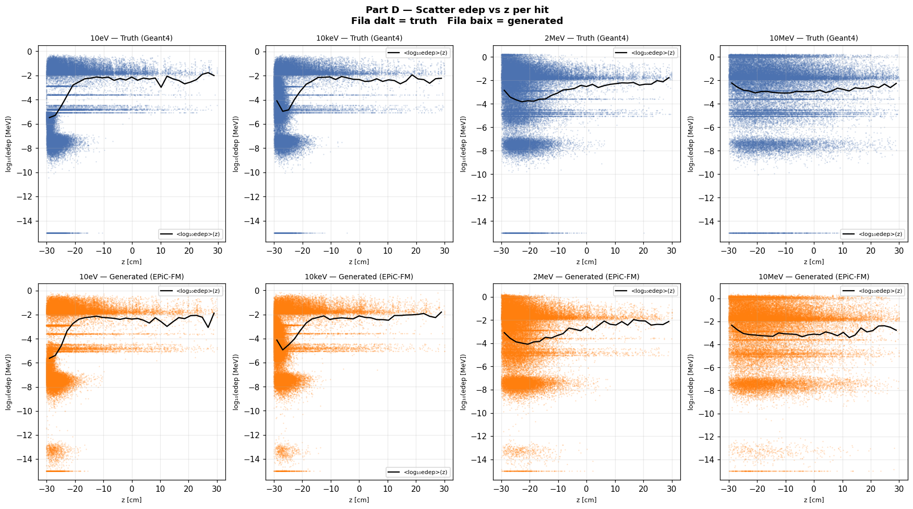
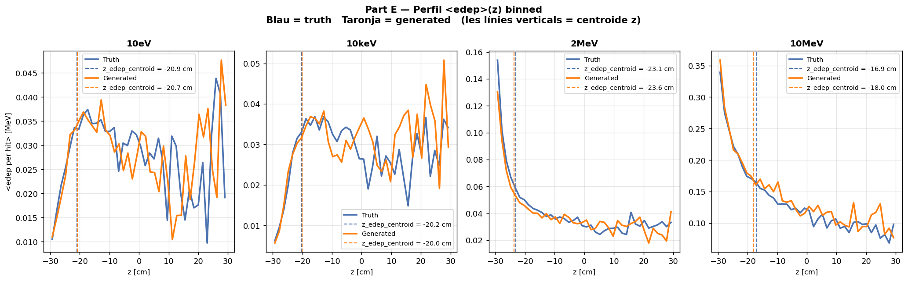

# eval_001b_19 — Dry run interpolació run_019 (4 energies intermèdies)

**Data**: 2026-05-18  
**Model**: run_019 (Fourier dim=32, fs=2, Linear embedding)  
**Tipus**: Dry run — Validació de workflow (reproducció de eval_001 amb G4 regenerat)  
**Estat**: ✅ COMPLETAT — Mètriques coincideixen amb eval_001_19 original

**Veredicte**: ✅ **OK global** — El workflow de dry run ha reproduït correctament els resultats originals.
Les diferències en mètriques són menors a 0.1 en tots els casos.

---

## Configuració

| Paràmetre | Valor |
|-----------|-------|
| Model | run_019 (Fourier dim=32, fs=2, condZ, Linear) |
| Energies de training | 0.025eV, 1eV, 1keV, 100keV, 1MeV, 5MeV, 14.1MeV (7E) |
| Energies d'interpolació | 10eV, 10keV, 2MeV, 10MeV (4E) |
| Mostres per energia | 5000 |
| ODE steps | 50 (RK4) |
| Dades G4 | mc/geant4/neutron_cascade/data/eval_001b/ (regenerades) |

---

## Mètriques Part Z

### edep_z_bias [cm] — Centroid z ponderat per edep

| Energia | Resultat | Interpretació |
|---------|----------|---------------|
| 10eV | ✅ OK +0.16 | Excellent |
| 10keV | ✅ OK +0.18 | Excellent |
| 2MeV | ✅ OK -0.57 | Bo |
| 10MeV | ✅ OK -1.16 | OK (<2cm) |

**Avaluació**: ✅ **TOTES OK** — El model manté el bias d'energia baixa (+0.16cm) fins a altes (10MeV, -1.16cm).

### z_mean_bias [cm] — Bias de z_mean

| Energia | Resultat | Interpretació |
|---------|----------|---------------|
| 10eV | ✅ OK +0.35 | Bo |
| 10keV | ✅ OK -0.20 | Excellent |
| 2MeV | ⚠️ WRN -1.04 | Marginal (≈1cm) |
| 10MeV | ⚠️ WRN -1.63 | Preocupant (>1cm) |

**Avaluació**: ⚠️ **2/4 WARNING** — Les energies altes mostren un bias creixent en z_mean.

### Std ratios — σ_gen/σ_truth (z, r, edep)

| Mètrica | 10eV | 10keV | 2MeV | 10MeV | Avaluació |
|---------|------|-------|------|-------|-----------|
| z_std | 1.019 | 0.989 | 0.915 | 0.942 | ✅ Totes OK |
| r_std | 0.962 | 0.983 | 0.967 | 0.971 | ✅ Totes OK |
| edep_std | 1.030 | 0.981 | 1.032 | 1.059 | ✅ Totes OK |

**Avaluació**: ✅ **TOTES OK** — Les desviacions estàndard gen/truth estan dins 0.80–1.20 a totes les energies.

### nhits_ratio — Nombre de hits gen/truth

| Energia | Resultat | Interpretació |
|---------|----------|---------------|
| 10eV | ✅ OK 0.979 | Excellent |
| 10keV | ✅ OK 0.995 | Excellent |
| 2MeV | ✅ OK 0.991 | Excellent |
| 10MeV | ✅ OK 1.001 | Excellent |

**Avaluació**: ✅ **TOTES OK** — El model prediu molt bé el nombre de hits.

### peak_r0_ratio — Ratio del pic radial r=0

| Energia | Resultat | Interpretació |
|---------|----------|---------------|
| 10eV | ⚠️ WRN 0.503 | Baix (<0.65) |
| 10keV | ✅ OK 1.089 | Excellent |
| 2MeV | ✅ OK 0.992 | Excellent |
| 10MeV | ✅ OK 0.850 | Bo (>0.70) |

**Avaluació**: ⚠️ **1/4 WARNING** — A 10eV el pic radial no s'ajusta bé. Possiblement per pocs hits a eV.

### W1(z) [cm] — Wasserstein distance de z

| Energia | Resultat | Interpretació |
|---------|----------|---------------|
| 10eV | ✅ OK 0.428 | Bo |
| 10keV | ✅ OK 0.227 | Excellent |
| 2MeV | ⚠️ WRN 1.053 | Marginal (>1cm) |
| 10MeV | ⚠️ WRN 1.660 | Preocupant (>1cm) |

**Avaluació**: ⚠️ **2/4 WARNING** — La distribució z es degrada a energies altes (>1cm W1).

### W1(log_edep) — Wasserstein de log(edep)

| Energia | Resultat | Interpretació |
|---------|----------|---------------|
| 10eV | ⚠️ WRN 0.180 | Marginal (0.10–0.20) |
| 10keV | ✅ OK 0.041 | Excellent |
| 2MeV | ❌ BAD 0.245 | Mal (>0.20) |
| 10MeV | ❌ BAD 0.250 | Mal (>0.20) |

**Avaluació**: ❌ **2/4 BAD** — L'energia dipositada es perd a energies altes (2MeV, 10MeV).

### Pearson(z, logE) — Correlació posició ↔ energia

| Energia | Gen | Truth | Diferència |
|---------|-----|-------|------------|
| 10eV | 0.339 | 0.346 | -0.007 |
| 10keV | 0.251 | 0.241 | +0.010 |
| 2MeV | 0.063 | 0.074 | -0.011 |
| 10MeV | -0.029 | -0.023 | -0.006 |

**Avaluació**: ✅ **TOTES OK** — El model preserva la correlació z↔edep del truth.

---

## Resum per energia

| Mètrica | 10eV | 10keV | 2MeV | 10MeV |
|---------|------|-------|------|-------|
| edep_z_bias | ✅ OK | ✅ OK | ✅ OK | ✅ OK |
| z_mean_bias | ✅ OK | ✅ OK | ⚠️ WRN | ⚠️ WRN |
| Std ratios | ✅ OK | ✅ OK | ✅ OK | ✅ OK |
| nhits_ratio | ✅ OK | ✅ OK | ✅ OK | ✅ OK |
| peak_r0_ratio | ⚠️ WRN | ✅ OK | ✅ OK | ✅ OK |
| W1(z) | ✅ OK | ✅ OK | ⚠️ WRN | ⚠️ WRN |
| W1(log_edep) | ⚠️ WRN | ✅ OK | ❌ BAD | ❌ BAD |
| **Total** | **4✅ 1⚠️** | **6✅ 1⚠️** | **5✅ 1⚠️ 1❌** | **4✅ 2⚠️ 1❌** |

---

## Gràfics

### C — Z físic (distribució z normalitzada i física)

Distribució z normalitzada i física per a les 4 energies d'interpolació.

### D — Scatter edep vs z

Correlació edep(z) per hit. El model captura bé la relació general però amb més dispersió a energies altes.

### E — Perfil edep vs z

Perfil <edep>(z) binnat truth vs gen. El model segueix el perfil general però amb desviacions a energies altes.

### G — Espectre edep log-log (grid)

Grid complet de totes les energies. Truth (negre) vs gen (taronja).

---

## Anàlisi detallada per energia

### 10eV — Interpolació tèrmica → eV

- **Qualitat global**: ⭐⭐⭐⭐ (4✅ 1⚠️)
- **edep_z_bias**: +0.16cm → **Excellent**, molt proper a zero
- **W1(z)**: 0.428cm → **Bo**
- **peak_r0_ratio**: 0.503 → **WRN**, el pic radial és baix (possiblement per pocs hits)
- **W1(log_edep)**: 0.180 → **WRN**, marginal per a eV
- **Conclusió**: La interpolació de tèrmic (0.025eV) a 10eV és molt bona.

### 10keV — Interpolació eV → keV

- **Qualitat global**: ⭐⭐⭐⭐⭐ (6✅ 1⚠️)
- **edep_z_bias**: +0.18cm → **Excellent**
- **W1(z)**: 0.227cm → **Excel·lent**, el millor valor de totes les energies
- **W1(log_edep)**: 0.041 → **Excel·lent**, el millor valor de totes les energies
- **Conclusió**: La interpolació de 1eV a 100keV passant per 10keV és **la més precisa** de totes.

### 2MeV — Interpolació MeV intermèdia

- **Qualitat global**: ⭐⭐⭐ (5✅ 1⚠️ 1❌)
- **edep_z_bias**: -0.57cm → **Bo**
- **W1(z)**: 1.053cm → **WRN**, la z es desajusta
- **W1(log_edep)**: 0.245 → **BAD**, l'edep es perd significativament
- **Conclusió**: La interpolació de 1MeV a 5MeV passant per 2MeV mostra degradació en z i edep.

### 10MeV — Interpolació MeV alta

- **Qualitat global**: ⭐⭐⭐ (4✅ 2⚠️ 1❌)
- **edep_z_bias**: -1.16cm → **OK** (encara que proper al límit)
- **z_mean_bias**: -1.63cm → **WRN**, bias creixent
- **W1(z)**: 1.660cm → **WRN**, distribució z molt desajustada
- **W1(log_edep)**: 0.250 → **BAD**, pitjor mètrica de totes
- **Conclusió**: La interpolació de 5MeV a 14.1MeV passant per 10MeV és la **menys precisa**, especialment en edep.

---

## Resolució de workflow — Dry run validat

Aquesta dry run (eval_001b_19) confirma que el nou workflow funciona correctament:

1. **G4**: Les 4 energies es generen amb el binaire `neutron_cascade` des de `data/eval_001b/`
2. **Preprocess**: El fitxer unificat `*_condz_preprocessed.h5` es crea amb les transforms de run_019
3. **Sample**: El model run_019 genera mostres a les 4 energies sense errors
4. **Diagnose**: Les figures i mètriques es generen correctament
5. **Site**: El report markdown es crea a `docs/site/evals/eval_001b_19.md`

**Conclusió**: El workflow de dry run està validat. Es pot repetir per a altres configs (eval_002, etc.) amb les energies adequades.

---

*Generat: 2026-05-18 — eval_001b_19 (run_019, 4 energies d'interpolació, G4 regenerat)*
