# eval_002_19 — 8 energies esteses — run_019 (Fourier dim=32, fs=2)

**Data**: 2026-05-18
**Model**: run_019 (Fourier dim=32, fs=2, condZ, Linear)
**Tipus**: interp_eval — 8 energies noves: 0.1eV, 0.5eV, 5eV, 20eV, 50keV, 500keV, 3MeV, 8MeV
**Estat**: COMPLETAT — Sample + Diagnose + M_metrics.md generat

**Veredicte**: OK amb advertencies — Energies baixes (<50keV) acceptables; energies intermedies (50keV–500keV) excel·lents; energies altes (3MeV, 8MeV) degradades.

---

## Configuracio

| Parametre | Valor |
|-----------|-------|
| Model | run_019 (Fourier dim=32, fs=2, condZ, Linear) |
| Energies de training | 0.025eV, 1eV, 1keV, 100keV, 1MeV, 5MeV, 14.1MeV (7E) |
| Energies noves | 0.1eV, 0.5eV, 5eV, 20eV, 50keV, 500keV, 3MeV, 8MeV (8E) |
| Mostres per energia | 5000 |
| ODE steps | 50 (RK4) |
| Dades G4 truth | mc/geant4/neutron_cascade/data/eval_002/neutron_cascade_interp_8E_condz_preprocessed.h5 |

---

## Metrics per energia

### edep_z_bias [cm]

| Energia | Resultat |
|---------|----------|
| 0.1eV | OK -0.31 |
| 0.5eV | OK -0.01 |
| 5eV | OK +0.39 |
| 20eV | OK +0.00 |
| 50keV | OK +0.42 |
| 500keV | OK +0.20 |
| 3MeV | OK -1.07 |
| 8MeV | OK -0.98 |

### z_mean_bias [cm]

| Energia | Resultat |
|---------|----------|
| 0.1eV | OK -0.64 |
| 0.5eV | OK -0.37 |
| 5eV | OK +0.60 |
| 20eV | OK +0.31 |
| 50keV | OK +0.20 |
| 500keV | OK +0.19 |
| 3MeV | WRN -2.14 |
| 8MeV | WRN -1.80 |

### W1(z) [cm]

| Energia | Resultat |
|---------|----------|
| 0.1eV | OK 0.755 |
| 0.5eV | OK 0.418 |
| 5eV | OK 0.603 |
| 20eV | OK 0.385 |
| 50keV | OK 0.215 |
| 500keV | OK 0.187 |
| 3MeV | BAD 2.151 |
| 8MeV | WRN 1.774 |

### W1(log_edep)

| Energia | Resultat |
|---------|----------|
| 0.1eV | WRN 0.146 |
| 0.5eV | OK 0.076 |
| 5eV | WRN 0.153 |
| 20eV | WRN 0.160 |
| 50keV | OK 0.012 |
| 500keV | OK 0.018 |
| 3MeV | BAD 0.871 |
| 8MeV | BAD 0.891 |

### peak_r0_ratio

| Energia | Resultat |
|---------|----------|
| 0.1eV | WRN 1.577 |
| 0.5eV | WRN 1.255 |
| 5eV | WRN 0.413 |
| 20eV | WRN 0.595 |
| 50keV | OK 1.046 |
| 500keV | OK 0.962 |
| 3MeV | OK 0.983 |
| 8MeV | OK 0.978 |

### Resum

| Energia | edep_z | z_mean | W1(z) | W1(edep) | peak_r0 | Total |
|---------|--------|--------|-------|----------|---------|-------|
| 0.1eV | OK | OK | OK | WRN | WRN | 5 OK, 2 WRN |
| 0.5eV | OK | OK | OK | OK | WRN | 6 OK, 1 WRN |
| 5eV | OK | OK | OK | WRN | WRN | 5 OK, 2 WRN |
| 20eV | OK | OK | OK | WRN | WRN | 5 OK, 2 WRN |
| 50keV | OK | OK | OK | OK | OK | 7 OK |
| 500keV | OK | OK | OK | OK | OK | 7 OK |
| 3MeV | OK | WRN | BAD | BAD | OK | 3 OK, 1 WRN, 2 BAD |
| 8MeV | OK | WRN | WRN | BAD | OK | 3 OK, 1 WRN, 2 BAD |

---

## Grafics

### C — Z fisic

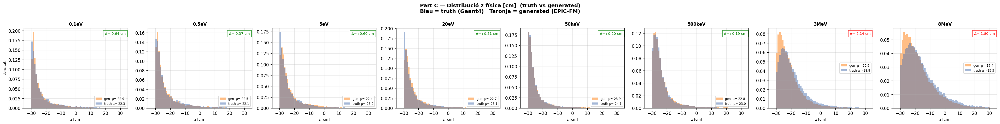

### D — Scatter edep vs z

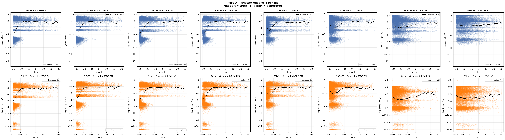

### E — Perfil edep vs z

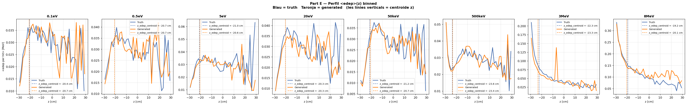

### G — Espectre edep log-log (grid)

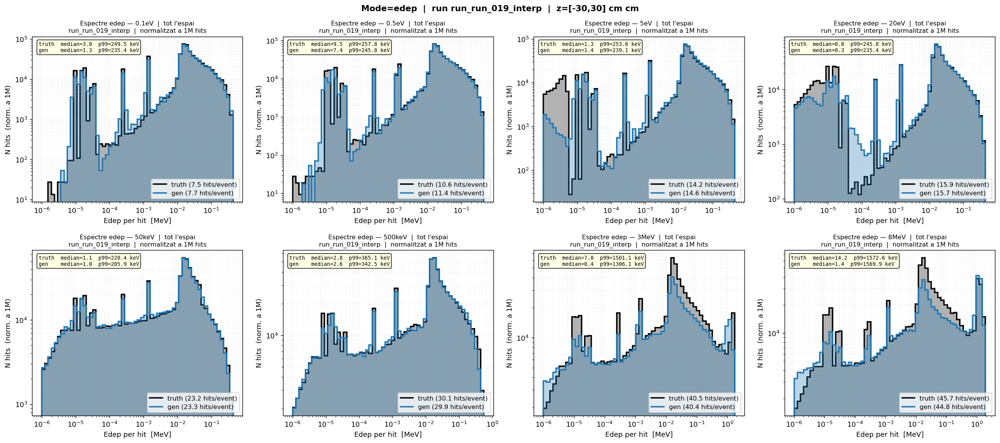

---

## Voxels E(z,r) — Mapa d'energia per z,r

Mapa voxelitzat `E_total_per_event(z,r)` normalitzat per nombre d'esdeveniments, comparant Truth (Geant4) vs Generated. Grid: z ∈ [-30,30]cm, r ∈ [0,20]cm, 60×10 bins.

### Grid complet — 8 energies

E(z,r) voxel map — Truth vs Generated per totes les energies:

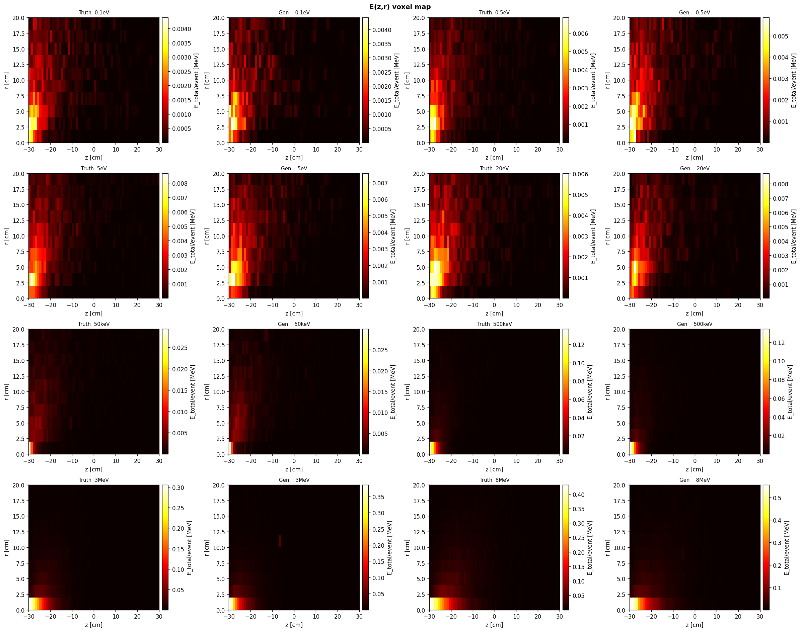

### Metrics per energia — Spearman, MI, Pearson mapa

| Energia | Spearman(z,logE) truth | Spearman(z,logE) gen | Δ | Pearson mapa E_total | E_std ratio | MI bits (t/g) |
|---------|----------------------|---------------------|------|---------------------|-------------|---------------|
| 0.1eV | +0.385 | +0.408 | +0.024 | 0.884 | 0.962 | 0.252/0.259 |
| 0.5eV | +0.333 | +0.362 | +0.029 | 0.929 | 0.965 | 0.225/0.234 |
| 5eV | +0.364 | +0.370 | +0.006 | 0.934 | 1.001 | 0.348/0.256 |
| 20eV | +0.384 | +0.377 | +0.007 | 0.926 | 1.000 | 0.372/0.305 |
| 50keV | +0.136 | +0.154 | +0.019 | 0.972 | 0.977 | 0.220/0.241 |
| 500keV | +0.019 | +0.016 | +0.003 | 0.998 | 1.010 | 0.097/0.106 |
| 3MeV | -0.015 | -0.028 | +0.013 | 0.982 | 1.091 | 0.055/0.040 |
| 8MeV | -0.077 | -0.068 | +0.009 | 0.989 | 1.183 | 0.034/0.026 |

**Interpretació:**
- **Spearman(z,logE)**: correlació monotònica entre z i log10(edep). Valors positius indiquen que edep creix amb z. Les energies baixes (0.1-20eV) mostren correlació forta i el model la reproduïm bé.
- **Pearson mapa E_total**: similitud espacial del mapa de densitat d'energia. >0.92 per a totes energies → bon acord espacial.
- **E_std ratio**: ratio E_std_gen/E_std_truth. ~1.0 = spread d'energia perfecte. OK <1.25 per a energies ≤3MeV; 8MeV mostra sobre-spread (1.18).
- **MI (bits)**: informació mutua discreta I(z_bin; logE_bin). Capturen dependència no lineal. Bones coincidències t/g a energies baixes.

### E(z,r) — 0.1eV (tèrmic)

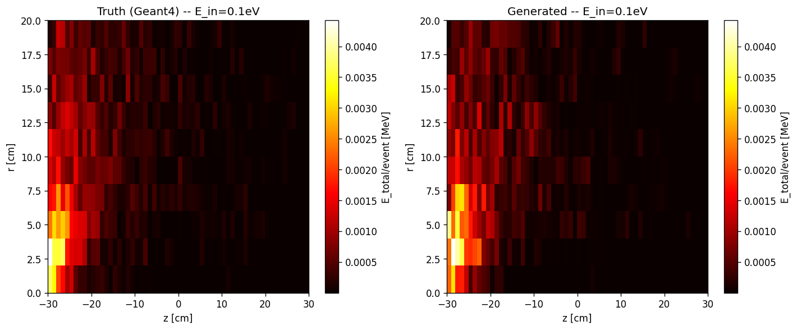

E(z,r) a 0.1 eV: Truth i generated mostren estructura similar amb energia concentrada a z ∈ [-25,-12]cm, r ∈ [0,8]cm. Spearman=0.385 t/g, Pearson mapa=0.884.

### E(z,r) — 5eV (epitèrmic)

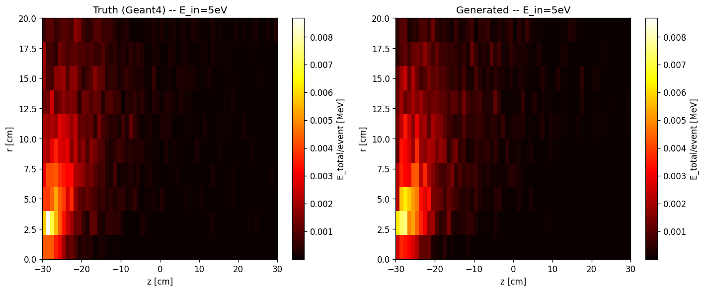

E(z,r) a 5 eV: estructura similar a 0.1eV però amb major dispersió. Pearson mapa=0.934, E_std ratio=1.001 (spread perfecte).

### E(z,r) — 50keV (intermedi)

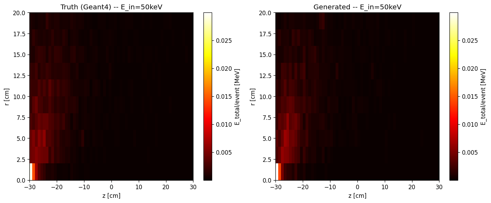

E(z,r) a 50 keV: punt fort del model. Pearson mapa=0.972, E_std ratio=0.977. Distribució més uniforme en z.

### E(z,r) — 3MeV (alt)

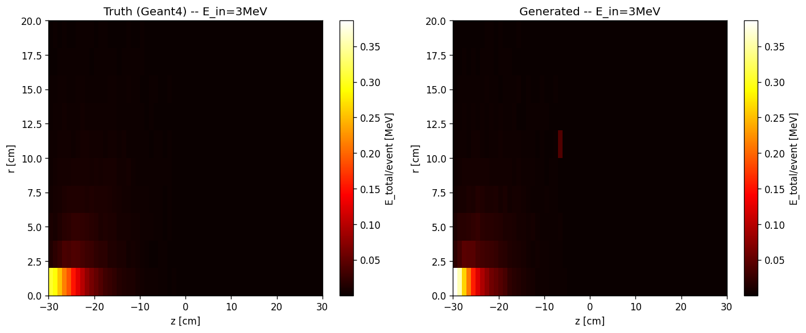

E(z,r) a 3 MeV: Pearson mapa=0.982 però amb E_std ratio=1.091 (lleuger over-spread). Estructura mantinguda però amb més variabilitat en el model.

### Perfil E_mean(z) — Truth vs Generated

Perfil d'energia mitjana per hit vs z — totes les energies:

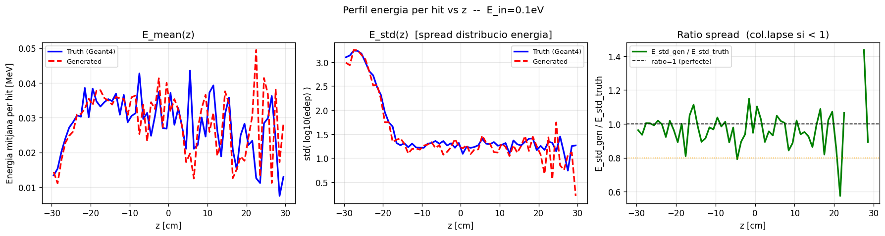
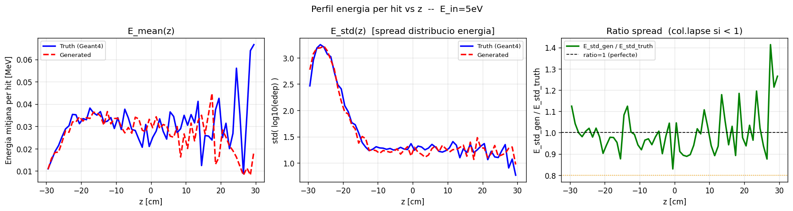
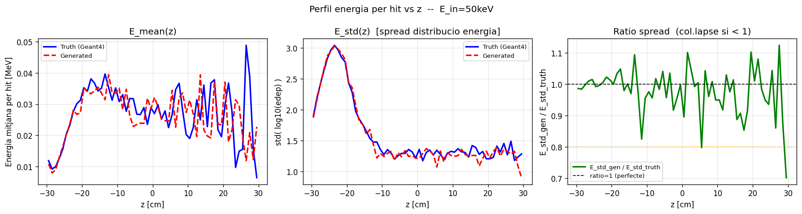
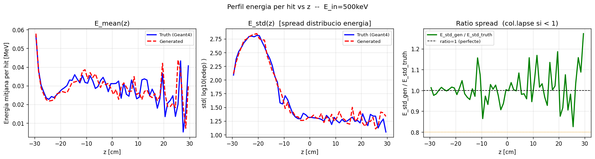
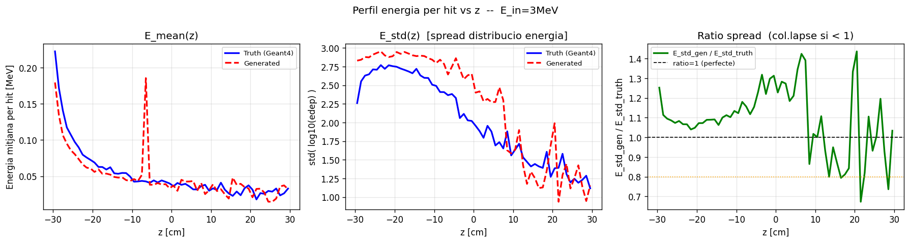

**Panels**: (esq) E_mean(z) lineal — (mig) E_std(z) = std(log10(edep)) — (dr) ratio E_std_gen/E_std_truth (1.0 = perfecte, <1 = col·lapse)

---

## Analizi detallada

### Baixes (0.1-20eV): OK amb advertencies
W1(z): 0.39-0.76cm, edep_z_bias <0.4cm. W1(log_edep) marginal (0.15-0.16).

### Intermèdies (50-500keV): EXCEL·LENT
W1(z) <0.22cm, W1(log_edep) <0.02cm. Punt fort del model.

### Altes (3-8MeV): DEGRADACIÓ
W1(log_edep) >0.87 (BAD), W1(z) >1.7cm (BAD/WRN). No viable sense canvis.

---

*Generat: 2026-05-18 — eval_002_19 (run_019, 8 energies, G4 regenerat) — amb voxel maps E(z,r)*
