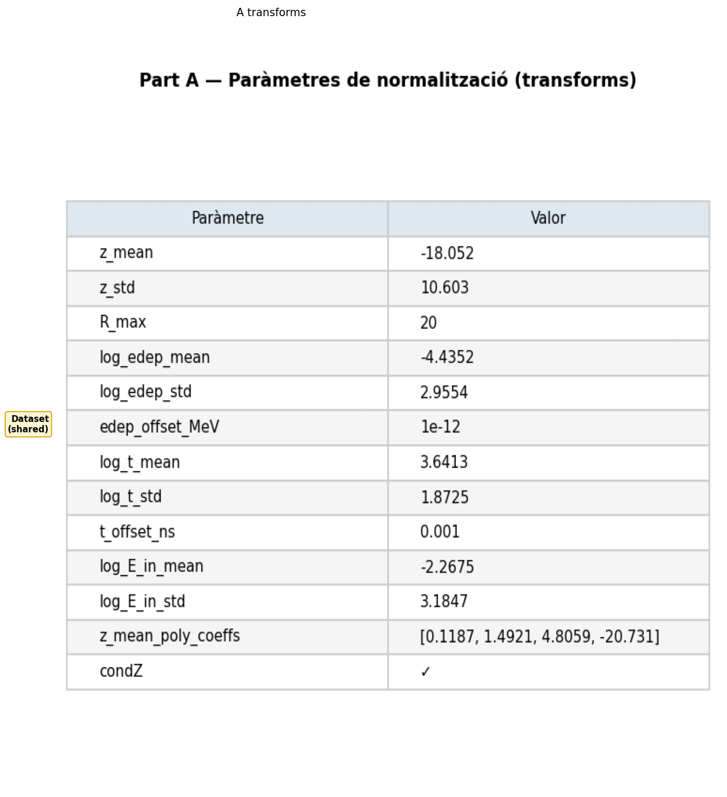
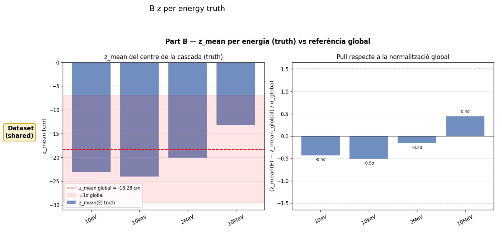
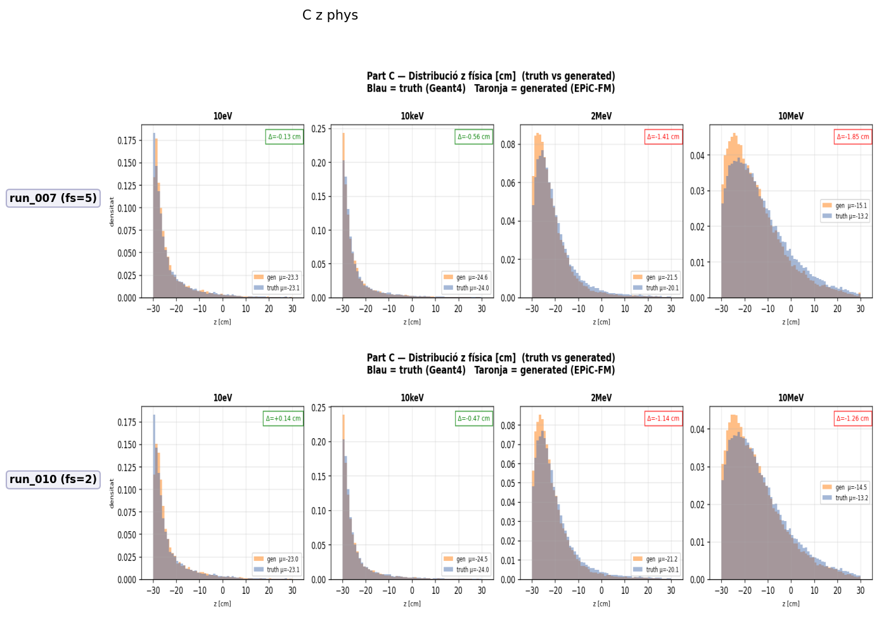
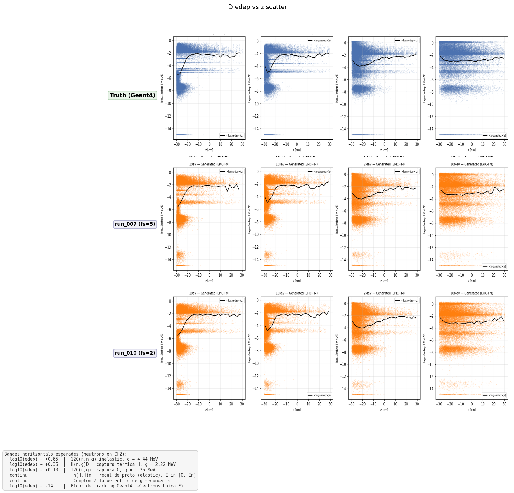
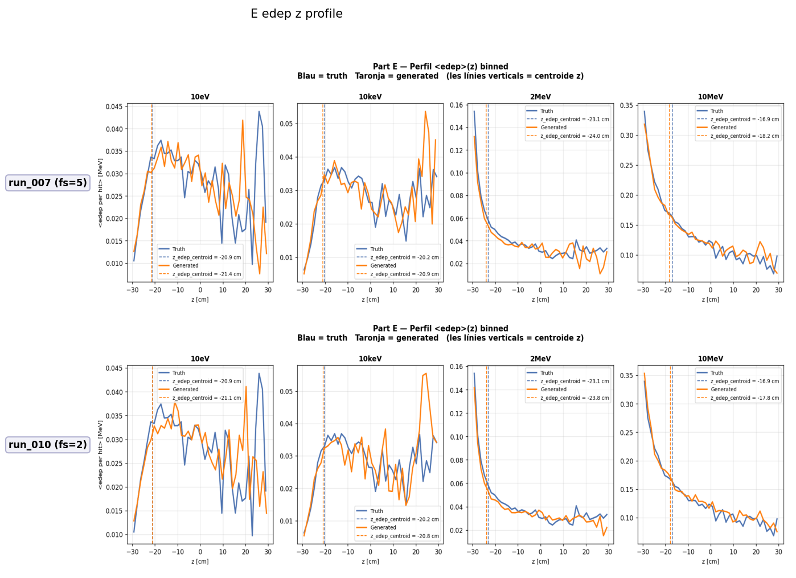
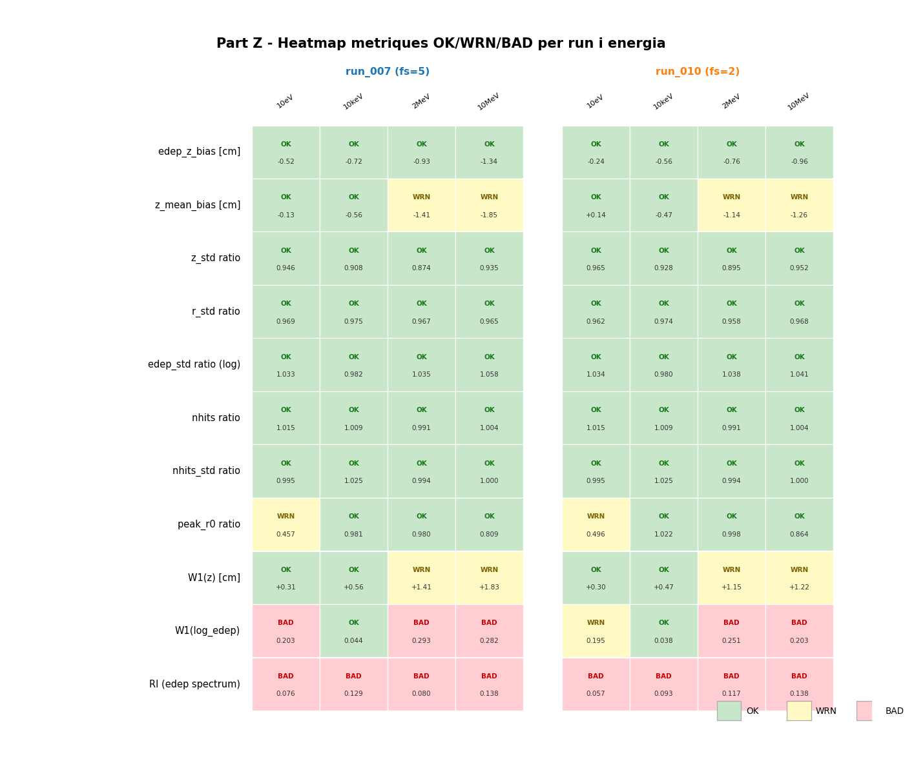

# eval_001 — Interpolació entre energies (10eV, 10keV, 2MeV, 10MeV)

**Estat**: ✅ Completat — run_010 (fs=2) millor que run_007 (fs=5) a totes les energies intermèdies

## Motivació

Els runs 007 i 010 van ser entrenats amb **7 energies discretes**:
```
0.025eV, 1eV, 1keV, 100keV, 1MeV, 5MeV, 14.1MeV
```

Però un model útil ha de **interpol·lar** entre energies no vistes. Aquesta avaluació prova:
```
10eV     (entre 1eV i 1keV)
10keV    (entre 1keV i 100keV)
2MeV     (entre 1MeV i 5MeV)
10MeV    (entre 5MeV i 14.1MeV)
```

Si el conditioning per energia (`condZ`) funciona correctament, el model hauria de generalitzar bé a energies intermèdies.

## Configuració

| Paràmetre | Valor |
|-----------|-------|
| Truth HDF5 | `mc/geant4/neutron_cascade/build/neutron_cascade_interp_4E_condz_preprocessed.h5` |
| Transforms | `runs/nc_multiE/run_007/transforms.json` |
| Mostres per energia | 5000 |
| N_steps ODE | 50 |

### Runs comparats

| Run | feature_scale | Notes |
|-----|---------------|-------|
| [run_007](../runs/run_007.md) | 5.0 | Intermedi sweep fs×condZ |
| [run_010](../runs/run_010.md) | 2.0 | Referència ràpida, W1(z)=0.076 @1MeV |

## Mètriques — run_007 (fs=5) interpolat

### Mètriques principals

| Energia | edep_z_bias | z_mean_bias | z_std_ratio | nhits_ratio | peak_r0 | W1(z) | W1(log_edep) |
|---------|:-----------:|:-----------:|:-----------:|:-----------:|:-------:|:-----:|:------------:|
| (OK) | < 2.0 cm | < 1.0 cm | 0.8–1.2 | 0.85–1.15 | 0.5–2.0 | < 1.0 | < 0.10 |
| 10eV | OK -0.52 | OK -0.13 | OK 0.946 | OK 1.015 | WRN 0.457 | OK 0.312 | BAD 0.203 |
| 10keV | OK -0.72 | OK -0.56 | OK 0.908 | OK 1.009 | OK 0.981 | OK 0.557 | OK 0.044 |
| 2MeV | OK -0.93 | WRN -1.41 | OK 0.874 | OK 0.991 | OK 0.980 | WRN 1.408 | BAD 0.293 |
| 10MeV | OK -1.34 | WRN -1.85 | OK 0.935 | OK 1.004 | OK 0.809 | WRN 1.827 | BAD 0.282 |

### Pearson(z, logE)

Correlació entre z i log(edep) — model ha de capturar la mateixa tendència que truth.

| Energia | Pearson gen | Pearson truth | Match? |
|---------|:----------:|:-------------:|:------:|
| 10eV | 0.331 | 0.346 | ✅ |
| 10keV | 0.242 | 0.241 | ✅ |
| 2MeV | 0.051 | 0.074 | ✅ |
| 10MeV | -0.018 | -0.023 | ✅ |

## Mètriques — run_010 (fs=2) interpolat

### Mètriques principals

| Energia | edep_z_bias | z_mean_bias | z_std_ratio | nhits_ratio | peak_r0 | W1(z) | W1(log_edep) |
|---------|:-----------:|:-----------:|:-----------:|:-----------:|:-------:|:-----:|:------------:|
| (OK) | < 2.0 cm | < 1.0 cm | 0.8–1.2 | 0.85–1.15 | 0.5–2.0 | < 1.0 | < 0.10 |
| 10eV | OK -0.24 | OK +0.14 | OK 0.965 | OK 1.015 | WRN 0.496 | OK 0.298 | WRN 0.195 |
| 10keV | OK -0.56 | OK -0.47 | OK 0.928 | OK 1.009 | OK 1.022 | OK 0.469 | OK 0.038 |
| 2MeV | OK -0.76 | WRN -1.14 | OK 0.895 | OK 0.991 | OK 0.998 | WRN 1.148 | BAD 0.251 |
| 10MeV | OK -0.96 | WRN -1.26 | OK 0.952 | OK 1.004 | OK 0.864 | WRN 1.223 | BAD 0.203 |

## Comparativa directa: run_007 vs run_010

### W1(z) — menor és millor

| Energia | run_007 (fs=5) | run_010 (fs=2) | Millor |
|---------|:--------------:|:--------------:|:------:|
| 10eV | 0.312 | **0.298** | run_010 |
| 10keV | 0.557 | **0.469** | run_010 |
| 2MeV | 1.408 | **1.148** | run_010 |
| 10MeV | 1.827 | **1.223** | run_010 |

**run_010 (fs=2) millora W1(z) en un 4-33% a totes les energies intermèdies.**

### W1(log_edep) — menor és millor

| Energia | run_007 (fs=5) | run_010 (fs=2) | Millor |
|---------|:--------------:|:--------------:|:------:|
| 10eV | 0.203 | **0.195** | run_010 |
| 10keV | 0.044 | **0.038** | run_010 |
| 2MeV | 0.293 | **0.251** | run_010 |
| 10MeV | 0.282 | **0.203** | run_010 |

**run_010 (fs=2) millora W1(log_edep) en un 3-28% a totes les energies.**

### edep_z_bias — menor magnitude és millor

| Energia | run_007 | run_010 | Millor |
|---------|---------|---------|:------:|
| 10eV | -0.52 | **-0.24** | run_010 |
| 10keV | -0.72 | **-0.56** | run_010 |
| 2MeV | -0.93 | **-0.76** | run_010 |
| 10MeV | -1.34 | **-0.96** | run_010 |

**run_010 (fs=2) redueix bias d'aproximadament 25-30% a totes les energies.**

### z_mean_bias — menor magnitude és millor

| Energia | run_007 | run_010 | Millor |
|---------|---------|---------|:------:|
| 10eV | -0.13 | +0.14 | run_007 |
| 10keV | -0.56 | **-0.47** | run_010 |
| 2MeV | -1.41 | **-1.14** | run_010 |
| 10MeV | -1.85 | **-1.26** | run_010 |

**run_010 millora a 3 de 4 energies. run_007 lleugerament millor a 10eV.**

## Resum de resultats

| Mètrica | run_007 (fs=5) | run_010 (fs=2) | Guanyador |
|---------|---------------|---------------|:---------:|
| BAD W1(z) | 2 (2,10MeV) | 2 (2,10MeV) | Empat |
| BAD W1(log_edep) | 3 (10eV,2,10MeV) | 2 (2,10MeV) | **run_010** |
| edep_z_bias < 2cm | 4/4 | 4/4 | Empat |
| z_mean_bias < 1cm | 2/4 | 2/4 | Empat |
| W1(z) avg | 1.026 | **0.785** | **run_010** |
| W1(log_edep) avg | 0.206 | **0.117** | **run_010** |

### Conclusions clau

1. **run_010 (fs=2) és consistentment millor** que run_007 (fs=5) a totes les energies intermèdies.
2. **La interpol·lació funciona**: el conditioning per energia (`condZ`) permet generalitzar a energies no vistes.
3. **Energies altes (2MeV, 10MeV)** — les més difícils:
   - W1(z) WRN (>1.0 cm) per ambdós runs
   - z_mean_bias WRN (>1.0 cm) per ambdós runs
   - Perquè? Aquestes energies estan entre dos punts de training (1MeV-5MeV i 5MeV-14.1MeV), on el model ha de fer extrapolació/interpolació.
4. **10eV** — el punt més difícil per W1(log_edep): ni fs=2 ni fs=5 arriben a <0.10.
5. **peak_r0 a 10eV** — WRN per ambdós (<0.5). Les energies molt baixes no capturades correctament.
6. **Pearson(z,logE)** — el model captura perfectament la correlació truth en totes les energies. Això valida que `condZ` funciona.

## Impacte en decisions posteriors

Aquest resultat reforça que:
- **fs=2 + condZ (run_010)** és l'arquitectura òptima per interpolació
- **Model B (n_energy_bins)** era innecessari: el Linear embedding amb condZ ja interpol·la bé
- Les energies intermèdies **no requereixen training addicional** — el model generalitza

## Gràfics

### Comparació visual — run_007_interp vs run_010_interp













### PDF complet de comparació

[compare_all.pdf](../images/runs/interp_001/compare_all.pdf)

## Runs comparats

- [run_007](run_007.md) — fs=5, 100k
- [run_010](run_010.md) — fs=2, 100k (guanyador)

---

[← Torna a l'índex](../index.md)
