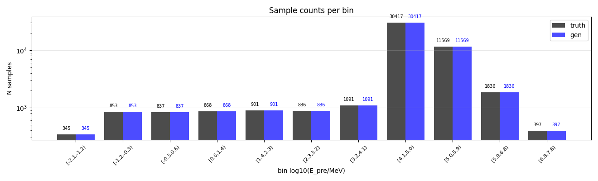
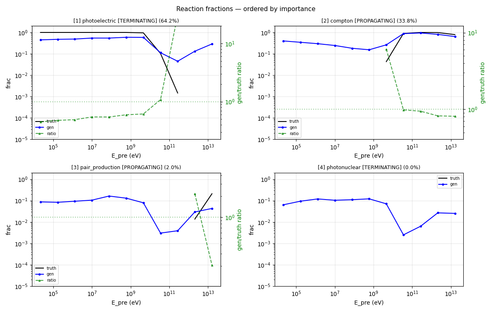
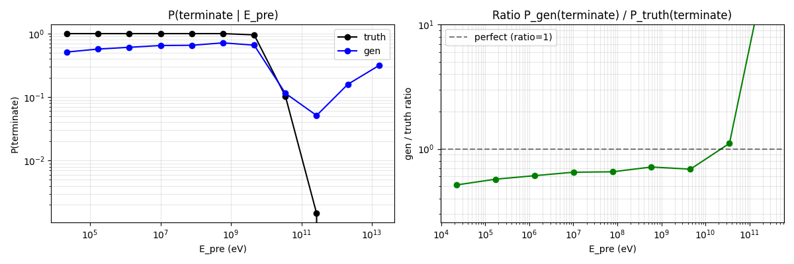
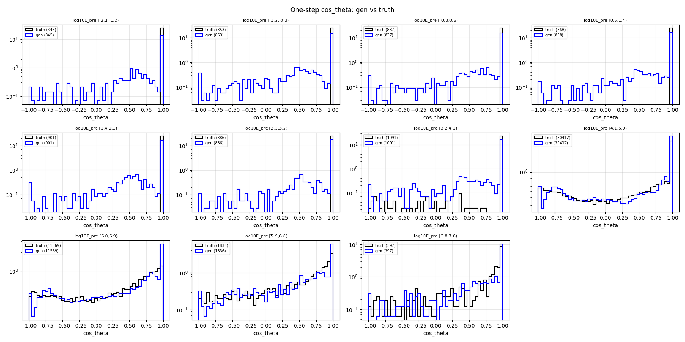
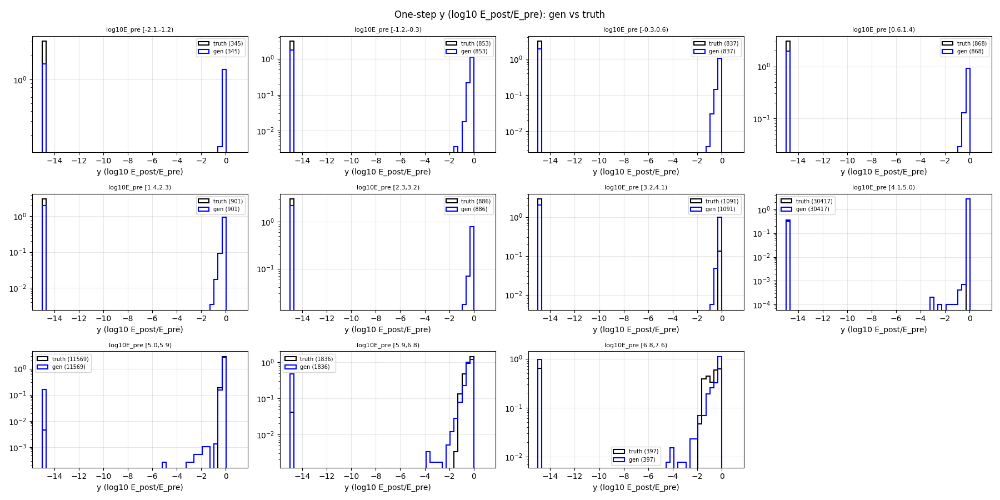
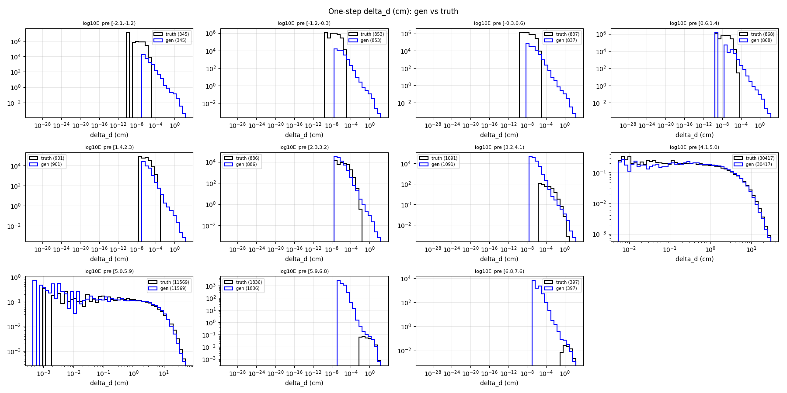
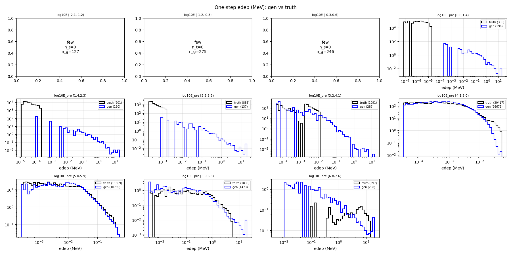
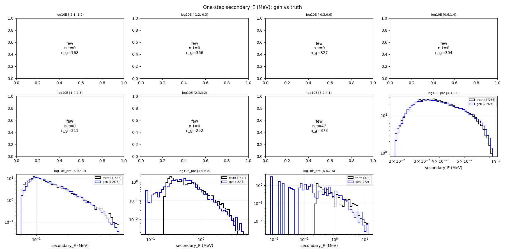

# One-step compare — gamma-net

- N samples comparats: 50,000

## Sample counts per bin

## Reactions combined

## P(terminate) global per E_pre

## Heads cinemàtics

### cos_theta

### y (log10 E_post/E_pre)

### delta_d

### edep (non-zero)

### secondary_energy (non-zero)

## KS test per bin d'E_pre

### cos_theta

| bin | n_truth | n_gen | KS | p-value | |
|---|---:|---:|---:|---:|---|
| [0.0,0.0) | 345 | 345 | 0.458 | 5.30e-33 | FAIL |
| [0.0,0.0) | 853 | 853 | 0.403 | 2.19e-62 | FAIL |
| [0.0,0.0) | 837 | 837 | 0.366 | 4.00e-50 | FAIL |
| [0.0,0.0) | 868 | 868 | 0.320 | 9.26e-40 | FAIL |
| [0.0,0.0) | 901 | 901 | 0.326 | 7.75e-43 | FAIL |
| [0.0,0.0) | 886 | 886 | 0.273 | 1.75e-29 | FAIL |
| [0.0,0.0) | 1,091 | 1,091 | 0.280 | 6.17e-38 | FAIL |
| [0.0,0.0) | 30,417 | 30,417 | 0.036 | 4.00e-17 | OK |
| [0.0,0.0) | 11,569 | 11,569 | 0.088 | 1.01e-39 | warn |
| [0.0,0.0) | 1,836 | 1,836 | 0.210 | 6.34e-36 | FAIL |
| [0.0,0.0) | 397 | 397 | 0.196 | 4.08e-07 | FAIL |

### y

| bin | n_truth | n_gen | KS | p-value | |
|---|---:|---:|---:|---:|---|
| [0.0,0.0) | 345 | 345 | 0.487 | 1.88e-37 | FAIL |
| [0.0,0.0) | 853 | 853 | 0.429 | 7.57e-71 | FAIL |
| [0.0,0.0) | 837 | 837 | 0.391 | 2.24e-57 | FAIL |
| [0.0,0.0) | 868 | 868 | 0.350 | 1.24e-47 | FAIL |
| [0.0,0.0) | 901 | 901 | 0.345 | 5.43e-48 | FAIL |
| [0.0,0.0) | 886 | 886 | 0.284 | 5.72e-32 | FAIL |
| [0.0,0.0) | 1,091 | 1,091 | 0.299 | 2.31e-43 | FAIL |
| [0.0,0.0) | 30,417 | 30,417 | 0.205 | 0.00e+00 | FAIL |
| [0.0,0.0) | 11,569 | 11,569 | 0.111 | 2.57e-62 | FAIL |
| [0.0,0.0) | 1,836 | 1,836 | 0.162 | 1.61e-21 | FAIL |
| [0.0,0.0) | 397 | 397 | 0.204 | 1.21e-07 | FAIL |

### delta_d

| bin | n_truth | n_gen | KS | p-value | |
|---|---:|---:|---:|---:|---|
| [0.0,0.0) | 345 | 345 | 0.820 | 2.46e-117 | FAIL |
| [0.0,0.0) | 853 | 853 | 0.770 | 1.44e-249 | FAIL |
| [0.0,0.0) | 837 | 837 | 0.761 | 3.63e-238 | FAIL |
| [0.0,0.0) | 868 | 868 | 0.725 | 9.74e-221 | FAIL |
| [0.0,0.0) | 901 | 901 | 0.607 | 4.73e-155 | FAIL |
| [0.0,0.0) | 886 | 886 | 0.502 | 5.47e-102 | FAIL |
| [0.0,0.0) | 1,091 | 1,091 | 0.353 | 1.09e-60 | FAIL |
| [0.0,0.0) | 30,417 | 30,417 | 0.028 | 1.48e-10 | OK |
| [0.0,0.0) | 11,569 | 11,569 | 0.035 | 1.26e-06 | OK |
| [0.0,0.0) | 1,836 | 1,836 | 0.170 | 1.48e-23 | FAIL |
| [0.0,0.0) | 397 | 397 | 0.395 | 4.19e-28 | FAIL |

### edep

| bin | n_truth | n_gen | KS | p-value | |
|---|---:|---:|---:|---:|---|
| [0.0,0.0) | 345 | 345 | 0.368 | 3.50e-21 | FAIL |
| [0.0,0.0) | 853 | 853 | 0.322 | 1.33e-39 | FAIL |
| [0.0,0.0) | 837 | 837 | 0.294 | 2.83e-32 | FAIL |
| [0.0,0.0) | 868 | 868 | 0.226 | 8.41e-20 | FAIL |
| [0.0,0.0) | 901 | 901 | 0.789 | 4.91e-279 | FAIL |
| [0.0,0.0) | 886 | 886 | 0.845 | 0.00e+00 | FAIL |
| [0.0,0.0) | 1,091 | 1,091 | 0.737 | 3.33e-288 | FAIL |
| [0.0,0.0) | 30,417 | 30,417 | 0.155 | 3.90e-320 | FAIL |
| [0.0,0.0) | 11,569 | 11,569 | 0.090 | 3.35e-41 | warn |
| [0.0,0.0) | 1,836 | 1,836 | 0.272 | 4.68e-60 | FAIL |
| [0.0,0.0) | 397 | 397 | 0.657 | 2.04e-81 | FAIL |

### secondary_energy

| bin | n_truth | n_gen | KS | p-value | |
|---|---:|---:|---:|---:|---|
| [0.0,0.0) | 345 | 345 | 0.487 | 1.88e-37 | FAIL |
| [0.0,0.0) | 853 | 853 | 0.429 | 7.57e-71 | FAIL |
| [0.0,0.0) | 837 | 837 | 0.391 | 2.24e-57 | FAIL |
| [0.0,0.0) | 868 | 868 | 0.350 | 1.24e-47 | FAIL |
| [0.0,0.0) | 901 | 901 | 0.345 | 5.43e-48 | FAIL |
| [0.0,0.0) | 886 | 886 | 0.284 | 5.72e-32 | FAIL |
| [0.0,0.0) | 1,091 | 1,091 | 0.336 | 4.48e-55 | FAIL |
| [0.0,0.0) | 30,417 | 30,417 | 0.025 | 7.44e-09 | OK |
| [0.0,0.0) | 11,569 | 11,569 | 0.057 | 1.18e-16 | warn |
| [0.0,0.0) | 1,836 | 1,836 | 0.181 | 1.23e-26 | FAIL |
| [0.0,0.0) | 397 | 397 | 0.234 | 5.80e-10 | FAIL |

