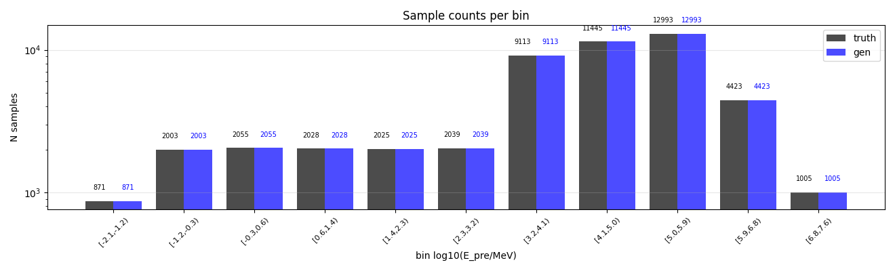
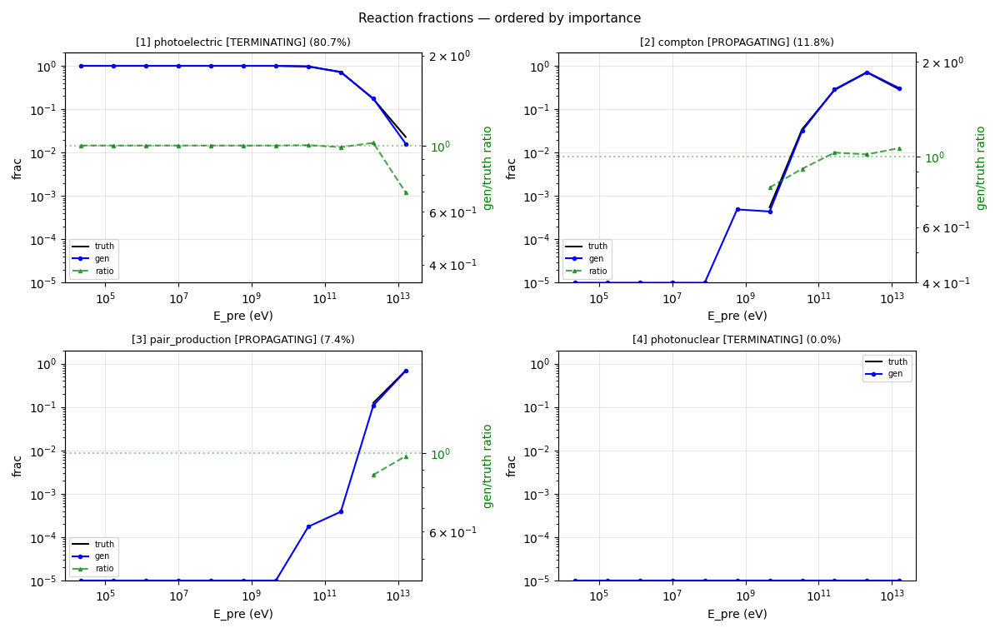
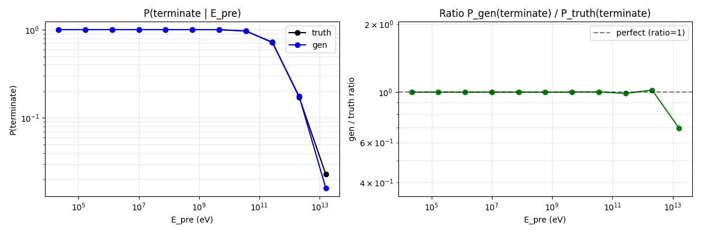
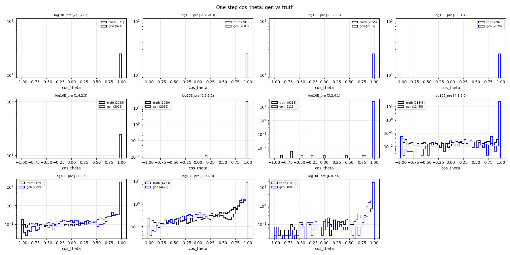
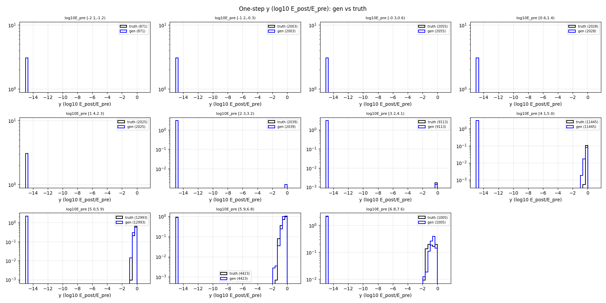
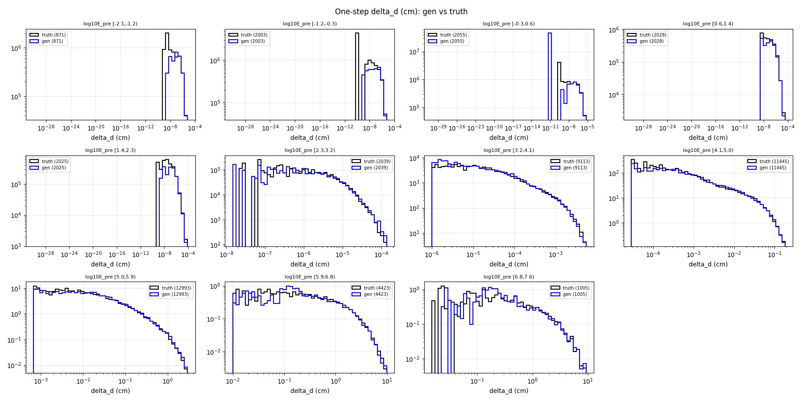
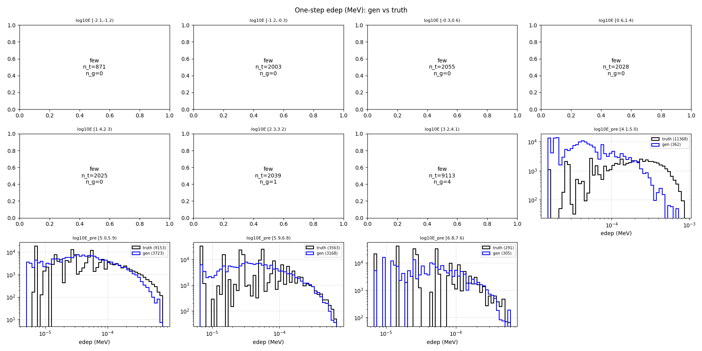
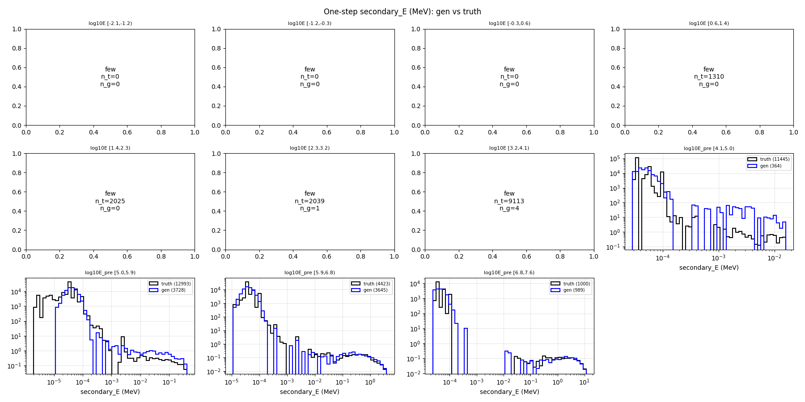

# One-step compare — gamma-net

- N samples comparats: 50,000

## Sample counts per bin

## Reactions combined

## P(terminate) global per E_pre

## Heads cinemàtics

### cos_theta

### y (log10 E_post/E_pre)

### delta_d

### edep (non-zero)

### secondary_energy (non-zero)

## KS test per bin d'E_pre

### cos_theta

| bin | n_truth | n_gen | KS | p-value | |
|---|---:|---:|---:|---:|---|
| [0.0,0.0) | 871 | 871 | 0.000 | 1.00e+00 | OK |
| [0.0,0.0) | 2,003 | 2,003 | 0.000 | 1.00e+00 | OK |
| [0.0,0.0) | 2,055 | 2,055 | 0.000 | 1.00e+00 | OK |
| [0.0,0.0) | 2,028 | 2,028 | 0.000 | 1.00e+00 | OK |
| [0.0,0.0) | 2,025 | 2,025 | 0.000 | 1.00e+00 | OK |
| [0.0,0.0) | 2,039 | 2,039 | 0.000 | 1.00e+00 | OK |
| [0.0,0.0) | 9,113 | 9,113 | 0.000 | 1.00e+00 | OK |
| [0.0,0.0) | 11,445 | 11,445 | 0.006 | 9.94e-01 | OK |
| [0.0,0.0) | 12,993 | 12,993 | 0.023 | 1.60e-03 | OK |
| [0.0,0.0) | 4,423 | 4,423 | 0.053 | 9.30e-06 | warn |
| [0.0,0.0) | 1,005 | 1,005 | 0.065 | 2.98e-02 | warn |

### y

| bin | n_truth | n_gen | KS | p-value | |
|---|---:|---:|---:|---:|---|
| [0.0,0.0) | 871 | 871 | 0.000 | 1.00e+00 | OK |
| [0.0,0.0) | 2,003 | 2,003 | 0.000 | 1.00e+00 | OK |
| [0.0,0.0) | 2,055 | 2,055 | 0.000 | 1.00e+00 | OK |
| [0.0,0.0) | 2,028 | 2,028 | 0.000 | 1.00e+00 | OK |
| [0.0,0.0) | 2,025 | 2,025 | 0.000 | 1.00e+00 | OK |
| [0.0,0.0) | 2,039 | 2,039 | 0.000 | 1.00e+00 | OK |
| [0.0,0.0) | 9,113 | 9,113 | 0.000 | 1.00e+00 | OK |
| [0.0,0.0) | 11,445 | 11,445 | 0.015 | 1.73e-01 | OK |
| [0.0,0.0) | 12,993 | 12,993 | 0.030 | 2.31e-05 | OK |
| [0.0,0.0) | 4,423 | 4,423 | 0.117 | 6.23e-27 | FAIL |
| [0.0,0.0) | 1,005 | 1,005 | 0.276 | 5.34e-34 | FAIL |

### delta_d

| bin | n_truth | n_gen | KS | p-value | |
|---|---:|---:|---:|---:|---|
| [0.0,0.0) | 871 | 871 | 0.067 | 4.20e-02 | warn |
| [0.0,0.0) | 2,003 | 2,003 | 0.034 | 1.86e-01 | OK |
| [0.0,0.0) | 2,055 | 2,055 | 0.042 | 5.47e-02 | OK |
| [0.0,0.0) | 2,028 | 2,028 | 0.036 | 1.44e-01 | OK |
| [0.0,0.0) | 2,025 | 2,025 | 0.025 | 5.42e-01 | OK |
| [0.0,0.0) | 2,039 | 2,039 | 0.030 | 3.21e-01 | OK |
| [0.0,0.0) | 9,113 | 9,113 | 0.030 | 6.71e-04 | OK |
| [0.0,0.0) | 11,445 | 11,445 | 0.027 | 5.21e-04 | OK |
| [0.0,0.0) | 12,993 | 12,993 | 0.016 | 7.09e-02 | OK |
| [0.0,0.0) | 4,423 | 4,423 | 0.025 | 1.30e-01 | OK |
| [0.0,0.0) | 1,005 | 1,005 | 0.052 | 1.36e-01 | warn |

### edep

| bin | n_truth | n_gen | KS | p-value | |
|---|---:|---:|---:|---:|---|
| [0.0,0.0) | 871 | 871 | 1.000 | 0.00e+00 | FAIL |
| [0.0,0.0) | 2,003 | 2,003 | 1.000 | 0.00e+00 | FAIL |
| [0.0,0.0) | 2,055 | 2,055 | 1.000 | 0.00e+00 | FAIL |
| [0.0,0.0) | 2,028 | 2,028 | 1.000 | 0.00e+00 | FAIL |
| [0.0,0.0) | 2,025 | 2,025 | 1.000 | 0.00e+00 | FAIL |
| [0.0,0.0) | 2,039 | 2,039 | 1.000 | 0.00e+00 | FAIL |
| [0.0,0.0) | 9,113 | 9,113 | 1.000 | 0.00e+00 | FAIL |
| [0.0,0.0) | 11,445 | 11,445 | 0.962 | 0.00e+00 | FAIL |
| [0.0,0.0) | 12,993 | 12,993 | 0.418 | 0.00e+00 | FAIL |
| [0.0,0.0) | 4,423 | 4,423 | 0.140 | 4.80e-38 | FAIL |
| [0.0,0.0) | 1,005 | 1,005 | 0.037 | 5.04e-01 | OK |

### secondary_energy

| bin | n_truth | n_gen | KS | p-value | |
|---|---:|---:|---:|---:|---|
| [0.0,0.0) | 871 | 871 | 0.000 | 1.00e+00 | OK |
| [0.0,0.0) | 2,003 | 2,003 | 0.000 | 1.00e+00 | OK |
| [0.0,0.0) | 2,055 | 2,055 | 0.000 | 1.00e+00 | OK |
| [0.0,0.0) | 2,028 | 2,028 | 0.646 | 0.00e+00 | FAIL |
| [0.0,0.0) | 2,025 | 2,025 | 1.000 | 0.00e+00 | FAIL |
| [0.0,0.0) | 2,039 | 2,039 | 1.000 | 0.00e+00 | FAIL |
| [0.0,0.0) | 9,113 | 9,113 | 1.000 | 0.00e+00 | FAIL |
| [0.0,0.0) | 11,445 | 11,445 | 0.968 | 0.00e+00 | FAIL |
| [0.0,0.0) | 12,993 | 12,993 | 0.713 | 0.00e+00 | FAIL |
| [0.0,0.0) | 4,423 | 4,423 | 0.240 | 8.06e-112 | FAIL |
| [0.0,0.0) | 1,005 | 1,005 | 0.056 | 8.83e-02 | warn |

