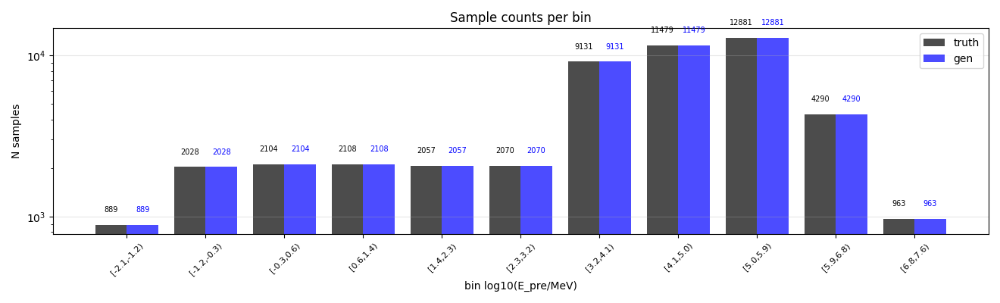
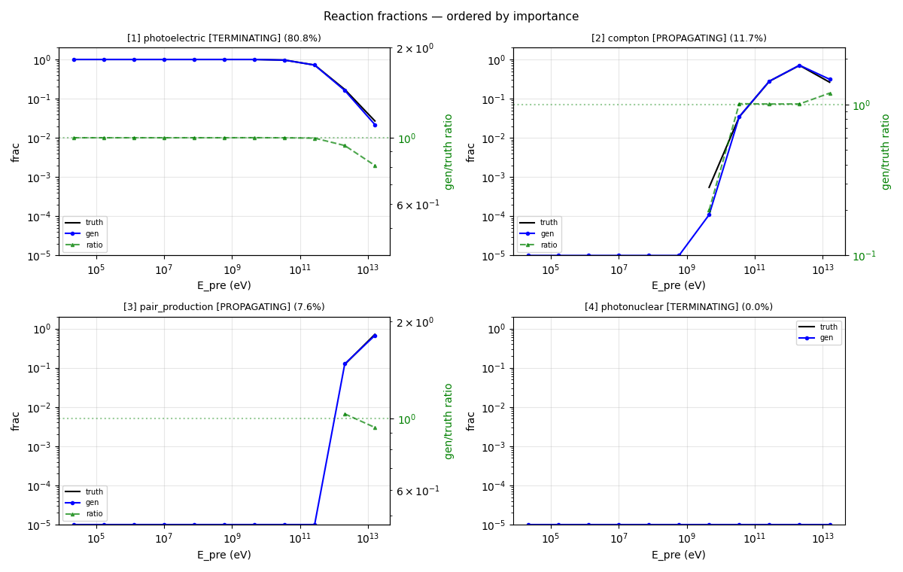
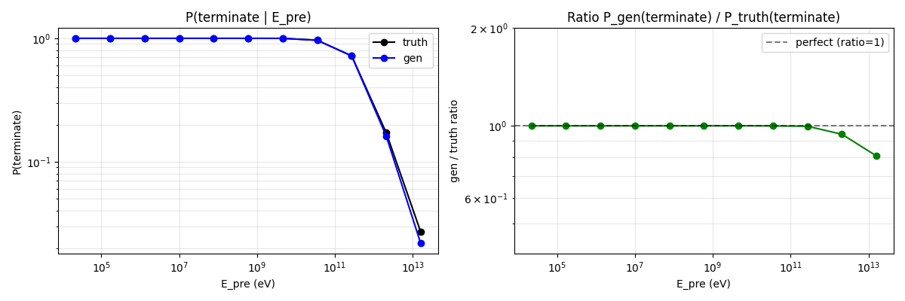
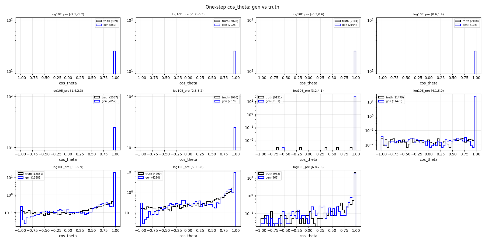
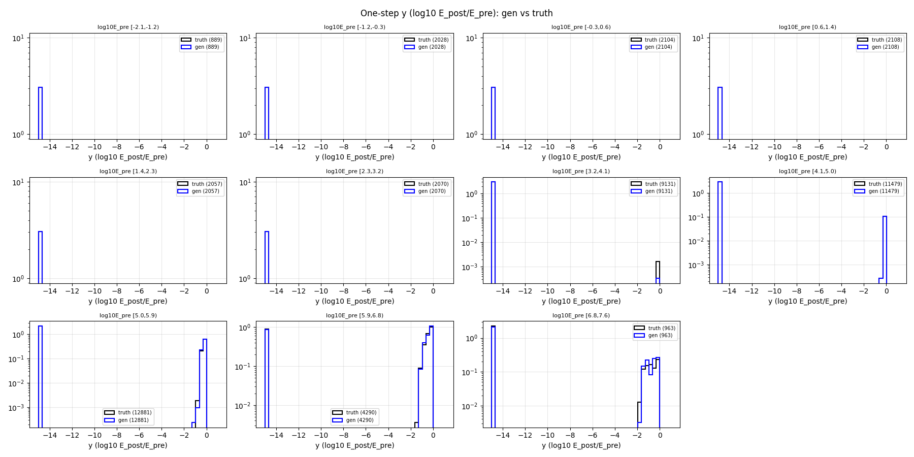
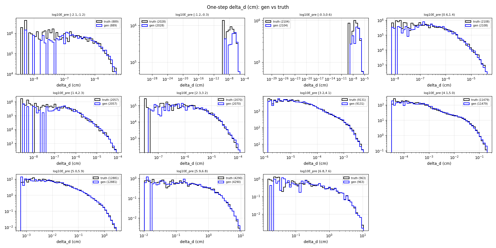
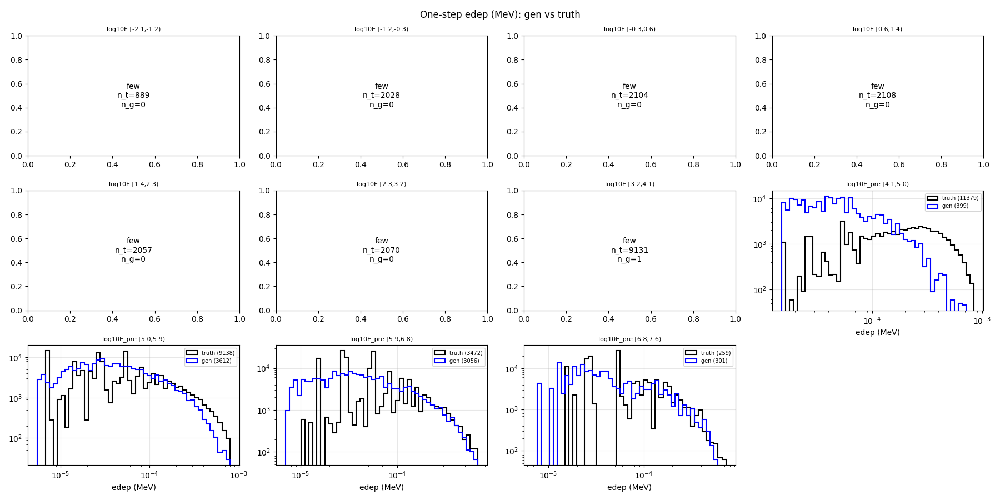
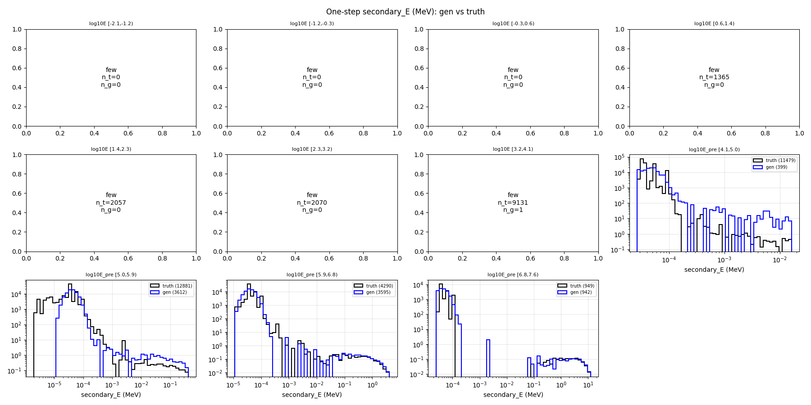

# One-step compare — gamma-net

- N samples comparats: 50,000

## Sample counts per bin

## Reactions combined

## P(terminate) global per E_pre

## Heads cinemàtics

### cos_theta

### y (log10 E_post/E_pre)

### delta_d

### edep (non-zero)

### secondary_energy (non-zero)

## KS test per bin d'E_pre

### cos_theta

| bin | n_truth | n_gen | KS | p-value | |
|---|---:|---:|---:|---:|---|
| [0.0,0.0) | 889 | 889 | 0.000 | 1.00e+00 | OK |
| [0.0,0.0) | 2,028 | 2,028 | 0.000 | 1.00e+00 | OK |
| [0.0,0.0) | 2,104 | 2,104 | 0.000 | 1.00e+00 | OK |
| [0.0,0.0) | 2,108 | 2,108 | 0.000 | 1.00e+00 | OK |
| [0.0,0.0) | 2,057 | 2,057 | 0.000 | 1.00e+00 | OK |
| [0.0,0.0) | 2,070 | 2,070 | 0.000 | 1.00e+00 | OK |
| [0.0,0.0) | 9,131 | 9,131 | 0.000 | 1.00e+00 | OK |
| [0.0,0.0) | 11,479 | 11,479 | 0.002 | 1.00e+00 | OK |
| [0.0,0.0) | 12,881 | 12,881 | 0.015 | 1.24e-01 | OK |
| [0.0,0.0) | 4,290 | 4,290 | 0.041 | 1.59e-03 | OK |
| [0.0,0.0) | 963 | 963 | 0.428 | 1.86e-79 | FAIL |

### y

| bin | n_truth | n_gen | KS | p-value | |
|---|---:|---:|---:|---:|---|
| [0.0,0.0) | 889 | 889 | 0.000 | 1.00e+00 | OK |
| [0.0,0.0) | 2,028 | 2,028 | 0.000 | 1.00e+00 | OK |
| [0.0,0.0) | 2,104 | 2,104 | 0.000 | 1.00e+00 | OK |
| [0.0,0.0) | 2,108 | 2,108 | 0.000 | 1.00e+00 | OK |
| [0.0,0.0) | 2,057 | 2,057 | 0.000 | 1.00e+00 | OK |
| [0.0,0.0) | 2,070 | 2,070 | 0.000 | 1.00e+00 | OK |
| [0.0,0.0) | 9,131 | 9,131 | 0.001 | 1.00e+00 | OK |
| [0.0,0.0) | 11,479 | 11,479 | 0.010 | 5.75e-01 | OK |
| [0.0,0.0) | 12,881 | 12,881 | 0.019 | 1.67e-02 | OK |
| [0.0,0.0) | 4,290 | 4,290 | 0.040 | 2.02e-03 | OK |
| [0.0,0.0) | 963 | 963 | 0.220 | 7.52e-21 | FAIL |

### delta_d

| bin | n_truth | n_gen | KS | p-value | |
|---|---:|---:|---:|---:|---|
| [0.0,0.0) | 889 | 889 | 0.045 | 3.29e-01 | OK |
| [0.0,0.0) | 2,028 | 2,028 | 0.046 | 2.81e-02 | OK |
| [0.0,0.0) | 2,104 | 2,104 | 0.045 | 2.74e-02 | OK |
| [0.0,0.0) | 2,108 | 2,108 | 0.035 | 1.60e-01 | OK |
| [0.0,0.0) | 2,057 | 2,057 | 0.038 | 1.04e-01 | OK |
| [0.0,0.0) | 2,070 | 2,070 | 0.036 | 1.42e-01 | OK |
| [0.0,0.0) | 9,131 | 9,131 | 0.017 | 1.34e-01 | OK |
| [0.0,0.0) | 11,479 | 11,479 | 0.019 | 2.70e-02 | OK |
| [0.0,0.0) | 12,881 | 12,881 | 0.011 | 3.77e-01 | OK |
| [0.0,0.0) | 4,290 | 4,290 | 0.013 | 8.72e-01 | OK |
| [0.0,0.0) | 963 | 963 | 0.013 | 1.00e+00 | OK |

### edep

| bin | n_truth | n_gen | KS | p-value | |
|---|---:|---:|---:|---:|---|
| [0.0,0.0) | 889 | 889 | 1.000 | 0.00e+00 | FAIL |
| [0.0,0.0) | 2,028 | 2,028 | 1.000 | 0.00e+00 | FAIL |
| [0.0,0.0) | 2,104 | 2,104 | 1.000 | 0.00e+00 | FAIL |
| [0.0,0.0) | 2,108 | 2,108 | 1.000 | 0.00e+00 | FAIL |
| [0.0,0.0) | 2,057 | 2,057 | 1.000 | 0.00e+00 | FAIL |
| [0.0,0.0) | 2,070 | 2,070 | 1.000 | 0.00e+00 | FAIL |
| [0.0,0.0) | 9,131 | 9,131 | 1.000 | 0.00e+00 | FAIL |
| [0.0,0.0) | 11,479 | 11,479 | 0.957 | 0.00e+00 | FAIL |
| [0.0,0.0) | 12,881 | 12,881 | 0.429 | 0.00e+00 | FAIL |
| [0.0,0.0) | 4,290 | 4,290 | 0.148 | 2.16e-41 | FAIL |
| [0.0,0.0) | 963 | 963 | 0.052 | 1.49e-01 | warn |

### secondary_energy

| bin | n_truth | n_gen | KS | p-value | |
|---|---:|---:|---:|---:|---|
| [0.0,0.0) | 889 | 889 | 0.000 | 1.00e+00 | OK |
| [0.0,0.0) | 2,028 | 2,028 | 0.000 | 1.00e+00 | OK |
| [0.0,0.0) | 2,104 | 2,104 | 0.000 | 1.00e+00 | OK |
| [0.0,0.0) | 2,108 | 2,108 | 0.648 | 0.00e+00 | FAIL |
| [0.0,0.0) | 2,057 | 2,057 | 1.000 | 0.00e+00 | FAIL |
| [0.0,0.0) | 2,070 | 2,070 | 1.000 | 0.00e+00 | FAIL |
| [0.0,0.0) | 9,131 | 9,131 | 1.000 | 0.00e+00 | FAIL |
| [0.0,0.0) | 11,479 | 11,479 | 0.965 | 0.00e+00 | FAIL |
| [0.0,0.0) | 12,881 | 12,881 | 0.720 | 0.00e+00 | FAIL |
| [0.0,0.0) | 4,290 | 4,290 | 0.229 | 6.60e-99 | FAIL |
| [0.0,0.0) | 963 | 963 | 0.066 | 2.84e-02 | warn |

