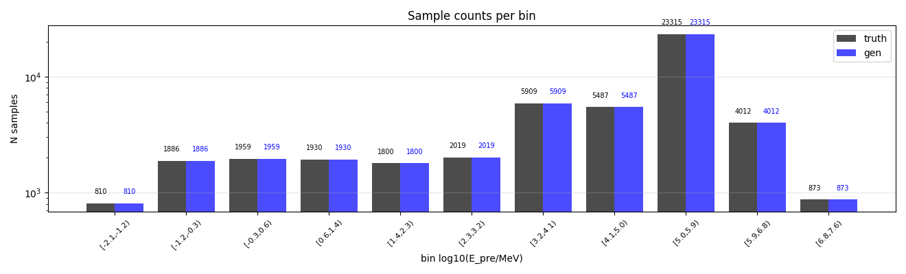
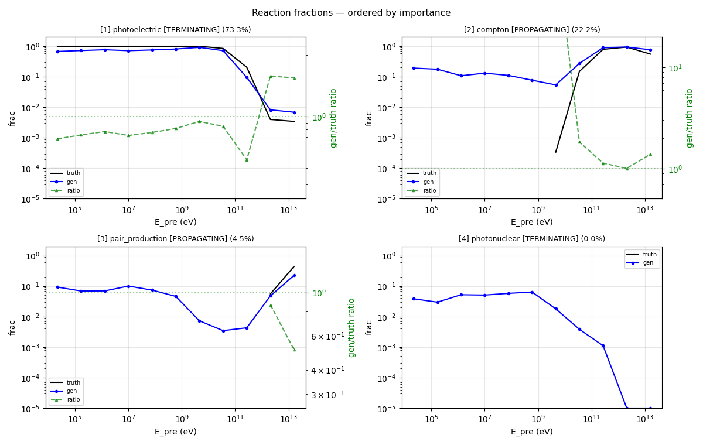
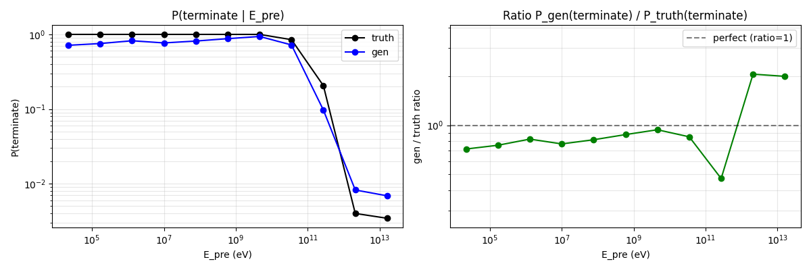
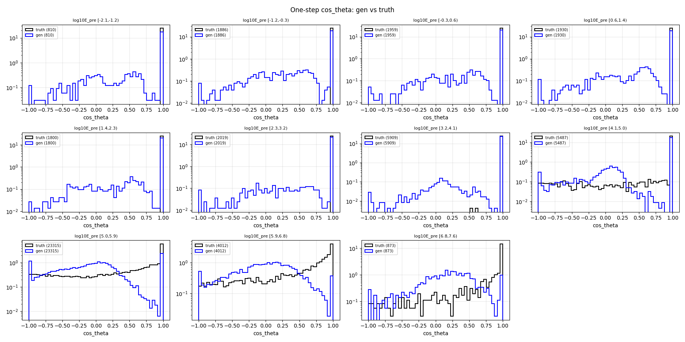
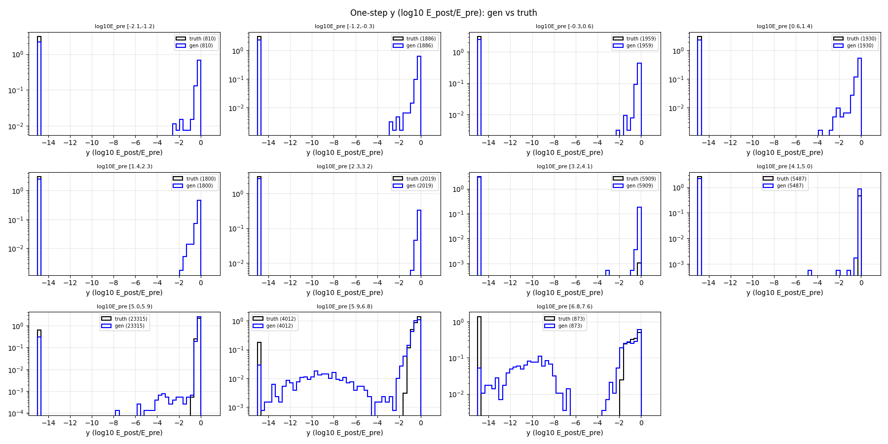
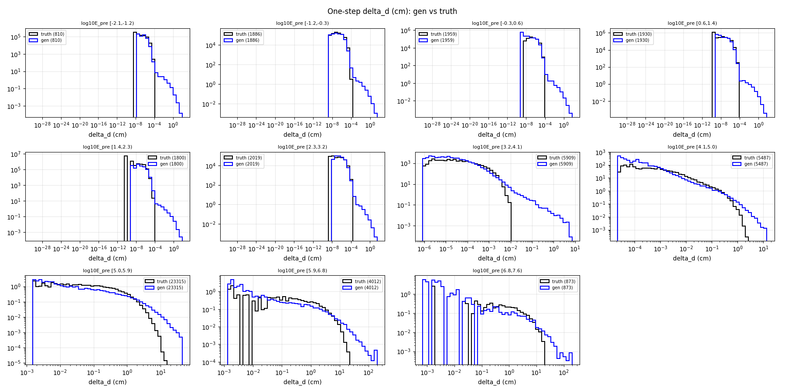
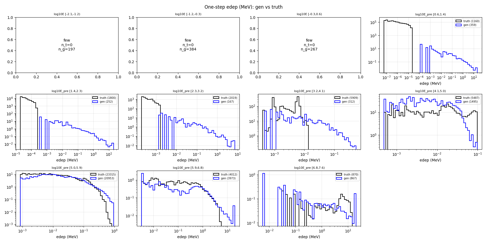
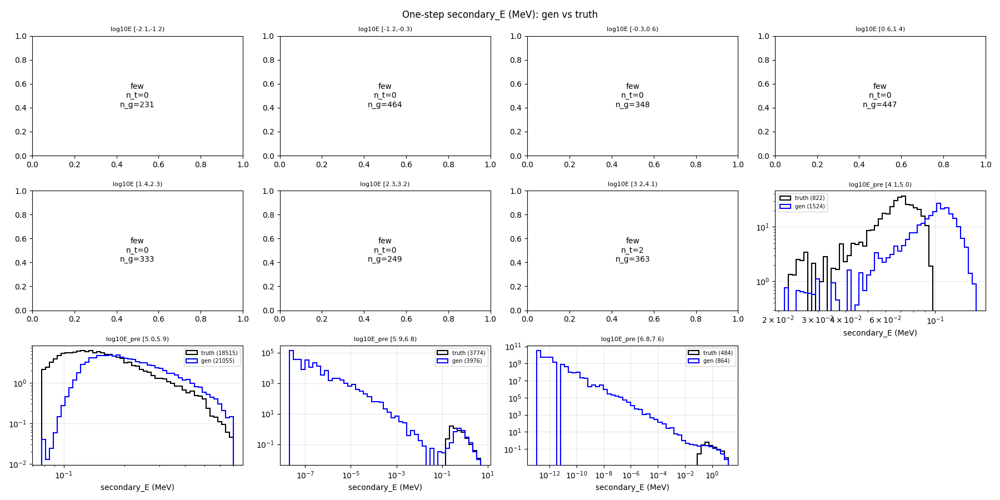

# One-step compare — gamma-net

- N samples comparats: 50,000

## Sample counts per bin

## Reactions combined

## P(terminate) global per E_pre

## Heads cinemàtics

### cos_theta

### y (log10 E_post/E_pre)

### delta_d

### edep (non-zero)

### secondary_energy (non-zero)

## KS test per bin d'E_pre

### cos_theta

| bin | n_truth | n_gen | KS | p-value | |
|---|---:|---:|---:|---:|---|
| [0.0,0.0) | 810 | 810 | 0.285 | 2.03e-29 | FAIL |
| [0.0,0.0) | 1,886 | 1,886 | 0.243 | 2.04e-49 | FAIL |
| [0.0,0.0) | 1,959 | 1,959 | 0.177 | 2.97e-27 | FAIL |
| [0.0,0.0) | 1,930 | 1,930 | 0.230 | 5.70e-45 | FAIL |
| [0.0,0.0) | 1,800 | 1,800 | 0.183 | 7.66e-27 | FAIL |
| [0.0,0.0) | 2,019 | 2,019 | 0.121 | 2.29e-13 | FAIL |
| [0.0,0.0) | 5,909 | 5,909 | 0.061 | 6.66e-10 | warn |
| [0.0,0.0) | 5,487 | 5,487 | 0.177 | 1.36e-75 | FAIL |
| [0.0,0.0) | 23,315 | 23,315 | 0.444 | 0.00e+00 | FAIL |
| [0.0,0.0) | 4,012 | 4,012 | 0.498 | 0.00e+00 | FAIL |
| [0.0,0.0) | 873 | 873 | 0.699 | 1.61e-204 | FAIL |

### y

| bin | n_truth | n_gen | KS | p-value | |
|---|---:|---:|---:|---:|---|
| [0.0,0.0) | 810 | 810 | 0.285 | 2.03e-29 | FAIL |
| [0.0,0.0) | 1,886 | 1,886 | 0.246 | 1.68e-50 | FAIL |
| [0.0,0.0) | 1,959 | 1,959 | 0.178 | 2.08e-27 | FAIL |
| [0.0,0.0) | 1,930 | 1,930 | 0.232 | 8.72e-46 | FAIL |
| [0.0,0.0) | 1,800 | 1,800 | 0.185 | 2.51e-27 | FAIL |
| [0.0,0.0) | 2,019 | 2,019 | 0.123 | 8.58e-14 | FAIL |
| [0.0,0.0) | 5,909 | 5,909 | 0.061 | 5.22e-10 | warn |
| [0.0,0.0) | 5,487 | 5,487 | 0.145 | 7.09e-51 | FAIL |
| [0.0,0.0) | 23,315 | 23,315 | 0.154 | 5.13e-241 | FAIL |
| [0.0,0.0) | 4,012 | 4,012 | 0.097 | 9.58e-17 | warn |
| [0.0,0.0) | 873 | 873 | 0.430 | 1.15e-72 | FAIL |

### delta_d

| bin | n_truth | n_gen | KS | p-value | |
|---|---:|---:|---:|---:|---|
| [0.0,0.0) | 810 | 810 | 0.312 | 2.65e-35 | FAIL |
| [0.0,0.0) | 1,886 | 1,886 | 0.276 | 9.83e-64 | FAIL |
| [0.0,0.0) | 1,959 | 1,959 | 0.198 | 5.17e-34 | FAIL |
| [0.0,0.0) | 1,930 | 1,930 | 0.244 | 7.71e-51 | FAIL |
| [0.0,0.0) | 1,800 | 1,800 | 0.236 | 2.08e-44 | FAIL |
| [0.0,0.0) | 2,019 | 2,019 | 0.140 | 1.05e-17 | FAIL |
| [0.0,0.0) | 5,909 | 5,909 | 0.173 | 2.02e-77 | FAIL |
| [0.0,0.0) | 5,487 | 5,487 | 0.214 | 2.36e-110 | FAIL |
| [0.0,0.0) | 23,315 | 23,315 | 0.313 | 0.00e+00 | FAIL |
| [0.0,0.0) | 4,012 | 4,012 | 0.294 | 2.20e-153 | FAIL |
| [0.0,0.0) | 873 | 873 | 0.310 | 1.50e-37 | FAIL |

### edep

| bin | n_truth | n_gen | KS | p-value | |
|---|---:|---:|---:|---:|---|
| [0.0,0.0) | 810 | 810 | 0.243 | 1.98e-21 | FAIL |
| [0.0,0.0) | 1,886 | 1,886 | 0.204 | 1.31e-34 | FAIL |
| [0.0,0.0) | 1,959 | 1,959 | 0.136 | 2.83e-16 | FAIL |
| [0.0,0.0) | 1,930 | 1,930 | 0.415 | 3.22e-149 | FAIL |
| [0.0,0.0) | 1,800 | 1,800 | 0.860 | 0.00e+00 | FAIL |
| [0.0,0.0) | 2,019 | 2,019 | 0.918 | 0.00e+00 | FAIL |
| [0.0,0.0) | 5,909 | 5,909 | 0.947 | 0.00e+00 | FAIL |
| [0.0,0.0) | 5,487 | 5,487 | 0.728 | 0.00e+00 | FAIL |
| [0.0,0.0) | 23,315 | 23,315 | 0.102 | 1.16e-106 | FAIL |
| [0.0,0.0) | 4,012 | 4,012 | 0.250 | 4.96e-110 | FAIL |
| [0.0,0.0) | 873 | 873 | 0.537 | 9.20e-116 | FAIL |

### secondary_energy

| bin | n_truth | n_gen | KS | p-value | |
|---|---:|---:|---:|---:|---|
| [0.0,0.0) | 810 | 810 | 0.285 | 2.03e-29 | FAIL |
| [0.0,0.0) | 1,886 | 1,886 | 0.246 | 1.68e-50 | FAIL |
| [0.0,0.0) | 1,959 | 1,959 | 0.178 | 2.08e-27 | FAIL |
| [0.0,0.0) | 1,930 | 1,930 | 0.232 | 8.72e-46 | FAIL |
| [0.0,0.0) | 1,800 | 1,800 | 0.185 | 2.51e-27 | FAIL |
| [0.0,0.0) | 2,019 | 2,019 | 0.123 | 8.58e-14 | FAIL |
| [0.0,0.0) | 5,909 | 5,909 | 0.061 | 5.22e-10 | warn |
| [0.0,0.0) | 5,487 | 5,487 | 0.209 | 1.10e-105 | FAIL |
| [0.0,0.0) | 23,315 | 23,315 | 0.290 | 0.00e+00 | FAIL |
| [0.0,0.0) | 4,012 | 4,012 | 0.189 | 8.01e-63 | FAIL |
| [0.0,0.0) | 873 | 873 | 0.435 | 1.13e-74 | FAIL |

