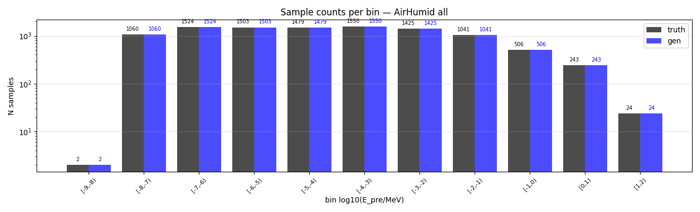
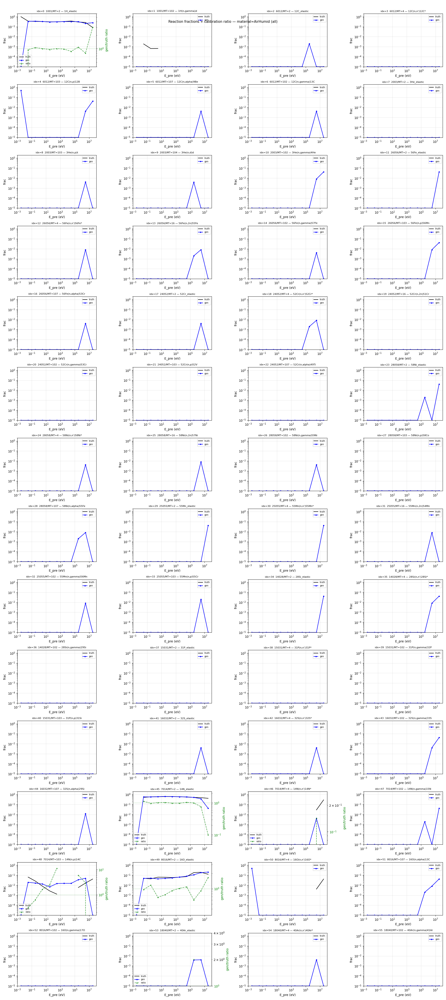
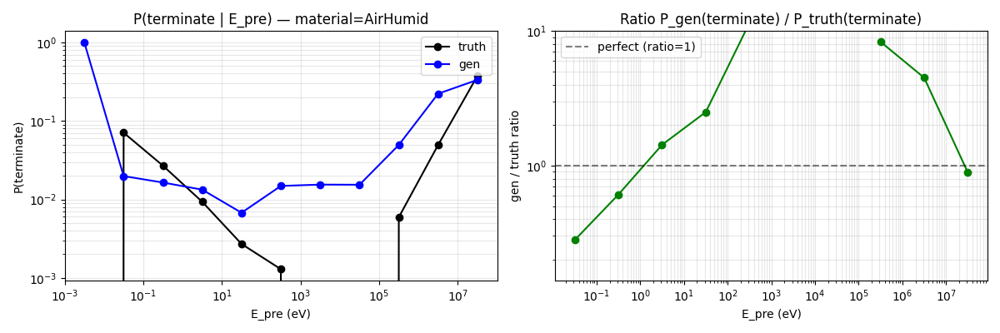
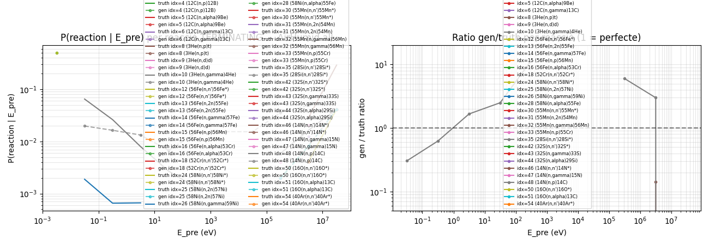
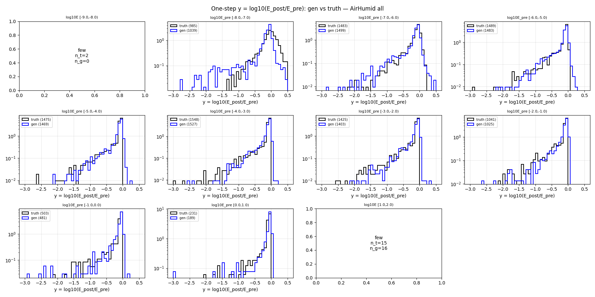
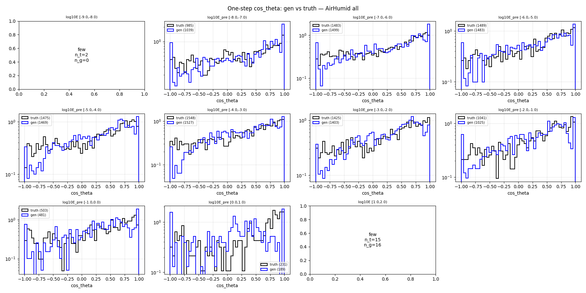
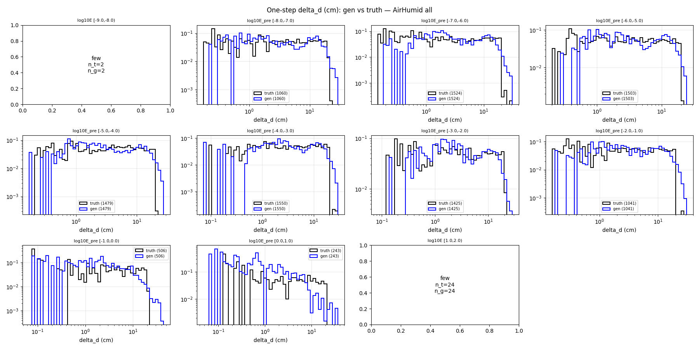
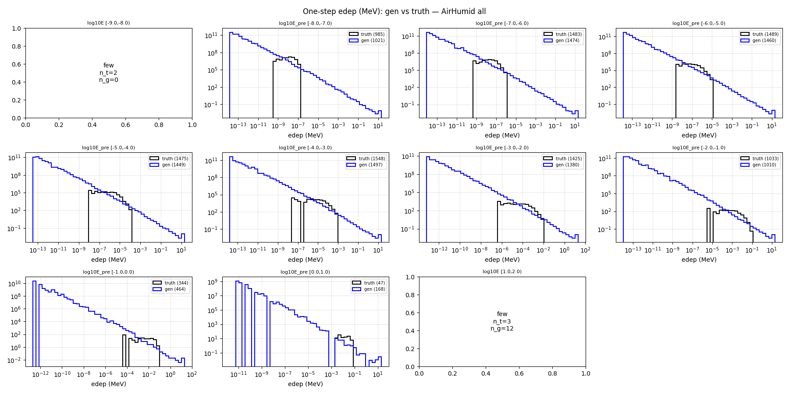

# One-step compare — material=AirHumid, split=all

- N samples comparats: 10,357

## Sample counts per bin

## Reactions combined

## P(terminate) global per E_pre

## P(terminate) per reacció individual

## Heads cinemàtics (HE only)

### y_head

### cos_theta_head

### delta_d_head

### edep_head (HE non-zero)

## P(terminate) resum per bin

| bin log10(E/MeV) | n_truth | n_gen | P_truth | P_gen | gen/truth |
|---|---:|---:|---:|---:|---:|
| [-9.0, -8.0) | 2 | 2 | 0.0000 | 1.0000 | NA |
| [-8.0, -7.0) | 1,060 | 1,060 | 0.0708 | 0.0198 | 0.28 |
| [-7.0, -6.0) | 1,524 | 1,524 | 0.0269 | 0.0164 | 0.61 |
| [-6.0, -5.0) | 1,503 | 1,503 | 0.0093 | 0.0133 | 1.43 |
| [-5.0, -4.0) | 1,479 | 1,479 | 0.0027 | 0.0068 | 2.50 |
| [-4.0, -3.0) | 1,550 | 1,550 | 0.0013 | 0.0148 | 11.50 |
| [-3.0, -2.0) | 1,425 | 1,425 | 0.0000 | 0.0154 | NA |
| [-2.0, -1.0) | 1,041 | 1,041 | 0.0000 | 0.0154 | NA |
| [-1.0, 0.0) | 506 | 506 | 0.0059 | 0.0494 | 8.33 |
| [0.0, 1.0) | 243 | 243 | 0.0494 | 0.2222 | 4.50 |
| [1.0, 2.0) | 24 | 24 | 0.3750 | 0.3333 | 0.89 |

## KS test per bin d'E_pre

### y_head (HE)

| bin | n_truth | n_gen | KS | p-value | |
|---|---:|---:|---:|---:|---|
| [-9.0, -8.0) | 2 | 0 | NA | NA | few |
| [-8.0, -7.0) | 985 | 1,039 | 0.280 | 2.53e-35 | FAIL* |
| [-7.0, -6.0) | 1,483 | 1,499 | 0.082 | 8.12e-05 | warn |
| [-6.0, -5.0) | 1,489 | 1,483 | 0.044 | 1.08e-01 | OK |
| [-5.0, -4.0) | 1,475 | 1,469 | 0.064 | 4.29e-03 | warn |
| [-4.0, -3.0) | 1,548 | 1,527 | 0.075 | 3.20e-04 | warn |
| [-3.0, -2.0) | 1,425 | 1,403 | 0.066 | 4.29e-03 | warn |
| [-2.0, -1.0) | 1,041 | 1,025 | 0.084 | 1.23e-03 | warn |
| [-1.0, 0.0) | 503 | 481 | 0.167 | 1.69e-06 | FAIL* |
| [0.0, 1.0) | 231 | 189 | 0.181 | 1.89e-03 | FAIL* |
| [1.0, 2.0) | 15 | 16 | NA | NA | few |

### cos_theta_head (HE)

| bin | n_truth | n_gen | KS | p-value | |
|---|---:|---:|---:|---:|---|
| [-9.0, -8.0) | 2 | 0 | NA | NA | few |
| [-8.0, -7.0) | 985 | 1,039 | 0.069 | 1.45e-02 | warn* |
| [-7.0, -6.0) | 1,483 | 1,499 | 0.057 | 1.50e-02 | warn |
| [-6.0, -5.0) | 1,489 | 1,483 | 0.042 | 1.32e-01 | OK |
| [-5.0, -4.0) | 1,475 | 1,469 | 0.073 | 6.92e-04 | warn |
| [-4.0, -3.0) | 1,548 | 1,527 | 0.071 | 8.78e-04 | warn |
| [-3.0, -2.0) | 1,425 | 1,403 | 0.060 | 1.22e-02 | warn |
| [-2.0, -1.0) | 1,041 | 1,025 | 0.061 | 3.84e-02 | warn |
| [-1.0, 0.0) | 503 | 481 | 0.072 | 1.51e-01 | warn* |
| [0.0, 1.0) | 231 | 189 | 0.268 | 4.61e-07 | FAIL* |
| [1.0, 2.0) | 15 | 16 | NA | NA | few |

### delta_d_head

| bin | n_truth | n_gen | KS | p-value | |
|---|---:|---:|---:|---:|---|
| [-9.0, -8.0) | 2 | 2 | NA | NA | few |
| [-8.0, -7.0) | 1,060 | 1,060 | 0.061 | 3.71e-02 | warn |
| [-7.0, -6.0) | 1,524 | 1,524 | 0.073 | 5.30e-04 | warn |
| [-6.0, -5.0) | 1,503 | 1,503 | 0.053 | 2.83e-02 | warn |
| [-5.0, -4.0) | 1,479 | 1,479 | 0.075 | 4.80e-04 | warn |
| [-4.0, -3.0) | 1,550 | 1,550 | 0.077 | 2.14e-04 | warn |
| [-3.0, -2.0) | 1,425 | 1,425 | 0.066 | 4.05e-03 | warn |
| [-2.0, -1.0) | 1,041 | 1,041 | 0.079 | 3.12e-03 | warn |
| [-1.0, 0.0) | 506 | 506 | 0.233 | 1.78e-12 | FAIL* |
| [0.0, 1.0) | 243 | 243 | 0.416 | 3.51e-19 | FAIL* |
| [1.0, 2.0) | 24 | 24 | NA | NA | few |

### edep_head (HE non-zero)

| bin | n_truth | n_gen | KS | p-value | |
|---|---:|---:|---:|---:|---|
| [-9.0, -8.0) | 2 | 0 | NA | NA | few |
| [-8.0, -7.0) | 985 | 1,021 | 0.642 | 2.90e-195 | FAIL* |
| [-7.0, -6.0) | 1,483 | 1,474 | 0.602 | 6.77e-250 | FAIL |
| [-6.0, -5.0) | 1,489 | 1,460 | 0.509 | 1.51e-174 | FAIL |
| [-5.0, -4.0) | 1,475 | 1,449 | 0.438 | 2.46e-126 | FAIL |
| [-4.0, -3.0) | 1,548 | 1,497 | 0.394 | 8.40e-106 | FAIL |
| [-3.0, -2.0) | 1,425 | 1,380 | 0.456 | 6.13e-132 | FAIL |
| [-2.0, -1.0) | 1,033 | 1,010 | 0.545 | 7.10e-140 | FAIL |
| [-1.0, 0.0) | 344 | 464 | 0.517 | 9.39e-49 | FAIL* |
| [0.0, 1.0) | 47 | 168 | 0.446 | 3.66e-07 | FAIL* |
| [1.0, 2.0) | 3 | 12 | NA | NA | few |

