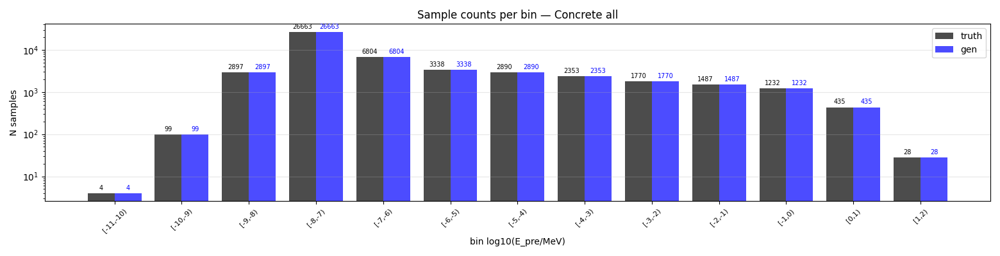
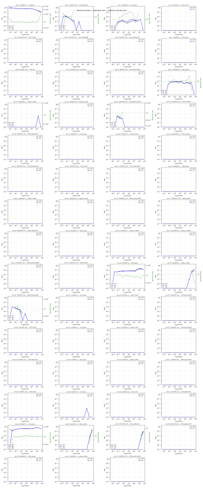
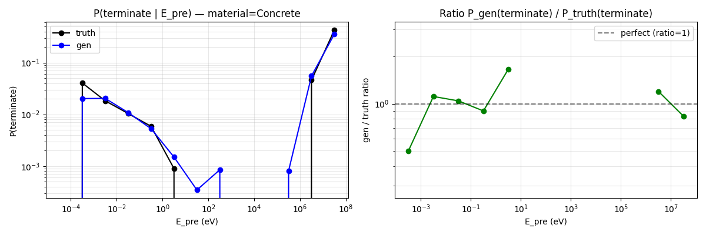
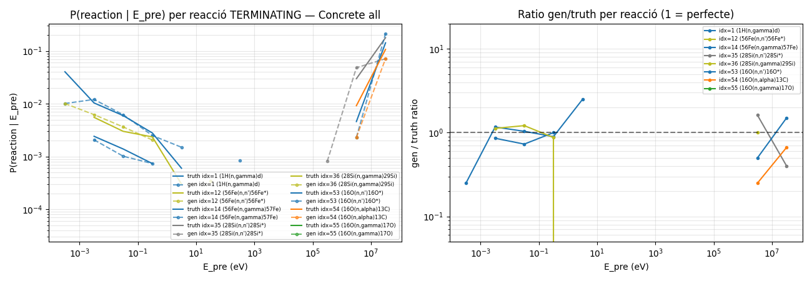
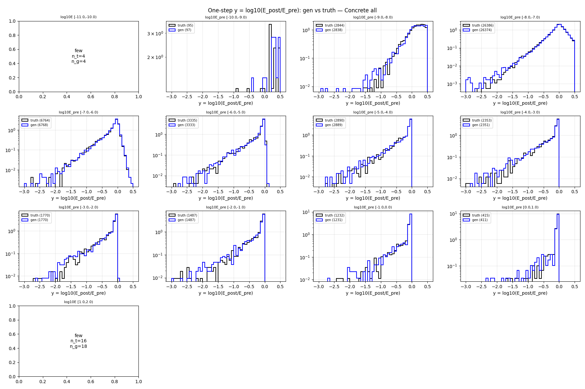
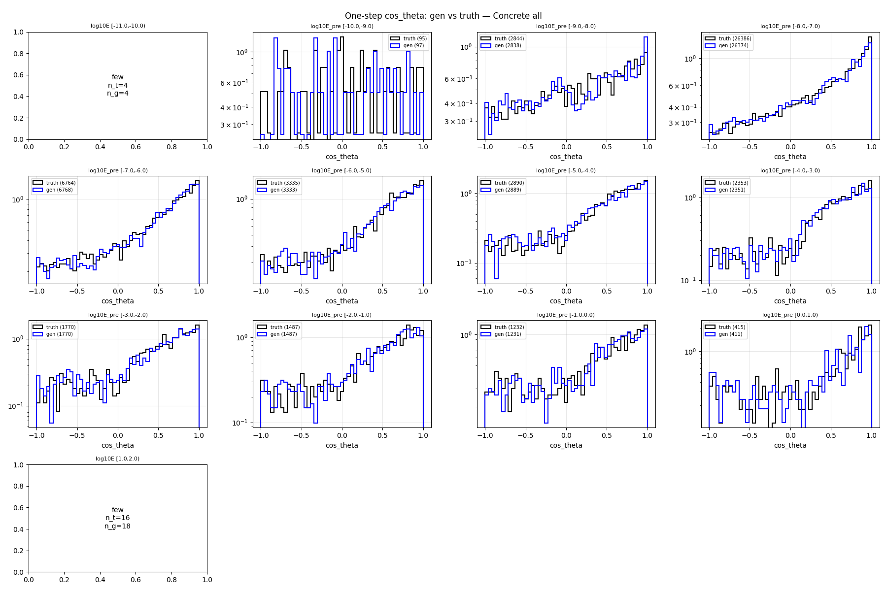
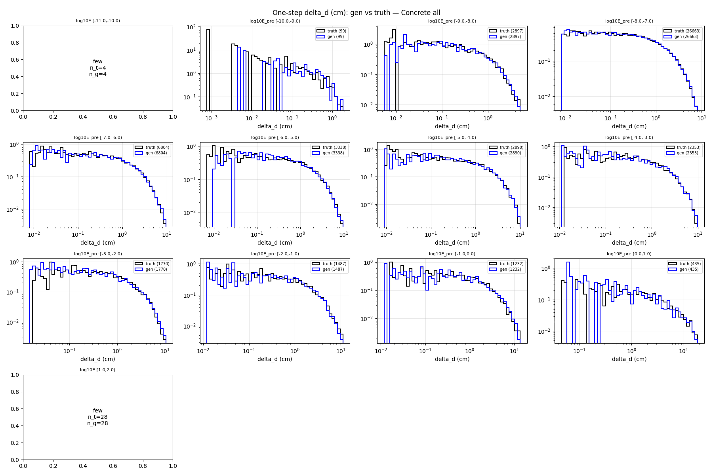
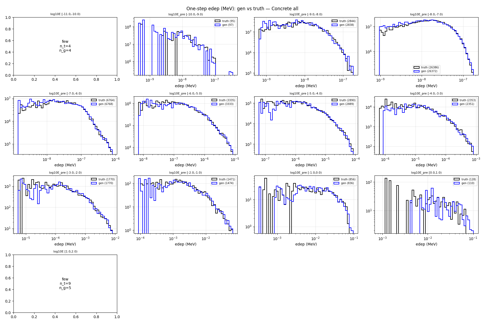

# One-step compare — material=Concrete, split=all

- N samples comparats: 50,000

## Sample counts per bin

## Reactions combined

## P(terminate) global per E_pre

## P(terminate) per reacció individual

## Heads cinemàtics (HE only)

### y_head

### cos_theta_head

### delta_d_head

### edep_head (HE non-zero)

## P(terminate) resum per bin

| bin log10(E/MeV) | n_truth | n_gen | P_truth | P_gen | gen/truth |
|---|---:|---:|---:|---:|---:|
| [-11.0, -10.0) | 4 | 4 | 0.0000 | 0.0000 | NA |
| [-10.0, -9.0) | 99 | 99 | 0.0404 | 0.0202 | 0.50 |
| [-9.0, -8.0) | 2,897 | 2,897 | 0.0183 | 0.0204 | 1.11 |
| [-8.0, -7.0) | 26,663 | 26,663 | 0.0104 | 0.0108 | 1.04 |
| [-7.0, -6.0) | 6,804 | 6,804 | 0.0059 | 0.0053 | 0.90 |
| [-6.0, -5.0) | 3,338 | 3,338 | 0.0009 | 0.0015 | 1.67 |
| [-5.0, -4.0) | 2,890 | 2,890 | 0.0000 | 0.0003 | NA |
| [-4.0, -3.0) | 2,353 | 2,353 | 0.0000 | 0.0008 | NA |
| [-3.0, -2.0) | 1,770 | 1,770 | 0.0000 | 0.0000 | NA |
| [-2.0, -1.0) | 1,487 | 1,487 | 0.0000 | 0.0000 | NA |
| [-1.0, 0.0) | 1,232 | 1,232 | 0.0000 | 0.0008 | NA |
| [0.0, 1.0) | 435 | 435 | 0.0460 | 0.0552 | 1.20 |
| [1.0, 2.0) | 28 | 28 | 0.4286 | 0.3571 | 0.83 |

## KS test per bin d'E_pre

### y_head (HE)

| bin | n_truth | n_gen | KS | p-value | |
|---|---:|---:|---:|---:|---|
| [-11.0, -10.0) | 4 | 4 | NA | NA | few |
| [-10.0, -9.0) | 95 | 97 | 0.091 | 7.67e-01 | warn* |
| [-9.0, -8.0) | 2,844 | 2,838 | 0.027 | 2.36e-01 | OK |
| [-8.0, -7.0) | 26,386 | 26,374 | 0.006 | 6.89e-01 | OK |
| [-7.0, -6.0) | 6,764 | 6,768 | 0.011 | 8.08e-01 | OK |
| [-6.0, -5.0) | 3,335 | 3,333 | 0.024 | 3.05e-01 | OK |
| [-5.0, -4.0) | 2,890 | 2,889 | 0.038 | 2.93e-02 | OK |
| [-4.0, -3.0) | 2,353 | 2,351 | 0.038 | 6.83e-02 | OK |
| [-3.0, -2.0) | 1,770 | 1,770 | 0.049 | 3.06e-02 | OK |
| [-2.0, -1.0) | 1,487 | 1,487 | 0.046 | 8.92e-02 | OK |
| [-1.0, 0.0) | 1,232 | 1,231 | 0.024 | 8.49e-01 | OK |
| [0.0, 1.0) | 415 | 411 | 0.082 | 1.17e-01 | warn* |
| [1.0, 2.0) | 16 | 18 | NA | NA | few |

### cos_theta_head (HE)

| bin | n_truth | n_gen | KS | p-value | |
|---|---:|---:|---:|---:|---|
| [-11.0, -10.0) | 4 | 4 | NA | NA | few |
| [-10.0, -9.0) | 95 | 97 | 0.095 | 7.30e-01 | warn* |
| [-9.0, -8.0) | 2,844 | 2,838 | 0.024 | 3.90e-01 | OK |
| [-8.0, -7.0) | 26,386 | 26,374 | 0.014 | 1.16e-02 | OK |
| [-7.0, -6.0) | 6,764 | 6,768 | 0.017 | 2.99e-01 | OK |
| [-6.0, -5.0) | 3,335 | 3,333 | 0.024 | 3.00e-01 | OK |
| [-5.0, -4.0) | 2,890 | 2,889 | 0.045 | 5.44e-03 | OK |
| [-4.0, -3.0) | 2,353 | 2,351 | 0.032 | 1.66e-01 | OK |
| [-3.0, -2.0) | 1,770 | 1,770 | 0.034 | 2.61e-01 | OK |
| [-2.0, -1.0) | 1,487 | 1,487 | 0.023 | 8.32e-01 | OK |
| [-1.0, 0.0) | 1,232 | 1,231 | 0.021 | 9.39e-01 | OK |
| [0.0, 1.0) | 415 | 411 | 0.068 | 2.84e-01 | warn* |
| [1.0, 2.0) | 16 | 18 | NA | NA | few |

### delta_d_head

| bin | n_truth | n_gen | KS | p-value | |
|---|---:|---:|---:|---:|---|
| [-11.0, -10.0) | 4 | 4 | NA | NA | few |
| [-10.0, -9.0) | 99 | 99 | 0.152 | 2.06e-01 | FAIL* |
| [-9.0, -8.0) | 2,897 | 2,897 | 0.018 | 7.39e-01 | OK |
| [-8.0, -7.0) | 26,663 | 26,663 | 0.005 | 9.12e-01 | OK |
| [-7.0, -6.0) | 6,804 | 6,804 | 0.014 | 4.81e-01 | OK |
| [-6.0, -5.0) | 3,338 | 3,338 | 0.035 | 3.55e-02 | OK |
| [-5.0, -4.0) | 2,890 | 2,890 | 0.020 | 6.28e-01 | OK |
| [-4.0, -3.0) | 2,353 | 2,353 | 0.045 | 1.54e-02 | OK |
| [-3.0, -2.0) | 1,770 | 1,770 | 0.028 | 5.06e-01 | OK |
| [-2.0, -1.0) | 1,487 | 1,487 | 0.028 | 6.24e-01 | OK |
| [-1.0, 0.0) | 1,232 | 1,232 | 0.047 | 1.30e-01 | OK |
| [0.0, 1.0) | 435 | 435 | 0.041 | 8.51e-01 | OK |
| [1.0, 2.0) | 28 | 28 | NA | NA | few |

### edep_head (HE non-zero)

| bin | n_truth | n_gen | KS | p-value | |
|---|---:|---:|---:|---:|---|
| [-11.0, -10.0) | 4 | 4 | NA | NA | few |
| [-10.0, -9.0) | 95 | 97 | 0.141 | 2.63e-01 | FAIL* |
| [-9.0, -8.0) | 2,844 | 2,838 | 0.031 | 1.33e-01 | OK |
| [-8.0, -7.0) | 26,386 | 26,372 | 0.022 | 7.17e-06 | OK |
| [-7.0, -6.0) | 6,764 | 6,768 | 0.026 | 1.98e-02 | OK |
| [-6.0, -5.0) | 3,335 | 3,333 | 0.026 | 2.14e-01 | OK |
| [-5.0, -4.0) | 2,890 | 2,889 | 0.027 | 2.50e-01 | OK |
| [-4.0, -3.0) | 2,353 | 2,351 | 0.037 | 8.34e-02 | OK |
| [-3.0, -2.0) | 1,770 | 1,770 | 0.038 | 1.58e-01 | OK |
| [-2.0, -1.0) | 1,471 | 1,474 | 0.069 | 1.84e-03 | warn |
| [-1.0, 0.0) | 856 | 836 | 0.044 | 3.63e-01 | OK |
| [0.0, 1.0) | 128 | 110 | 0.212 | 7.96e-03 | FAIL* |
| [1.0, 2.0) | 9 | 5 | NA | NA | few |

