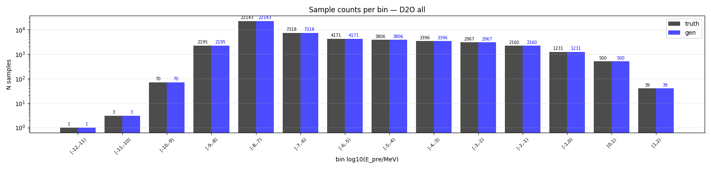
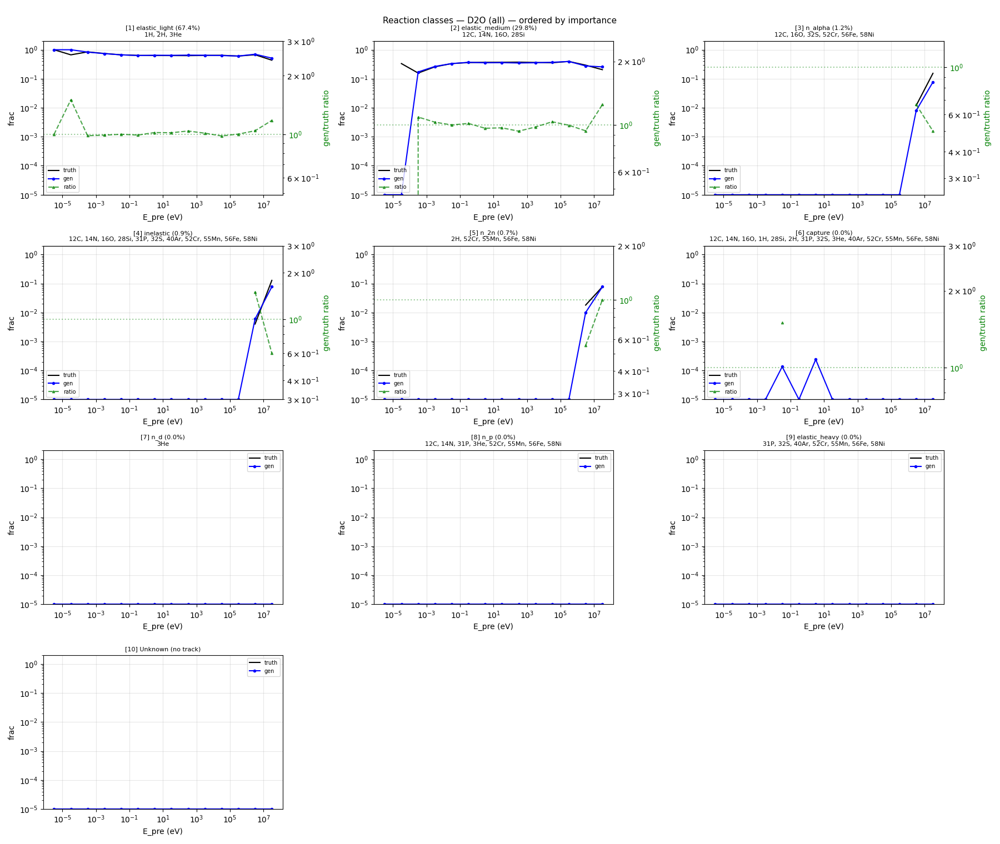
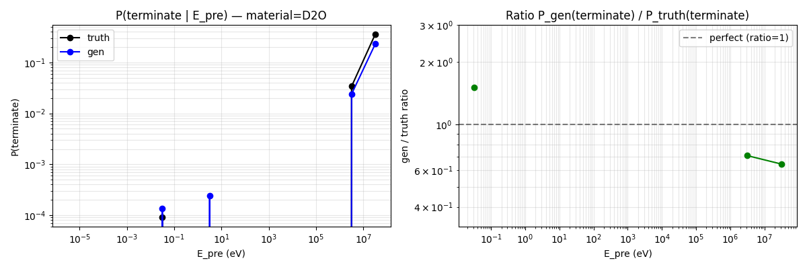
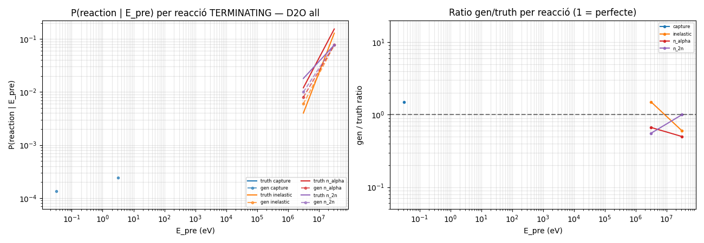
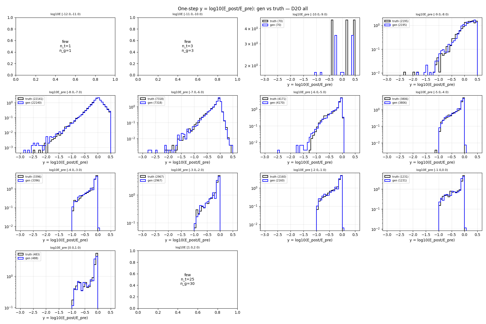
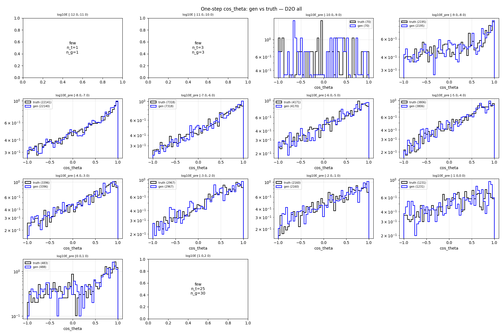
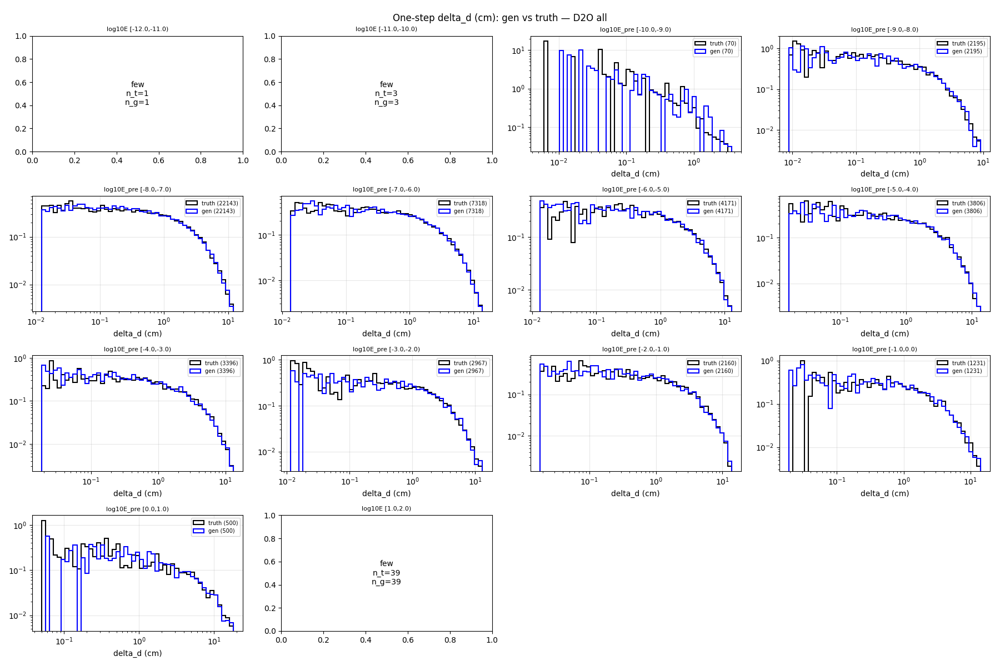
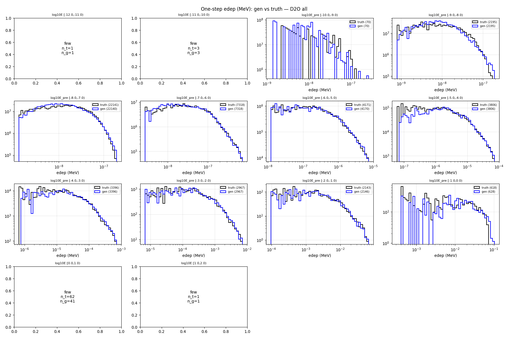

# One-step compare — material=D2O, split=all

- N samples comparats: 50,000

## Sample counts per bin

## Reactions combined

## P(terminate) global per E_pre

## P(terminate) per reacció individual

## Heads cinemàtics (HE only)

### y_head

### cos_theta_head

### delta_d_head

### edep_head (HE non-zero)

## P(terminate) resum per bin

| bin log10(E/MeV) | n_truth | n_gen | P_truth | P_gen | gen/truth |
|---|---:|---:|---:|---:|---:|
| [-12.0, -11.0) | 1 | 1 | 0.0000 | 0.0000 | NA |
| [-11.0, -10.0) | 3 | 3 | 0.0000 | 0.0000 | NA |
| [-10.0, -9.0) | 70 | 70 | 0.0000 | 0.0000 | NA |
| [-9.0, -8.0) | 2,195 | 2,195 | 0.0000 | 0.0000 | NA |
| [-8.0, -7.0) | 22,143 | 22,143 | 0.0001 | 0.0001 | 1.50 |
| [-7.0, -6.0) | 7,318 | 7,318 | 0.0000 | 0.0000 | NA |
| [-6.0, -5.0) | 4,171 | 4,171 | 0.0000 | 0.0002 | NA |
| [-5.0, -4.0) | 3,806 | 3,806 | 0.0000 | 0.0000 | NA |
| [-4.0, -3.0) | 3,396 | 3,396 | 0.0000 | 0.0000 | NA |
| [-3.0, -2.0) | 2,967 | 2,967 | 0.0000 | 0.0000 | NA |
| [-2.0, -1.0) | 2,160 | 2,160 | 0.0000 | 0.0000 | NA |
| [-1.0, 0.0) | 1,231 | 1,231 | 0.0000 | 0.0000 | NA |
| [0.0, 1.0) | 500 | 500 | 0.0340 | 0.0240 | 0.71 |
| [1.0, 2.0) | 39 | 39 | 0.3590 | 0.2308 | 0.64 |

## KS test per bin d'E_pre

### y_head (HE)

| bin | n_truth | n_gen | KS | p-value | |
|---|---:|---:|---:|---:|---|
| [-12.0, -11.0) | 1 | 1 | NA | NA | few |
| [-11.0, -10.0) | 3 | 3 | NA | NA | few |
| [-10.0, -9.0) | 70 | 70 | 0.186 | 1.79e-01 | FAIL* |
| [-9.0, -8.0) | 2,195 | 2,195 | 0.025 | 4.96e-01 | OK |
| [-8.0, -7.0) | 22,141 | 22,140 | 0.013 | 4.72e-02 | OK |
| [-7.0, -6.0) | 7,318 | 7,318 | 0.017 | 2.53e-01 | OK |
| [-6.0, -5.0) | 4,171 | 4,170 | 0.021 | 3.32e-01 | OK |
| [-5.0, -4.0) | 3,806 | 3,806 | 0.043 | 2.02e-03 | OK |
| [-4.0, -3.0) | 3,396 | 3,396 | 0.052 | 2.18e-04 | warn |
| [-3.0, -2.0) | 2,967 | 2,967 | 0.043 | 7.33e-03 | OK |
| [-2.0, -1.0) | 2,160 | 2,160 | 0.025 | 4.86e-01 | OK |
| [-1.0, 0.0) | 1,231 | 1,231 | 0.043 | 2.04e-01 | OK |
| [0.0, 1.0) | 483 | 488 | 0.091 | 3.27e-02 | warn* |
| [1.0, 2.0) | 25 | 30 | NA | NA | few |

### cos_theta_head (HE)

| bin | n_truth | n_gen | KS | p-value | |
|---|---:|---:|---:|---:|---|
| [-12.0, -11.0) | 1 | 1 | NA | NA | few |
| [-11.0, -10.0) | 3 | 3 | NA | NA | few |
| [-10.0, -9.0) | 70 | 70 | 0.100 | 8.79e-01 | FAIL* |
| [-9.0, -8.0) | 2,195 | 2,195 | 0.014 | 9.81e-01 | OK |
| [-8.0, -7.0) | 22,141 | 22,140 | 0.011 | 1.19e-01 | OK |
| [-7.0, -6.0) | 7,318 | 7,318 | 0.013 | 5.68e-01 | OK |
| [-6.0, -5.0) | 4,171 | 4,170 | 0.020 | 3.47e-01 | OK |
| [-5.0, -4.0) | 3,806 | 3,806 | 0.014 | 8.70e-01 | OK |
| [-4.0, -3.0) | 3,396 | 3,396 | 0.020 | 5.23e-01 | OK |
| [-3.0, -2.0) | 2,967 | 2,967 | 0.012 | 9.75e-01 | OK |
| [-2.0, -1.0) | 2,160 | 2,160 | 0.031 | 2.66e-01 | OK |
| [-1.0, 0.0) | 1,231 | 1,231 | 0.034 | 4.71e-01 | OK |
| [0.0, 1.0) | 483 | 488 | 0.033 | 9.37e-01 | OK |
| [1.0, 2.0) | 25 | 30 | NA | NA | few |

### delta_d_head

| bin | n_truth | n_gen | KS | p-value | |
|---|---:|---:|---:|---:|---|
| [-12.0, -11.0) | 1 | 1 | NA | NA | few |
| [-11.0, -10.0) | 3 | 3 | NA | NA | few |
| [-10.0, -9.0) | 70 | 70 | 0.157 | 3.55e-01 | FAIL* |
| [-9.0, -8.0) | 2,195 | 2,195 | 0.023 | 6.19e-01 | OK |
| [-8.0, -7.0) | 22,143 | 22,143 | 0.015 | 1.49e-02 | OK |
| [-7.0, -6.0) | 7,318 | 7,318 | 0.009 | 9.27e-01 | OK |
| [-6.0, -5.0) | 4,171 | 4,171 | 0.015 | 7.46e-01 | OK |
| [-5.0, -4.0) | 3,806 | 3,806 | 0.017 | 6.16e-01 | OK |
| [-4.0, -3.0) | 3,396 | 3,396 | 0.030 | 9.34e-02 | OK |
| [-3.0, -2.0) | 2,967 | 2,967 | 0.016 | 8.32e-01 | OK |
| [-2.0, -1.0) | 2,160 | 2,160 | 0.041 | 5.55e-02 | OK |
| [-1.0, 0.0) | 1,231 | 1,231 | 0.025 | 8.30e-01 | OK |
| [0.0, 1.0) | 500 | 500 | 0.046 | 6.66e-01 | OK |
| [1.0, 2.0) | 39 | 39 | NA | NA | few |

### edep_head (HE non-zero)

| bin | n_truth | n_gen | KS | p-value | |
|---|---:|---:|---:|---:|---|
| [-12.0, -11.0) | 1 | 1 | NA | NA | few |
| [-11.0, -10.0) | 3 | 3 | NA | NA | few |
| [-10.0, -9.0) | 70 | 70 | 0.257 | 1.92e-02 | FAIL* |
| [-9.0, -8.0) | 2,195 | 2,195 | 0.105 | 6.57e-11 | FAIL |
| [-8.0, -7.0) | 22,141 | 22,140 | 0.048 | 2.22e-22 | OK |
| [-7.0, -6.0) | 7,318 | 7,318 | 0.016 | 2.97e-01 | OK |
| [-6.0, -5.0) | 4,171 | 4,170 | 0.022 | 2.52e-01 | OK |
| [-5.0, -4.0) | 3,806 | 3,806 | 0.034 | 2.70e-02 | OK |
| [-4.0, -3.0) | 3,396 | 3,396 | 0.038 | 1.38e-02 | OK |
| [-3.0, -2.0) | 2,967 | 2,967 | 0.038 | 2.50e-02 | OK |
| [-2.0, -1.0) | 2,143 | 2,146 | 0.016 | 9.31e-01 | OK |
| [-1.0, 0.0) | 618 | 628 | 0.111 | 8.30e-04 | FAIL* |
| [0.0, 1.0) | 62 | 41 | NA | NA | few |
| [1.0, 2.0) | 1 | 1 | NA | NA | few |

