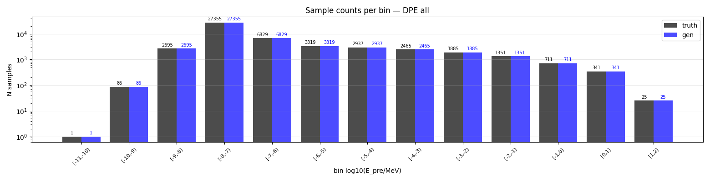
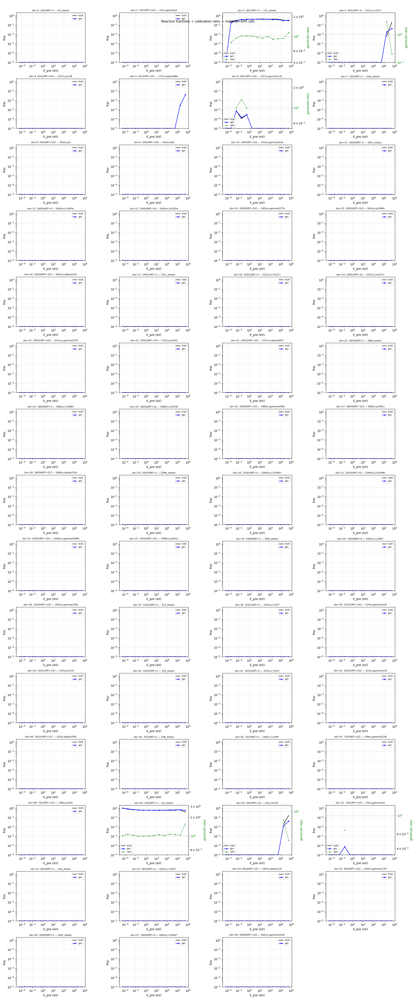
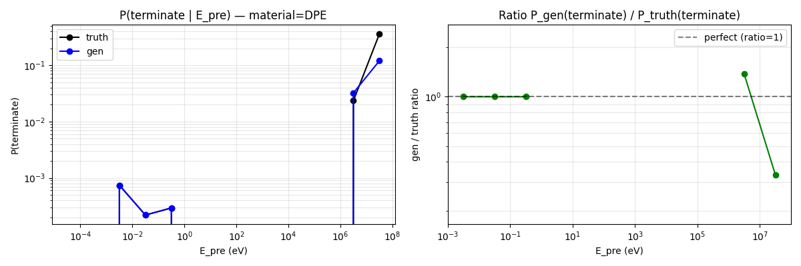
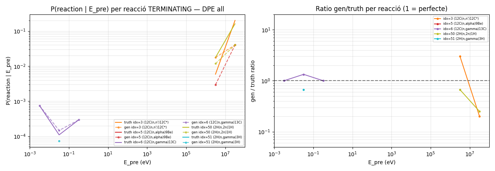
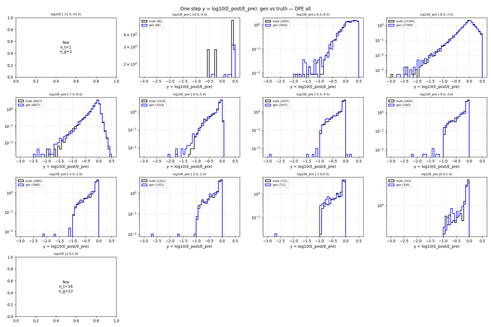
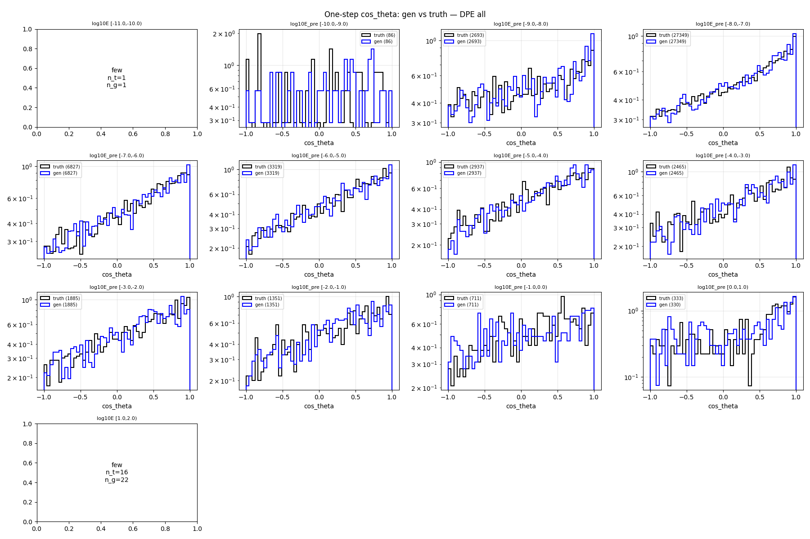
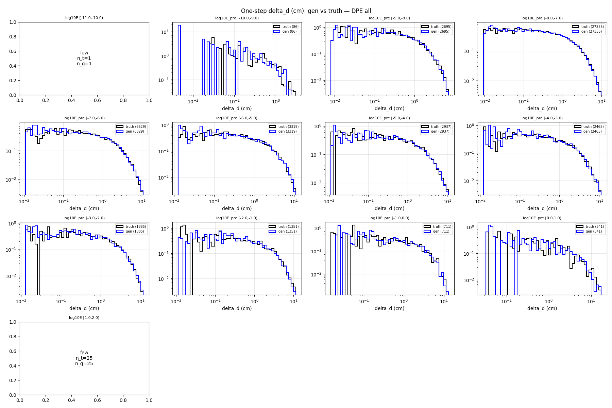
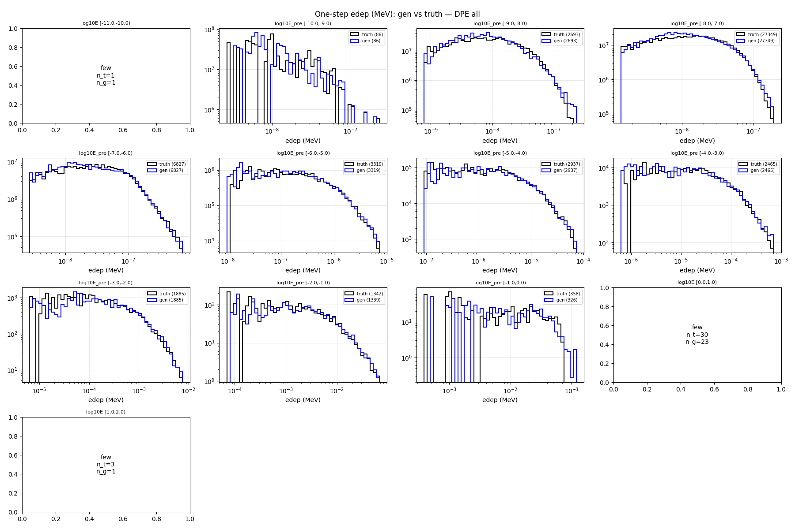

# One-step compare — material=DPE, split=all

- N samples comparats: 50,000

## Sample counts per bin

## Reactions combined

## P(terminate) global per E_pre

## P(terminate) per reacció individual

## Heads cinemàtics (HE only)

### y_head

### cos_theta_head

### delta_d_head

### edep_head (HE non-zero)

## P(terminate) resum per bin

| bin log10(E/MeV) | n_truth | n_gen | P_truth | P_gen | gen/truth |
|---|---:|---:|---:|---:|---:|
| [-11.0, -10.0) | 1 | 1 | 0.0000 | 0.0000 | NA |
| [-10.0, -9.0) | 86 | 86 | 0.0000 | 0.0000 | NA |
| [-9.0, -8.0) | 2,695 | 2,695 | 0.0007 | 0.0007 | 1.00 |
| [-8.0, -7.0) | 27,355 | 27,355 | 0.0002 | 0.0002 | 1.00 |
| [-7.0, -6.0) | 6,829 | 6,829 | 0.0003 | 0.0003 | 1.00 |
| [-6.0, -5.0) | 3,319 | 3,319 | 0.0000 | 0.0000 | NA |
| [-5.0, -4.0) | 2,937 | 2,937 | 0.0000 | 0.0000 | NA |
| [-4.0, -3.0) | 2,465 | 2,465 | 0.0000 | 0.0000 | NA |
| [-3.0, -2.0) | 1,885 | 1,885 | 0.0000 | 0.0000 | NA |
| [-2.0, -1.0) | 1,351 | 1,351 | 0.0000 | 0.0000 | NA |
| [-1.0, 0.0) | 711 | 711 | 0.0000 | 0.0000 | NA |
| [0.0, 1.0) | 341 | 341 | 0.0235 | 0.0323 | 1.38 |
| [1.0, 2.0) | 25 | 25 | 0.3600 | 0.1200 | 0.33 |

## KS test per bin d'E_pre

### y_head (HE)

| bin | n_truth | n_gen | KS | p-value | |
|---|---:|---:|---:|---:|---|
| [-11.0, -10.0) | 1 | 1 | NA | NA | few |
| [-10.0, -9.0) | 86 | 86 | 0.070 | 9.86e-01 | warn* |
| [-9.0, -8.0) | 2,693 | 2,693 | 0.022 | 5.38e-01 | OK |
| [-8.0, -7.0) | 27,349 | 27,349 | 0.012 | 3.61e-02 | OK |
| [-7.0, -6.0) | 6,827 | 6,827 | 0.016 | 3.28e-01 | OK |
| [-6.0, -5.0) | 3,319 | 3,319 | 0.019 | 5.68e-01 | OK |
| [-5.0, -4.0) | 2,937 | 2,937 | 0.039 | 2.05e-02 | OK |
| [-4.0, -3.0) | 2,465 | 2,465 | 0.043 | 2.10e-02 | OK |
| [-3.0, -2.0) | 1,885 | 1,885 | 0.066 | 5.71e-04 | warn |
| [-2.0, -1.0) | 1,351 | 1,351 | 0.067 | 4.34e-03 | warn |
| [-1.0, 0.0) | 711 | 711 | 0.070 | 5.94e-02 | warn* |
| [0.0, 1.0) | 333 | 330 | 0.117 | 1.97e-02 | FAIL* |
| [1.0, 2.0) | 16 | 22 | NA | NA | few |

### cos_theta_head (HE)

| bin | n_truth | n_gen | KS | p-value | |
|---|---:|---:|---:|---:|---|
| [-11.0, -10.0) | 1 | 1 | NA | NA | few |
| [-10.0, -9.0) | 86 | 86 | 0.070 | 9.86e-01 | warn* |
| [-9.0, -8.0) | 2,693 | 2,693 | 0.025 | 3.94e-01 | OK |
| [-8.0, -7.0) | 27,349 | 27,349 | 0.009 | 1.78e-01 | OK |
| [-7.0, -6.0) | 6,827 | 6,827 | 0.016 | 3.49e-01 | OK |
| [-6.0, -5.0) | 3,319 | 3,319 | 0.025 | 2.50e-01 | OK |
| [-5.0, -4.0) | 2,937 | 2,937 | 0.029 | 1.71e-01 | OK |
| [-4.0, -3.0) | 2,465 | 2,465 | 0.041 | 3.46e-02 | OK |
| [-3.0, -2.0) | 1,885 | 1,885 | 0.034 | 2.12e-01 | OK |
| [-2.0, -1.0) | 1,351 | 1,351 | 0.033 | 4.42e-01 | OK |
| [-1.0, 0.0) | 711 | 711 | 0.066 | 8.95e-02 | warn* |
| [0.0, 1.0) | 333 | 330 | 0.102 | 5.93e-02 | FAIL* |
| [1.0, 2.0) | 16 | 22 | NA | NA | few |

### delta_d_head

| bin | n_truth | n_gen | KS | p-value | |
|---|---:|---:|---:|---:|---|
| [-11.0, -10.0) | 1 | 1 | NA | NA | few |
| [-10.0, -9.0) | 86 | 86 | 0.093 | 8.54e-01 | warn* |
| [-9.0, -8.0) | 2,695 | 2,695 | 0.030 | 1.75e-01 | OK |
| [-8.0, -7.0) | 27,355 | 27,355 | 0.008 | 3.32e-01 | OK |
| [-7.0, -6.0) | 6,829 | 6,829 | 0.012 | 7.09e-01 | OK |
| [-6.0, -5.0) | 3,319 | 3,319 | 0.014 | 9.21e-01 | OK |
| [-5.0, -4.0) | 2,937 | 2,937 | 0.025 | 3.24e-01 | OK |
| [-4.0, -3.0) | 2,465 | 2,465 | 0.028 | 3.05e-01 | OK |
| [-3.0, -2.0) | 1,885 | 1,885 | 0.033 | 2.60e-01 | OK |
| [-2.0, -1.0) | 1,351 | 1,351 | 0.041 | 2.13e-01 | OK |
| [-1.0, 0.0) | 711 | 711 | 0.031 | 8.86e-01 | OK |
| [0.0, 1.0) | 341 | 341 | 0.070 | 3.67e-01 | warn* |
| [1.0, 2.0) | 25 | 25 | NA | NA | few |

### edep_head (HE non-zero)

| bin | n_truth | n_gen | KS | p-value | |
|---|---:|---:|---:|---:|---|
| [-11.0, -10.0) | 1 | 1 | NA | NA | few |
| [-10.0, -9.0) | 86 | 86 | 0.174 | 1.46e-01 | FAIL* |
| [-9.0, -8.0) | 2,693 | 2,693 | 0.071 | 2.25e-06 | warn |
| [-8.0, -7.0) | 27,349 | 27,349 | 0.043 | 1.48e-22 | OK |
| [-7.0, -6.0) | 6,827 | 6,827 | 0.026 | 2.25e-02 | OK |
| [-6.0, -5.0) | 3,319 | 3,319 | 0.015 | 8.46e-01 | OK |
| [-5.0, -4.0) | 2,937 | 2,937 | 0.027 | 2.52e-01 | OK |
| [-4.0, -3.0) | 2,465 | 2,465 | 0.032 | 1.49e-01 | OK |
| [-3.0, -2.0) | 1,885 | 1,885 | 0.044 | 5.17e-02 | OK |
| [-2.0, -1.0) | 1,342 | 1,339 | 0.041 | 1.93e-01 | OK |
| [-1.0, 0.0) | 358 | 326 | 0.086 | 1.49e-01 | warn* |
| [0.0, 1.0) | 30 | 23 | NA | NA | few |
| [1.0, 2.0) | 3 | 1 | NA | NA | few |

