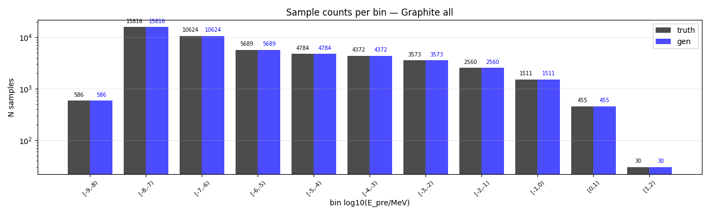
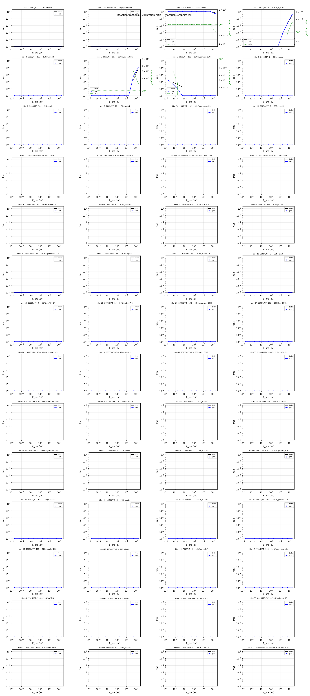
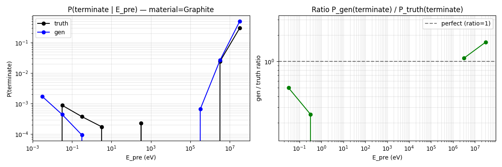
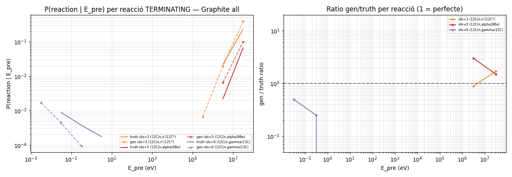
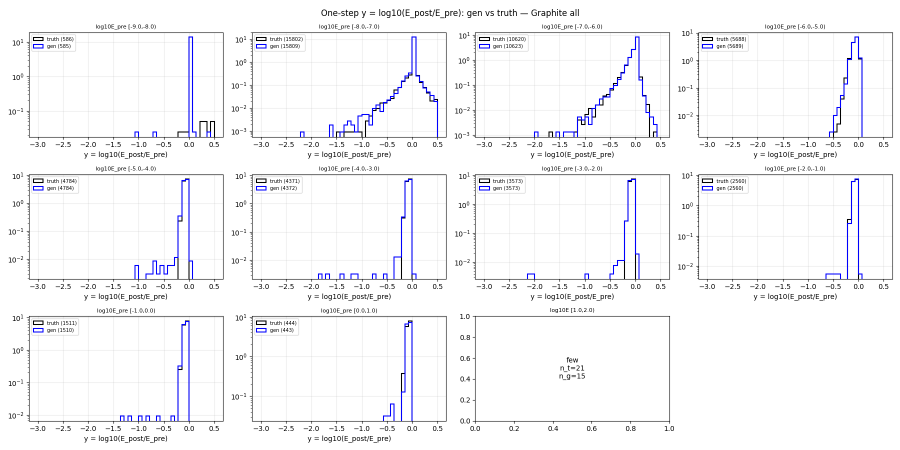
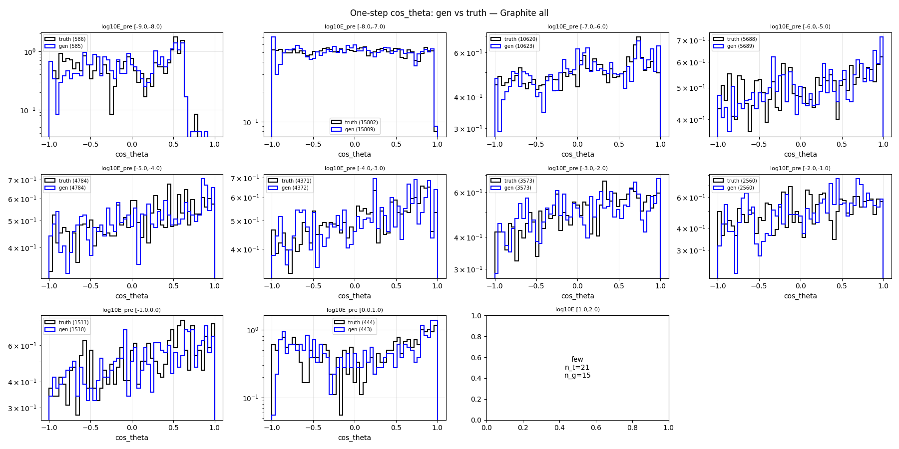
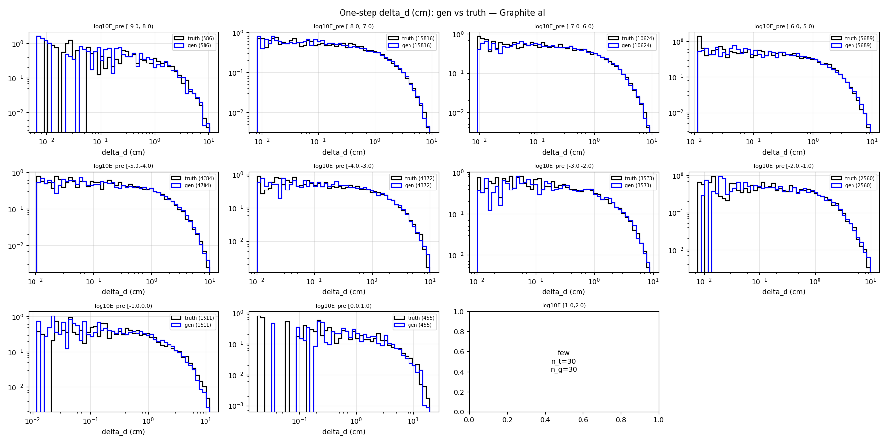
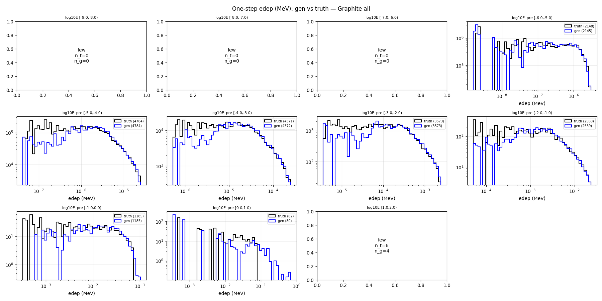

# One-step compare — material=Graphite, split=all

- N samples comparats: 50,000

## Sample counts per bin

## Reactions combined

## P(terminate) global per E_pre

## P(terminate) per reacció individual

## Heads cinemàtics (HE only)

### y_head

### cos_theta_head

### delta_d_head

### edep_head (HE non-zero)

## P(terminate) resum per bin

| bin log10(E/MeV) | n_truth | n_gen | P_truth | P_gen | gen/truth |
|---|---:|---:|---:|---:|---:|
| [-9.0, -8.0) | 586 | 586 | 0.0000 | 0.0017 | NA |
| [-8.0, -7.0) | 15,816 | 15,816 | 0.0009 | 0.0004 | 0.50 |
| [-7.0, -6.0) | 10,624 | 10,624 | 0.0004 | 0.0001 | 0.25 |
| [-6.0, -5.0) | 5,689 | 5,689 | 0.0002 | 0.0000 | 0.00 |
| [-5.0, -4.0) | 4,784 | 4,784 | 0.0000 | 0.0000 | NA |
| [-4.0, -3.0) | 4,372 | 4,372 | 0.0002 | 0.0000 | 0.00 |
| [-3.0, -2.0) | 3,573 | 3,573 | 0.0000 | 0.0000 | NA |
| [-2.0, -1.0) | 2,560 | 2,560 | 0.0000 | 0.0000 | NA |
| [-1.0, 0.0) | 1,511 | 1,511 | 0.0000 | 0.0007 | NA |
| [0.0, 1.0) | 455 | 455 | 0.0242 | 0.0264 | 1.09 |
| [1.0, 2.0) | 30 | 30 | 0.3000 | 0.5000 | 1.67 |

## KS test per bin d'E_pre

### y_head (HE)

| bin | n_truth | n_gen | KS | p-value | |
|---|---:|---:|---:|---:|---|
| [-9.0, -8.0) | 586 | 585 | 0.008 | 1.00e+00 | OK |
| [-8.0, -7.0) | 15,802 | 15,809 | 0.008 | 6.70e-01 | OK |
| [-7.0, -6.0) | 10,620 | 10,623 | 0.009 | 8.05e-01 | OK |
| [-6.0, -5.0) | 5,688 | 5,689 | 0.025 | 5.95e-02 | OK |
| [-5.0, -4.0) | 4,784 | 4,784 | 0.066 | 1.70e-09 | warn |
| [-4.0, -3.0) | 4,371 | 4,372 | 0.076 | 1.75e-11 | warn |
| [-3.0, -2.0) | 3,573 | 3,573 | 0.067 | 2.26e-07 | warn |
| [-2.0, -1.0) | 2,560 | 2,560 | 0.061 | 1.67e-04 | warn |
| [-1.0, 0.0) | 1,511 | 1,510 | 0.075 | 3.94e-04 | warn |
| [0.0, 1.0) | 444 | 443 | 0.121 | 2.45e-03 | FAIL* |
| [1.0, 2.0) | 21 | 15 | NA | NA | few |

### cos_theta_head (HE)

| bin | n_truth | n_gen | KS | p-value | |
|---|---:|---:|---:|---:|---|
| [-9.0, -8.0) | 586 | 585 | 0.100 | 4.72e-03 | FAIL* |
| [-8.0, -7.0) | 15,802 | 15,809 | 0.020 | 4.02e-03 | OK |
| [-7.0, -6.0) | 10,620 | 10,623 | 0.019 | 4.74e-02 | OK |
| [-6.0, -5.0) | 5,688 | 5,689 | 0.018 | 3.24e-01 | OK |
| [-5.0, -4.0) | 4,784 | 4,784 | 0.014 | 7.69e-01 | OK |
| [-4.0, -3.0) | 4,371 | 4,372 | 0.017 | 5.16e-01 | OK |
| [-3.0, -2.0) | 3,573 | 3,573 | 0.022 | 3.32e-01 | OK |
| [-2.0, -1.0) | 2,560 | 2,560 | 0.046 | 9.51e-03 | OK |
| [-1.0, 0.0) | 1,511 | 1,510 | 0.022 | 8.34e-01 | OK |
| [0.0, 1.0) | 444 | 443 | 0.055 | 4.81e-01 | warn* |
| [1.0, 2.0) | 21 | 15 | NA | NA | few |

### delta_d_head

| bin | n_truth | n_gen | KS | p-value | |
|---|---:|---:|---:|---:|---|
| [-9.0, -8.0) | 586 | 586 | 0.077 | 6.31e-02 | warn* |
| [-8.0, -7.0) | 15,816 | 15,816 | 0.012 | 1.97e-01 | OK |
| [-7.0, -6.0) | 10,624 | 10,624 | 0.007 | 9.52e-01 | OK |
| [-6.0, -5.0) | 5,689 | 5,689 | 0.023 | 9.79e-02 | OK |
| [-5.0, -4.0) | 4,784 | 4,784 | 0.026 | 8.46e-02 | OK |
| [-4.0, -3.0) | 4,372 | 4,372 | 0.010 | 9.84e-01 | OK |
| [-3.0, -2.0) | 3,573 | 3,573 | 0.025 | 2.18e-01 | OK |
| [-2.0, -1.0) | 2,560 | 2,560 | 0.019 | 7.59e-01 | OK |
| [-1.0, 0.0) | 1,511 | 1,511 | 0.047 | 7.11e-02 | OK |
| [0.0, 1.0) | 455 | 455 | 0.044 | 7.72e-01 | OK |
| [1.0, 2.0) | 30 | 30 | NA | NA | few |

### edep_head (HE non-zero)

| bin | n_truth | n_gen | KS | p-value | |
|---|---:|---:|---:|---:|---|
| [-9.0, -8.0) | 0 | 0 | NA | NA | few |
| [-8.0, -7.0) | 0 | 0 | NA | NA | few |
| [-7.0, -6.0) | 0 | 0 | NA | NA | few |
| [-6.0, -5.0) | 2,148 | 2,145 | 0.040 | 5.79e-02 | OK |
| [-5.0, -4.0) | 4,784 | 4,784 | 0.054 | 2.24e-06 | warn |
| [-4.0, -3.0) | 4,371 | 4,372 | 0.044 | 3.47e-04 | OK |
| [-3.0, -2.0) | 3,573 | 3,573 | 0.040 | 6.03e-03 | OK |
| [-2.0, -1.0) | 2,560 | 2,559 | 0.042 | 2.19e-02 | OK |
| [-1.0, 0.0) | 1,185 | 1,185 | 0.075 | 2.49e-03 | warn |
| [0.0, 1.0) | 82 | 80 | 0.538 | 2.63e-11 | FAIL* |
| [1.0, 2.0) | 6 | 4 | NA | NA | few |

