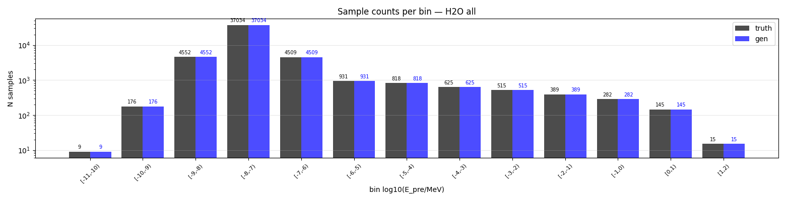
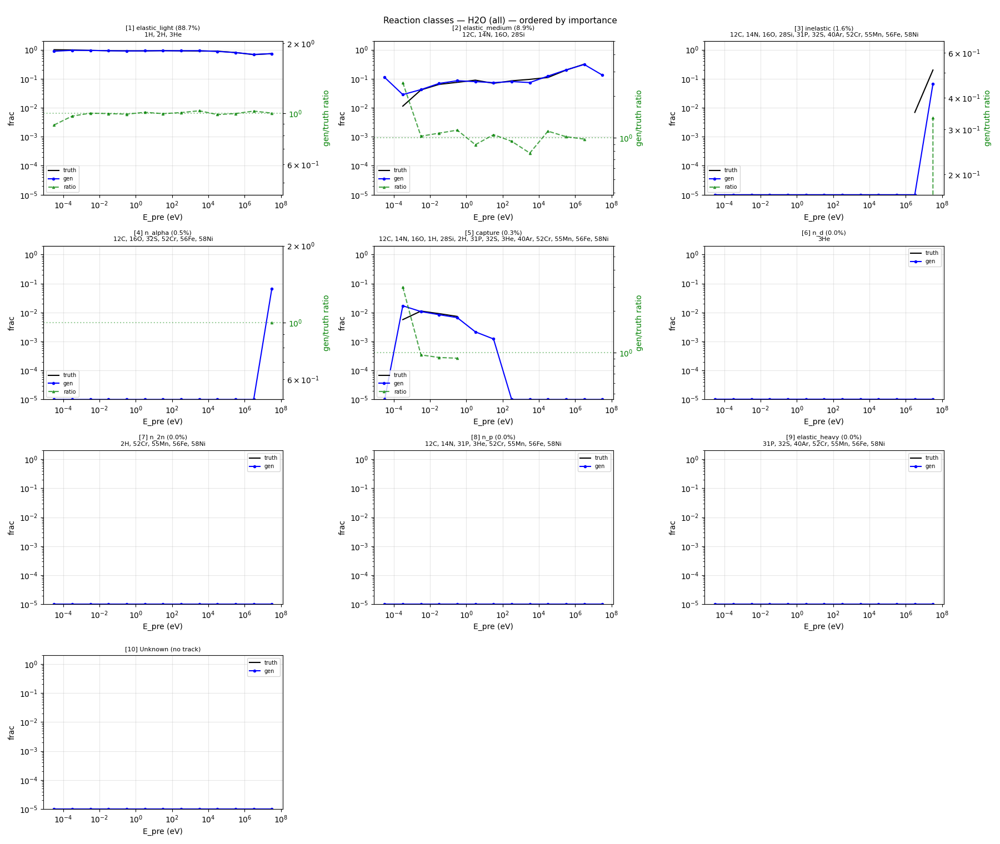
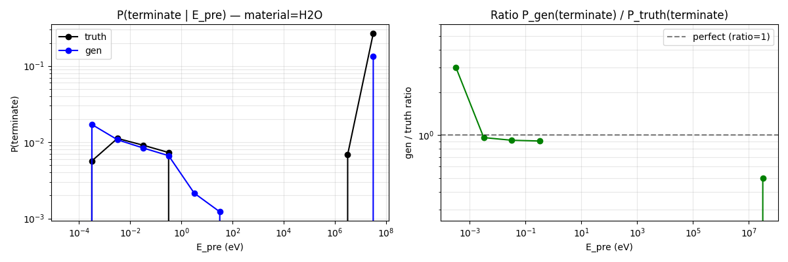
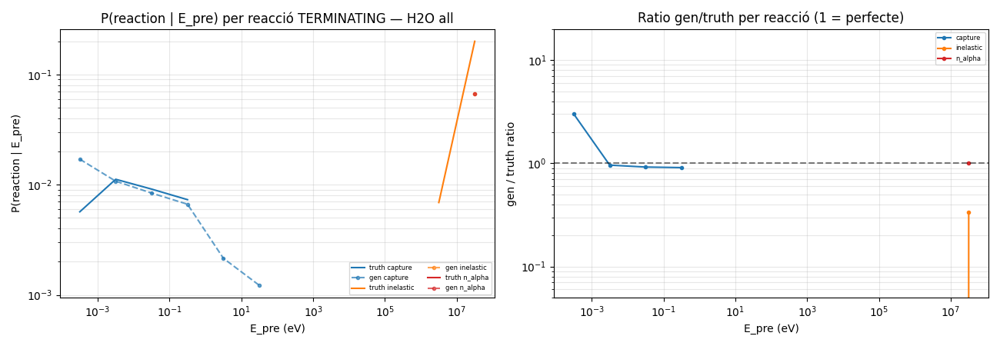
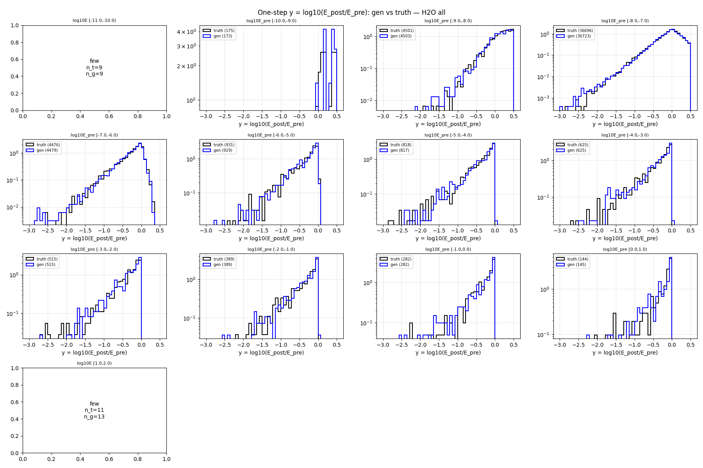
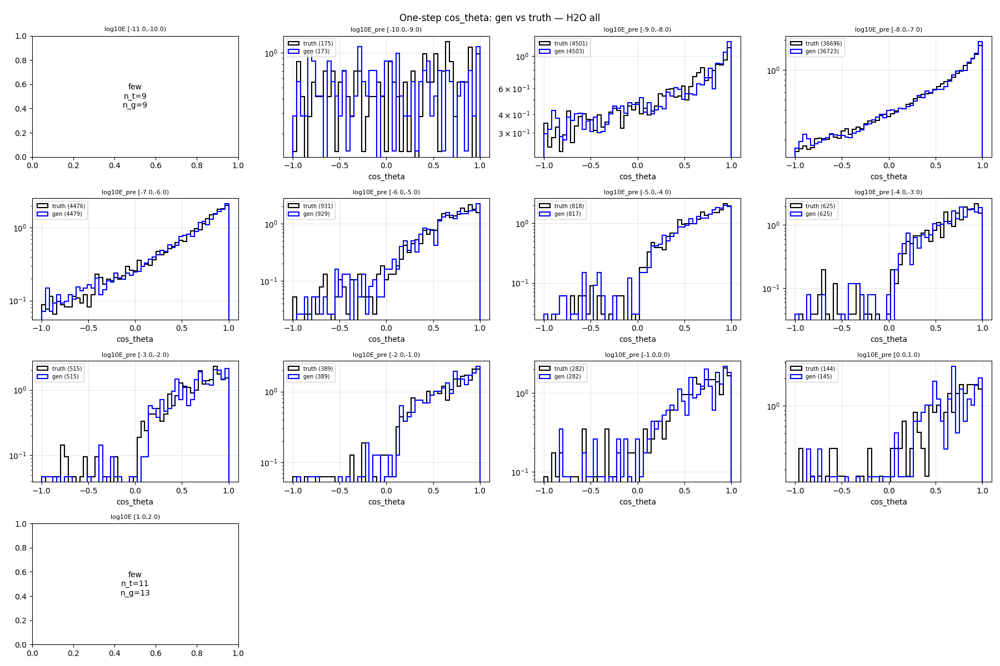
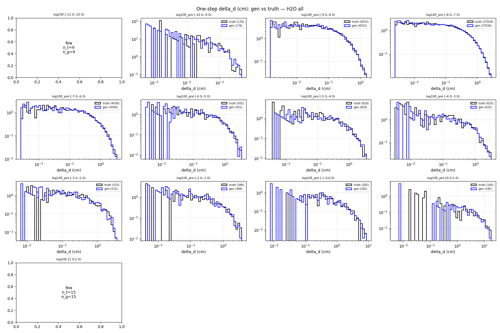
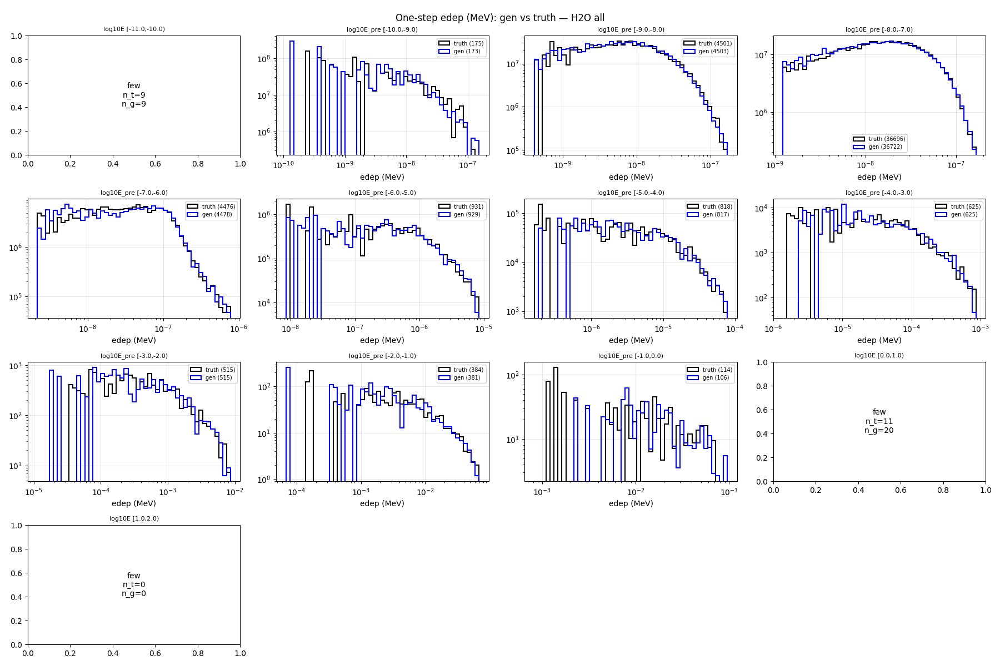

# One-step compare — material=H2O, split=all

- N samples comparats: 50,000

## Sample counts per bin

## Reactions combined

## P(terminate) global per E_pre

## P(terminate) per reacció individual

## Heads cinemàtics (HE only)

### y_head

### cos_theta_head

### delta_d_head

### edep_head (HE non-zero)

## P(terminate) resum per bin

| bin log10(E/MeV) | n_truth | n_gen | P_truth | P_gen | gen/truth |
|---|---:|---:|---:|---:|---:|
| [-11.0, -10.0) | 9 | 9 | 0.0000 | 0.0000 | NA |
| [-10.0, -9.0) | 176 | 176 | 0.0057 | 0.0170 | 3.00 |
| [-9.0, -8.0) | 4,552 | 4,552 | 0.0112 | 0.0108 | 0.96 |
| [-8.0, -7.0) | 37,034 | 37,034 | 0.0091 | 0.0084 | 0.92 |
| [-7.0, -6.0) | 4,509 | 4,509 | 0.0073 | 0.0067 | 0.91 |
| [-6.0, -5.0) | 931 | 931 | 0.0000 | 0.0021 | NA |
| [-5.0, -4.0) | 818 | 818 | 0.0000 | 0.0012 | NA |
| [-4.0, -3.0) | 625 | 625 | 0.0000 | 0.0000 | NA |
| [-3.0, -2.0) | 515 | 515 | 0.0000 | 0.0000 | NA |
| [-2.0, -1.0) | 389 | 389 | 0.0000 | 0.0000 | NA |
| [-1.0, 0.0) | 282 | 282 | 0.0000 | 0.0000 | NA |
| [0.0, 1.0) | 145 | 145 | 0.0069 | 0.0000 | 0.00 |
| [1.0, 2.0) | 15 | 15 | 0.2667 | 0.1333 | 0.50 |

## KS test per bin d'E_pre

### y_head (HE)

| bin | n_truth | n_gen | KS | p-value | |
|---|---:|---:|---:|---:|---|
| [-11.0, -10.0) | 9 | 9 | NA | NA | few |
| [-10.0, -9.0) | 175 | 173 | 0.084 | 5.35e-01 | warn* |
| [-9.0, -8.0) | 4,501 | 4,503 | 0.029 | 3.94e-02 | OK |
| [-8.0, -7.0) | 36,696 | 36,723 | 0.010 | 4.72e-02 | OK |
| [-7.0, -6.0) | 4,476 | 4,479 | 0.029 | 5.08e-02 | OK |
| [-6.0, -5.0) | 931 | 929 | 0.048 | 2.22e-01 | OK |
| [-5.0, -4.0) | 818 | 817 | 0.027 | 9.07e-01 | OK |
| [-4.0, -3.0) | 625 | 625 | 0.048 | 4.68e-01 | OK |
| [-3.0, -2.0) | 515 | 515 | 0.043 | 7.36e-01 | OK |
| [-2.0, -1.0) | 389 | 389 | 0.044 | 8.52e-01 | OK |
| [-1.0, 0.0) | 282 | 282 | 0.050 | 8.79e-01 | OK |
| [0.0, 1.0) | 144 | 145 | 0.122 | 2.02e-01 | FAIL* |
| [1.0, 2.0) | 11 | 13 | NA | NA | few |

### cos_theta_head (HE)

| bin | n_truth | n_gen | KS | p-value | |
|---|---:|---:|---:|---:|---|
| [-11.0, -10.0) | 9 | 9 | NA | NA | few |
| [-10.0, -9.0) | 175 | 173 | 0.106 | 2.59e-01 | FAIL* |
| [-9.0, -8.0) | 4,501 | 4,503 | 0.027 | 7.48e-02 | OK |
| [-8.0, -7.0) | 36,696 | 36,723 | 0.011 | 2.44e-02 | OK |
| [-7.0, -6.0) | 4,476 | 4,479 | 0.023 | 1.65e-01 | OK |
| [-6.0, -5.0) | 931 | 929 | 0.033 | 6.78e-01 | OK |
| [-5.0, -4.0) | 818 | 817 | 0.031 | 8.07e-01 | OK |
| [-4.0, -3.0) | 625 | 625 | 0.038 | 7.47e-01 | OK |
| [-3.0, -2.0) | 515 | 515 | 0.043 | 7.36e-01 | OK |
| [-2.0, -1.0) | 389 | 389 | 0.044 | 8.52e-01 | OK |
| [-1.0, 0.0) | 282 | 282 | 0.050 | 8.79e-01 | OK |
| [0.0, 1.0) | 144 | 145 | 0.121 | 2.22e-01 | FAIL* |
| [1.0, 2.0) | 11 | 13 | NA | NA | few |

### delta_d_head

| bin | n_truth | n_gen | KS | p-value | |
|---|---:|---:|---:|---:|---|
| [-11.0, -10.0) | 9 | 9 | NA | NA | few |
| [-10.0, -9.0) | 176 | 176 | 0.091 | 4.62e-01 | warn* |
| [-9.0, -8.0) | 4,552 | 4,552 | 0.018 | 4.20e-01 | OK |
| [-8.0, -7.0) | 37,034 | 37,034 | 0.010 | 4.73e-02 | OK |
| [-7.0, -6.0) | 4,509 | 4,509 | 0.013 | 8.64e-01 | OK |
| [-6.0, -5.0) | 931 | 931 | 0.029 | 8.29e-01 | OK |
| [-5.0, -4.0) | 818 | 818 | 0.032 | 8.03e-01 | OK |
| [-4.0, -3.0) | 625 | 625 | 0.053 | 3.49e-01 | warn* |
| [-3.0, -2.0) | 515 | 515 | 0.052 | 4.79e-01 | warn* |
| [-2.0, -1.0) | 389 | 389 | 0.087 | 1.02e-01 | warn* |
| [-1.0, 0.0) | 282 | 282 | 0.035 | 9.94e-01 | OK |
| [0.0, 1.0) | 145 | 145 | 0.083 | 7.05e-01 | warn* |
| [1.0, 2.0) | 15 | 15 | NA | NA | few |

### edep_head (HE non-zero)

| bin | n_truth | n_gen | KS | p-value | |
|---|---:|---:|---:|---:|---|
| [-11.0, -10.0) | 9 | 9 | NA | NA | few |
| [-10.0, -9.0) | 175 | 173 | 0.134 | 7.68e-02 | FAIL* |
| [-9.0, -8.0) | 4,501 | 4,503 | 0.031 | 2.73e-02 | OK |
| [-8.0, -7.0) | 36,696 | 36,722 | 0.009 | 8.60e-02 | OK |
| [-7.0, -6.0) | 4,476 | 4,478 | 0.036 | 6.52e-03 | OK |
| [-6.0, -5.0) | 931 | 929 | 0.037 | 5.29e-01 | OK |
| [-5.0, -4.0) | 818 | 817 | 0.031 | 8.07e-01 | OK |
| [-4.0, -3.0) | 625 | 625 | 0.043 | 6.05e-01 | OK |
| [-3.0, -2.0) | 515 | 515 | 0.035 | 9.12e-01 | OK |
| [-2.0, -1.0) | 384 | 381 | 0.054 | 6.10e-01 | warn* |
| [-1.0, 0.0) | 114 | 106 | 0.085 | 7.79e-01 | warn* |
| [0.0, 1.0) | 11 | 20 | NA | NA | few |
| [1.0, 2.0) | 0 | 0 | NA | NA | few |

