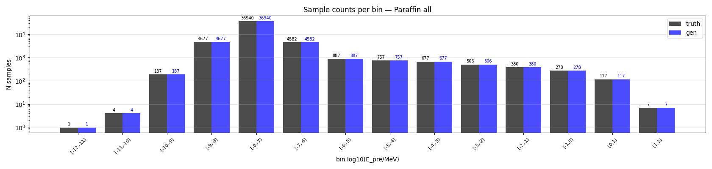
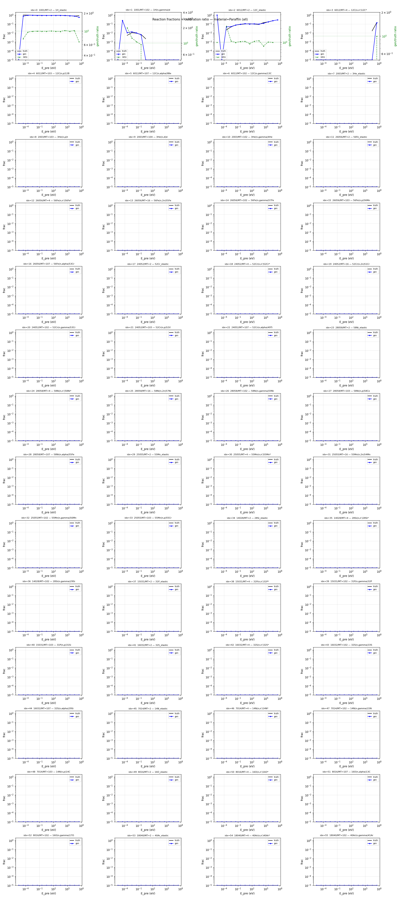
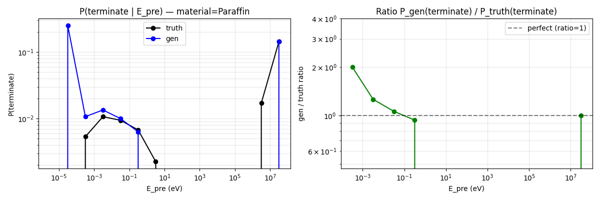
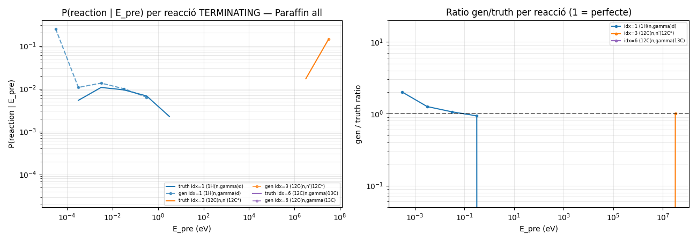
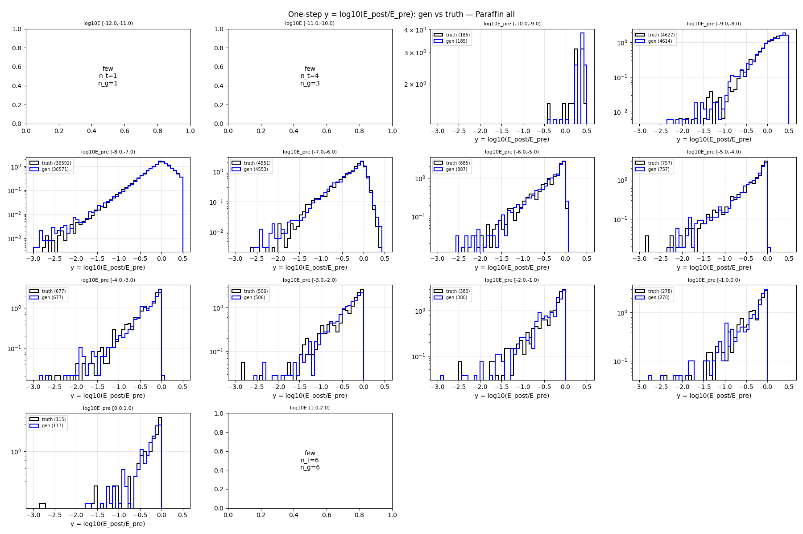
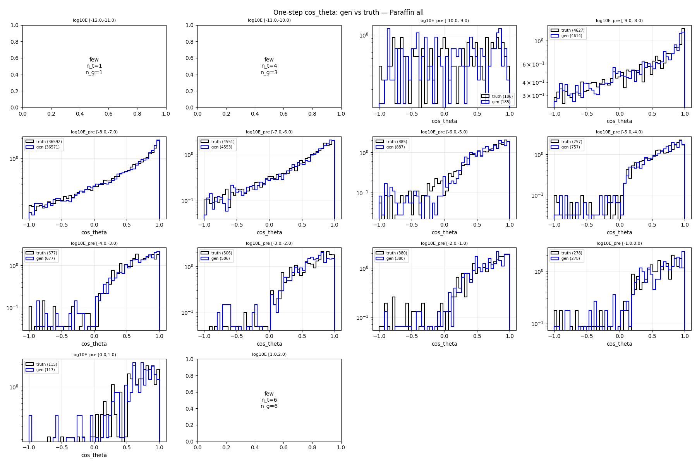
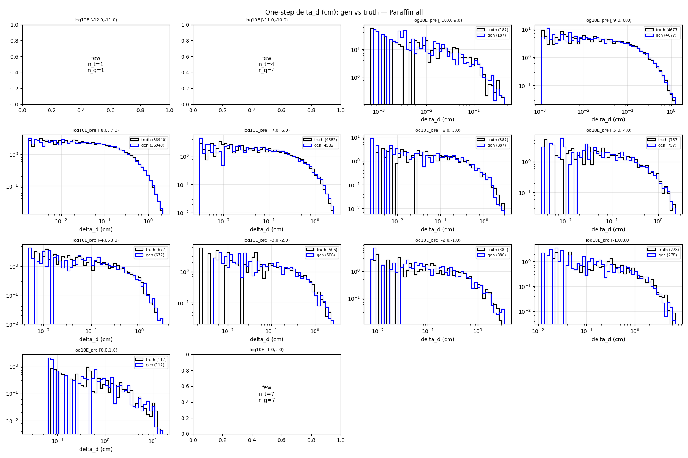
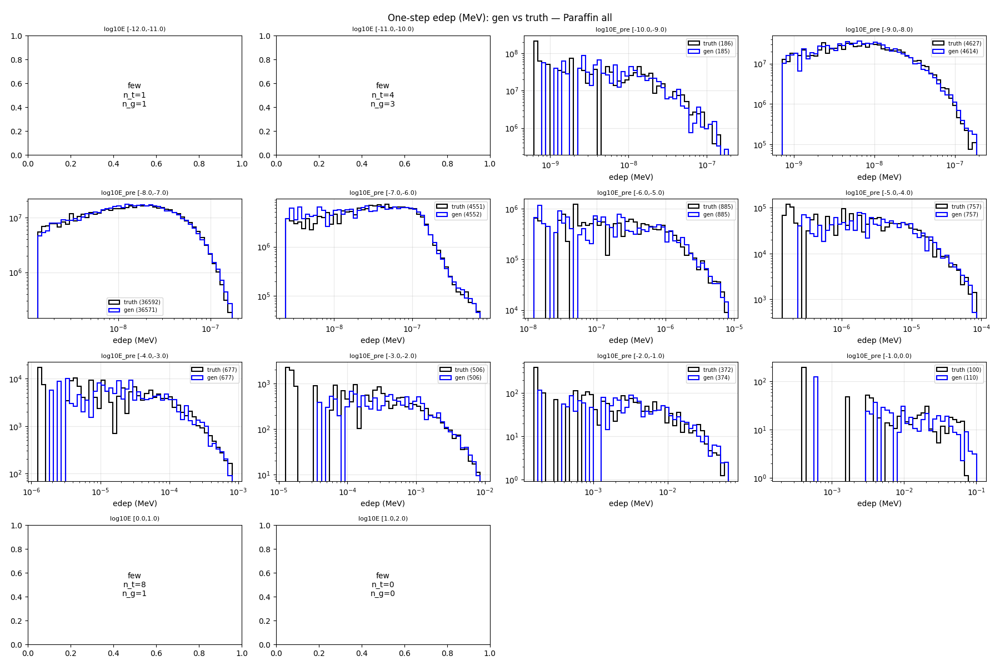

# One-step compare — material=Paraffin, split=all

- N samples comparats: 50,000

## Sample counts per bin

## Reactions combined

## P(terminate) global per E_pre

## P(terminate) per reacció individual

## Heads cinemàtics (HE only)

### y_head

### cos_theta_head

### delta_d_head

### edep_head (HE non-zero)

## P(terminate) resum per bin

| bin log10(E/MeV) | n_truth | n_gen | P_truth | P_gen | gen/truth |
|---|---:|---:|---:|---:|---:|
| [-12.0, -11.0) | 1 | 1 | 0.0000 | 0.0000 | NA |
| [-11.0, -10.0) | 4 | 4 | 0.0000 | 0.2500 | NA |
| [-10.0, -9.0) | 187 | 187 | 0.0053 | 0.0107 | 2.00 |
| [-9.0, -8.0) | 4,677 | 4,677 | 0.0107 | 0.0135 | 1.26 |
| [-8.0, -7.0) | 36,940 | 36,940 | 0.0094 | 0.0100 | 1.06 |
| [-7.0, -6.0) | 4,582 | 4,582 | 0.0068 | 0.0063 | 0.94 |
| [-6.0, -5.0) | 887 | 887 | 0.0023 | 0.0000 | 0.00 |
| [-5.0, -4.0) | 757 | 757 | 0.0000 | 0.0000 | NA |
| [-4.0, -3.0) | 677 | 677 | 0.0000 | 0.0000 | NA |
| [-3.0, -2.0) | 506 | 506 | 0.0000 | 0.0000 | NA |
| [-2.0, -1.0) | 380 | 380 | 0.0000 | 0.0000 | NA |
| [-1.0, 0.0) | 278 | 278 | 0.0000 | 0.0000 | NA |
| [0.0, 1.0) | 117 | 117 | 0.0171 | 0.0000 | 0.00 |
| [1.0, 2.0) | 7 | 7 | 0.1429 | 0.1429 | 1.00 |

## KS test per bin d'E_pre

### y_head (HE)

| bin | n_truth | n_gen | KS | p-value | |
|---|---:|---:|---:|---:|---|
| [-12.0, -11.0) | 1 | 1 | NA | NA | few |
| [-11.0, -10.0) | 4 | 3 | NA | NA | few |
| [-10.0, -9.0) | 186 | 185 | 0.109 | 2.06e-01 | FAIL* |
| [-9.0, -8.0) | 4,627 | 4,614 | 0.032 | 1.48e-02 | OK |
| [-8.0, -7.0) | 36,592 | 36,571 | 0.012 | 1.11e-02 | OK |
| [-7.0, -6.0) | 4,551 | 4,553 | 0.025 | 1.04e-01 | OK |
| [-6.0, -5.0) | 885 | 887 | 0.027 | 8.89e-01 | OK |
| [-5.0, -4.0) | 757 | 757 | 0.034 | 7.64e-01 | OK |
| [-4.0, -3.0) | 677 | 677 | 0.041 | 6.09e-01 | OK |
| [-3.0, -2.0) | 506 | 506 | 0.079 | 8.47e-02 | warn* |
| [-2.0, -1.0) | 380 | 380 | 0.089 | 9.55e-02 | warn* |
| [-1.0, 0.0) | 278 | 278 | 0.058 | 7.48e-01 | warn* |
| [0.0, 1.0) | 115 | 117 | 0.105 | 5.02e-01 | FAIL* |
| [1.0, 2.0) | 6 | 6 | NA | NA | few |

### cos_theta_head (HE)

| bin | n_truth | n_gen | KS | p-value | |
|---|---:|---:|---:|---:|---|
| [-12.0, -11.0) | 1 | 1 | NA | NA | few |
| [-11.0, -10.0) | 4 | 3 | NA | NA | few |
| [-10.0, -9.0) | 186 | 185 | 0.058 | 8.80e-01 | warn* |
| [-9.0, -8.0) | 4,627 | 4,614 | 0.015 | 6.70e-01 | OK |
| [-8.0, -7.0) | 36,592 | 36,571 | 0.016 | 2.42e-04 | OK |
| [-7.0, -6.0) | 4,551 | 4,553 | 0.026 | 8.87e-02 | OK |
| [-6.0, -5.0) | 885 | 887 | 0.033 | 7.02e-01 | OK |
| [-5.0, -4.0) | 757 | 757 | 0.032 | 8.42e-01 | OK |
| [-4.0, -3.0) | 677 | 677 | 0.044 | 5.20e-01 | OK |
| [-3.0, -2.0) | 506 | 506 | 0.065 | 2.32e-01 | warn* |
| [-2.0, -1.0) | 380 | 380 | 0.050 | 7.30e-01 | warn* |
| [-1.0, 0.0) | 278 | 278 | 0.072 | 4.69e-01 | warn* |
| [0.0, 1.0) | 115 | 117 | 0.098 | 5.82e-01 | warn* |
| [1.0, 2.0) | 6 | 6 | NA | NA | few |

### delta_d_head

| bin | n_truth | n_gen | KS | p-value | |
|---|---:|---:|---:|---:|---|
| [-12.0, -11.0) | 1 | 1 | NA | NA | few |
| [-11.0, -10.0) | 4 | 4 | NA | NA | few |
| [-10.0, -9.0) | 187 | 187 | 0.112 | 1.89e-01 | FAIL* |
| [-9.0, -8.0) | 4,677 | 4,677 | 0.019 | 3.39e-01 | OK |
| [-8.0, -7.0) | 36,940 | 36,940 | 0.008 | 2.41e-01 | OK |
| [-7.0, -6.0) | 4,582 | 4,582 | 0.019 | 3.81e-01 | OK |
| [-6.0, -5.0) | 887 | 887 | 0.034 | 6.91e-01 | OK |
| [-5.0, -4.0) | 757 | 757 | 0.034 | 7.64e-01 | OK |
| [-4.0, -3.0) | 677 | 677 | 0.035 | 7.89e-01 | OK |
| [-3.0, -2.0) | 506 | 506 | 0.051 | 5.17e-01 | warn* |
| [-2.0, -1.0) | 380 | 380 | 0.039 | 9.29e-01 | OK |
| [-1.0, 0.0) | 278 | 278 | 0.090 | 2.11e-01 | warn* |
| [0.0, 1.0) | 117 | 117 | 0.060 | 9.86e-01 | warn* |
| [1.0, 2.0) | 7 | 7 | NA | NA | few |

### edep_head (HE non-zero)

| bin | n_truth | n_gen | KS | p-value | |
|---|---:|---:|---:|---:|---|
| [-12.0, -11.0) | 1 | 1 | NA | NA | few |
| [-11.0, -10.0) | 4 | 3 | NA | NA | few |
| [-10.0, -9.0) | 186 | 185 | 0.072 | 6.84e-01 | warn* |
| [-9.0, -8.0) | 4,627 | 4,614 | 0.044 | 2.99e-04 | OK |
| [-8.0, -7.0) | 36,592 | 36,571 | 0.015 | 4.14e-04 | OK |
| [-7.0, -6.0) | 4,551 | 4,552 | 0.016 | 5.93e-01 | OK |
| [-6.0, -5.0) | 885 | 885 | 0.053 | 1.65e-01 | warn* |
| [-5.0, -4.0) | 757 | 757 | 0.048 | 3.59e-01 | OK |
| [-4.0, -3.0) | 677 | 677 | 0.035 | 7.89e-01 | OK |
| [-3.0, -2.0) | 506 | 506 | 0.077 | 9.90e-02 | warn* |
| [-2.0, -1.0) | 372 | 374 | 0.077 | 1.98e-01 | warn* |
| [-1.0, 0.0) | 100 | 110 | 0.173 | 7.62e-02 | FAIL* |
| [0.0, 1.0) | 8 | 1 | NA | NA | few |
| [1.0, 2.0) | 0 | 0 | NA | NA | few |

