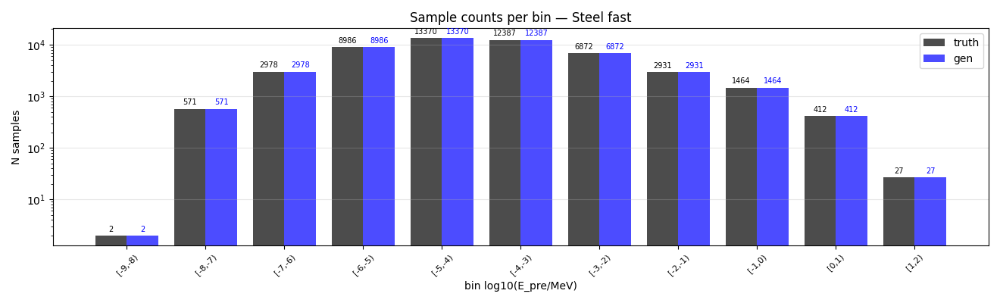
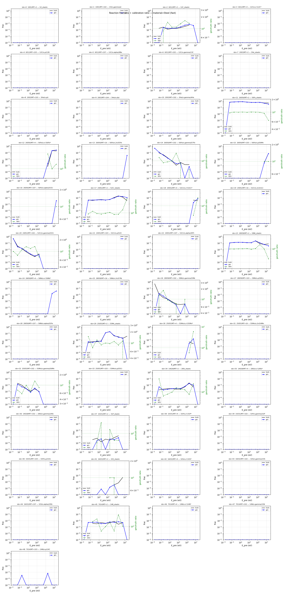
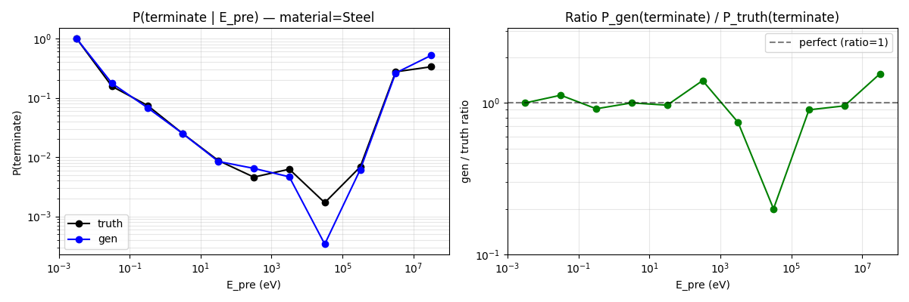
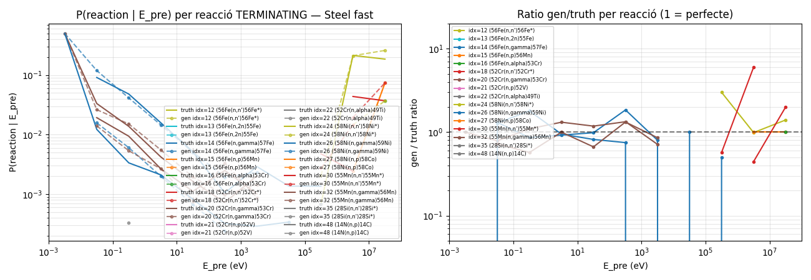
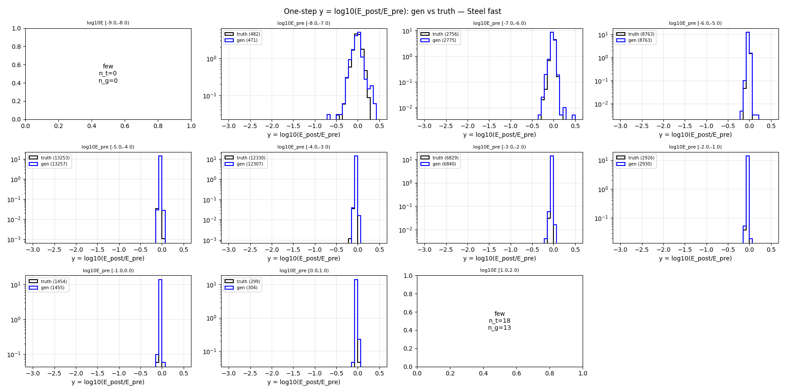
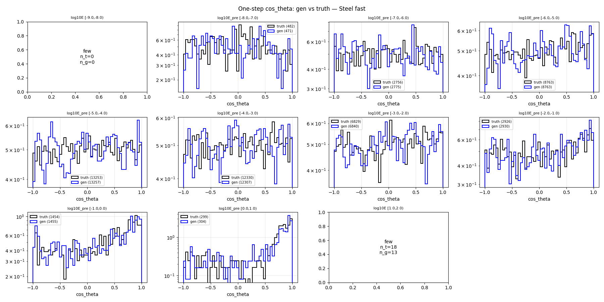
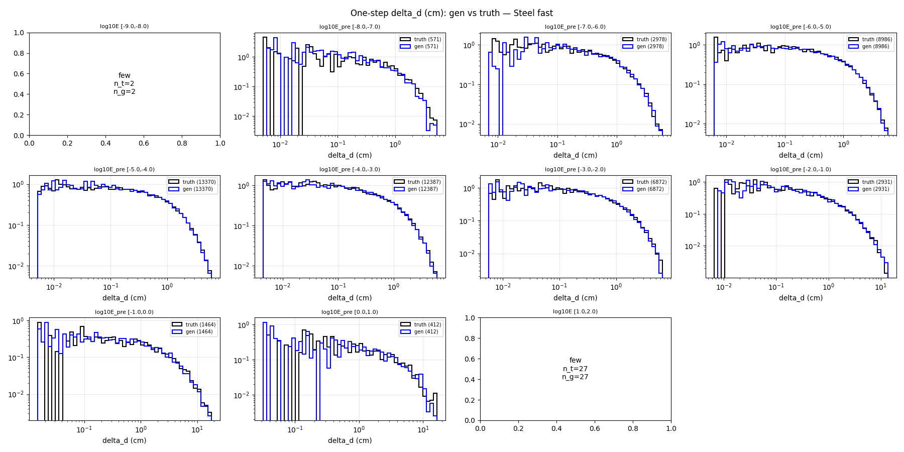
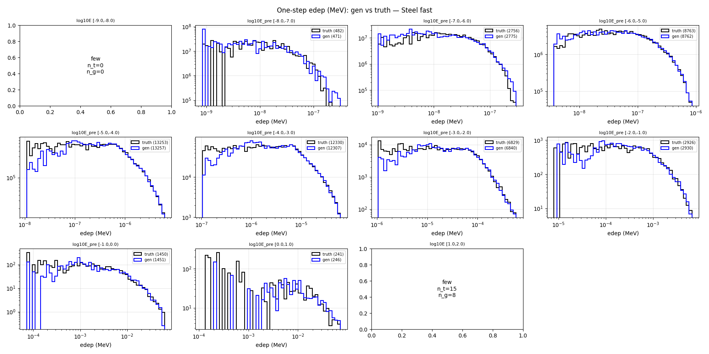

# One-step compare — material=Steel, split=fast

- N samples comparats: 50,000

## Sample counts per bin

## Reactions combined

## P(terminate) global per E_pre

## P(terminate) per reacció individual

## Heads cinemàtics (HE only)

### y_head

### cos_theta_head

### delta_d_head

### edep_head (HE non-zero)

## P(terminate) resum per bin

| bin log10(E/MeV) | n_truth | n_gen | P_truth | P_gen | gen/truth |
|---|---:|---:|---:|---:|---:|
| [-9.0, -8.0) | 2 | 2 | 1.0000 | 1.0000 | 1.00 |
| [-8.0, -7.0) | 571 | 571 | 0.1559 | 0.1751 | 1.12 |
| [-7.0, -6.0) | 2,978 | 2,978 | 0.0745 | 0.0682 | 0.91 |
| [-6.0, -5.0) | 8,986 | 8,986 | 0.0248 | 0.0248 | 1.00 |
| [-5.0, -4.0) | 13,370 | 13,370 | 0.0088 | 0.0085 | 0.97 |
| [-4.0, -3.0) | 12,387 | 12,387 | 0.0046 | 0.0065 | 1.40 |
| [-3.0, -2.0) | 6,872 | 6,872 | 0.0063 | 0.0047 | 0.74 |
| [-2.0, -1.0) | 2,931 | 2,931 | 0.0017 | 0.0003 | 0.20 |
| [-1.0, 0.0) | 1,464 | 1,464 | 0.0068 | 0.0061 | 0.90 |
| [0.0, 1.0) | 412 | 412 | 0.2743 | 0.2621 | 0.96 |
| [1.0, 2.0) | 27 | 27 | 0.3333 | 0.5185 | 1.56 |

## KS test per bin d'E_pre

### y_head (HE)

| bin | n_truth | n_gen | KS | p-value | |
|---|---:|---:|---:|---:|---|
| [-9.0, -8.0) | 0 | 0 | NA | NA | few |
| [-8.0, -7.0) | 482 | 471 | 0.065 | 2.56e-01 | warn* |
| [-7.0, -6.0) | 2,756 | 2,775 | 0.035 | 6.65e-02 | OK |
| [-6.0, -5.0) | 8,763 | 8,763 | 0.021 | 4.38e-02 | OK |
| [-5.0, -4.0) | 13,253 | 13,257 | 0.023 | 2.08e-03 | OK |
| [-4.0, -3.0) | 12,330 | 12,307 | 0.026 | 4.18e-04 | OK |
| [-3.0, -2.0) | 6,829 | 6,840 | 0.027 | 1.33e-02 | OK |
| [-2.0, -1.0) | 2,926 | 2,930 | 0.037 | 3.82e-02 | OK |
| [-1.0, 0.0) | 1,454 | 1,455 | 0.054 | 2.62e-02 | warn |
| [0.0, 1.0) | 299 | 304 | 0.069 | 4.45e-01 | warn* |
| [1.0, 2.0) | 18 | 13 | NA | NA | few |

### cos_theta_head (HE)

| bin | n_truth | n_gen | KS | p-value | |
|---|---:|---:|---:|---:|---|
| [-9.0, -8.0) | 0 | 0 | NA | NA | few |
| [-8.0, -7.0) | 482 | 471 | 0.046 | 6.57e-01 | OK |
| [-7.0, -6.0) | 2,756 | 2,775 | 0.036 | 5.65e-02 | OK |
| [-6.0, -5.0) | 8,763 | 8,763 | 0.012 | 5.43e-01 | OK |
| [-5.0, -4.0) | 13,253 | 13,257 | 0.012 | 2.66e-01 | OK |
| [-4.0, -3.0) | 12,330 | 12,307 | 0.012 | 3.03e-01 | OK |
| [-3.0, -2.0) | 6,829 | 6,840 | 0.017 | 2.92e-01 | OK |
| [-2.0, -1.0) | 2,926 | 2,930 | 0.031 | 1.11e-01 | OK |
| [-1.0, 0.0) | 1,454 | 1,455 | 0.042 | 1.55e-01 | OK |
| [0.0, 1.0) | 299 | 304 | 0.074 | 3.61e-01 | warn* |
| [1.0, 2.0) | 18 | 13 | NA | NA | few |

### delta_d_head

| bin | n_truth | n_gen | KS | p-value | |
|---|---:|---:|---:|---:|---|
| [-9.0, -8.0) | 2 | 2 | NA | NA | few |
| [-8.0, -7.0) | 571 | 571 | 0.110 | 1.90e-03 | FAIL* |
| [-7.0, -6.0) | 2,978 | 2,978 | 0.013 | 9.60e-01 | OK |
| [-6.0, -5.0) | 8,986 | 8,986 | 0.015 | 2.63e-01 | OK |
| [-5.0, -4.0) | 13,370 | 13,370 | 0.012 | 2.85e-01 | OK |
| [-4.0, -3.0) | 12,387 | 12,387 | 0.013 | 2.38e-01 | OK |
| [-3.0, -2.0) | 6,872 | 6,872 | 0.018 | 2.06e-01 | OK |
| [-2.0, -1.0) | 2,931 | 2,931 | 0.014 | 9.37e-01 | OK |
| [-1.0, 0.0) | 1,464 | 1,464 | 0.029 | 5.53e-01 | OK |
| [0.0, 1.0) | 412 | 412 | 0.034 | 9.72e-01 | OK |
| [1.0, 2.0) | 27 | 27 | NA | NA | few |

### edep_head (HE non-zero)

| bin | n_truth | n_gen | KS | p-value | |
|---|---:|---:|---:|---:|---|
| [-9.0, -8.0) | 0 | 0 | NA | NA | few |
| [-8.0, -7.0) | 482 | 471 | 0.069 | 1.99e-01 | warn* |
| [-7.0, -6.0) | 2,756 | 2,775 | 0.041 | 1.93e-02 | OK |
| [-6.0, -5.0) | 8,763 | 8,762 | 0.016 | 2.20e-01 | OK |
| [-5.0, -4.0) | 13,253 | 13,257 | 0.016 | 6.23e-02 | OK |
| [-4.0, -3.0) | 12,330 | 12,307 | 0.012 | 3.72e-01 | OK |
| [-3.0, -2.0) | 6,829 | 6,840 | 0.021 | 1.10e-01 | OK |
| [-2.0, -1.0) | 2,926 | 2,930 | 0.026 | 2.84e-01 | OK |
| [-1.0, 0.0) | 1,450 | 1,451 | 0.047 | 7.43e-02 | OK |
| [0.0, 1.0) | 241 | 246 | 0.096 | 1.94e-01 | warn* |
| [1.0, 2.0) | 15 | 8 | NA | NA | few |

