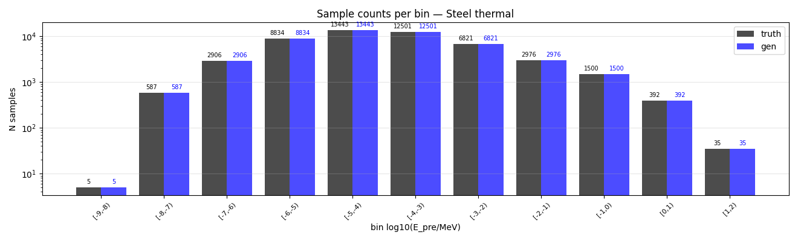
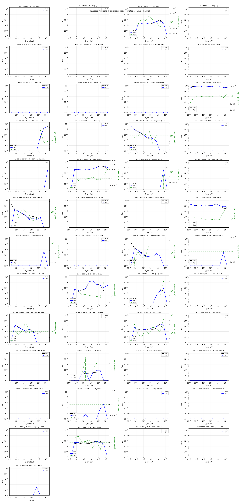
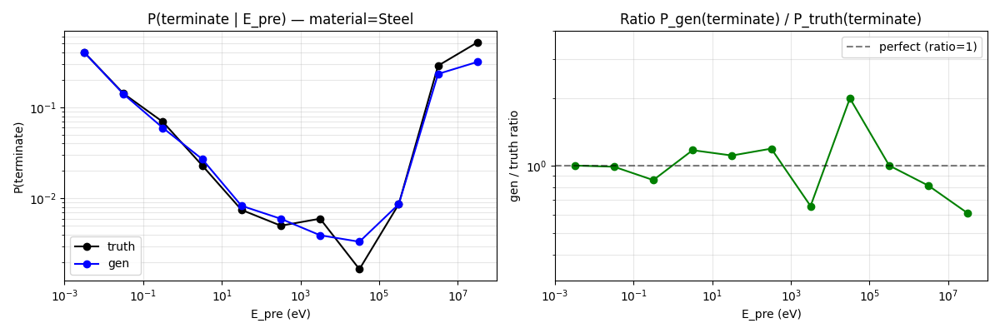
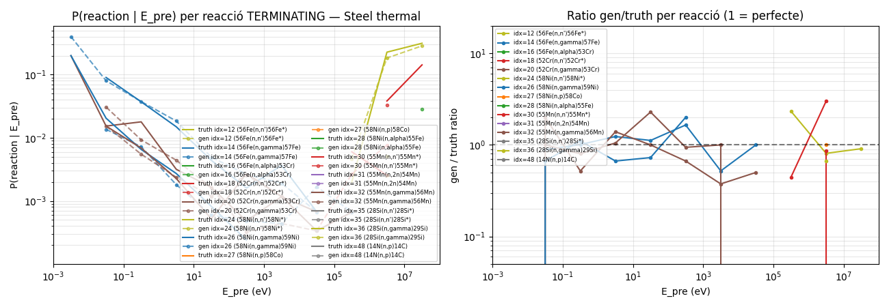
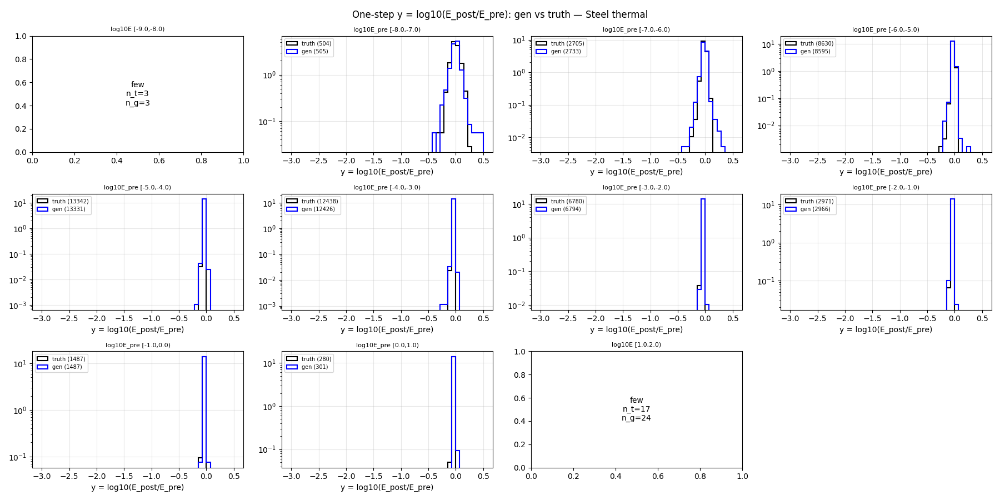
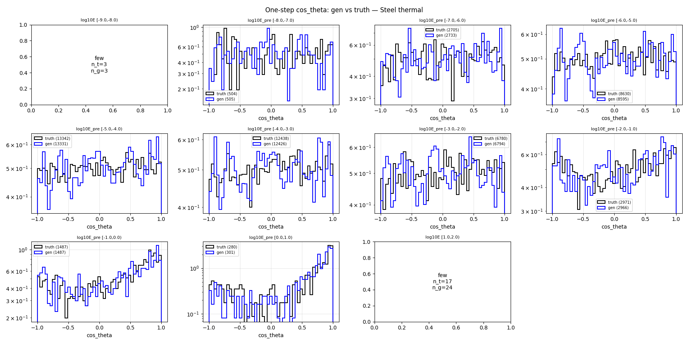
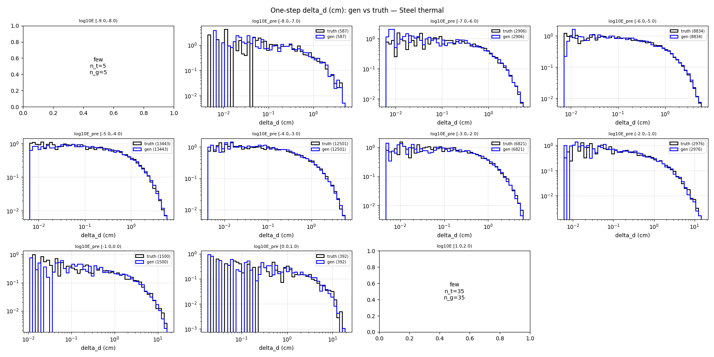
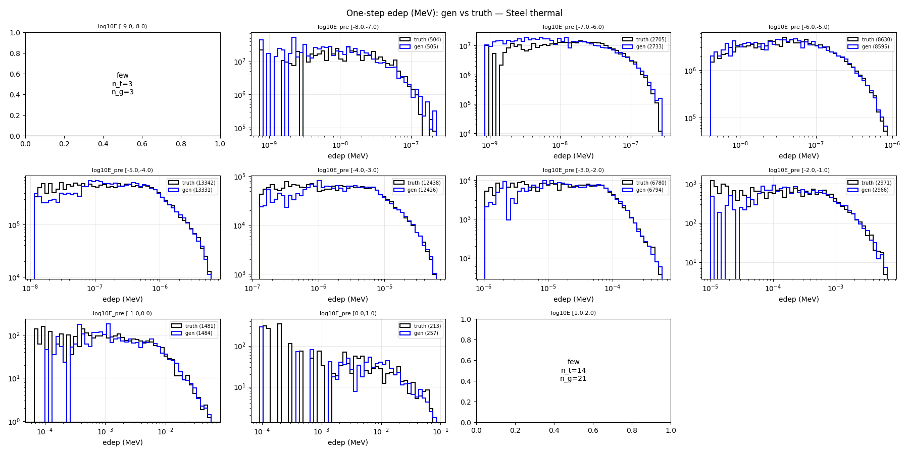

# One-step compare — material=Steel, split=thermal

- N samples comparats: 50,000

## Sample counts per bin

## Reactions combined

## P(terminate) global per E_pre

## P(terminate) per reacció individual

## Heads cinemàtics (HE only)

### y_head

### cos_theta_head

### delta_d_head

### edep_head (HE non-zero)

## P(terminate) resum per bin

| bin log10(E/MeV) | n_truth | n_gen | P_truth | P_gen | gen/truth |
|---|---:|---:|---:|---:|---:|
| [-9.0, -8.0) | 5 | 5 | 0.4000 | 0.4000 | 1.00 |
| [-8.0, -7.0) | 587 | 587 | 0.1414 | 0.1397 | 0.99 |
| [-7.0, -6.0) | 2,906 | 2,906 | 0.0692 | 0.0595 | 0.86 |
| [-6.0, -5.0) | 8,834 | 8,834 | 0.0231 | 0.0271 | 1.17 |
| [-5.0, -4.0) | 13,443 | 13,443 | 0.0075 | 0.0083 | 1.11 |
| [-4.0, -3.0) | 12,501 | 12,501 | 0.0050 | 0.0060 | 1.19 |
| [-3.0, -2.0) | 6,821 | 6,821 | 0.0060 | 0.0040 | 0.66 |
| [-2.0, -1.0) | 2,976 | 2,976 | 0.0017 | 0.0034 | 2.00 |
| [-1.0, 0.0) | 1,500 | 1,500 | 0.0087 | 0.0087 | 1.00 |
| [0.0, 1.0) | 392 | 392 | 0.2857 | 0.2321 | 0.81 |
| [1.0, 2.0) | 35 | 35 | 0.5143 | 0.3143 | 0.61 |

## KS test per bin d'E_pre

### y_head (HE)

| bin | n_truth | n_gen | KS | p-value | |
|---|---:|---:|---:|---:|---|
| [-9.0, -8.0) | 3 | 3 | NA | NA | few |
| [-8.0, -7.0) | 504 | 505 | 0.068 | 1.75e-01 | warn* |
| [-7.0, -6.0) | 2,705 | 2,733 | 0.027 | 2.53e-01 | OK |
| [-6.0, -5.0) | 8,630 | 8,595 | 0.020 | 5.41e-02 | OK |
| [-5.0, -4.0) | 13,342 | 13,331 | 0.029 | 2.59e-05 | OK |
| [-4.0, -3.0) | 12,438 | 12,426 | 0.028 | 1.26e-04 | OK |
| [-3.0, -2.0) | 6,780 | 6,794 | 0.029 | 7.30e-03 | OK |
| [-2.0, -1.0) | 2,971 | 2,966 | 0.035 | 5.14e-02 | OK |
| [-1.0, 0.0) | 1,487 | 1,487 | 0.040 | 1.78e-01 | OK |
| [0.0, 1.0) | 280 | 301 | 0.113 | 4.36e-02 | FAIL* |
| [1.0, 2.0) | 17 | 24 | NA | NA | few |

### cos_theta_head (HE)

| bin | n_truth | n_gen | KS | p-value | |
|---|---:|---:|---:|---:|---|
| [-9.0, -8.0) | 3 | 3 | NA | NA | few |
| [-8.0, -7.0) | 504 | 505 | 0.048 | 5.89e-01 | OK |
| [-7.0, -6.0) | 2,705 | 2,733 | 0.020 | 6.46e-01 | OK |
| [-6.0, -5.0) | 8,630 | 8,595 | 0.015 | 2.51e-01 | OK |
| [-5.0, -4.0) | 13,342 | 13,331 | 0.015 | 8.69e-02 | OK |
| [-4.0, -3.0) | 12,438 | 12,426 | 0.013 | 2.72e-01 | OK |
| [-3.0, -2.0) | 6,780 | 6,794 | 0.018 | 2.11e-01 | OK |
| [-2.0, -1.0) | 2,971 | 2,966 | 0.028 | 1.75e-01 | OK |
| [-1.0, 0.0) | 1,487 | 1,487 | 0.036 | 3.01e-01 | OK |
| [0.0, 1.0) | 280 | 301 | 0.096 | 1.29e-01 | warn* |
| [1.0, 2.0) | 17 | 24 | NA | NA | few |

### delta_d_head

| bin | n_truth | n_gen | KS | p-value | |
|---|---:|---:|---:|---:|---|
| [-9.0, -8.0) | 5 | 5 | NA | NA | few |
| [-8.0, -7.0) | 587 | 587 | 0.029 | 9.67e-01 | OK |
| [-7.0, -6.0) | 2,906 | 2,906 | 0.019 | 6.97e-01 | OK |
| [-6.0, -5.0) | 8,834 | 8,834 | 0.015 | 2.61e-01 | OK |
| [-5.0, -4.0) | 13,443 | 13,443 | 0.009 | 6.03e-01 | OK |
| [-4.0, -3.0) | 12,501 | 12,501 | 0.019 | 1.75e-02 | OK |
| [-3.0, -2.0) | 6,821 | 6,821 | 0.013 | 5.64e-01 | OK |
| [-2.0, -1.0) | 2,976 | 2,976 | 0.020 | 5.59e-01 | OK |
| [-1.0, 0.0) | 1,500 | 1,500 | 0.029 | 5.69e-01 | OK |
| [0.0, 1.0) | 392 | 392 | 0.066 | 3.55e-01 | warn* |
| [1.0, 2.0) | 35 | 35 | NA | NA | few |

### edep_head (HE non-zero)

| bin | n_truth | n_gen | KS | p-value | |
|---|---:|---:|---:|---:|---|
| [-9.0, -8.0) | 3 | 3 | NA | NA | few |
| [-8.0, -7.0) | 504 | 505 | 0.114 | 2.46e-03 | FAIL* |
| [-7.0, -6.0) | 2,705 | 2,733 | 0.069 | 4.54e-06 | warn |
| [-6.0, -5.0) | 8,630 | 8,595 | 0.020 | 7.27e-02 | OK |
| [-5.0, -4.0) | 13,342 | 13,331 | 0.015 | 1.19e-01 | OK |
| [-4.0, -3.0) | 12,438 | 12,426 | 0.019 | 2.65e-02 | OK |
| [-3.0, -2.0) | 6,780 | 6,794 | 0.020 | 1.48e-01 | OK |
| [-2.0, -1.0) | 2,971 | 2,966 | 0.025 | 3.09e-01 | OK |
| [-1.0, 0.0) | 1,481 | 1,484 | 0.036 | 2.86e-01 | OK |
| [0.0, 1.0) | 213 | 257 | 0.110 | 1.07e-01 | FAIL* |
| [1.0, 2.0) | 14 | 21 | NA | NA | few |

