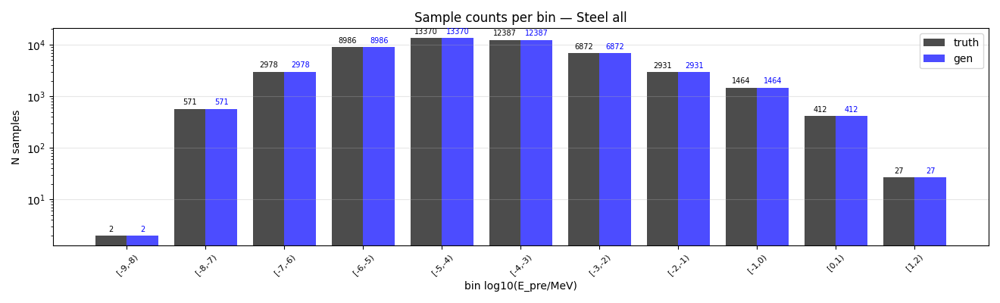
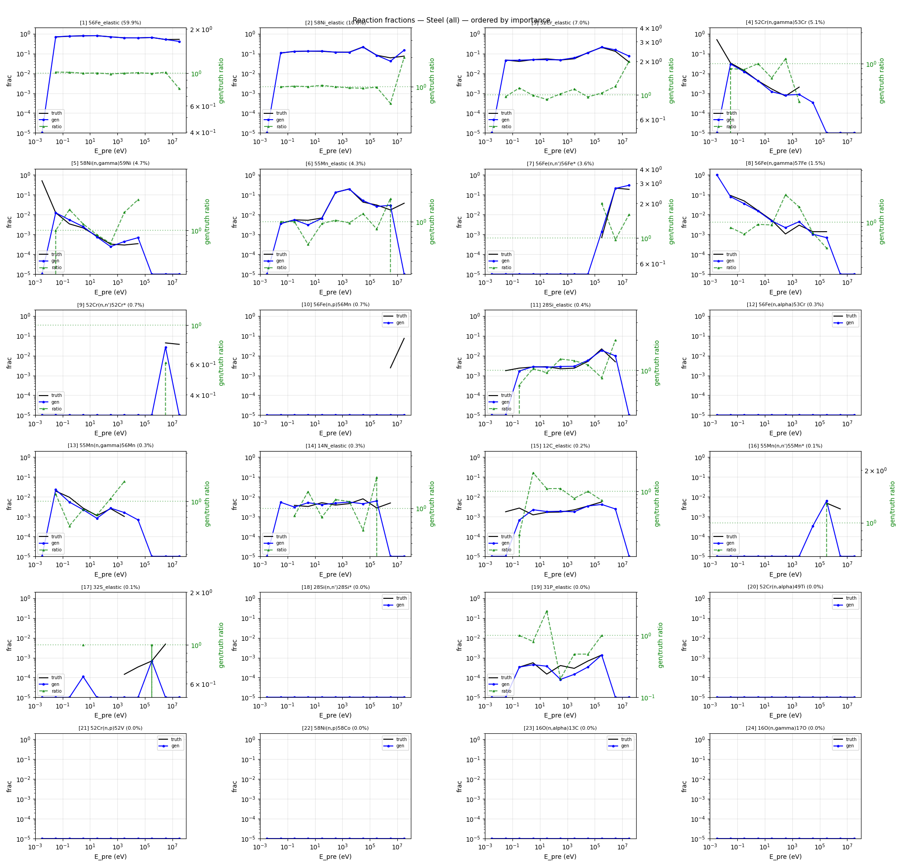
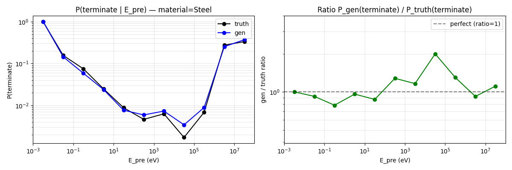
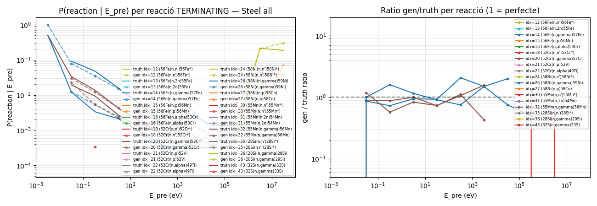
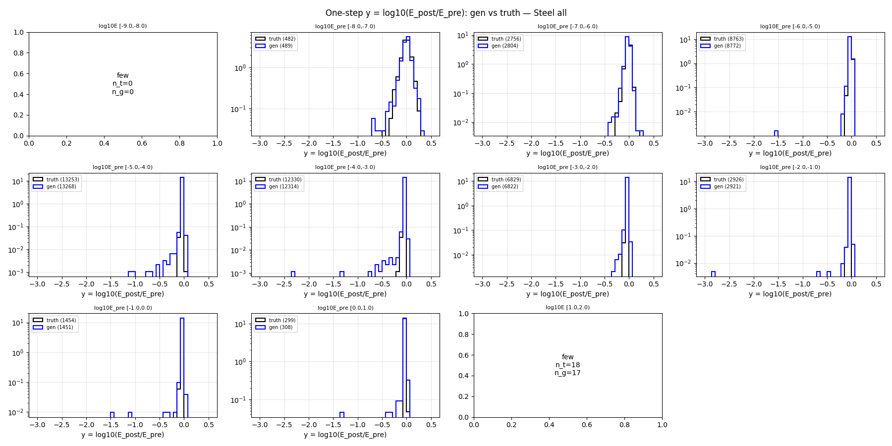
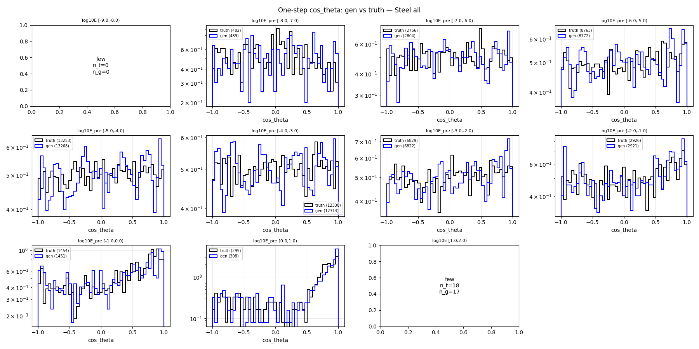
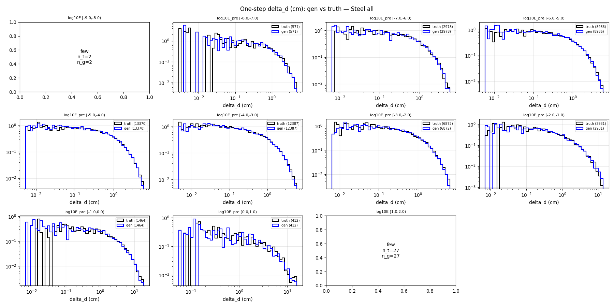
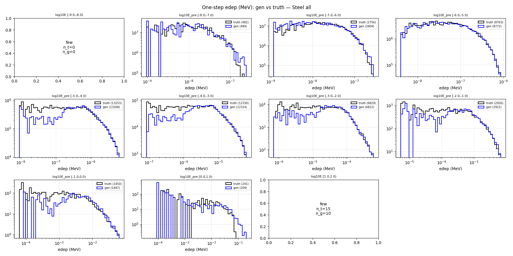

# One-step compare — material=Steel, split=all

- N samples comparats: 50,000

## Sample counts per bin

## Reactions combined

## P(terminate) global per E_pre

## P(terminate) per reacció individual

## Heads cinemàtics (HE only)

### y_head

### cos_theta_head

### delta_d_head

### edep_head (HE non-zero)

## P(terminate) resum per bin

| bin log10(E/MeV) | n_truth | n_gen | P_truth | P_gen | gen/truth |
|---|---:|---:|---:|---:|---:|
| [-9.0, -8.0) | 2 | 2 | 1.0000 | 1.0000 | 1.00 |
| [-8.0, -7.0) | 571 | 571 | 0.1559 | 0.1436 | 0.92 |
| [-7.0, -6.0) | 2,978 | 2,978 | 0.0745 | 0.0584 | 0.78 |
| [-6.0, -5.0) | 8,986 | 8,986 | 0.0248 | 0.0238 | 0.96 |
| [-5.0, -4.0) | 13,370 | 13,370 | 0.0088 | 0.0076 | 0.87 |
| [-4.0, -3.0) | 12,387 | 12,387 | 0.0046 | 0.0059 | 1.28 |
| [-3.0, -2.0) | 6,872 | 6,872 | 0.0063 | 0.0073 | 1.16 |
| [-2.0, -1.0) | 2,931 | 2,931 | 0.0017 | 0.0034 | 2.00 |
| [-1.0, 0.0) | 1,464 | 1,464 | 0.0068 | 0.0089 | 1.30 |
| [0.0, 1.0) | 412 | 412 | 0.2743 | 0.2524 | 0.92 |
| [1.0, 2.0) | 27 | 27 | 0.3333 | 0.3704 | 1.11 |

## KS test per bin d'E_pre

### y_head (HE)

| bin | n_truth | n_gen | KS | p-value | |
|---|---:|---:|---:|---:|---|
| [-9.0, -8.0) | 0 | 0 | NA | NA | few |
| [-8.0, -7.0) | 482 | 489 | 0.056 | 4.05e-01 | warn* |
| [-7.0, -6.0) | 2,756 | 2,804 | 0.032 | 1.04e-01 | OK |
| [-6.0, -5.0) | 8,763 | 8,772 | 0.017 | 1.45e-01 | OK |
| [-5.0, -4.0) | 13,253 | 13,268 | 0.086 | 5.21e-43 | warn |
| [-4.0, -3.0) | 12,330 | 12,314 | 0.084 | 1.13e-38 | warn |
| [-3.0, -2.0) | 6,829 | 6,822 | 0.090 | 1.24e-24 | warn |
| [-2.0, -1.0) | 2,926 | 2,921 | 0.091 | 5.26e-11 | warn |
| [-1.0, 0.0) | 1,454 | 1,451 | 0.150 | 8.55e-15 | FAIL |
| [0.0, 1.0) | 299 | 308 | 0.320 | 3.15e-14 | FAIL* |
| [1.0, 2.0) | 18 | 17 | NA | NA | few |

### cos_theta_head (HE)

| bin | n_truth | n_gen | KS | p-value | |
|---|---:|---:|---:|---:|---|
| [-9.0, -8.0) | 0 | 0 | NA | NA | few |
| [-8.0, -7.0) | 482 | 489 | 0.066 | 2.22e-01 | warn* |
| [-7.0, -6.0) | 2,756 | 2,804 | 0.017 | 8.03e-01 | OK |
| [-6.0, -5.0) | 8,763 | 8,772 | 0.017 | 1.73e-01 | OK |
| [-5.0, -4.0) | 13,253 | 13,268 | 0.017 | 4.38e-02 | OK |
| [-4.0, -3.0) | 12,330 | 12,314 | 0.011 | 4.30e-01 | OK |
| [-3.0, -2.0) | 6,829 | 6,822 | 0.021 | 1.04e-01 | OK |
| [-2.0, -1.0) | 2,926 | 2,921 | 0.026 | 2.90e-01 | OK |
| [-1.0, 0.0) | 1,454 | 1,451 | 0.044 | 1.11e-01 | OK |
| [0.0, 1.0) | 299 | 308 | 0.105 | 6.29e-02 | FAIL* |
| [1.0, 2.0) | 18 | 17 | NA | NA | few |

### delta_d_head

| bin | n_truth | n_gen | KS | p-value | |
|---|---:|---:|---:|---:|---|
| [-9.0, -8.0) | 2 | 2 | NA | NA | few |
| [-8.0, -7.0) | 571 | 571 | 0.047 | 5.46e-01 | OK |
| [-7.0, -6.0) | 2,978 | 2,978 | 0.013 | 9.51e-01 | OK |
| [-6.0, -5.0) | 8,986 | 8,986 | 0.009 | 8.38e-01 | OK |
| [-5.0, -4.0) | 13,370 | 13,370 | 0.010 | 5.00e-01 | OK |
| [-4.0, -3.0) | 12,387 | 12,387 | 0.010 | 6.03e-01 | OK |
| [-3.0, -2.0) | 6,872 | 6,872 | 0.018 | 1.91e-01 | OK |
| [-2.0, -1.0) | 2,931 | 2,931 | 0.014 | 9.37e-01 | OK |
| [-1.0, 0.0) | 1,464 | 1,464 | 0.041 | 1.71e-01 | OK |
| [0.0, 1.0) | 412 | 412 | 0.061 | 4.35e-01 | warn* |
| [1.0, 2.0) | 27 | 27 | NA | NA | few |

### edep_head (HE non-zero)

| bin | n_truth | n_gen | KS | p-value | |
|---|---:|---:|---:|---:|---|
| [-9.0, -8.0) | 0 | 0 | NA | NA | few |
| [-8.0, -7.0) | 482 | 489 | 0.055 | 4.32e-01 | warn* |
| [-7.0, -6.0) | 2,756 | 2,804 | 0.030 | 1.69e-01 | OK |
| [-6.0, -5.0) | 8,763 | 8,772 | 0.022 | 2.33e-02 | OK |
| [-5.0, -4.0) | 13,253 | 13,268 | 0.052 | 8.60e-16 | warn |
| [-4.0, -3.0) | 12,330 | 12,314 | 0.048 | 5.56e-13 | OK |
| [-3.0, -2.0) | 6,829 | 6,822 | 0.069 | 8.91e-15 | warn |
| [-2.0, -1.0) | 2,926 | 2,921 | 0.057 | 1.62e-04 | warn |
| [-1.0, 0.0) | 1,450 | 1,447 | 0.121 | 1.12e-09 | FAIL |
| [0.0, 1.0) | 241 | 209 | 0.287 | 1.28e-08 | FAIL* |
| [1.0, 2.0) | 15 | 10 | NA | NA | few |

