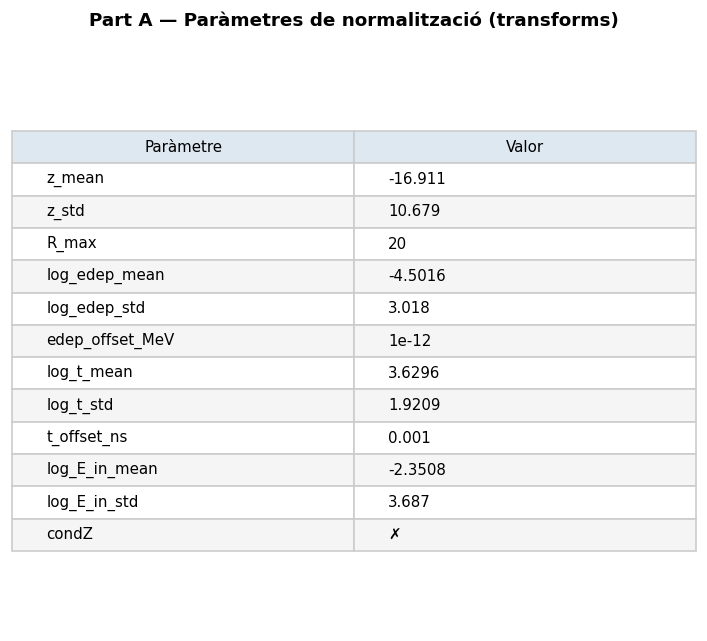
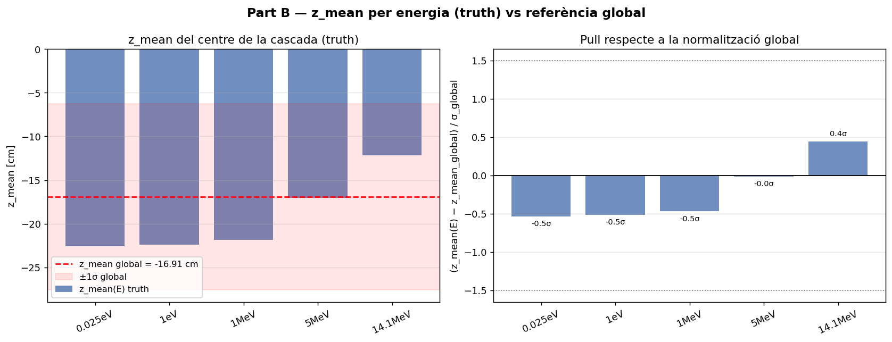
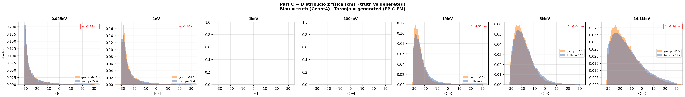
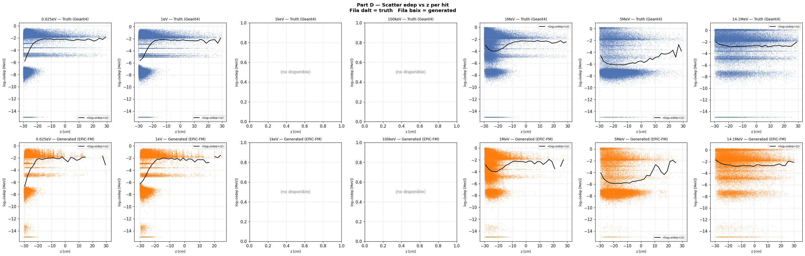
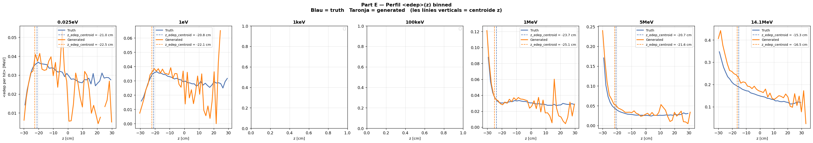

# run_001 — Baseline EPiC-FM 5E ✅ MS3 PASS

**Estat**: ✅ MS3 PASS — Resultat A, èxit ple

## Motivació

Baseline multi-energia amb EPiC-FM: validar que un únic model condicionat per E_in captura la física cross-règim (0.025 eV – 14.1 MeV).

## Configuració

| Paràmetre | Valor |
|-----------|-------|
| Iteracions | 500000 |
| feature_scale | 1.0 |
| global_dim | 64 |
| hidden_dim | 256 |
| n_layers | 6 |
| focal_gamma | 0.0 (MSE pur) |
| sum_scale_nmax | True |
| batch_size | 128 |
| Learning rate | 0.0003 |
| max_n | 400 |

Dataset: `neutron_cascade_multiE_1M_preprocessed.h5` (5E, ~1M events)
- Energies: 0.025 eV, 1 eV, 1 MeV, 5 MeV, 14.1 MeV
- Temps d'entrenament: 4h 15m

## Mètriques per energia

| Energia | edep_z_bias | z_peak_bias | peak_r0 | nhits_ratio | W1(r) | W1(z) | W1(t) | W1(edep) |
|---------|:-----------:|:-----------:|:-------:|:-----------:|:-----:|:-----:|:-----:|:--------:|
| (|·| < 2.0) | (< 1.0) | (0.5–2.0) | (0.85–1.15) | (< 1.0) | (< 1.0) | (< 1.0) | (< 0.10) |
| 0.025eV | ✅ -0.73 | ✅ -0.14 | ✅ 2.036 | ✅ 1.091 | ✅ 0.934 | ✅ 2.171 | ✅ 5.911 | ✅ 0.093 |
| 1eV     | ✅ -0.58 | ✅ -0.18 | ✅ 1.546 | ✅ 0.979 | ✅ 0.698 | ✅ 1.663 | ✅ 6.007 | ✅ 0.090 |
| 1MeV    | ✅ -2.14 | ✅ -0.41 | ✅ 1.030 | ✅ 1.015 | ✅ 0.669 | ✅ 1.553 | ✅ 3.674 | ✅ 0.086 |
| 5MeV    | ✅ -2.54 | ✅ +1.03 | ✅ 1.018 | ✅ 0.961 | ✅ 0.418 | ✅ 1.040 | ✅ 4.872 | ✅ 0.030 |
| 14.1MeV | ✅ -2.48 | ✅ +0.81 | ✅ 0.925 | ✅ 1.008 | ✅ 0.388 | ✅ 1.166 | ✅ 2.709 | ✅ 0.086 |

**Veredicte MS3**: Resultat A — ÈXIT PLE. Totes les energies passen tots els criteris.

### Notes d'interpretació

- **peak_r0_ratio > 1 al tèrmic** (2.036): el model sobre-concentra lleugerament hits a r < 0.2 cm. Físicament acceptable — la captura tèrmica és molt localitzada i el model l'exagera lleugerament.
- **edep_z_bias ~−2.5 cm al règim ràpid** (1–14.1 MeV): petita deriva sistemàtica en z de l'energia dipositada. Dins del llindar acceptable.
- **Bug de N_hits pool**: la primera execució va donar Resultat E (fracàs total) per un bug del sampling script que mostrejava N_hits del pool global (totes les energies barrejades) → sempre ~44 hits/event. Corregit.

## Gràfics

### A — Transforms

Distribucions de features normalitzades (vs real).

### B — Z per energia (truth)

Distribució de z per energia en les dades de veritat.

### C — Z físic

Distribució de z en unitats físiques (truth vs generated).

### D — Scatter edep vs z

Relació entre edep i z (scatter plots).

### E — Perfil edep vs z

Perfil de edep al llarg de z.

## Runs comparats

[002](run_002.md) [006](run_006.md) [007](run_007.md) [008](run_008.md) [009](run_009.md) [010](run_010.md)

---

[← Torna a l'índex](../index.md)
