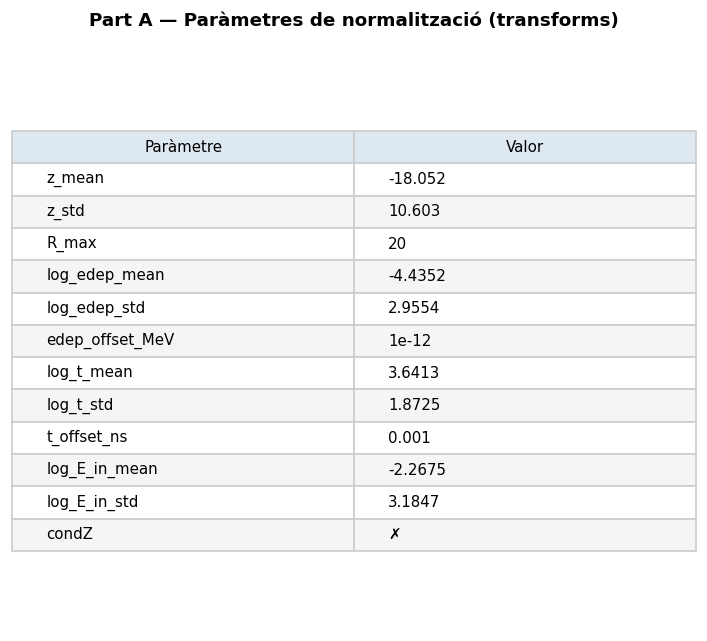
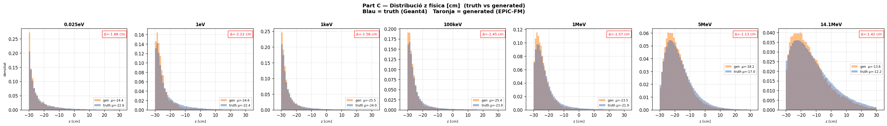
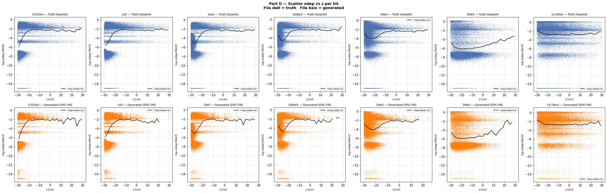
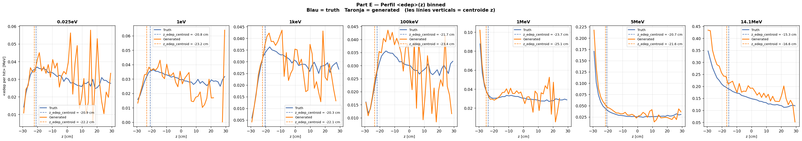

# run_002 — EPiC-FM 7E, fs=5.0 sense condZ

**Estat**: ✅ Vàlid (fs=5 sense condZ, z_mean_bias ≈ −1.5 cm — fs no ajuda)

## Motivació

Repetir run_001 amb 7 energies i fs=5.0 per comprovar si un feature_scale més alt millora les mètriques sense condZ.

## Configuració

| Paràmetre | Valor |
|-----------|-------|
| Iteracions | 500000 |
| feature_scale | 5.0 |
| global_dim | 64 |
| focal_gamma | 0.0 (MSE pur) |
| sum_scale_nmax | True |

Dataset: `neutron_cascade_multiE_7E_preprocessed.h5` (7E, ~1.4M events)
- Energies: 0.025 eV, 1 eV, 1 keV, 100 keV, 1 MeV, 5 MeV, 14.1 MeV

## Mètriques per energia

| Energia | edep_z_bias | z_mean_bias | peak_r0 | nhits_ratio |
|---------|:-----------:|:-----------:|:-------:|:-----------:|
| (|·| < 2.0) | (< 1.0) | (0.5–2.0) | (0.85–1.15) |
| 0.025eV | — | ⚠️ -1.88 | — | ⚠️ 1.114 |
| 1eV     | — | ⚠️ -2.22 | — | ✅ 1.030 |
| 1keV    | — | ⚠️ -1.56 | — | ✅ 1.008 |
| 100keV  | — | ⚠️ -1.45 | — | ✅ 0.999 |
| 1MeV    | — | ⚠️ -1.57 | — | ✅ 0.998 |
| 5MeV    | — | ⚠️ -1.13 | — | ✅ 0.985 |
| 14.1MeV | — | ⚠️ -1.42 | — | ✅ 1.007 |

**Conclusió**: fs=5 sense condZ dona z_mean_bias ≈ −1.5 cm a totes les energies — idèntic a run_001 (fs=1). **Feature_scale no redueix el bias de z sense condZ.**

## Gràfics

### A — Transforms

### B — Z per energia (truth)

### C — Z físic

### D — Scatter edep vs z

### E — Perfil edep vs z

## Runs comparats

[001](run_001.md) [006](run_006.md) [007](run_007.md) [008](run_008.md) [009](run_009.md) [010](run_010.md)

---

[← Torna a l'índex](../index.md)
