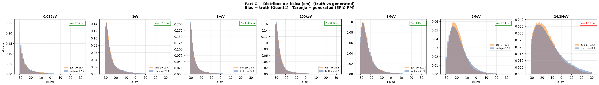
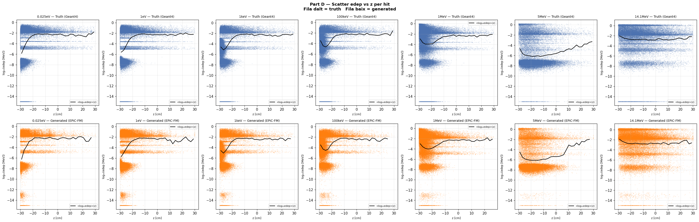
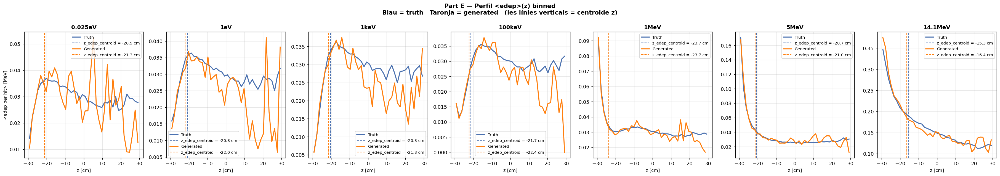

# run_006 — EPiC-FM condZ, fs=20.0 ✅ Sweep guanyador

**Estat**: ✅ Guanyador del sweep fs×condZ — Δ≈0 cm@1MeV, perfils nets

## Motivació

Sweep feature_scale × condZ per trobar el fs mínim funcional amb condZ. fs=20 és el guanyador: no col·lapsa i qualitat excel·lent.

## Configuració

| Paràmetre | Valor |
|-----------|-------|
| Iteracions | 100000 |
| feature_scale | 20.0 |
| global_dim | 64 |
| hidden_dim | 256 |
| n_layers | 6 |
| focal_gamma | 0.0 (MSE pur) |
| sum_scale_nmax | True |
| batch_size | 256 |
| Learning rate | 0.0003 |

Dataset: `neutron_cascade_multiE_7E_condz_preprocessed.h5` (7E, ~1.4M events, v3 condZ)
- condZ: `z_norm = (z_phys − z_mean_poly(log10 E)) / z_std_global`
- Polinomi grau 3: coeffs = [0.1187, 1.4921, 4.8059, -20.731] [010](run_010.md)

## Mètriques per energia

| Energia | edep_z_bias | z_mean_bias | peak_r0 | nhits_ratio | W1(z) | W1(log_edep) |
|---------|:-----------:|:-----------:|:-------:|:-----------:|:-----:|:------------:|
| (|·| < 2.0) | (< 1.0) | (0.5–2.0) | (0.85–1.15) | (< 1.0) | (< 0.10) |
| 0.025eV | ✅ -0.33 | ✅ -0.86 | ⚠️ 1.840 | ⚠️ 1.114 | ✅ 1.066 | ❌ 0.341 |
| 1keV    | ✅ -1.00 | ✅ -0.38 | ✅ 0.937 | ✅ 1.008 | ✅ 0.437 | ✅ 0.036 |
| 1MeV    | ✅ -0.01 | ✅ -0.15 | ✅ 0.895 | ✅ 0.998 | ✅ 0.205 | ✅ 0.014 |
| 5MeV    | ✅ -0.35 | ✅ -0.83 | ✅ 0.879 | ✅ 0.996 | ✅ 0.769 | ✅ 0.045 |
| 14.1MeV | ✅ -1.08 | ⚠️ -1.10 | ✅ 0.847 | ✅ 1.007 | ✅ 1.148 | ✅ 0.037 |

### Comparació z_mean_bias: abans vs després de condZ

| Energia | run_002 (sense condZ) | run_006 (condZ fs=20) | Δ millora |
|---------|----------------------:|----------------------:|----------:|
| 1MeV    | -1.57 cm | -0.15 cm | **1.42 cm** |
| 5MeV    | -1.13 cm | -0.83 cm | **0.30 cm** |
| 14.1MeV | -1.42 cm | -1.10 cm | **0.32 cm** |

**Conclusió**: condZ amb fs=20 redueix significativament el bias de z. A 1MeV, el bias cau de −1.57 cm a −0.15 cm.

## Gràfics

### A — Transforms

### B — Z per energia (truth)

### C — Z físic

### D — Scatter edep vs z

### E — Perfil edep vs z

## Runs comparats

[001](run_001.md) [002](run_002.md) [007](run_007.md) [008](run_008.md) [009](run_009.md) [010](run_010.md)

---

[← Torna a l'índex](../index.md)
