# run_007 — EPiC-FM condZ, fs=5.0 100k ⚠️ NO col·lapsa, perfils tèrmics sorollosos

**Estat**: ⚠️ Funciona però qualitat insuficient (redo de run_004)

## Motivació

Redo de run_004: confirmar si fs=5 amb condZ col·lapsa o funciona. fs=5 era el candidat intermedi del sweep fs×condZ.

## Configuració

| Paràmetre | Valor |
|-----------|-------|
| Iteracions | 100000 |
| feature_scale | 5.0 |
| global_dim | 64 |
| hidden_dim | 256 |
| n_layers | 6 |
| focal_gamma | 0.0 (MSE pur) |
| sum_scale_nmax | True |
| batch_size | 256 |
| Learning rate | 0.0003 |

Dataset: `neutron_cascade_multiE_7E_condz_preprocessed.h5` (7E, v3 condZ)

## Mètriques per energia

| Energia | edep_z_bias | z_mean_bias | peak_r0 | nhits_ratio | W1(z) | W1(log_edep) |
|---------|:-----------:|:-----------:|:-------:|:-----------:|:-----:|:------------:|
| (|·| < 2.0) | (< 1.0) | (0.5–2.0) | (0.85–1.15) | (< 1.0) | (< 0.10) |
| 0.025eV | ✅ +0.29 | ✅ -0.44 | ⚠️ 1.808 | ⚠️ 1.114 | ✅ 0.653 | ❌ 0.341 |
| 1keV    | ✅ -0.42 | ✅ -0.17 | ✅ 0.957 | ✅ 1.008 | ✅ 0.229 | ✅ 0.031 |
| 1MeV    | ✅ -0.06 | ✅ -0.07 | ✅ 0.928 | ✅ 0.998 | ✅ 0.109 | ✅ 0.030 |
| 5MeV    | ✅ -0.12 | ✅ -0.19 | ✅ 0.924 | ✅ 0.996 | ✅ 0.241 | ✅ 0.021 |
| 14.1MeV | ✅ -0.39 | ✅ -0.38 | ✅ 0.865 | ✅ 1.007 | ✅ 0.474 | ✅ 0.021 |

### Observacions

- **NO col·lapsa**: distribucions generades amples, rang z complet (−30 a +30 cm).
- **Perfils tèrmics sorollosos**: energies 0.025eV i 1 keV mostren perfils E amb més soroll que run_006 (fs=20).
- **Mètriques intermèdies**: W1(z) i edep_z_bias són millors que run_002 però pitjors que run_006.
- **Loss**: 2.928 (= 5 × 0.586 — escala lineal amb fs, no diagnòstica de col·lapse).

## Conclusió del sweep fs×condZ

| fs | Run | Col·lapse | Qualitat | Veredicte |
|----|-----|-----------|----------|-----------|
| 1  | 005 | ❌ SÍ     | — | Descartat |
| 5  | 007 | ✅ NO     | ⚠️ baixa | Insuficient |
| 12 | 008 | ✅ NO     | ⚠️ baixa | Insuficient |
| 20 | 006 | ✅ NO     | ✅ alta | **GUANYADOR** |

**Llindar de col·lapse**: entre fs=1 i fs=5. **Gradient de qualitat**: fs=20 és significativament millor que fs=5/12 en perfils tèrmics.

## Gràfics

### A — Transforms

### B — Z per energia (truth)

### C — Z físic

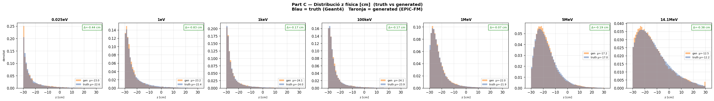

### D — Scatter edep vs z

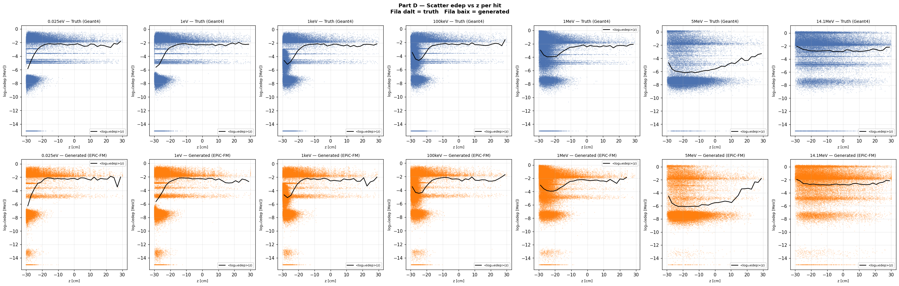

### E — Perfil edep vs z

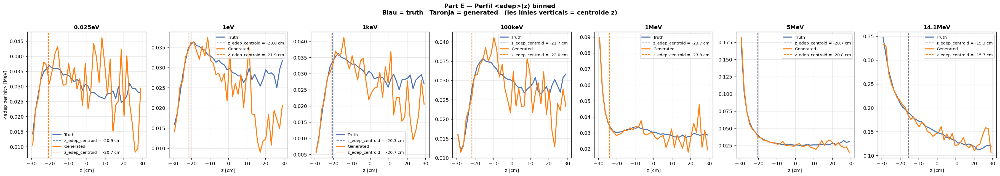

## G — Espectre edep log-log (dN/dE)

Eix X = edep [MeV] (log), eix Y = dN/dE normalitzat. Truth (negre) vs Generated (blau) per a cada energia.

### 0.025eV

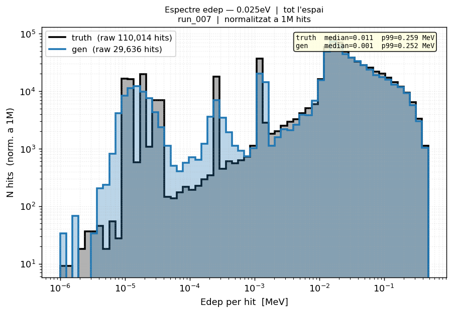

### 1eV

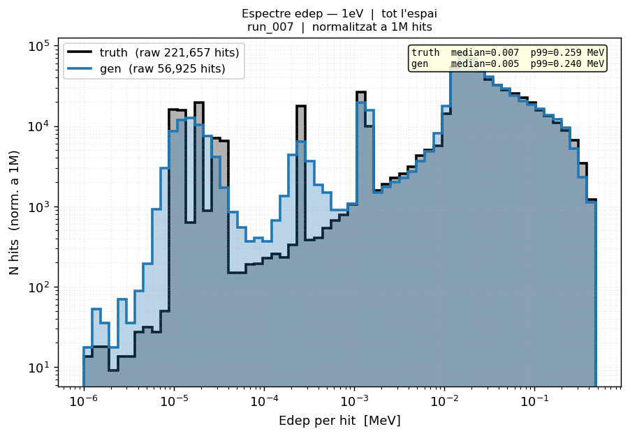

### 1keV

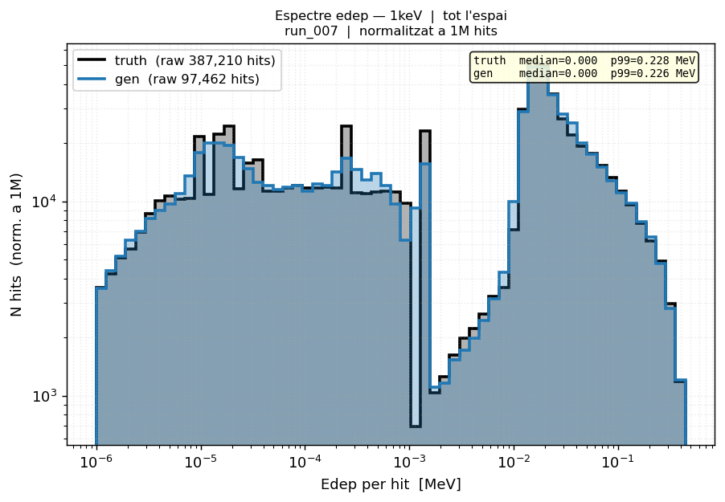

### 100keV

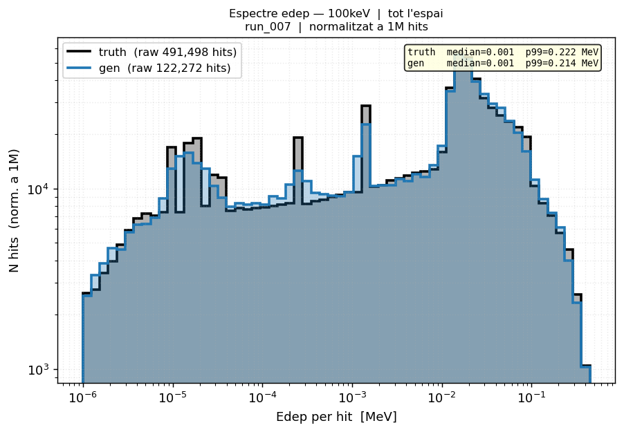

### 1MeV

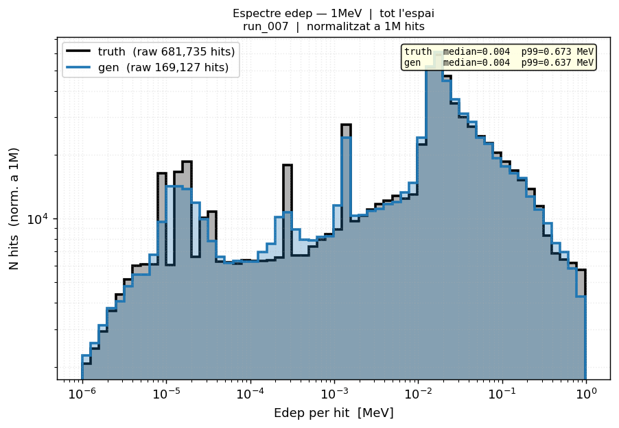

### 5MeV

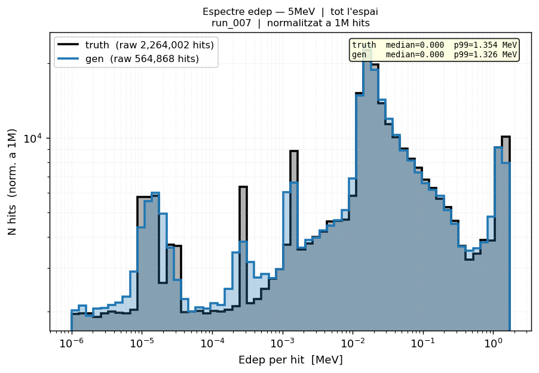

### 14.1MeV

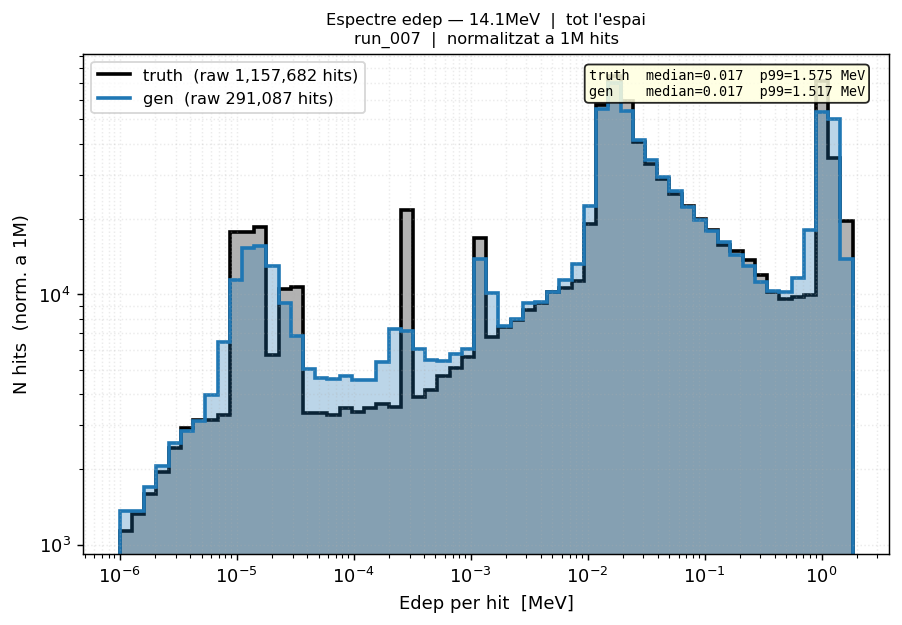

### Grid complet

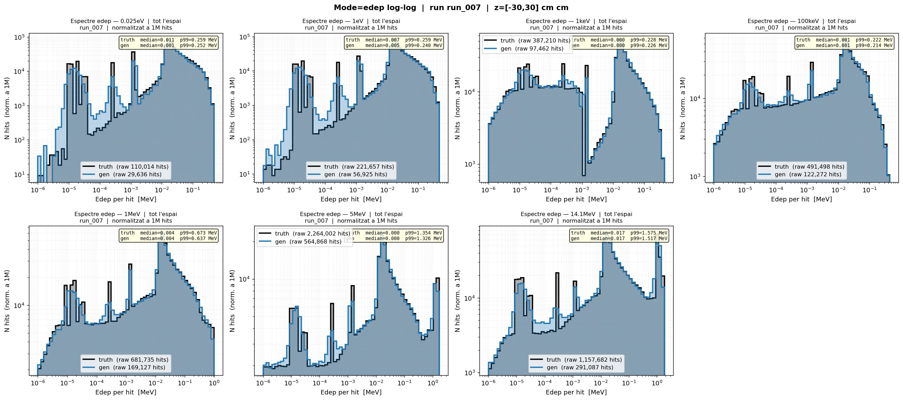

## H — Espectre isoletàrgic (dN/dlnE)

Escala Y corregida: **dN/d(ln E) = counts / Δu** on Δu = ln(E_upper/E_lower) = constant.
Aquesta escala fa Y independent de X: un espectre pla en regió epitérmica indica distribució 1/E.

### 0.025eV

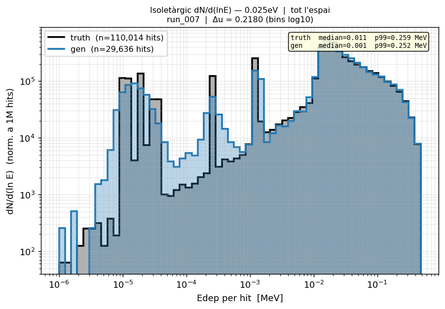

### 1eV

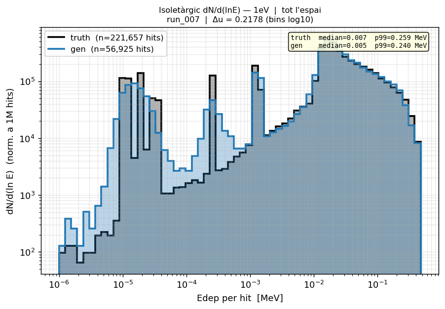

### 1keV

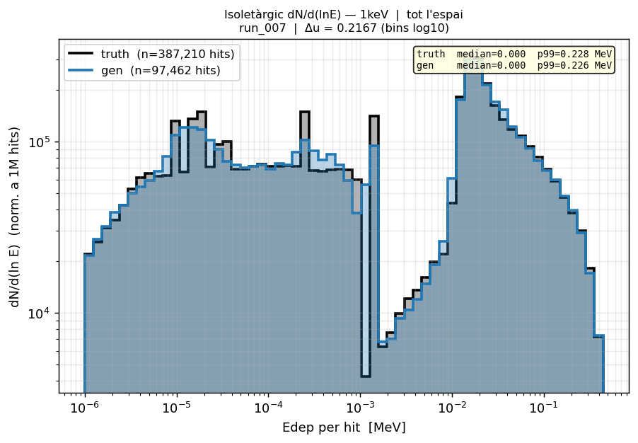

### 100keV

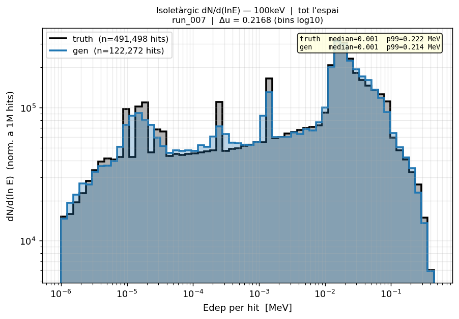

### 1MeV

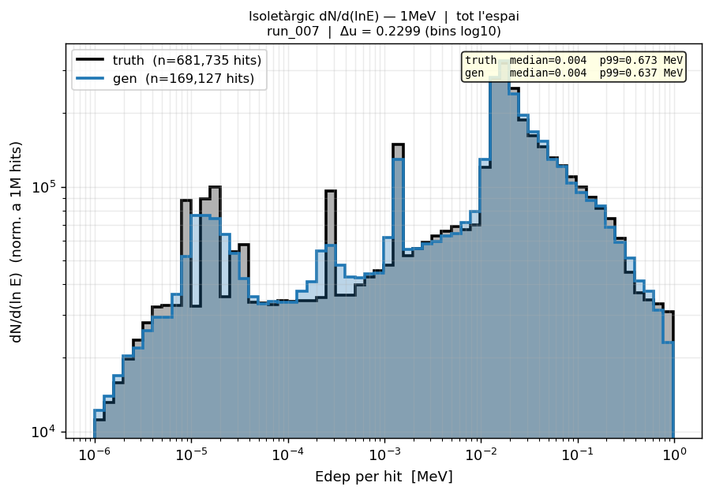

### 5MeV

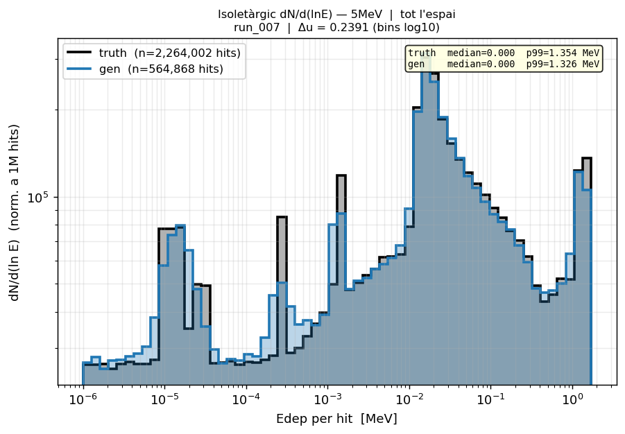

### 14.1MeV

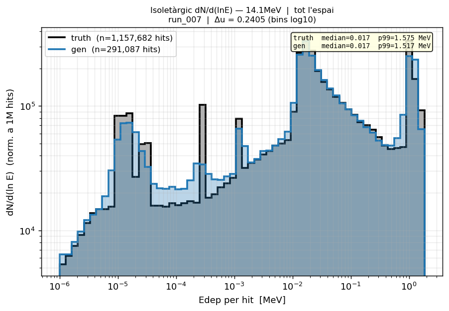

## Runs comparats

[001](run_001.md) [002](run_002.md) [006](run_006.md) [008](run_008.md) [009](run_009.md) [010](run_010.md)

---

[← Torna a l'índex](../index.md)
