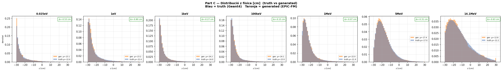
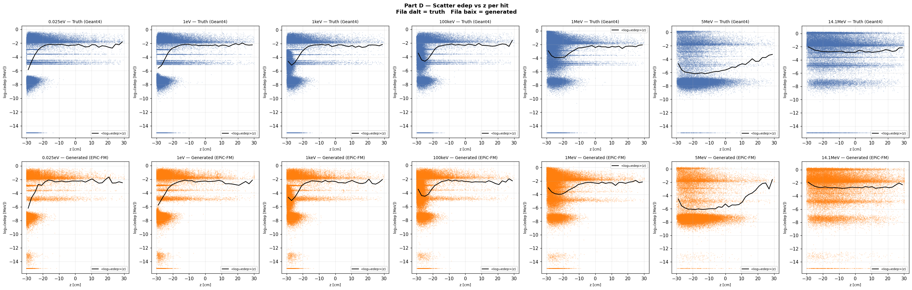
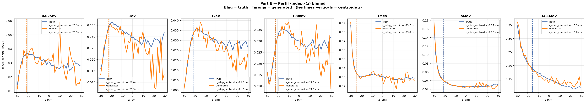

# run_008 — EPiC-FM condZ, fs=12.0 100k ⚠️ Similar a fs=5, insuficient

**Estat**: ⚠️ NO col·lapsa, qualitat similar a fs=5 (run_007)

## Motivació

Estrenyir el llindar de col·lapse entre fs=5 i fs=20 del sweep fs×condZ. fs=12 era la cel·la intermèdia.

## Configuració

| Paràmetre | Valor |
|-----------|-------|
| Iteracions | 100000 |
| feature_scale | 12.0 |
| global_dim | 64 |
| hidden_dim | 256 |
| n_layers | 6 |
| focal_gamma | 0.0 (MSE pur) |
| sum_scale_nmax | True |
| batch_size | 256 |
| Learning rate | 0.0003 |

Dataset: `neutron_cascade_multiE_7E_condz_preprocessed.h5` (7E, v3 condZ)

## Mètriques per energia

| Energia | edep_z_bias | z_mean_bias | peak_r0 | nhits_ratio |
|---------|:-----------:|:-----------:|:-------:|:-----------:|
| (|·| < 2.0) | (< 1.0) | (0.5–2.0) | (0.85–1.15) |
| 0.025eV | ✅ +0.06 | ✅ -0.53 | ⚠️ 1.883 | ⚠️ 1.114 |
| 1keV    | ✅ -0.69 | ✅ -0.27 | ✅ 0.894 | ✅ 1.008 |
| 1MeV    | ✅ -0.02 | ✅ -0.07 | ✅ 0.870 | ✅ 0.998 |
| 5MeV    | ✅ -0.15 | ✅ -0.31 | ✅ 0.889 | ✅ 0.996 |
| 14.1MeV | ✅ -0.64 | ✅ -0.63 | ✅ 0.825 | ✅ 1.007 |

### Observacions

- **NO col·lapsa**: distribucions amples, scatter complet.
- **Qualitat similar a fs=5**: no hi ha millora apreciable respecte run_007.
- **Loss**: 7.157 (= 12 × 0.596 — mateixa loss/fs ≈ 0.59 que tots els runs, confirmant que loss no és diagnòstica).

## Conclusió del sweep

El salt de qualitat es produeix entre fs=12 i fs=20, no entre fs=5 i fs=12. El gradient de qualitat és:
- fs=5 → fs=12: **millora mínima**
- fs=12 → fs=20: **millora significativa**

## Gràfics

### A — Transforms

### B — Z per energia (truth)

### C — Z físic

### D — Scatter edep vs z

### E — Perfil edep vs z

## Runs comparats

[001](run_001.md) [002](run_002.md) [006](run_006.md) [007](run_007.md) [009](run_009.md) [010](run_010.md)

---

[← Torna a l'índex](../index.md)
