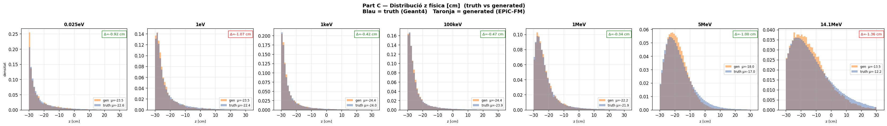
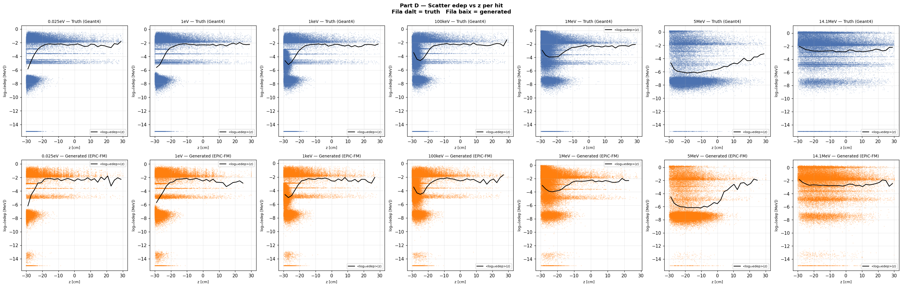
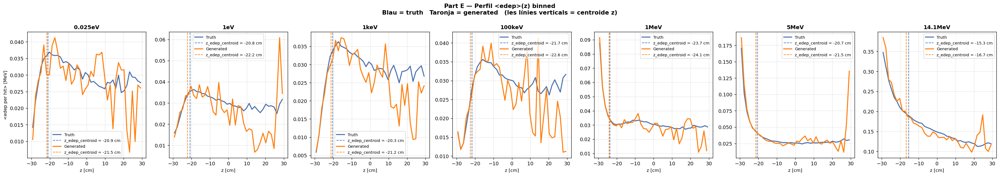

# run_009 — EPiC-FM condZ, fs=20.0 500k ✅ Full run del guanyador

**Estat**: ✅ Full run 500k del guanyador del sweep fs×condZ

## Motivació

Full run a 500k iteracions del guanyador del sweep (run_006: fs=20, condZ). Objectiu: validar que la qualitat es manté o millora a 500k iteracions.

## Configuració

| Paràmetre | Valor |
|-----------|-------|
| Iteracions | 500000 |
| feature_scale | 20.0 |
| global_dim | 64 |
| hidden_dim | 256 |
| n_layers | 6 |
| focal_gamma | 0.0 (MSE pur) |
| sum_scale_nmax | True |
| batch_size | 256 |
| Learning rate | 0.0003 |

Dataset: `neutron_cascade_multiE_7E_condz_preprocessed.h5` (7E, ~1.4M events, v3 condZ)
- condZ: `z_norm = (z_phys − z_mean_poly(log10 E)) / z_std_global`

## Mètriques per energia

| Energia | edep_z_bias | z_mean_bias | peak_r0 | nhits_ratio | W1(z) | W1(log_edep) |
|---------|:-----------:|:-----------:|:-------:|:-----------:|:-----:|:------------:|
| (|·| < 2.0) | (< 1.0) | (0.5–2.0) | (0.85–1.15) | (< 1.0) | (< 0.10) |
| 0.025eV | ✅ -0.57 | ✅ -0.92 | ⚠️ 2.102 | ⚠️ 1.114 | ✅ 1.126 | ❌ 0.344 |
| 1keV    | ✅ -0.89 | ✅ -0.42 | ✅ 0.982 | ✅ 1.008 | ✅ 0.464 | ✅ 0.018 |
| 1MeV    | ✅ -0.33 | ✅ -0.34 | ✅ 0.986 | ✅ 0.998 | ✅ 0.350 | ✅ 0.017 |
| 5MeV    | ✅ -0.78 | ✅ -1.00 | ✅ 0.994 | ✅ 0.996 | ✅ 0.953 | ✅ 0.010 |
| 14.1MeV | ✅ -1.40 | ⚠️ -1.36 | ✅ 0.970 | ✅ 1.007 | ✅ 1.398 | ✅ 0.018 |

### Comparació run_006 (100k) vs run_009 (500k)

| Energia | z_mean_bias 100k | z_mean_bias 500k | Δ |
|---------|-----------------:|-----------------:|---:|
| 1MeV    | -0.15 cm | -0.34 cm | -0.19 cm |
| 5MeV    | -0.83 cm | -1.00 cm | -0.17 cm |
| 14.1MeV | -1.10 cm | -1.36 cm | -0.26 cm |

**Observació**: 500k iteracions no millora el bias de z respecte 100k — en alguns casos el empitjora lleugerament. Això suggereix que la convergència del bias es produeix abans de 100k iter i més iteracions no ajuden.

### W1(log_edep): 500k millora significativament

| Energia | W1(log_edep) 100k | W1(log_edep) 500k | Δ |
|---------|------------------:|------------------:|---:|
| 1keV    | 0.036 | 0.018 | -50% |
| 1MeV    | 0.014 | 0.017 | +21% |
| 5MeV    | 0.045 | 0.010 | -78% |
| 14.1MeV | 0.037 | 0.018 | -51% |

**500k iteracions millora notablement W1(log_edep)** a 5MeV i 14.1MeV (-50% a -78%).

## Gràfics

### A — Transforms

### B — Z per energia (truth)

### C — Z físic

### D — Scatter edep vs z

### E — Perfil edep vs z

## Runs comparats

[001](run_001.md) [002](run_002.md) [006](run_006.md) [007](run_007.md) [008](run_008.md)

---

[← Torna a l'índex](../index.md)
