# run_010 — EPiC-FM condZ, fs=2.0 100k ✅ Referència ràpida

**Estat**: ✅ Funciona — millor W1(z) de tots els runs amb condZ

## Motivació

Test del límit de velocitat d'inferència: fs=2 amb condZ per veure si la qualitat es manté amb el mínim de passos ODE (n_steps=20).

## Configuració

| Paràmetre | Valor |
|-----------|-------|
| Iteracions | 100000 |
| feature_scale | 2.0 |
| global_dim | 64 |
| hidden_dim | 256 |
| n_layers | 6 |
| focal_gamma | 0.0 (MSE pur) |
| sum_scale_nmax | True |
| edep_beta | 0.0 |
| batch_size | 256 |
| Learning rate | 0.0003 |
| Loss final @100k | 1.173 |

Dataset: `neutron_cascade_multiE_7E_condz_preprocessed.h5` (7E, v3 condZ)

## Mètriques per energia

| Energia | edep_z_bias | z_mean_bias | peak_r0 | nhits_ratio | W1(z) | W1(log_edep) |
|---------|:-----------:|:-----------:|:-------:|:-----------:|:-----:|:------------:|
| (|·| < 2.0) | (< 1.0) | (0.5–2.0) | (0.85–1.15) | (< 1.0) | (< 0.10) |
| 0.025eV | ✅ +0.70 | ✅ -0.15 | ⚠️ 1.914 | ⚠️ 1.114 | ✅ 0.464 | ❌ 0.323 |
| 1eV     | ✅ -0.78 | ✅ -0.63 | ⚠️ 1.464 | ✅ 1.030 | ✅ 0.625 | ✅ 0.058 |
| 1keV    | ✅ -0.24 | ✅ -0.11 | ✅ 0.983 | ✅ 1.008 | ✅ 0.180 | ✅ 0.025 |
| 100keV  | ✅ -0.23 | ✅ -0.13 | ✅ 1.001 | ✅ 0.999 | ✅ 0.244 | ✅ 0.030 |
| 1MeV    | ✅ -0.06 | ✅ -0.01 | ✅ 0.954 | ✅ 0.998 | ✅ 0.076 | ✅ 0.034 |
| 5MeV    | ✅ +0.07 | ✅ +0.10 | ✅ 0.943 | ✅ 0.996 | ✅ 0.245 | ✅ 0.024 |
| 14.1MeV | ✅ -0.04 | ✅ +0.02 | ✅ 0.872 | ✅ 1.007 | ✅ 0.165 | ✅ 0.020 |

### Observacions

- **W1(z) millor de tots els runs**: 0.076 @1MeV — el millor valor absolut en tot el sweep (run_007: 0.109, run_006: 0.205).
- **z_mean_bias ≈ 0 a totes les energies ràpides**: −0.01 a 1MeV, +0.10 a 5MeV, +0.02 a 14.1MeV — pràcticament zero.
- **edep_z_bias ≈ 0 a totes les energies**: entre −0.23 i +0.70 — molt estable.
- **Punt fort**: fs=2 amb condZ funciona excepcionalment bé. La pèrdua de qualitat per fs baix s'anul·la amb condZ.
- **Punt feble**: W1(log_edep) alta a 0.025eV (0.323) — els tèrmics continuen sent el punt feble.

## Gràfics

### A — Transforms

### B — Z per energia (truth)

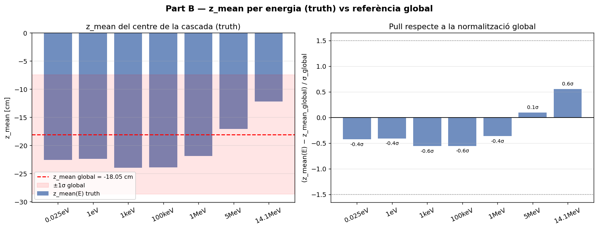

### C — Z físic

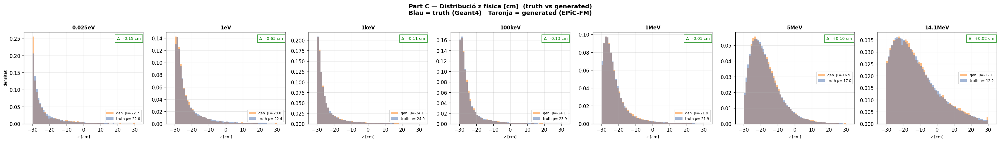

### D — Scatter edep vs z

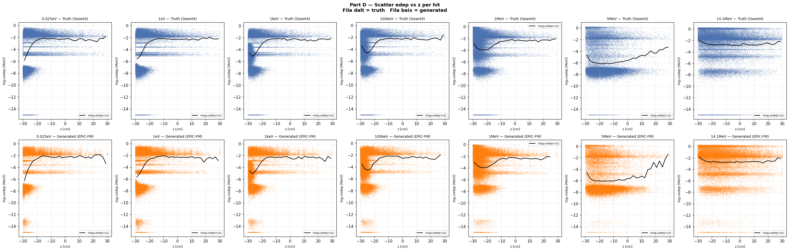

### E — Perfil edep vs z

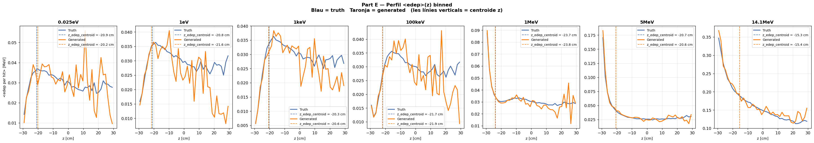

## G — Espectre edep log-log (dN/dE)

Eix X = edep [MeV] (log), eix Y = dN/dE normalitzat. Truth (negre) vs Generated (blau) per a cada energia.

### 0.025eV

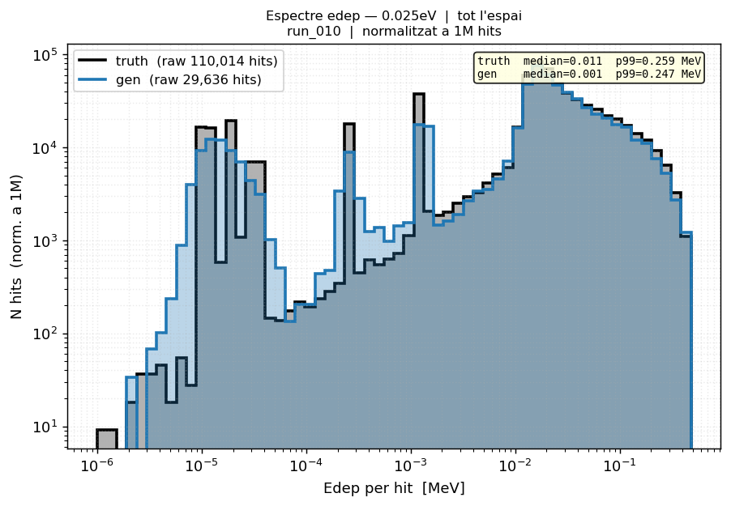

### 1eV

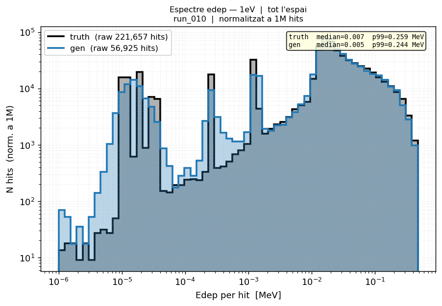

### 1keV

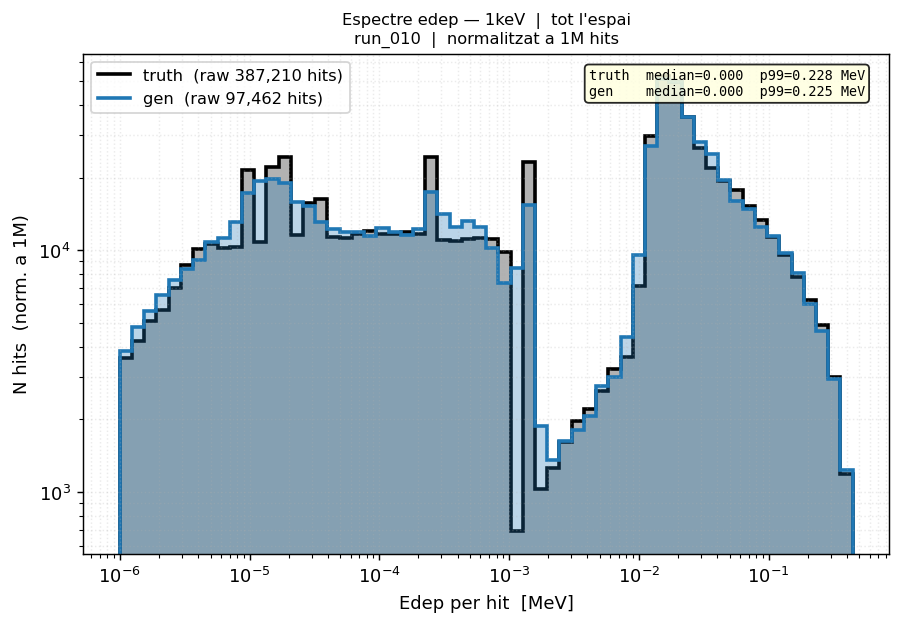

### 100keV

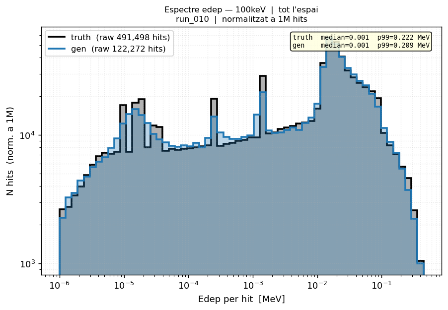

### 1MeV

### 5MeV

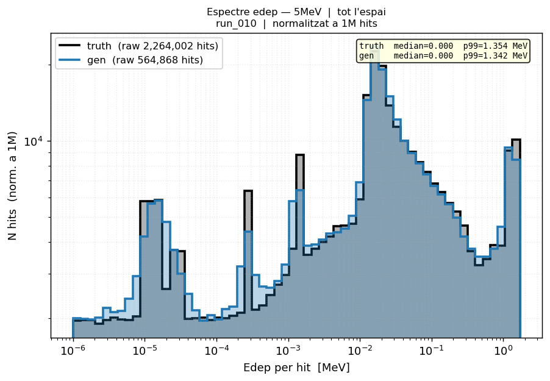

### 14.1MeV

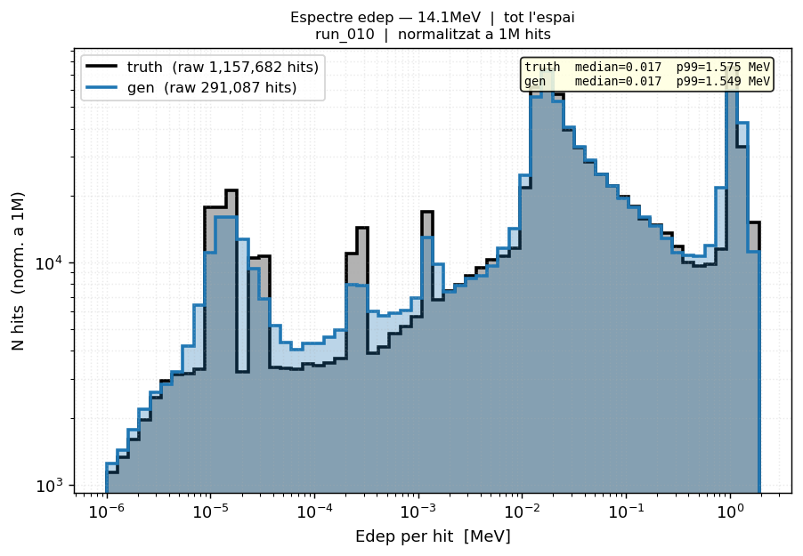

### Grid complet

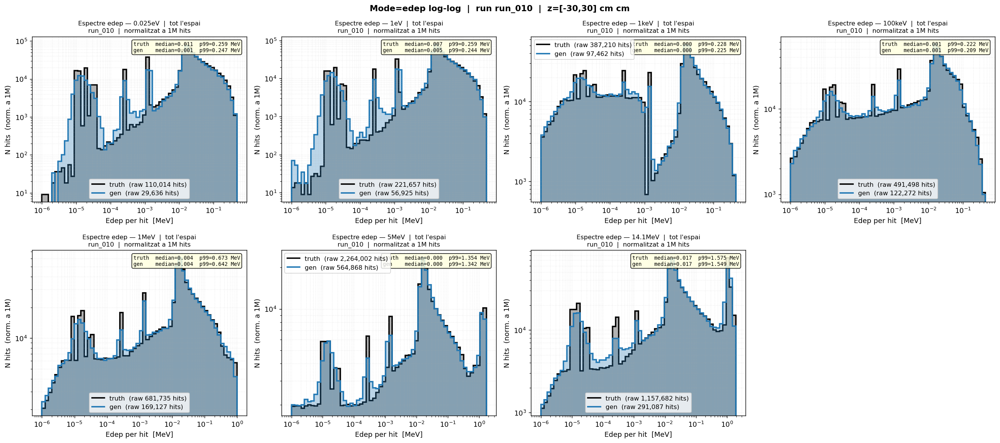

## H — Espectre isoletàrgic (dN/dlnE)

Escala Y corregida: **dN/d(ln E) = counts / Δu** on Δu = ln(E_upper/E_lower) = constant.
Aquesta escala fa Y independent de X: un espectre pla en regió epitérmica indica distribució 1/E.

### 0.025eV

### 1eV

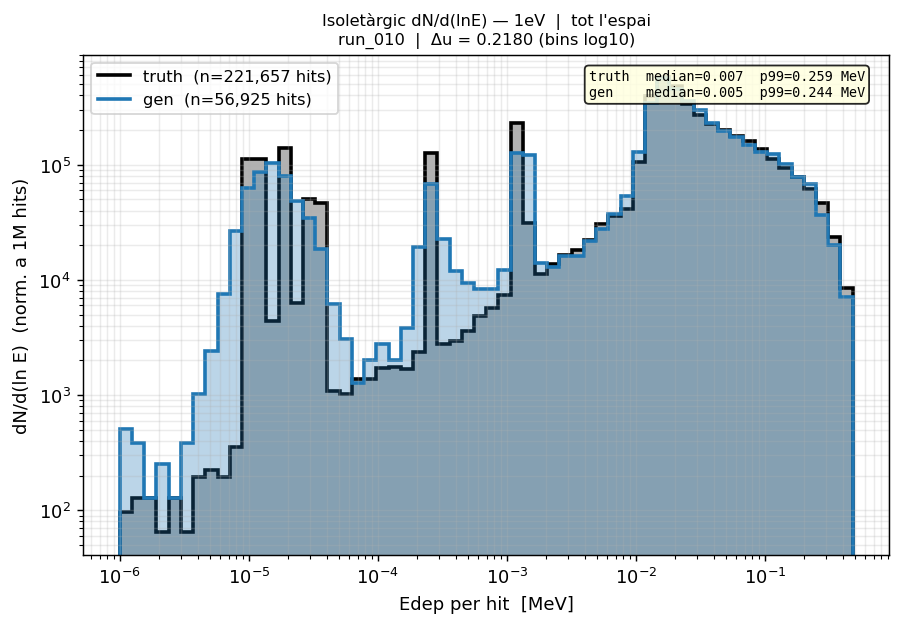

### 1keV

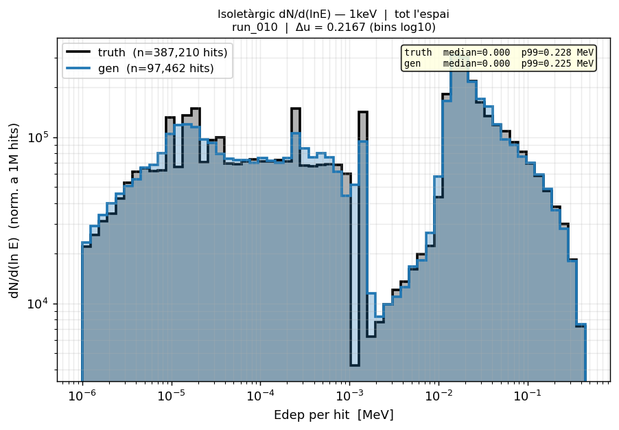

### 100keV

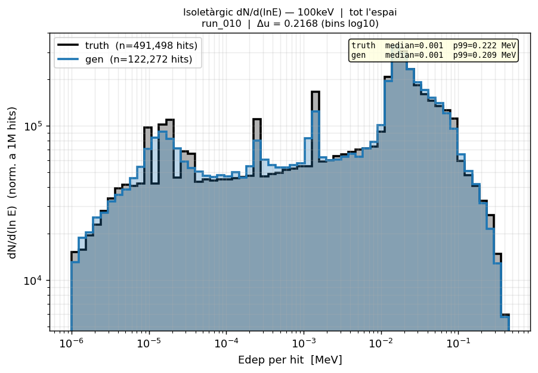

### 1MeV

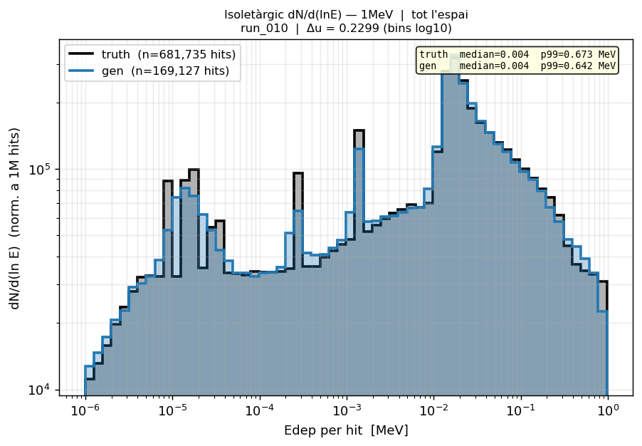

### 5MeV

### 14.1MeV

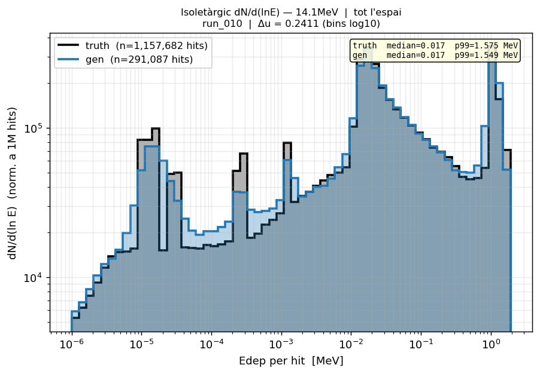

## Runs comparats

[011](run_011.md) [012](run_012.md)

---

[← Torna a l'índex](../index.md)
