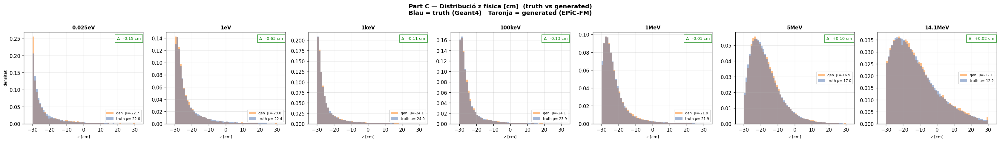
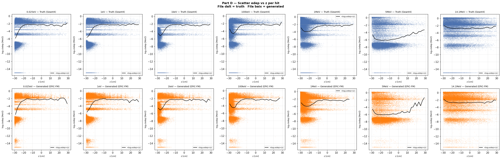
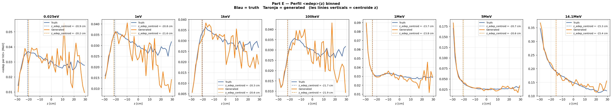
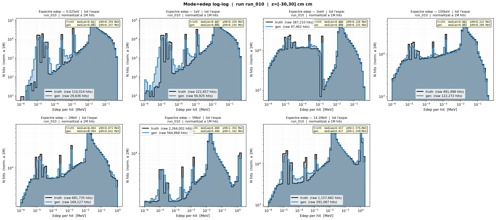
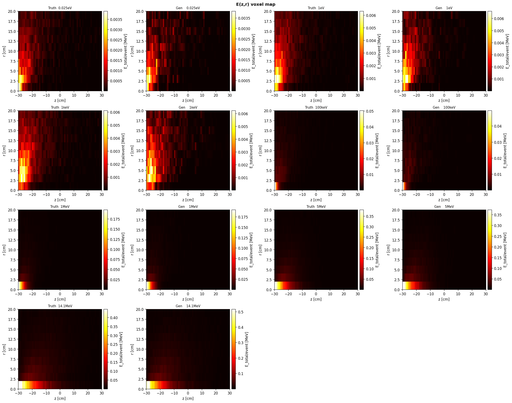
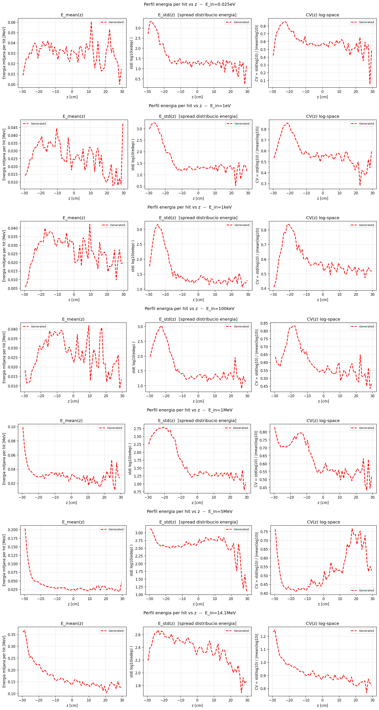
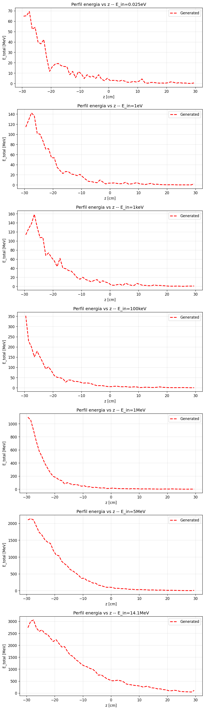

# run_010 — EPiC-FM condZ, fs=2.0 100k ✅ Referència ràpida

**Estat**: ✅ Funciona — millor W1(z) de tots els runs amb condZ

## Motivació

Test del límit de velocitat d'inferència: fs=2 amb condZ per veure si la qualitat es manté amb el mínim de passos ODE (n_steps=20).

## Configuració

| Paràmetre | Valor |
|-----------|-------|
| Iteracions | 100000 |
| feature_scale | 2.0 |
| global_dim | 64 |
| hidden_dim | 256 |
| n_layers | 6 |
| focal_gamma | 0.0 (MSE pur) |
| sum_scale_nmax | True |
| edep_beta | 0.0 |
| batch_size | 256 |
| Learning rate | 0.0003 |
| Loss final @100k | 1.173 |

Dataset: `neutron_cascade_multiE_7E_condz_preprocessed.h5` (7E, v3 condZ)

## Mètriques

Taula completa amb estatus OK/WRN/BAD per energia. Les mètriques amb ✅ són dins dels llindars, ⚠️ són warnings, ❌ són crítiques.

### Observacions

- **W1(z) millor de tots els runs**: 0.076 @1MeV — el millor valor absolut en tot el sweep (run_007: 0.109, run_006: 0.205).
- **z_mean_bias ≈ 0 a totes les energies ràpides**: −0.01 a 1MeV, +0.10 a 5MeV, +0.02 a 14.1MeV — pràcticament zero.
- **edep_z_bias ≈ 0 a totes les energies**: entre −0.23 i +0.70 — molt estable.
- **Punt fort**: fs=2 amb condZ funciona excepcionalment bé. La pèrdua de qualitat per fs baix s'anul·la amb condZ.
- **Punt feble**: W1(log_edep) alta a 0.025eV (0.323) — els tèrmics continuen sent el punt feble.

### Part Z — Resum de mètriques

Taula completa amb estatus OK/WRN/BAD per energia.

| Mètrica | 0.025eV | 1eV | 1keV | 100keV | 1MeV | 5MeV | 14.1MeV |
|---------|---------|-----|------|--------|------|------|---------|
| edep_z_bias | ✅ +0.70 | ✅ -0.78 | ✅ -0.24 | ✅ -0.23 | ✅ -0.06 | ✅ +0.07 | ✅ -0.04 |
| z_mean_bias | ✅ -0.15 | ✅ -0.63 | ✅ -0.11 | ✅ -0.13 | ✅ -0.01 | ✅ +0.10 | ✅ +0.02 |
| z_std σ_gen/σ_truth | ✅ 1.014 | ✅ 0.918 | ✅ 0.974 | ✅ 0.960 | ✅ 0.965 | ✅ 0.997 | ✅ 1.003 |
| r_std σ_gen/σ_truth | ✅ 0.988 | ✅ 0.972 | ✅ 0.989 | ✅ 0.989 | ✅ 0.981 | ✅ 0.979 | ✅ 0.962 |
| edep_std σ_gen/σ_truth | ✅ 1.003 | ✅ 0.993 | ✅ 0.990 | ✅ 0.993 | ✅ 0.988 | ✅ 1.000 | ✅ 0.996 |
| nhits_ratio | ⚠️ 1.114 | ✅ 1.030 | ✅ 1.008 | ✅ 0.999 | ✅ 0.998 | ✅ 0.996 | ✅ 1.007 |
| nhits_std σ_gen/σ_truth | ✅ 0.998 | ✅ 1.000 | ✅ 1.002 | ✅ 1.001 | ✅ 1.003 | ✅ 0.969 | ✅ 0.999 |
| peak_r0_ratio | ⚠️ 1.914 | ⚠️ 1.464 | ✅ 0.983 | ✅ 1.001 | ✅ 0.954 | ✅ 0.943 | ✅ 0.872 |
| Pearson(z,logE) gen | 0.392 | 0.321 | 0.290 | 0.157 | 0.094 | 0.017 | -0.036 |
| W1(z) [cm] | ✅ 0.464 | ✅ 0.625 | ✅ 0.180 | ✅ 0.244 | ✅ 0.076 | ✅ 0.245 | ✅ 0.165 |
| W1(log_edep) | ❌ 0.323 | ✅ 0.058 | ✅ 0.025 | ✅ 0.030 | ✅ 0.034 | ✅ 0.024 | ✅ 0.020 |

**Sections A (Transforms) i B (Z per energia truth) són comunes a tots els runs.**
Consultar [truth.md](../truth.md) per veure-les.

## Gràfics

### C — Z físic

### D — Scatter edep vs z

### E — Perfil edep vs z

## G — Espectre edep log-log (dN/dE)

Eix X = edep [MeV] (log), eix Y = dN/dE normalitzat.
Truth (negre) vs Generated (blau) per a cada energia.

### Grid complet

### Directors d'individus

- [edep log-log individuals](../images/nhits/)

## V — Mapa voxelitzat E(z,r)

Mapes de la distribució d'energia al llarg de z (vertical) i r (radial).
Escala de color: blau (baixa edep) → groc (alta edep).

### Grid run_010 vs truth

Comparació directa del grid voxelitzat entre el run_010 i les dades de referència (Geant4).

#### Grid run_010

- [Veure grid truth complet](../truth.md)

### Directors d'individus

- [run_010 — emaps individuals](../images/runs/diagnose_run_010/voxel/)
- [truth — emaps individuals](../images/truth/)

## W — Profiles voxelitzats E(z,r)

Per cada energia: perfil d'energia mitjana per hit `E_mean(z)` i energia total `E_total(z)`, comparats amb truth (Geant4).

### W1 — E_mean(z) per hit

3 subplots per energia: (1) `E_mean(z)` lineal, (2) `E_std(z)` spread log10(edep), (3) ratio `E_std_gen/E_std_truth` (1=perfecte, <1=col·lapse).

### Grid complet

### Directors d'individus

- [run_010 — profiles individuals](../images/runs/diagnose_run_010/voxel/)

### W2 — E_total(z)

Energia total acumulada al llarg de z. Truth (blau) vs Generated (taronja).

### Grid complet

### Directors d'individus

- [run_010 — profiles individuals](../images/runs/diagnose_run_010/voxel/)

## Runs comparats

[011](run_011.md) [012](run_012.md)

---

[← Torna a l'índex](../index.md)
