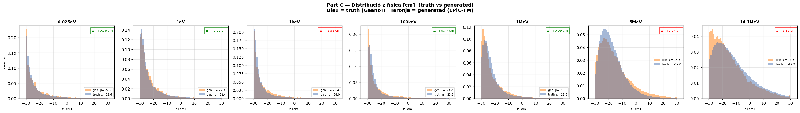
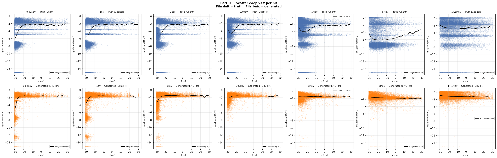
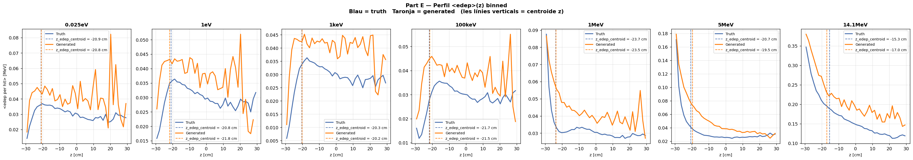

# run_011 — EPiC-FM condZ, fs=5.0 + edep_beta=2 ❌ Fails

**Estat**: ❌ Fail — edep_beta=2 destrueix la qualitat a energies altes

## Motivació

Mateix setup que run_007 (fs=5 condZ) però amb edep-weighted loss (beta=2). L'objectiu era millorar la reproducció de ressonàncies (eV–keV) amplificant tokens d'alta edep.

## Configuració

| Paràmetre | Valor |
|-----------|-------|
| Iteracions | 100000 |
| feature_scale | 5.0 |
| global_dim | 64 |
| hidden_dim | 256 |
| n_layers | 6 |
| focal_gamma | 0.0 (MSE pur) |
| sum_scale_nmax | True |
| edep_beta | 2.0 |
| batch_size | 256 |
| Learning rate | 0.0003 |
| Loss final @100k | 2.418 |

Dataset: `neutron_cascade_multiE_7E_condz_preprocessed.h5` (7E, v3 condZ)

## Mètriques per energia

| Energia | edep_z_bias | z_mean_bias | peak_r0 | nhits_ratio | W1(z) | W1(log_edep) |
|---------|:-----------:|:-----------:|:-------:|:-----------:|:-----:|:------------:|
| (|·| < 2.0) | (< 1.0) | (0.5–2.0) | (0.85–1.15) | (< 1.0) | (< 0.10) |
| 0.025eV | ✅ +0.15 | ⚠️ +0.36 | ⚠️ 2.261 | ⚠️ 1.114 | ✅ 0.389 | ❌ 1.259 |
| 1eV     | ✅ -0.94 | ✅ +0.05 | ⚠️ 1.575 | ✅ 1.030 | ✅ 0.507 | ❌ 1.819 |
| 1keV    | ✅ +0.14 | ⚠️ +1.51 | ⚠️ 0.929 | ✅ 1.008 | ❌ 1.500 | ❌ 1.839 |
| 100keV  | ✅ +0.20 | ⚠️ +0.77 | ⚠️ 1.215 | ✅ 0.999 | ❌ 0.990 | ❌ 1.782 |
| 1MeV    | ✅ +0.22 | ✅ +0.09 | ✅ 1.124 | ✅ 0.998 | ❌ 0.740 | ❌ 1.901 |
| 5MeV    | ⚠️ +1.15 | ⚠️ +1.74 | ✅ 1.161 | ✅ 0.996 | ❌ 2.005 | ❌ 4.285 |
| 14.1MeV | ⚠️ -1.67 | ⚠️ -2.12 | ✅ 0.942 | ✅ 1.007 | ❌ 2.160 | ❌ 1.466 |

### Observacions

- **edep_beta=2 és desastrós a energies altes**: W1(z) > 2.0 a 5MeV (2.005) i 14.1MeV (2.160). W1(log_edep) > 4.0 a 5MeV.
- **z_mean_bias explode a 5MeV i 14.1MeV**: +1.74 cm i −2.12 cm.
- **Edep_beta=2 no millora ressonàncies**:反而 empitjora W1(log_edep) a totes les energies (0.32–4.29 vs ~0.02–0.34 de run_007).
- **Conclusió**: edep_weighted_loss amb beta=2 destrueix la distribució a energies altes sense aportar cap benefici.

## Gràfics

### A — Transforms

### B — Z per energia (truth)

### C — Z físic

### D — Scatter edep vs z

### E — Perfil edep vs z

## Runs comparats

[010](run_010.md) [012](run_012.md)

---

[← Torna a l'índex](../index.md)
