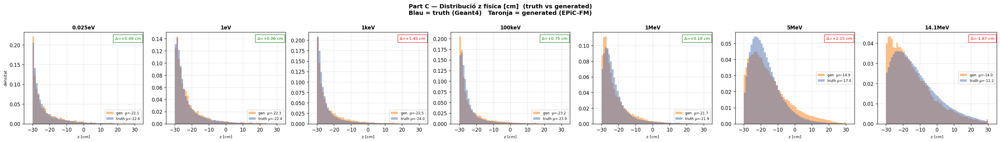
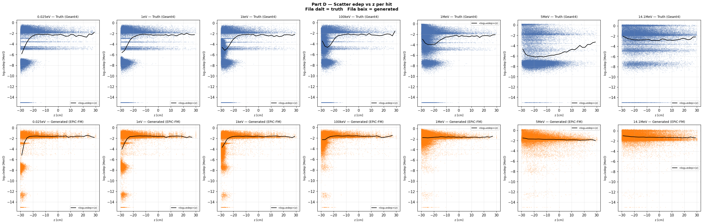
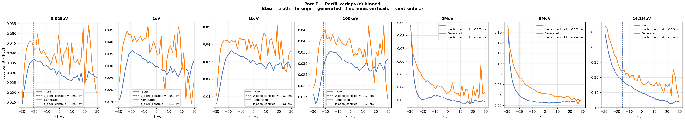

# run_012 — EPiC-FM condZ, fs=3.0 + edep_beta=2 ❌ Fails

**Estat**: ❌ Fail — mateix problema que run_011, edep_beta=2 destrueix qualitat

## Motivació

Combinació de fs=3 (entre fs=2 de run_010 i fs=5 de run_011) amb edep_beta=2. Objectiu doble: inferència més ràpida que run_007 (fs=5) i millora de ressonàncies.

## Configuració

| Paràmetre | Valor |
|-----------|-------|
| Iteracions | 100000 |
| feature_scale | 3.0 |
| global_dim | 64 |
| hidden_dim | 256 |
| n_layers | 6 |
| focal_gamma | 0.0 (MSE pur) |
| sum_scale_nmax | True |
| edep_beta | 2.0 |
| batch_size | 256 |
| Learning rate | 0.0003 |
| Loss final @100k | 1.531 |

Dataset: `neutron_cascade_multiE_7E_condz_preprocessed.h5` (7E, v3 condZ)

## Mètriques per energia

| Energia | edep_z_bias | z_mean_bias | peak_r0 | nhits_ratio | W1(z) | W1(log_edep) |
|---------|:-----------:|:-----------:|:-------:|:-----------:|:-----:|:------------:|
| (|·| < 2.0) | (< 1.0) | (0.5–2.0) | (0.85–1.15) | (< 1.0) | (< 0.10) |
| 0.025eV | ✅ +0.49 | ⚠️ +0.49 | ⚠️ 2.000 | ⚠️ 1.114 | ✅ 0.457 | ❌ 1.001 |
| 1eV     | ✅ -0.78 | ✅ +0.06 | ⚠️ 1.109 | ✅ 1.030 | ✅ 0.402 | ❌ 1.550 |
| 1keV    | ✅ +0.32 | ⚠️ +1.45 | ⚠️ 0.877 | ✅ 1.008 | ❌ 1.428 | ❌ 1.593 |
| 100keV  | ✅ +0.27 | ⚠️ +0.75 | ⚠️ 1.168 | ✅ 0.999 | ❌ 0.942 | ❌ 1.641 |
| 1MeV    | ✅ +0.35 | ✅ +0.18 | ✅ 1.089 | ✅ 0.998 | ❌ 0.710 | ❌ 1.784 |
| 5MeV    | ⚠️ +1.67 | ⚠️ +2.15 | ✅ 1.118 | ✅ 0.996 | ❌ 2.448 | ❌ 4.167 |
| 14.1MeV | ⚠️ -1.44 | ⚠️ -1.87 | ✅ 0.915 | ✅ 1.007 | ❌ 1.909 | ❌ 1.422 |

### Observacions

- **Mateix patró que run_011**: edep_beta=2 destrueix qualitat a energies altes.
- **Empitjor que run_011 a 5MeV**: W1(z)=2.448 vs 2.005, W1(log_edep)=4.167 vs 4.285 — lleugerament pitjor en W1(z).
- **fs=3 no millora res**: amb edep_beta=2, fs=3 i fs=5 tenen el mateix resultat: fail complet.
- **Conclusió**: edep_weighted_loss no funciona amb cap fs. Abandonar aquesta línia.

## Gràfics

### A — Transforms

### B — Z per energia (truth)

### C — Z físic

### D — Scatter edep vs z

### E — Perfil edep vs z

## Runs comparats

[010](run_010.md) [011](run_011.md)

---

[← Torna a l'índex](../index.md)
