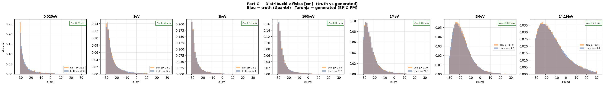
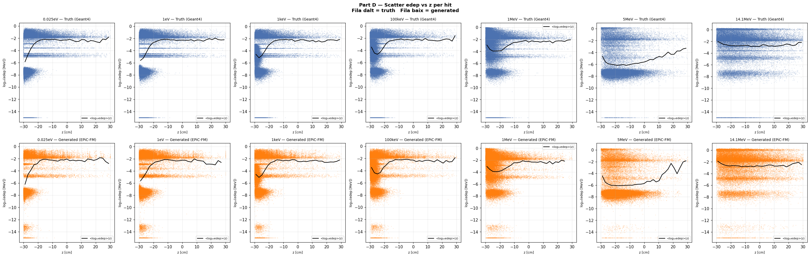
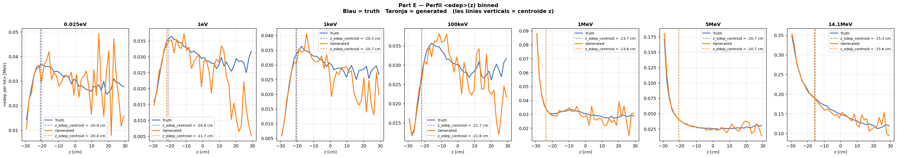
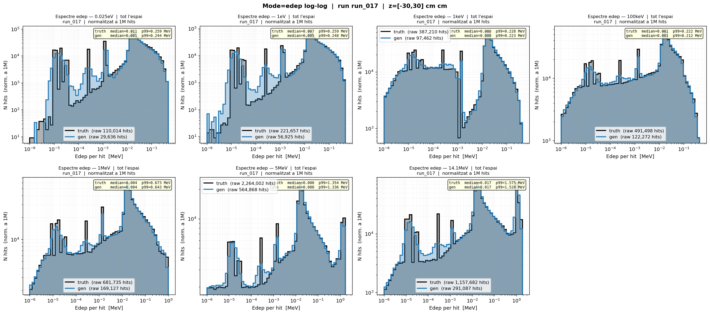
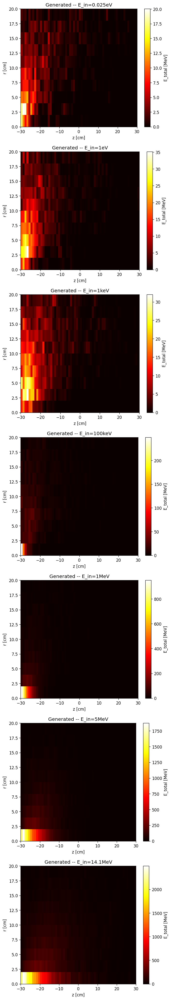
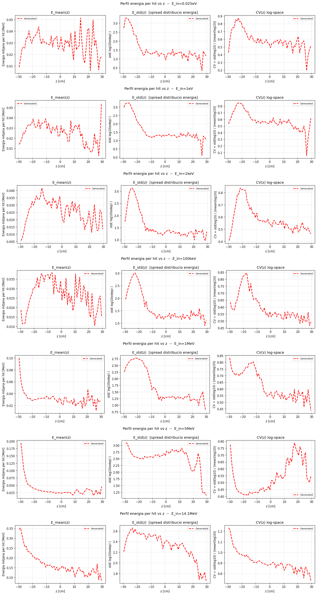
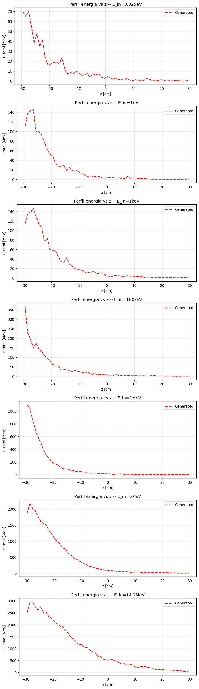

# run_017 — bins=64

✅ Completat

## Motivació

5b.1 amb n_energy_bins=64. Màxima resolució proposada. Només útil si ressonàncies són més estretes que ~0.6 ordres de magnitud. Model més gran, pot ser més lent de convergir.

## Configuració

| Paràmetre | Valor |
|-----------|-------|
| Iteracions | 100000 |
| feature_scale | 2.0 |
| global_dim | 64 |
| batch_size | 256 |
| Learning rate | 0.0003 |
| n_energy_bins | 64 |
| focal_gamma | 0.0 |
| sum_scale_nmax | True |

## Mètriques per energia

| Energia | edep_z_bias | W1(z) | W1(log_edep) | peak_r0 |
|---------|-------------|-------|--------------|---------|
| (|·| < 2.0) | (< 1.0) | (< 0.10) | (> 0.70) |
| 0.025eV    | ✅ 0.55     | ✅ 0.356    | ❌ 0.3099   | ✅ 2.028    |
| 1eV        | ✅ -0.92    | ✅ 0.695    | ✅ 0.0690   | ✅ 1.327    |
| 1keV       | ✅ -0.41    | ✅ 0.092    | ✅ 0.0168   | ✅ 1.008    |
| 100keV     | ✅ -0.15    | ✅ 0.086    | ✅ 0.0110   | ✅ 1.030    |
| 1MeV       | ✅ -0.03    | ✅ 0.140    | ✅ 0.0155   | ✅ 0.982    |
| 5MeV       | ✅ 0.02     | ✅ 0.148    | ✅ 0.0281   | ✅ 0.966    |
| 14.1MeV    | ✅ -0.28    | ✅ 0.187    | ✅ 0.0178   | ✅ 0.846    |
| **Mitjana** | **0.34** | **0.24** | **0.067** | **1.169** |

### Interpretació

- **edep_z_bias**: desplaçament del centroid d'energia. < 2cm = acceptable.
- **W1(z)**: distància W1 en z. < 1cm = acceptable, < 2cm = warning.
- **W1(log_edep)**: distància W1 en edep logarítmic. < 0.10 = acceptable.
- **peak_r0_ratio**: proporció del peak a r=0. > 0.70 = acceptable.

### Part Z — Resum de mètriques

Taula completa amb estatus OK/WRN/BAD per energia.

| Mètrica | 0.025eV | 1eV | 1keV | 100keV | 1MeV | 5MeV | 14.1MeV |
|---------|---------|-----|------|--------|------|------|---------|
| edep_z_bias | ✅ +0.55 | ✅ -0.92 | ✅ -0.41 | ✅ -0.15 | ✅ -0.03 | ✅ +0.02 | ✅ -0.28 |
| z_mean_bias | ✅ -0.21 | ✅ -0.68 | ✅ -0.13 | ✅ -0.05 | ✅ -0.02 | ✅ +0.02 | ✅ -0.21 |
| z_std σ_gen/σ_truth | ✅ 1.005 | ✅ 0.908 | ✅ 0.973 | ✅ 0.992 | ✅ 0.968 | ✅ 0.979 | ✅ 0.996 |
| r_std σ_gen/σ_truth | ✅ 0.997 | ✅ 0.970 | ✅ 0.989 | ✅ 0.991 | ✅ 0.986 | ✅ 0.980 | ✅ 0.962 |
| edep_std σ_gen/σ_truth | ✅ 1.001 | ✅ 0.994 | ✅ 0.989 | ✅ 0.992 | ✅ 0.990 | ✅ 1.000 | ✅ 0.990 |
| nhits_ratio | ⚠️ 1.114 | ✅ 1.030 | ✅ 1.008 | ✅ 0.999 | ✅ 0.998 | ✅ 0.996 | ✅ 1.007 |
| nhits_std σ_gen/σ_truth | ✅ 0.998 | ✅ 1.000 | ✅ 1.002 | ✅ 1.001 | ✅ 1.003 | ✅ 0.969 | ✅ 0.999 |
| peak_r0_ratio | ⚠️ 2.028 | ⚠️ 1.327 | ✅ 1.008 | ✅ 1.030 | ✅ 0.982 | ✅ 0.966 | ✅ 0.846 |
| Pearson(z,logE) gen | 0.391 | 0.317 | 0.286 | 0.157 | 0.094 | 0.021 | -0.034 |
| W1(z) [cm] | ✅ 0.356 | ✅ 0.695 | ✅ 0.092 | ✅ 0.086 | ✅ 0.140 | ✅ 0.148 | ✅ 0.187 |
| W1(log_edep) | ❌ 0.310 | ✅ 0.069 | ✅ 0.017 | ✅ 0.011 | ✅ 0.015 | ✅ 0.028 | ✅ 0.018 |

**Sections A (Transforms) i B (Z per energia truth) són comunes a tots els runs.**
Consultar [truth.md](../truth.md) per veure-les.

## Gràfics

Distribució de z per energia en les dades de veritat.

### C — Z físic

Distribució de z en unitats físiques (truth vs generated).



### D — Scatter edep vs z

Relació entre edep i z (scatter plots).



### E — Perfil edep vs z

Perfil de edep al llarg de z.



### F — Summary

Resum textual de mètriques.

```
=================================================================
PART F — Resum diagnosi biaix edep_z
=================================================================

z_global_mean  = -18.052 cm
z_global_std   = 10.603 cm

Si el model aprèn distribucions en espai normalitzat i el pull
de la cascada ràpida (z_mean_fast - z_global_mean)/z_global_std
és gran (> 1.5σ), el model ha de desplaçar molt el z i pot
quedar un biaix residual consistent.

Energies amb biaix observat a run_001:
  1 MeV:    edep_z_bias = -2.14 cm   z_peak_bias = +1.03 cm
  5 MeV:    edep_z_bias = -2.54 cm   z_peak_bias = +1.03 cm
 14.1 MeV:  edep_z_bias = -2.48 cm   z_peak_bias = +0.81 cm

Paradoxa: z_peak_bias > 0 però edep_z_bias < 0
→ El pic geomètric és lleugerament massa lluny PERÒ
  l'energia es concentra massa a prop de z=0.
→ Possible distorsió de la correlació edep(z), no només desplaçament rígid.

Comprovació clau (Part C):
  Si el biaix Δz ja existeix en espai NORMALITZAT → error del model.
  Si el biaix només apareix en espai FÍSIC        → error del transform.

Veure figures:
  B_z_per_energy_truth.png  → quantifica el 'pull' de normalització
  C_z_norm_vs_phys.png      → on apareix el biaix (norm vs físic)
  D_edep_vs_z_scatter.png   → correlació edep(z) per hit
  E_edep_z_profile.png      → perfil <edep>(z) binnat truth vs gen
```

## G — Espectre edep log-log (dN/dE)

Eix X = edep [MeV] (log), eix Y = dN/dE normalitzat.
Truth (negre) vs Generated (blau) per a cada energia.

### Grid complet



### Directors d'individus

- [edep log-log individuals](../images/nhits/)

## V — Mapa voxelitzat E(z,r)

Mapes de la distribució d'energia al llarg de z (vertical) i r (radial).
Escala de color: blau (baixa edep) → groc (alta edep).

### Grid run_017 vs truth

Comparació directa del grid voxelitzat entre el run_017 i les dades de referència (Geant4).

#### Grid run_017



- [Veure grid truth complet](../truth.md)

### Directors d'individus

- [run_017 — emaps individuals](../images/runs/diagnose_run_017/voxel/)
- [truth — emaps individuals](../images/truth/)

## W — Profiles voxelitzats E(z,r)

Per cada energia: perfil d'energia mitjana per hit `E_mean(z)` i energia total `E_total(z)`, comparats amb truth (Geant4).

### W1 — E_mean(z) per hit

3 subplots per energia: (1) `E_mean(z)` lineal, (2) `E_std(z)` spread log10(edep), (3) ratio `E_std_gen/E_std_truth` (1=perfecte, <1=col·lapse).

### Grid complet



### Directors d'individus

- [run_017 — profiles individuals](../images/runs/diagnose_run_017/voxel/)

### W2 — E_total(z)

Energia total acumulada al llarg de z. Truth (blau) vs Generated (taronja).

### Grid complet



### Directors d'individus

- [run_017 — profiles individuals](../images/runs/diagnose_run_017/voxel/)

## Runs comparats

[013](run_013.md) [014](run_014.md) [015](run_015.md) [016](run_016.md) [018](run_018.md) 

---

[← Torna a l'índex](../index.md)
