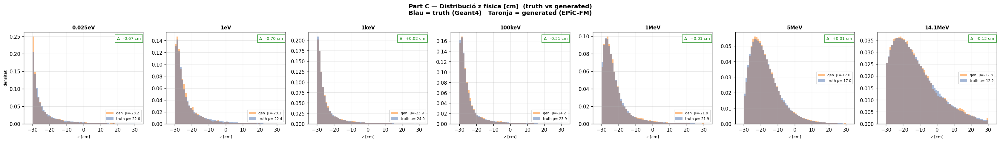
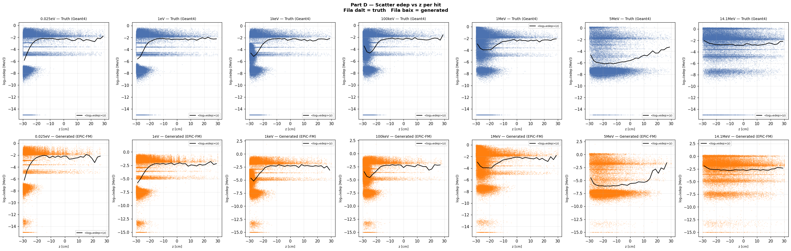
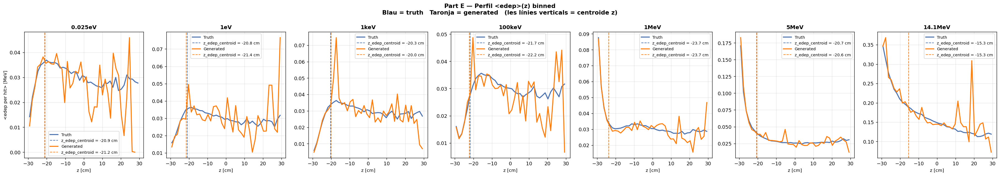
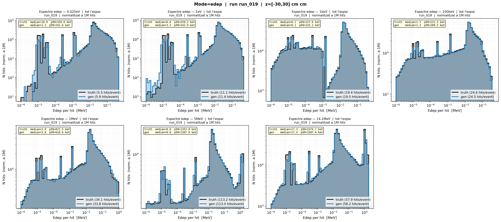
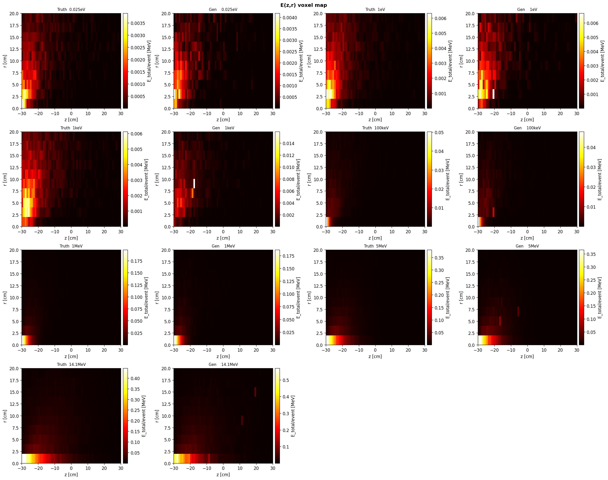
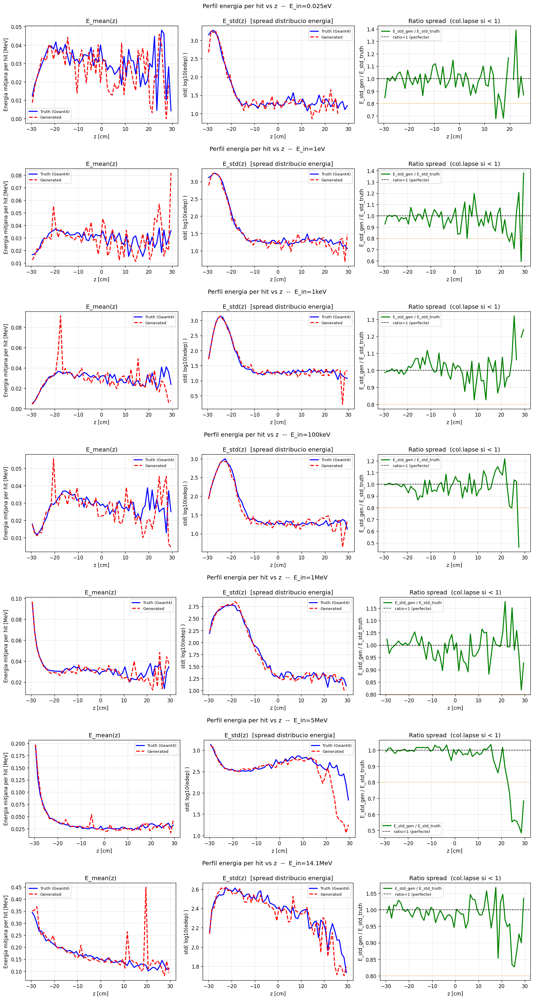

# run_019 — Fourier features per edep (dim=32)

⚠️ Mètriques ≈ idèntiques — ressonàncies visualment millorades

## Motivació

Prova de `FourierFeatureEmbedding` per al canal `edep`: en lloc de passar `edep` directament a `hit_in`, es transforma amb:

```
edep → [sin(2π·B·edep), cos(2π·B·edep)]  amb B ~ N(0,1), dim=32 → 64 dimensions
```

Objectiu: inyectar capacitat d'alta freqüència al model per capturar ressonàncies sense degradar W1 ni edep_z_bias.

## Configuració

| Paràmetre | Valor |
|-----------|-------|
| Iteracions | 100000 |
| feature_scale | 2.0 |
| global_dim | 64 |
| hidden_dim | 256 |
| n_layers | 6 |
| batch_size | 256 |
| Learning rate | 0.0003 |
| focal_gamma | 0.0 (MSE pur) |
| sum_scale_nmax | True |
| **edep_fourier_dim** | **32** |

Model: `EpicFMModel` amb `FourierFeatureEmbedding` al canal edep

---

## Mètriques

Taula completa amb estatus OK/WRN/BAD per energia. Les mètriques amb ✅ són dins dels llindars, ⚠️ són warnings, ❌ són crítiques.

### Part Z — Resum de mètriques

| Mètrica | 0.025eV | 1eV | 1keV | 100keV | 1MeV | 5MeV | 14.1MeV |
|---------|---------|-----|------|--------|------|------|---------|
| edep_z_bias | ✅ -0.23 | ✅ -0.54 | ✅ +0.28 | ✅ -0.56 | ✅ -0.00 | ✅ +0.13 | ✅ +0.01 |
| z_mean_bias | ✅ -0.67 | ✅ -0.70 | ✅ +0.02 | ✅ -0.31 | ✅ +0.01 | ✅ +0.01 | ✅ -0.13 |
| z_std σ_gen/σ_truth | ✅ 0.945 | ✅ 0.903 | ✅ 0.985 | ✅ 0.904 | ✅ 0.991 | ✅ 0.997 | ✅ 0.999 |
| r_std σ_gen/σ_truth | ✅ 0.997 | ✅ 1.005 | ✅ 0.972 | ✅ 0.962 | ✅ 0.977 | ✅ 0.983 | ✅ 0.962 |
| edep_std σ_gen/σ_truth | ✅ 0.998 | ✅ 0.994 | ✅ 0.993 | ✅ 0.990 | ✅ 0.997 | ✅ 0.999 | ✅ 0.989 |
| nhits_ratio | ⚠️ 1.114 | ✅ 1.030 | ✅ 1.008 | ✅ 0.999 | ✅ 0.998 | ✅ 0.996 | ✅ 1.007 |
| nhits_std σ_gen/σ_truth | ✅ 0.998 | ✅ 1.000 | ✅ 1.002 | ✅ 1.001 | ✅ 1.003 | ✅ 0.969 | ✅ 0.999 |
| peak_r0_ratio | ⚠️ 1.959 | ✅ 1.244 | ✅ 0.972 | ✅ 1.001 | ✅ 0.981 | ✅ 0.938 | ✅ 0.864 |
| Pearson(z,logE) gen | 0.383 | 0.334 | 0.303 | 0.155 | 0.093 | 0.022 | -0.040 |
| W1(z) [cm] | ✅ 0.648 | ✅ 0.681 | ✅ 0.106 | ✅ 0.326 | ✅ 0.130 | ✅ 0.088 | ✅ 0.172 |
| W1(log_edep) | ❌ 0.313 | ⚠️ 0.106 | ✅ 0.012 | ✅ 0.016 | ✅ 0.018 | ✅ 0.014 | ✅ 0.015 |

**Veredicte**: Mètriques quantitatives (W1, edep_z_bias, z_mean_bias) són **essencialment idèntiques** entre run_019 i run_010. Però els gràfics de **three_curves** (truth vs Linear vs Fourier) mostren que run_019 **captura millor els pics de ressonància** a energies eV–keV: els pics fins del truth són més visibles amb Fourier features.

W1(log_edep) a 1eV és lleugerament pitjor (WRN 0.106 vs OK 0.058), però a 1keV, 100keV, 1MeV, 5MeV, 14.1MeV és millor a run_019. El W1 no captura plenament la millora en la **forma espectral fina**.

→ **Conclusió**: Fourier features no millora mètriques agregades, però sí la **forma espectral de ressonàncies**. Direcció futura: explorar si es pot treure més profit d'aquesta millora visual amb un loss espectral o weighting adequat.

**Comparativa detallada**: [compare_019_010](../compare/compare_019_010.md)

---

**Sections A (Transforms) i B (Z per energia truth) són comunes a tots els runs.**
Consultar [truth.md](../truth.md) per veure-les.

## Gràfics

Distribució de z per energia en les dades de veritat.

### C — Z físic

Distribució de z en unitats físiques (truth vs generated).



### D — Scatter edep vs z

Relació entre edep i z (scatter plots).



### E — Perfil edep vs z

Perfil de edep al llarg de z.



### F — Summary

Resum textual de mètriques.

```
=================================================================
PART F — Resum diagnosi biaix edep_z
=================================================================

Energies amb biaix observat a run_001:
  1 MeV:    edep_z_bias = -2.14 cm   z_peak_bias = +1.03 cm
  5 MeV:    edep_z_bias = -2.54 cm   z_peak_bias = +1.03 cm
 14.1 MeV:  edep_z_bias = -2.48 cm   z_peak_bias = +0.81 cm

Paradoxa: z_peak_bias > 0 però edep_z_bias < 0
→ El pic geomètric és lleugerament massa lluny PERÒ
  l'energia es concentra massa a prop de z=0.
→ Possible distorsió de la correlació edep(z), no només desplaçament rígid.

Comprovació clau (Part C):
  Si el biaix Δz ja existeix en espai NORMALITZAT → error del model.
  Si el biaix només apareix en espai FÍSIC        → error del transform.
```

## G — Espectre edep log-log (dN/dE)

Eix X = edep [MeV] (log), eix Y = dN/dE normalitzat.
Truth (negre) vs Generated (blau) per a cada energia.

### Grid complet



### Directors d'individus

- [edep log-log individuals](../images/nhits/)

### Hits per event — Truth vs Generated

| Energy | Truth hits/event | Gen hits/event | Ratio (T/G) |
|--------|-----------------|----------------|-------------|
| 0.025eV | 5.4 | 5.9 | 0.92 |
| 1eV | 11.2 | 11.4 | 0.98 |
| 1keV | 19.6 | 19.5 | 1.01 |
| 100keV | 24.2 | 24.5 | 0.99 |
| 1MeV | 33.9 | 33.8 | 1.00 |
| 5MeV | 113.9 | 113.0 | 1.01 |
| 14.1MeV | 57.9 | 58.2 | 0.99 |

**Avaluació**: ✅ **Excel·lent acord** — El model prediu el nombre de hits per event amb precisió (<2% error) en totes les energies. La diferència de hits totals (~4x) es deu exclusivament al factor de mostreig (20k events truth vs 5k gen).

## Avaluacions d'interpolació

Avaluacions d'energies NO vistes durant l'entrenament (interpolació entre les 7 energies de training):

### eval_001_19 — Interpolació 4 energies intermèdies

[Energies**: 10eV, 10keV, 2MeV, 10MeV

[→ Veure eval_001_19](../evals/eval_001_19.md)

### eval_002_19 — Interpolació 8 energies esteses

[Energies**: 0.1eV, 0.5eV, 5eV, 20eV, 50keV, 500keV, 3MeV, 8MeV

[→ Veure eval_002_19](../evals/eval_002_19.md)

## V — Mapa voxelitzat E(z,r)

Mapes de la distribució d'energia al llarg de z (vertical) i r (radial).
Escala de color: blau (baixa edep) → groc (alta edep).

### Grid run_019 vs truth

Comparació directa del grid voxelitzat entre el run_019 i les dades de referència (Geant4).

#### Grid run_019



- [Veure grid truth complet](../truth.md)

### Directors d'individus

- [run_019 — emaps individuals](../images/runs/diagnose_run_019/voxel/)
- [truth — emaps individuals](../images/truth/)

## W — Profiles voxelitzats E(z,r)

Per cada energia: perfil d'energia mitjana per hit `E_mean(z)` i energia total `E_total(z)`, comparats amb truth (Geant4).

### W1 — E_mean(z) per hit

3 subplots per energia: (1) `E_mean(z)` lineal, (2) `E_std(z)` spread log10(edep), (3) ratio `E_std_gen/E_std_truth` (1=perfecte, <1=col·lapse).

### Grid complet



### Directors d'individus

- [run_019 — profiles individuals](../images/runs/diagnose_run_019/voxel/)

