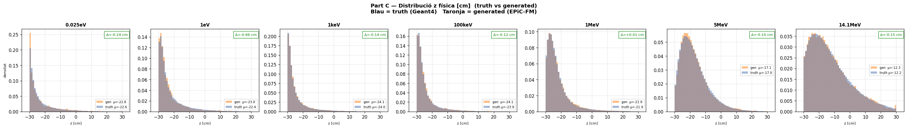
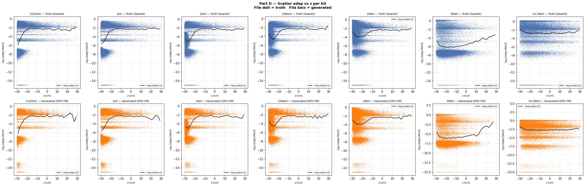
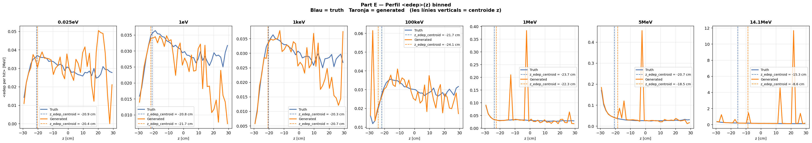
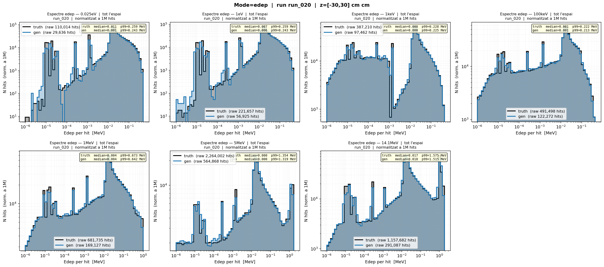

# run_020 — Fourier features dim=64 (hipòtesi refutada)

❌ **Hipòtesi refutada**: dim=64 NO millora dim=32. Peak Sharpness empitjora a 1keV i 100keV.

## Motivació

Prova de `FourierFeatureEmbedding` amb `edep_fourier_dim=64` (vs 32 de run_019).
Hipòtesi: més freqüències = millor captura de pics de ressonància = Peak Sharpness més alt.

```
edep → [sin(2π·B·edep), cos(2π·B·edep)]  amb B ~ N(0,1), dim=64 → 128 dimensions
```

Objectiu: provar si més freqüències Fourier milloren la captura de pics de ressonància.

## Configuració

| Paràmetre | Valor |
|-----------|-------|
| Iteracions | 100000 |
| feature_scale | 2.0 |
| global_dim | 64 |
| hidden_dim | 256 |
| n_layers | 6 |
| batch_size | 256 |
| Learning rate | 0.0003 |
| focal_gamma | 0.0 (MSE pur) |
| sum_scale_nmax | True |
| **edep_fourier_dim** | **64** |

Model: `EpicFMModel` amb `FourierFeatureEmbedding` al canal edep

---

## Mètriques

### Part Z — Resum de mètriques

| Mètrica | 0.025eV | 1eV | 1keV | 100keV | 1MeV | 5MeV | 14.1MeV |
|---------|---------|-----|------|--------|------|------|---------|
| edep_z_bias | ✅ +0.57 | ✅ -0.87 | ✅ -0.36 | ⚠️ -2.47 | ✅ +1.43 | ⚠️ +2.22 | ⚠️ +6.77 |
| z_mean_bias | ✅ -0.24 | ✅ -0.66 | ✅ -0.14 | ✅ -0.12 | ✅ +0.01 | ✅ -0.10 | ✅ -0.15 |
| z_std σ_gen/σ_truth | ✅ 0.991 | ✅ 0.913 | ✅ 0.961 | ✅ 0.966 | ✅ 0.976 | ✅ 0.987 | ✅ 0.997 |
| r_std σ_gen/σ_truth | ✅ 0.987 | ✅ 0.969 | ✅ 0.991 | ✅ 0.992 | ✅ 0.982 | ✅ 0.979 | ✅ 0.963 |
| edep_std σ_gen/σ_truth | ✅ 1.001 | ✅ 0.992 | ✅ 0.990 | ✅ 0.993 | ✅ 0.989 | ✅ 1.002 | ✅ 0.989 |
| nhits_ratio | ⚠️ 1.114 | ✅ 1.030 | ✅ 1.008 | ✅ 0.999 | ✅ 0.998 | ✅ 0.996 | ✅ 1.007 |
| nhits_std σ_gen/σ_truth | ✅ 0.998 | ✅ 1.000 | ✅ 1.002 | ✅ 1.001 | ✅ 1.003 | ✅ 0.969 | ✅ 0.999 |
| peak_r0_ratio | ⚠️ 2.138 | ⚠️ 1.385 | ✅ 0.985 | ✅ 0.987 | ✅ 0.951 | ✅ 0.921 | ✅ 0.841 |
| Pearson(z,logE) gen | 0.390 | 0.318 | 0.293 | 0.154 | 0.096 | 0.023 | -0.037 |
| W1(z) [cm] | ✅ 0.495 | ✅ 0.660 | ✅ 0.201 | ✅ 0.236 | ✅ 0.052 | ✅ 0.161 | ✅ 0.231 |
| W1(log_edep) | ❌ 0.322 | ✅ 0.041 | ✅ 0.035 | ✅ 0.029 | ✅ 0.035 | ✅ 0.025 | ✅ 0.039 |

**Veredicte**: **Hipòtesi refutada**. dim=64 NO millora dim=32:

| Mètrica | run_019 (dim32) | run_020 (dim64) | Canvi |
|---------|-----------------|-----------------|-------|
| Peak Sharpness (1keV) | **14.78** | 9.78 | Empitjora |
| Peak Sharpness (100keV) | **12.96** | 6.59 | Empitjora |
| Peak Sharpness (5MeV) | 53.74 | **56.48** | Millora lleugera |
| edep_z_bias (14.1MeV) | +0.01 ✅ | +6.77 ⚠️ | Empitjora molt |
| RI (totes energies) | BAD (~0.08) | BAD (~0.09) | Idèntic |
| W1(log_edep) (1eV) | ⚠️ 0.106 | ✅ 0.041 | Millora |

→ **Conclusió**: El augment de freqüències Fourier no ajuda a capturar millor els pics. dim=32 ja és suficient. El problema no és la representació sinó el loss de training. Direcció futura: **Phase 6 — loss espectral / importance weighting**.

**Comparativa detallada**: [compare_020_019](../compare/compare_020_019.md)

---

## Gràfics

### C — Z físic



### D — Scatter edep vs z



### E — Perfil edep vs z



## G — Espectre edep log-log (dN/dE)

### Grid complet



### Directors d'individus

- [edep log-log individuals](../images/nhits/)

## V — Mapa voxelitzat E(z,r)

### Grid run_020


### Directors d'individus

- [run_020 — emaps individuals](../images/runs/diagnose_run_020/voxel/)

## W — Profiles voxelitzats E(z,r)

### Grid complet


### Directors d'individus

- [run_020 — profiles individuals](../images/runs/diagnose_run_020/voxel/)
