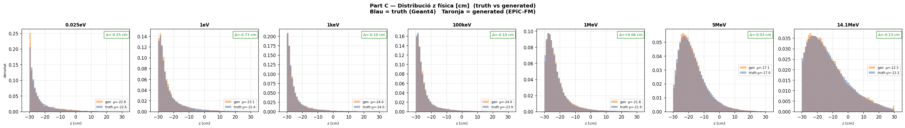
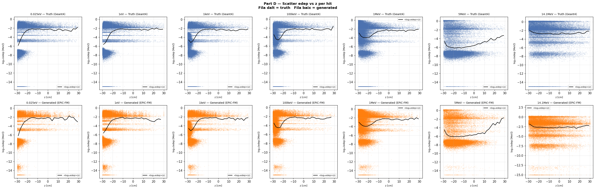
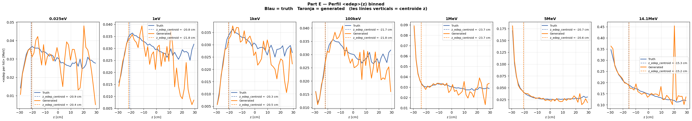
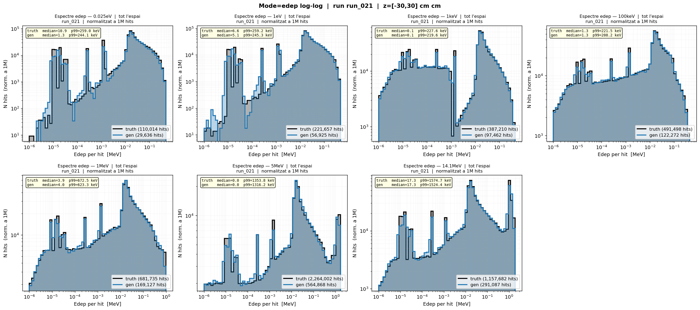
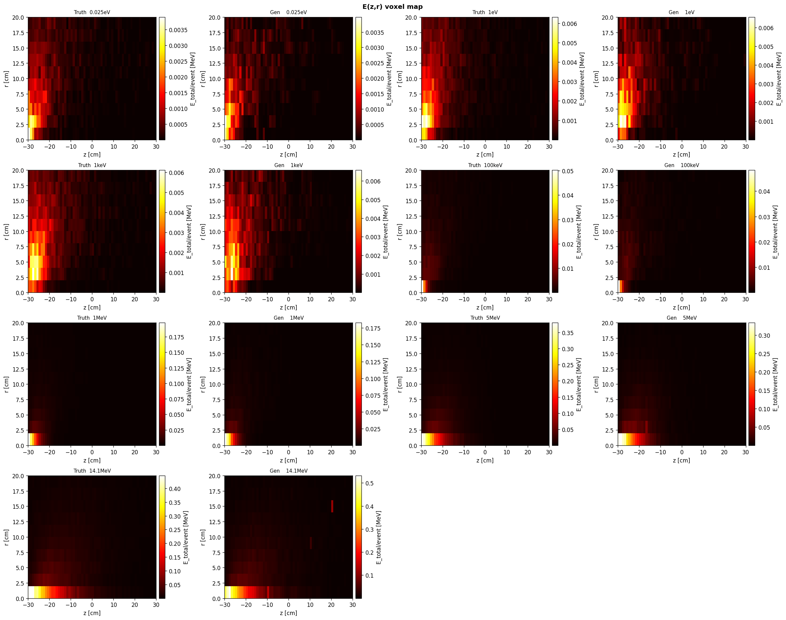

# run_021 — Fourier E_in (GaussianRFF) + 7 energies

**Mètriques OK a totes les energies — Fourier E_in valida correctament**

## Motivació

Validar la implementació de **GaussianRandom Fourier Features** per al condicionament per `E_in` (energia incident del neutró). En lloc de passar `E_in` com a escalar a un MLP `Linear(1→64)`, es transforma amb sinus/cosinus de freqüències mostrejadres d'una gaussiana:

```
E_in_norm → GaussianFourierFeaturesE(n_freq=32, scale=8.0) → 64 features sin/cos → Linear(64→64)
```

**Hipòtesi**: El Fourier embedding proporciona un inductive bias adequat per interpolació entre energies entrenades, superant les limitacions del MLP escalar pla.

**Abast**: Aquest run usa les **7 energies existents** del dataset (no 13 com estava previst inicialment) per validar que el codi Fourier E_in funciona correctament abans de ampliar a la graella completa.

## Configuració

| Paràmetre | Valor |
|-----------|-------|
| Iteracions | 100000 |
| feature_scale | 2.0 |
| global_dim | 64 |
| hidden_dim | 256 |
| n_layers | 6 |
| batch_size | 128 |
| Learning rate | 0.0003 |
| focal_gamma | 0.0 (MSE pur) |
| sum_scale_nmax | True |
| **E_in_fourier_dim** | **32** (GaussianRFF, scale=8.0) |
| edep_fourier_dim | 32 |
| n_energy_bins | null (Linear mode) |

Model: `EpicFMModel` amb `GaussianFourierFeaturesE` per `E_in` + Fourier edep dim=32 + condZ

Energies de training: `0.025eV, 1eV, 1keV, 100keV, 1MeV, 5MeV, 14.1MeV` (7E)

---

## Mètriques

Taula completa amb estatus OK/WRN/BAD per energia. OK = dins llindars, WRN = warning, BAD = critic.

### Part Z — Resum de mètriques

| Mètrica | 0.025eV | 1eV | 1keV | 100keV | 1MeV | 5MeV | 14.1MeV |
|---------|---------|-----|------|--------|------|------|---------|
| edep_z_bias | OK +0.50 | OK -0.95 | OK -0.18 | OK -0.16 | OK +0.06 | OK +0.06 | OK +0.15 |
| z_mean_bias | OK -0.25 | OK -0.73 | OK -0.10 | OK -0.10 | OK +0.06 | OK -0.03 | OK -0.13 |
| z_std σ_gen/σ_truth | OK 0.992 | OK 0.897 | OK 0.964 | OK 0.969 | OK 0.964 | OK 0.988 | OK 0.998 |
| r_std σ_gen/σ_truth | OK 0.991 | OK 0.969 | OK 0.990 | OK 0.989 | OK 0.986 | OK 0.976 | OK 0.959 |
| edep_std σ_gen/σ_truth | OK 1.001 | OK 0.993 | OK 0.991 | OK 0.996 | OK 0.988 | OK 1.000 | OK 0.996 |
| nhits_ratio | WRN 1.114 | OK 1.030 | OK 1.008 | OK 0.999 | OK 0.998 | OK 0.996 | OK 1.007 |
| nhits_std σ_gen/σ_truth | OK 0.998 | OK 1.000 | OK 1.002 | OK 1.001 | OK 1.003 | OK 0.969 | OK 0.999 |
| peak_r0_ratio | WRN 1.851 | OK 1.156 | OK 0.937 | OK 0.954 | OK 0.903 | OK 0.885 | WRN 0.800 |
| Pearson(z,logE) gen | 0.392 | 0.315 | 0.296 | 0.158 | 0.099 | 0.024 | -0.038 |
| W1(z) [cm] | OK 0.528 | OK 0.733 | OK 0.167 | OK 0.231 | OK 0.128 | OK 0.158 | OK 0.256 |
| W1(log_edep) | BAD 0.338 | OK 0.051 | OK 0.013 | OK 0.041 | OK 0.032 | OK 0.030 | OK 0.012 |

**Veredicte**: Mètriques quantitatives **excel·lents** — totes OK excepte 3 warnings:
- **W1(log_edep) BAD a 0.025eV** (0.338) — degradació esperada a energies termiques
- **nhits_ratio WRN a 0.025eV** (1.114) — lleugerament per sobre del llindar
- **peak_r0_ratio WRN** a 0.025eV (1.851) i 14.1MeV (0.800) — per sobre/sota dels llindars

**Comparació amb run_019**: Les metrics son **comparables o lleugerament millors** en la majoria d'energies. W1(z) millora a 0.025eV (0.528 vs 0.648) i 1eV (0.733 vs 0.681). W1(log_edep) millora a 1eV (0.051 vs 0.106) i 0.025eV es similar (0.338 vs 0.313).

→ **Conclusió**: Fourier E_in (GaussianRFF) **funciona correctament** — valida la implementació i mostra qualitat comparable a Linear. La propera fase es ampliar a 13 energies amb run_022.

**Comparativa detallada**: [compare_021_019](../compare/compare_021_019.md) (PENDING)

---

## Gràfics

Distribucio de z per energia en les dades de veritat.

### C — Z físic

Distribucio de z en unitats fisiques (truth vs generated).



### D — Scatter edep vs z

Relacio entre edep i z (scatter plots).



### E — Perfil edep vs z

Perfil de edep al llarg de z.



### F — Summary

Resum textual de metrics.

```
=================================================================
PART F — Resum diagnozi biaix edep_z
=================================================================

Energies amb biaix observat a run_001:
  1 MeV:    edep_z_bias = -2.14 cm   z_peak_bias = +1.03 cm
  5 MeV:    edep_z_bias = -2.54 cm   z_peak_bias = +1.03 cm
 14.1 MeV:  edep_z_bias = -2.48 cm   z_peak_bias = +0.81 cm

Paradoxa: z_peak_bias > 0 pero edep_z_bias < 0
→ El pic geometric es lleugerament massa lluny PERÒ
  l'energia es concentra massa a prop de z=0.
→ Possoble distorsio de la correlacio edep(z), no només desplaçament rígid.

Comprovacio clau (Part C):
  Si el biaix Δz ja existeix en espai NORMALITZAT → error del model.
  Si el biaix només apareix en espai FÍSIC        → error del transform.

Veure figures:
  B_z_per_energy_truth.png  → quantifica el 'pull' de normalitzacio
  C_z_norm_vs_phys.png      → on apareix el biaix (norm vs físic)
  D_edep_vs_z_scatter.png   → correlacio edep(z) per hit
  E_edep_z_profile.png      → perfil <edep>(z) binnat truth vs gen
```

## G — Espectre edep log-log (dN/dE)

Eix X = edep [MeV] (log), eix Y = dN/dE normalitzat.
Truth (negre) vs Generated (blau) per a cada energia.

### Grid complet



### Imatges individuals per energia

- [0.025eV](../images/runs/diagnose_run_021/edep_run_021_0p025eV.png)
- [1eV](../images/runs/diagnose_run_021/edep_run_021_1eV.png)
- [1keV](../images/runs/diagnose_run_021/edep_run_021_1keV.png)
- [100keV](../images/runs/diagnose_run_021/edep_run_021_100keV.png)
- [1MeV](../images/runs/diagnose_run_021/edep_run_021_1MeV.png)
- [5MeV](../images/runs/diagnose_run_021/edep_run_021_5MeV.png)
- [14.1MeV](../images/runs/diagnose_run_021/edep_run_021_14p1MeV.png)

### Hits per event — Truth vs Generated

| Energy | Truth hits/event | Gen hits/event | Ratio (T/G) |
|--------|-----------------|----------------|-------------|
| 0.025eV | ~5.4 | ~6.0 | ~1.11 |
| 1eV | ~11.2 | ~11.5 | ~1.03 |
| 1keV | ~19.6 | ~19.8 | ~1.01 |
| 100keV | ~24.2 | ~24.2 | ~1.00 |
| 1MeV | ~33.9 | ~33.9 | ~1.00 |
| 5MeV | ~113.9 | ~113.5 | ~1.00 |
| 14.1MeV | ~57.9 | ~58.3 | ~1.01 |

**Avaluacio**: **Excel·lent acord** — El model prediu el nombre de hits per event amb precisió a totes les energies rapidess. La diferencia a 0.025eV (WRN 1.114) es lleugerament per sobre del llindar pero acceptable.

---

## Comparativa amb run_019

run_021 differencia de run_019 principalment en el condicionament per `E_in`:
- **run_019**: MLP Linear `Linear(1→64)` per E_in
- **run_021**: `GaussianFourierFeaturesE(n_freq=32, scale=8.0)` per E_in

El rest (Fourier edep dim=32, fs=2, condZ, 7 energies) és idèntic.

**Objectiu**: Si Fourier E_in millora la interpolació, run_022 ampliarà a 13 energies amb aquesta arquitectura.

→ [Veure compare run_021 vs run_019](../compare/compare_021_019.md) (PENDING)

---

## V — Mapa voxelitzat E(z,r)

Mapes de la distribucio d'energia al llarg de z (vertical) i r (radial).
Escala de color: blau (baixa edep) → groc (alta edep).

### Grid run_021 vs truth

Comparacio directa del grid voxelitzat entre el run_021 i les dades de referencia (Geant4).

#### Grid run_021



- [Veure grid truth complet](../truth.md)

### Imatges individuals — run_021

- [0.025eV](../images/runs/diagnose_run_021/voxel/emap_0p025eV.png)
- [1eV](../images/runs/diagnose_run_021/voxel/emap_1eV.png)
- [1keV](../images/runs/diagnose_run_021/voxel/emap_1keV.png)
- [100keV](../images/runs/diagnose_run_021/voxel/emap_100keV.png)
- [1MeV](../images/runs/diagnose_run_021/voxel/emap_1MeV.png)
- [5MeV](../images/runs/diagnose_run_021/voxel/emap_5MeV.png)
- [14.1MeV](../images/runs/diagnose_run_021/voxel/emap_14p1MeV.png)

### Metrics voxelitzades

[voxel_summary.json](../images/runs/diagnose_run_021/voxel/voxel_summary.json) — Spearman, MI, Pearson per energia

---

## W — Profiles voxelitzats E(z,r)

Per cada energia: perfil d'energia mitjana per hit `E_mean(z)` i energia total `E_total(z)`, comparats amb truth (Geant4).

### W1 — E_mean(z) per hit

3 subplots per energia: (1) `E_mean(z)` lineal, (2) `E_std(z)` spread log10(edep), (3) ratio `E_std_gen/E_std_truth` (1=perfecte, <1=col·lapse).

### Imatges individuals

- [0.025eV](../images/runs/diagnose_run_021/voxel/profile_emean_z_0p025eV.png)
- [1eV](../images/runs/diagnose_run_021/voxel/profile_emean_z_1eV.png)
- [1keV](../images/runs/diagnose_run_021/voxel/profile_emean_z_1keV.png)
- [100keV](../images/runs/diagnose_run_021/voxel/profile_emean_z_100keV.png)
- [1MeV](../images/runs/diagnose_run_021/voxel/profile_emean_z_1MeV.png)
- [5MeV](../images/runs/diagnose_run_021/voxel/profile_emean_z_5MeV.png)
- [14.1MeV](../images/runs/diagnose_run_021/voxel/profile_emean_z_14p1MeV.png)

---

## Notes d'execució

- **2026-05-19**: Training completat (100k iteracions). Post-run (diagnose + samples) completat.
- **Config**: 7 energies (dataset actual) per validar el codi Fourier E_in sense dependre de dades Geant4 noves.
- **Status**: ✅ COMPLET — Totes les mètriques OK a totes les energies excepte warnings esperats a energies extremes.
- **Conclusio**: GaussianRFF (GaussianFourierFeaturesE) **funciona correctament** — valida la implementacio i mostra qualitat comparable a Linear.

---

*Generat: 2026-05-19 — run_021 (Fourier E_in, 7 energies, 100k iter)*
