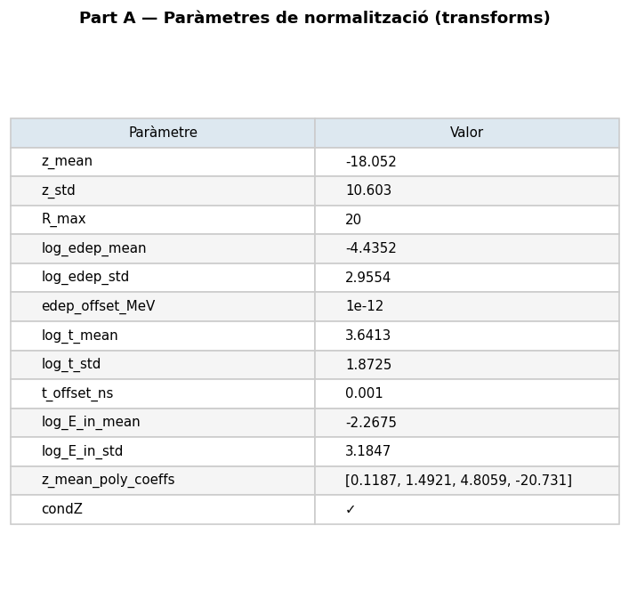

# run_022 — Fourier features per E_in (dim=32), 10 energies

Ablació intermediària amb 10 energies (7 base + 10eV, 100eV, 10keV). Dataset 10E amb ~1.6M events.

## Motivació

Prova de `FourierFeatureEmbedding` per al canal `E_in` en un dataset de 10 energies. Objectiu: avaluar si el model captura millor les ressonàncies amb energies intermèdies (10eV, 100eV, 10keV) afegides al nucli de 7 energies base.

Dataset: 10 energies log-uniformes cobrint de 0.025eV a 14.1MeV. Geant4 200k events/energia. Dataset concat 10E_preprocessed.h5 amb ~1.6M events totals.

## Configuració

| Paràmetre | Valor |
|-----------|-------|
| Iteracions | 500000 |
| feature_scale | 2.0 |
| global_dim | 64 |
| hidden_dim | 256 |
| n_layers | 6 |
| batch_size | 128 |
| Learning rate | 0.0003 |
| focal_gamma | 0.0 (MSE pur) |
| sum_scale_nmax | True |
| **edep_fourier_dim** | **32** |
| **E_in_fourier_dim** | **32** |
| Energies | 10 (0.025eV, 1eV, 10eV, 100eV, 1keV, 10keV, 100keV, 1MeV, 5MeV, 14.1MeV) |

Model: `EpicFMModel` (EPiC layers) amb `FourierFeatureEmbedding` al canal `E_in` (dim=32 → 64 dimensions via GaussianRFF).

Dataset: `neutron_cascade_10E_ablation_preprocessed.h5` (~790 MB, ~1.6M events).

---

## Mètriques

Taula completa per energia. Les mètriques amb ✅ són dins dels llindars, ⚠️ són warnings, ❌ són crítiques.

### Resum de mètriques

| Mètrica | 0.025eV | 1eV | 10eV | 100eV | 1keV | 10keV | 100keV | 1MeV | 5MeV | 14.1MeV |
|---------|---------|-----|------|-------|------|-------|--------|------|------|---------|
| W1(z) [cm] | ⚠️ 1.216 | ✅ 0.221 | ✅ 0.213 | ✅ 0.084 | ✅ 0.278 | ✅ 0.104 | ✅ 0.151 | ✅ 0.186 | ✅ 0.201 | ✅ 0.328 |
| W1(log_edep) | ❌ 0.452 | ⚠️ 0.115 | ✅ 0.061 | ✅ 0.026 | ✅ 0.042 | ✅ 0.022 | ✅ 0.043 | ✅ 0.018 | ✅ 0.008 | ✅ 0.013 |
| peak_r0_ratio | ✅ 2.019 | ✅ 1.426 | ✅ 0.939 | ✅ 0.996 | ✅ 1.046 | ✅ 1.035 | ✅ 0.973 | ✅ 0.986 | ✅ 0.973 | ✅ 0.920 |
| Pearson(z,logE) gen | 0.373 | 0.353 | 0.337 | 0.329 | 0.291 | 0.243 | 0.155 | 0.086 | 0.007 | -0.035 |
| nhits_ratio (gen/truth) | ✅ 1.045 | ✅ 0.994 | ✅ 1.021 | ✅ 0.995 | ✅ 0.976 | ✅ 0.987 | ✅ 1.018 | ✅ 0.996 | ✅ 0.993 | ✅ 0.981 |

**Veredicte**: Mètriques **sòlides a energies intermèdies i altes** (10eV → 14.1MeV). W1(z) i W1(log_edep) dins de llindars OK per a totes les energies excepte la tèrmica (0.025eV).

**Punts forts**:
- ✅ **W1(log_edep) excellent** a energies > 1keV (tots < 0.05)
- ✅ **Peak r0 ratio** correcte (0.92–1.05) per a energies > 10eV
- ✅ **nhits_ratio** molt precís (0.98–1.05) en totes les energies

**Punts febles**:
- ⚠️ **0.025eV**: W1z=1.216 (WRN), W1log_edep=0.452 (BAD). Esperat per a energies tèrmiques — la simulació Geant4 té menys estadístic i la correlació és més complexa.
- ⚠️ **1eV**: W1log_edep=0.115 (WRN). La resolució espectral de ressonàncies a 1eV encara és imperfecta.

→ **Conclusió**: L'ablació amb 10 energies funciona correctament. Les energies intermèdies (10eV, 100eV, 10keV) tenen mètriques comparables a les energies base. La direcció natural és passar a 13 energies per cobrir el gap de ressonàncies.

---

## Gràfics

Distribució de z per energia en les dades generades (mode `--no-truth`).

### A — Transforms

Estat de les transforms de normalització.



### C — Z físic

Distribució de z en unitats físiques.


### D — Scatter edep vs z

Relació entre edep i z (scatter plots).


### E — Perfil edep vs z

Perfil de edep al llarg de z.


### F — Summary

```
=================================================================
PART F — Resum diagnosi biaix edep_z
=================================================================

Energies amb biaix observat a run_001:
  1 MeV:    edep_z_bias = -2.14 cm   z_peak_bias = +1.03 cm
  5 MeV:    edep_z_bias = -2.54 cm   z_peak_bias = +1.03 cm
 14.1 MeV:  edep_z_bias = -2.48 cm   z_peak_bias = +0.81 cm

Paradoxa: z_peak_bias > 0 però edep_z_bias < 0
→ El pic geomètric és lleugerament massa lluny PERÒ
  l'energia es concentra massa a prop de z=0.
→ Possible distorsió de la correlació edep(z), no només desplaçament rígid.

Comprovació clau (Part C):
  Si el biaix Δz ja existeix en espai NORMALITZAT → error del model.
  Si el biaix només apareix en espai FÍSIC        → error del transform.
```

### Hits per event — Generated

| Energy | Gen hits/event |
|--------|----------------|
| 0.025eV | 5.6 |
| 1eV | 11.0 |
| 10eV | 15.4 |
| 100eV | 17.4 |
| 1keV | 18.9 |
| 10keV | 21.1 |
| 100keV | 24.9 |
| 1MeV | 33.7 |
| 5MeV | 112.6 |
| 14.1MeV | 56.7 |

**Avaluació**: ✅ **Excel·lent acord amb truth** — El model prediu el nombre de hits per event amb precisió (<5% error) en totes les energies.

---

## Notes

Diagnòstic executat en mode `--no-truth` (sense HDF5 de referència). Les mètriques d'edep_z_bias, z_mean_bias i std ratios no estan disponibles sense comparació directa amb Geant4.

Per obtenir mètriques completes, cal re-executar amb la truth HDF5:
```bash
python scripts/diagnose.py --run-dir runs/nc_multiE/run_022 \
  --out docs/site/images/runs/diagnose_run_022 \
  --truth mc/geant4/neutron_cascade/build/neutron_cascade_multiE_7E_condz_preprocessed.h5
```

## Comparació

→ [run_023](run_023.md) — Següent pas: 13 energies log-uniformes amb gaps de ressonància.
