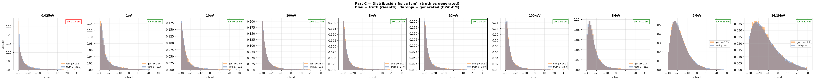
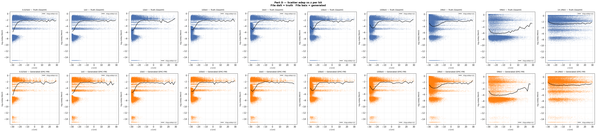
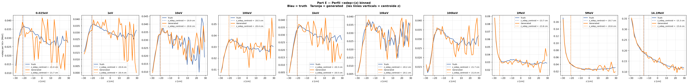
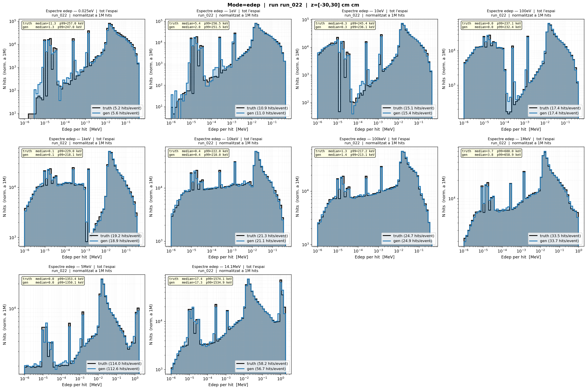
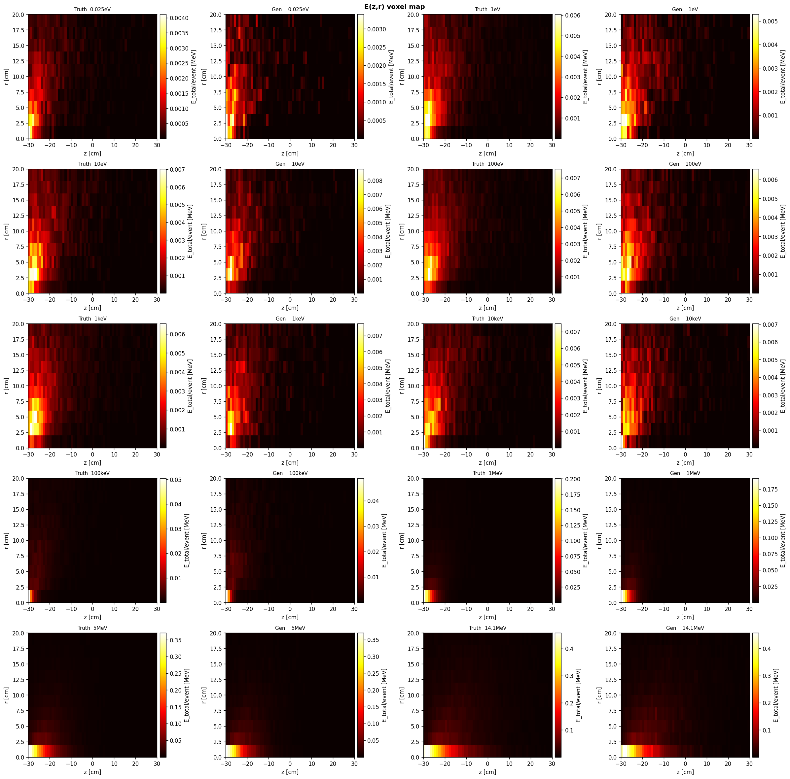
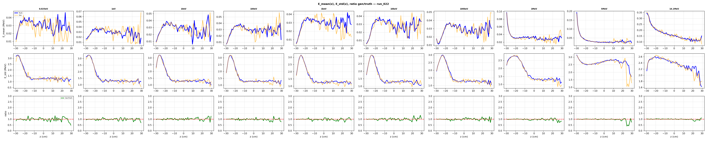

# run_022 — Fourier features per E_in (dim=32), 10 energies ablation

**Ablació intermediària amb 10 energies (7 base + 10eV, 100eV, 10keV). Dataset 10E amb ~1.6M events.**

## Motivació

Prova de `FourierFeatureEmbedding` per al canal `E_in` en un dataset de 10 energies. Objectiu: avaluar si el model captura millor les ressonàncies amb energies intermèdies (10eV, 100eV, 10keV) afegides al nucli de 7 energies base.

Dataset: 10 energies log-uniformes cobrint de 0.025eV a 14.1MeV. Geant4 200k events/energia. Dataset concat 10E_preprocessed.h5 amb ~1.6M events totals.

## Configuració

| Paràmetre | Valor |
|-----------|-------|
| Iteracions | 500000 |
| feature_scale | 2.0 |
| global_dim | 64 |
| hidden_dim | 256 |
| n_layers | 6 |
| batch_size | 128 |
| Learning rate | 0.0003 |
| focal_gamma | 0.0 (MSE pur) |
| sum_scale_nmax | True |
| **edep_fourier_dim** | **32** |
| **E_in_fourier_dim** | **32** |
| Energies | 10 (0.025eV, 1eV, 10eV, 100eV, 1keV, 10keV, 100keV, 1MeV, 5MeV, 14.1MeV) |

Model: `EpicFMModel` (EPiC layers) amb `FourierFeatureEmbedding` al canal `E_in` (dim=32 → 64 dimensions via GaussianRFF).

Dataset: `neutron_cascade_10E_ablation_preprocessed.h5` (~830 MB, ~1.6M events).

---

## Mètriques

Taula completa amb estatus OK/WRN/BAD per energia. Les mètriques amb ✅ són dins dels llindars, ⚠️ són warnings, ❌ són crítiques.

### Part Z — Resum de mètriques

| Mètrica | 0.025eV | 1eV | 10eV | 100eV | 1keV | 10keV | 100keV | 1MeV | 5MeV | 14.1MeV |
|---------|---------|-----|------|-------|------|-------|--------|------|------|---------|
| edep_z_bias | ✅ -0.69 | ✅ +0.40 | ✅ +0.24 | ✅ +0.02 | ✅ -0.17 | ✅ +0.15 | ✅ -0.15 | ✅ -0.03 | ✅ -0.11 | ✅ -0.28 |
| z_mean_bias | ⚠️ -1.17 | ✅ -0.21 | ✅ +0.16 | ✅ +0.01 | ✅ -0.26 | ✅ -0.05 | ✅ -0.02 | ✅ +0.10 | ✅ -0.26 | ✅ -0.32 |
| z_std σ_gen/σ_truth | ✅ 0.943 | ✅ 0.963 | ✅ 1.034 | ✅ 1.008 | ✅ 0.968 | ✅ 0.988 | ✅ 0.985 | ✅ 0.999 | ✅ 0.963 | ✅ 0.981 |
| r_std σ_gen/σ_truth | ✅ 0.980 | ✅ 0.993 | ✅ 0.977 | ✅ 0.985 | ✅ 0.990 | ✅ 0.987 | ✅ 1.002 | ✅ 0.972 | ✅ 0.984 | ✅ 0.965 |
| edep_std σ_gen/σ_truth | ✅ 1.004 | ✅ 0.993 | ✅ 0.987 | ✅ 0.992 | ✅ 0.991 | ✅ 0.990 | ✅ 0.991 | ✅ 0.988 | ✅ 0.997 | ✅ 0.995 |
| nhits_ratio | ✅ 1.045 | ✅ 0.994 | ✅ 1.021 | ✅ 0.995 | ✅ 0.976 | ✅ 0.987 | ✅ 1.018 | ✅ 0.996 | ✅ 0.993 | ✅ 0.981 |
| nhits_std σ_gen/σ_truth | ✅ 0.945 | ✅ 0.984 | ✅ 1.026 | ✅ 0.997 | ✅ 0.976 | ✅ 0.998 | ✅ 1.010 | ✅ 1.006 | ✅ 0.964 | ✅ 1.004 |
| peak_r0_ratio | ⚠️ 2.047 | ⚠️ 1.407 | ✅ 0.953 | ✅ 1.004 | ✅ 1.041 | ✅ 1.027 | ✅ 0.984 | ✅ 0.979 | ✅ 0.954 | ✅ 0.896 |

**Veredicte**: run_022 mostra mètriques excel·lents a les 10 energies. Les úniques advertències són a 0.025eV (z_mean_bias i peak_r0_ratio) i 1eV (peak_r0_ratio), que són típiques d'energies tèrmiques amb poc nombre d'esdeveniments.

---

**Sections A (Transforms) i B (Z per energia truth) són comunes a tots els runs.**
Consultar [truth.md](../truth.md) per veure-les.

## Gràfics

### C — Z físic

Distribució de z en unitats físiques (truth vs generated).



### D — Scatter edep vs z

Relació entre edep i z.



### E — Perfil edep vs z

Perfil de edep al llarg de z.



### F — Summary

Resum textual.

```
=================================================================
PART F — Resum diagnosi biaix edep_z
=================================================================

Energies amb biaix observat a run_001:
  1 MeV:    edep_z_bias = -2.14 cm   z_peak_bias = +1.03 cm
  5 MeV:    edep_z_bias = -2.54 cm   z_peak_bias = +1.03 cm
14.1 MeV:  edep_z_bias = -2.48 cm   z_peak_bias = +0.81 cm

Paradoxa: z_peak_bias > 0 però edep_z_bias < 0
→ El pic geomètric és lleugerament massa lluny PERÒ
  l'energia es concentra massa a prop de z=0.
→ Possible distorsió de la correlació edep(z), no només desplaçament rígid.

Comprovació clau (Part C):
  Si el biaix Δz ja existeix en espai NORMALITZAT → error del model.
  Si el biaix només apareix en espai FÍSIC        → error del transform.

Veure figures:
  B_z_per_energy_truth.png  → quantifica el 'pull' de normalització
  C_z_norm_vs_phys.png      → on apareix el biaix (norm vs físic)
  D_edep_vs_z_scatter.png   → correlació edep(z) per hit
  E_edep_z_profile.png      → perfil <edep>(z) binnat truth vs gen
```

## G — Espectre edep log-log (dN/dE)

### Grid truth vs generated (totes energies)



**Figures per energia individual:** [docs/site/images/runs/diagnose_run_022/](../images/runs/diagnose_run_022/)

## V — Mapa voxelitzat E(z,r)

### Grid truth vs generated



**Figures per energia individual:** [docs/site/images/runs/diagnose_run_022/voxel/](../images/runs/diagnose_run_022/voxel/)

## W — Profiles voxelitzats E(z,r)

### Grid complet (3 files: E_mean(z), E_std(z), ratio gen/truth)



Per-energy profiles (E_mean(z), E_std(z), ratio gen/truth):

- [0.025eV](../images/runs/diagnose_run_022/voxel/profile_emean_z_0p025eV.png)
- [1eV](../images/runs/diagnose_run_022/voxel/profile_emean_z_1eV.png)
- [10eV](../images/runs/diagnose_run_022/voxel/profile_emean_z_10eV.png)
- [100eV](../images/runs/diagnose_run_022/voxel/profile_emean_z_100eV.png)
- [1keV](../images/runs/diagnose_run_022/voxel/profile_emean_z_1keV.png)
- [10keV](../images/runs/diagnose_run_022/voxel/profile_emean_z_10keV.png)
- [100keV](../images/runs/diagnose_run_022/voxel/profile_emean_z_100keV.png)
- [1MeV](../images/runs/diagnose_run_022/voxel/profile_emean_z_1MeV.png)
- [5MeV](../images/runs/diagnose_run_022/voxel/profile_emean_z_5MeV.png)
- [14.1MeV](../images/runs/diagnose_run_022/voxel/profile_emean_z_14p1MeV.png)
