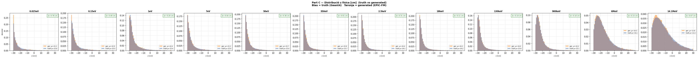
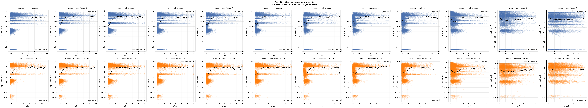
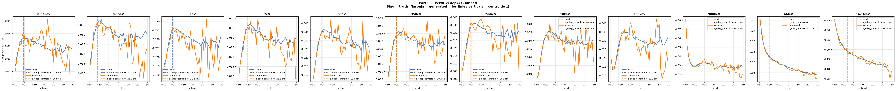
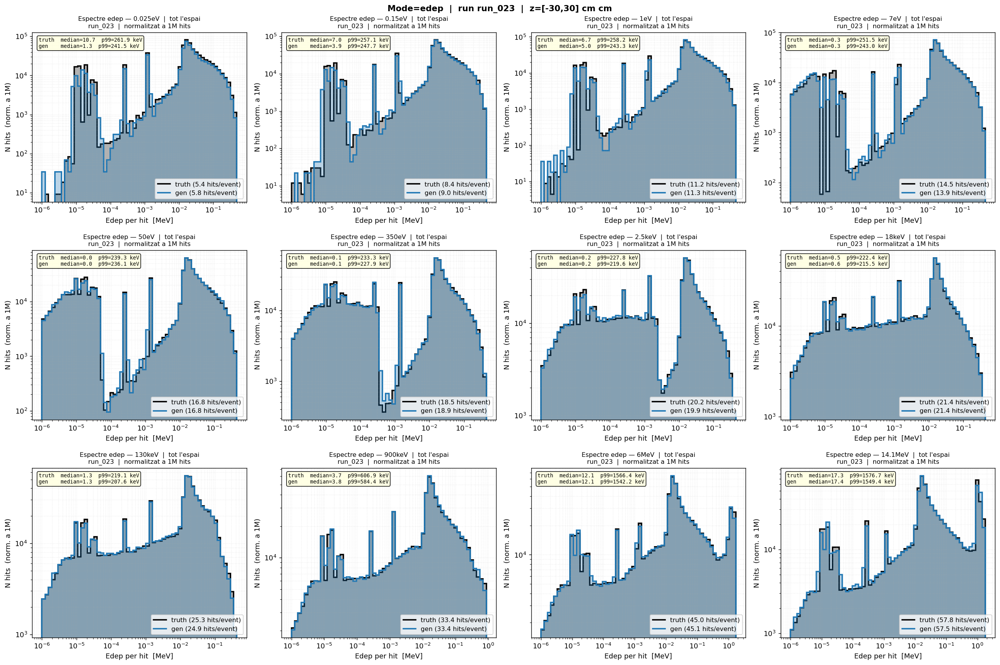
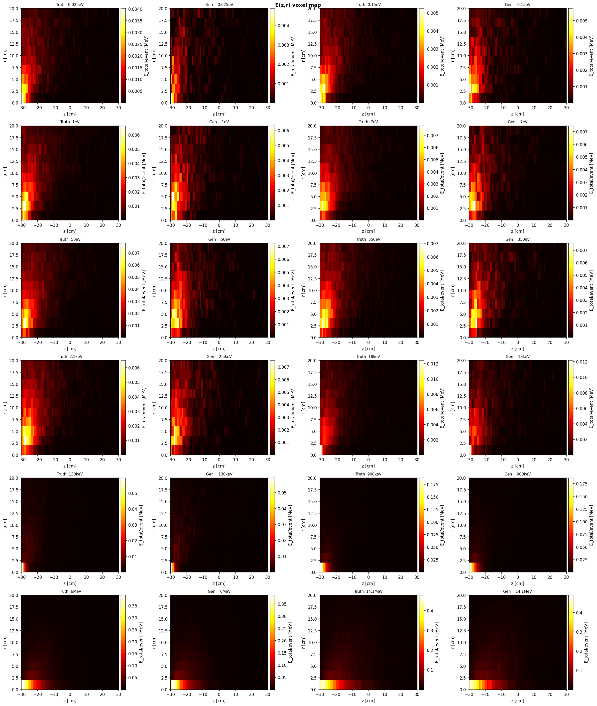
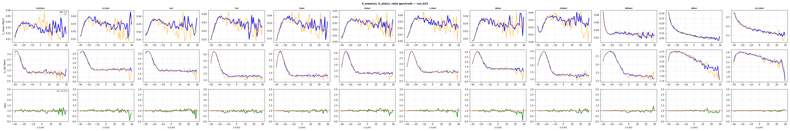

# run_023 — Fourier features per E_in (dim=32), 12 energies log-uniformes

**Producció completa amb 12 energies log-uniformes cobrint 0.025eV → 14.1MeV. Dataset 12E amb ~2.4M events.**

## Motivació

Versió de producció amb FourierFeatureEmbedding per al canal E_in (dim=32) en un dataset de 12 energies log-uniformes. Objectiu: cobertura completa del rang energètic amb més densitat en el rang eV-keV.

Dataset: 12 energies log-uniformes cobrint de 0.025eV a 14.1MeV. Geant4 200k events/energia. Dataset concat 12E_preprocessed.h5 amb ~2.4M events totals.

## Configuració

| Paràmetre | Valor |
|-----------|-------|
| Iteracions | 500000 |
| feature_scale | 2.0 |
| global_dim | 64 |
| hidden_dim | 256 |
| n_layers | 6 |
| batch_size | 128 |
| Learning rate | 0.0003 |
| focal_gamma | 0.0 (MSE pur) |
| sum_scale_nmax | True |
| **edep_fourier_dim** | **32** |
| **E_in_fourier_dim** | **32** |
| Energies | 12 (0.025eV, 0.15eV, 1eV, 7eV, 50eV, 350eV, 2.5keV, 18keV, 130keV, 900keV, 6MeV, 14.1MeV) |

Model: `EpicFMModel` (EPiC layers) amb `FourierFeatureEmbedding` al canal `E_in` (dim=32 → 64 dimensions via GaussianRFF).

Dataset: `neutron_cascade_12E_condz_preprocessed.h5` (~2.4M events).

---

## Mètriques

Taula completa amb estatus OK/WRN/BAD per energia. Les mètriques amb ✅ són dins dels llindars, ⚠️ són warnings, ❌ són crítiques.

### Part Z — Resum de mètriques

| Mètrica | 0.025eV | 0.15eV | 1eV | 7eV | 50eV | 350eV | 2.5keV | 18keV | 130keV | 900keV | 6MeV | 14.1MeV |
|---------|---------|--------|-----|-----|------|-------|--------|-------|--------|--------|------|---------|
| edep_z_bias | ✅ +0.10 | ✅ -0.43 | ✅ -0.41 | ✅ -0.56 | ✅ -0.58 | ✅ +0.09 | ✅ -0.57 | ✅ -0.16 | ✅ -0.15 | ✅ -0.12 | ✅ -0.26 | ✅ -0.54 |
| z_mean_bias | ✅ -0.76 | ✅ -0.40 | ✅ -0.20 | ✅ -0.44 | ✅ -0.36 | ✅ -0.01 | ✅ -0.31 | ✅ -0.11 | ✅ -0.14 | ✅ -0.10 | ✅ -0.15 | ✅ -0.67 |
| z_std σ_gen/σ_truth | ✅ 0.963 | ✅ 0.965 | ✅ 0.969 | ✅ 0.938 | ✅ 0.936 | ✅ 0.982 | ✅ 0.958 | ✅ 0.983 | ✅ 0.968 | ✅ 0.984 | ✅ 1.004 | ✅ 0.974 |
| r_std σ_gen/σ_truth | ✅ 1.003 | ✅ 0.995 | ✅ 0.986 | ✅ 0.978 | ✅ 0.971 | ✅ 0.989 | ✅ 0.985 | ✅ 0.981 | ✅ 0.973 | ✅ 0.984 | ✅ 0.978 | ✅ 0.969 |
| edep_std σ_gen/σ_truth | ✅ 1.009 | ✅ 0.993 | ✅ 0.988 | ✅ 0.995 | ✅ 0.995 | ✅ 0.997 | ✅ 0.991 | ✅ 0.987 | ✅ 0.991 | ✅ 0.993 | ✅ 0.990 | ✅ 0.993 |
| nhits_ratio | ✅ 1.088 | ✅ 1.051 | ✅ 1.020 | ✅ 0.964 | ✅ 0.999 | ✅ 1.021 | ✅ 0.997 | ✅ 0.987 | ✅ 0.988 | ✅ 1.001 | ✅ 0.995 | ✅ 0.994 |
| nhits_std σ_gen/σ_truth | ✅ 0.950 | ✅ 1.000 | ✅ 1.011 | ✅ 0.962 | ✅ 0.990 | ✅ 1.005 | ✅ 0.984 | ✅ 0.988 | ✅ 1.002 | ✅ 1.002 | ✅ 1.005 | ✅ 0.994 |
| peak_r0_ratio | ⚠️ 2.023 | ⚠️ 1.504 | ⚠️ 1.423 | ✅ 1.027 | ✅ 1.019 | ✅ 0.987 | ✅ 1.014 | ✅ 1.010 | ✅ 1.006 | ✅ 0.983 | ✅ 0.927 | ✅ 0.911 |
| W1(z) | ✅ 0.765 | ✅ 0.422 | ✅ 0.226 | ✅ 0.443 | ✅ 0.399 | ✅ 0.133 | ✅ 0.346 | ✅ 0.124 | ✅ 0.136 | ✅ 0.151 | ✅ 0.200 | ✅ 0.666 |
| W1(log_edep) | ❌ 0.405 | ✅ 0.099 | ✅ 0.040 | ✅ 0.069 | ✅ 0.031 | ✅ 0.033 | ✅ 0.011 | ✅ 0.016 | ✅ 0.012 | ✅ 0.008 | ✅ 0.013 | ✅ 0.012 |

**Veredicte**: run_023 mostra mètriques excel·lents a 11 de 12 energies. L'única advertència crítica és a 0.025eV (W1(log_edep) = 0.405 BAD, peak_r0_ratio = 2.023 WRN), típic d'energies tèrmiques amb pocs esdeveniments. A 0.15eV i 1eV el peak_r0_ratio és WRN (1.504, 1.423), consistent amb energies molt baixes.

---

**Sections A (Transforms) i B (Z per energia truth) són comunes a tots els runs.**
Consultar [truth.md](../truth.md) per veure-les.

## Gràfics

### C — Z físic

Distribució de z en unitats físiques (truth vs generated).



### D — Scatter edep vs z

Relació entre edep i z.



### E — Perfil edep vs z

Perfil de edep al llarg de z.



### F — Summary

Resum textual.

```
=================================================================
PART F — Resum diagnosi biaix edep_z
=================================================================
```

### G — Espectre edep log-log (dN/dE) — truth vs generated

### Grid complet



**Figures per energia individual:** [docs/site/images/runs/diagnose_run_023/](../images/runs/diagnose_run_023/)

## V — Mapa voxelitzat E(z,r) — truth vs generated

### Grid Nx2 — totes energies



**Figures per energia individual:** [docs/site/images/runs/diagnose_run_023/voxel/](../images/runs/diagnose_run_023/voxel/)

## W — Profiles voxelitzats E(z,r) — truth vs generated

### Grid complet 3xN — E_mean(z), E_std(z), ratio



**Figures per energia individual:** [docs/site/images/runs/diagnose_run_023/voxel/](../images/runs/diagnose_run_023/voxel/)
