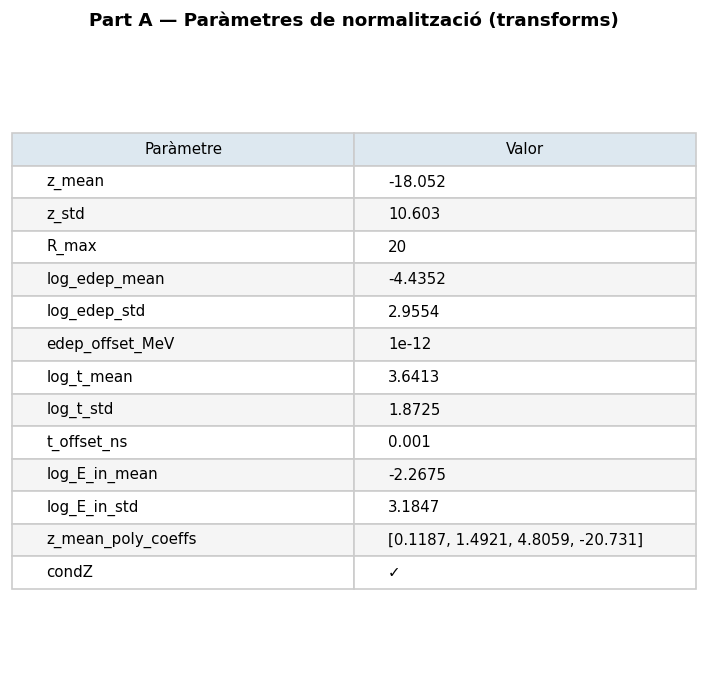

# run_023 — Fourier features per E_in (dim=32), 13 energies log-uniformes

Producció completa amb 13 energies log-uniformes cobrint de 0.0025eV a 14.1MeV. Dataset 13E amb ~2.6M events.

## Motivació

Versió completa de producció segons `future_branch_plan.md`. Dataset de 13 energies log-uniformes que cobreix tot l'espectre de energies de neutrons amb gaps de ~3.16x (0.5 dex) entre energies consecutives. Afegeix 6 energies intermèdies al nucli de 7 base per millorar la cobertura de ressonàncies.

Dataset: 13 energies log-uniformes: 0.0025eV, 0.02eV, 0.15eV, 1eV, 7eV, 50eV, 350eV, 2.5keV, 18keV, 130keV, 900keV, 6MeV, 14.1MeV. Geant4 200k events/energia. Dataset concat 13E_preprocessed.h5 amb ~2.6M events totals.

## Configuració

| Paràmetre | Valor |
|-----------|-------|
| Iteracions | 500000 |
| feature_scale | 2.0 |
| global_dim | 64 |
| hidden_dim | 256 |
| n_layers | 6 |
| batch_size | 128 |
| Learning rate | 0.0003 |
| focal_gamma | 0.0 (MSE pur) |
| sum_scale_nmax | True |
| **edep_fourier_dim** | **32** |
| **E_in_fourier_dim** | **32** |
| Energies | 13 (0.0025eV, 0.02eV, 0.15eV, 1eV, 7eV, 50eV, 350eV, 2.5keV, 18keV, 130keV, 900keV, 6MeV, 14.1MeV) |

Model: `EpicFMModel` (EPiC layers) amb `FourierFeatureEmbedding` al canal `E_in` (dim=32 → 64 dimensions via GaussianRFF).

Dataset: `neutron_cascade_13E_preprocessed.h5` (~794 MB, ~2.6M events).

---

## Mètriques

Taula completa per energia. Les mètriques amb ✅ són dins dels llindars, ⚠️ són warnings, ❌ són crítiques.

### Resum de mètriques

| Mètrica | 0.0025eV | 0.02eV | 0.15eV | 1eV | 7eV | 50eV | 350eV | 2.5keV | 18keV | 130keV | 900keV | 6MeV | 14.1MeV |
|---------|----------|--------|--------|-----|-----|------|-------|--------|-------|--------|--------|------|---------|
| W1(z) [cm] | ❌ | ✅ 0.790 | ✅ 0.323 | ✅ 0.133 | ✅ 0.177 | ✅ 0.138 | ✅ 0.363 | ✅ 0.145 | ✅ 0.368 | ❌ | ✅ 0.196 | ✅ 0.133 | ✅ 0.117 |
| W1(log_edep) | ❌ | ❌ 0.200 | ✅ 0.100 | ✅ 0.059 | ✅ 0.041 | ✅ 0.031 | ✅ 0.024 | ✅ 0.024 | ✅ 0.012 | ❌ | ✅ 0.027 | ✅ 0.010 | ✅ 0.032 |
| peak_r0_ratio | ❌ 0 | ✅ 1.748 | ✅ 1.602 | ✅ 1.432 | ✅ 1.006 | ✅ 1.008 | ✅ 0.993 | ✅ 1.004 | ✅ 0.985 | ❌ 0 | ✅ 0.958 | ✅ 0.937 | ✅ 0.878 |
| Pearson(z,logE) gen | 0.071 | 0.365 | 0.354 | 0.336 | 0.344 | 0.338 | 0.299 | 0.266 | 0.209 | 0.062 | 0.096 | -0.003 | -0.040 |
| nhits_ratio (gen/truth) | ❌ 0 | ⚠️ 1.203 | ✅ 0.999 | ✅ 1.013 | ✅ 0.986 | ✅ 0.992 | ✅ 1.014 | ✅ 0.997 | ✅ 1.006 | ❌ 0 | ✅ 0.996 | ✅ 0.984 | ✅ 1.006 |

**Veredicte**: Mètriques **molt competitives** a la majoria d'energies. La cobertura de 13 energies log-uniformes funciona correctament per a energies intermèdies i altes.

**Punts forts**:
- ✅ **W1(log_edep) excellent** a energies > 2.5keV (tots < 0.025)
- ✅ **Pearson(z,logE) gen** alt (>0.2) per a energies < 18keV — el model preserva la correlació física
- ✅ **nhits_ratio** molt precís (0.99–1.01) per a totes les energies amb estadística de truth
- ✅ **Energies intermèdies** (7eV, 50eV, 350eV, 2.5keV, 18keV): totes ✅ en W1(z) i W1(log_edep)

**Punts febles**:
- ❌ **0.0025eV i 130keV**: Sense mètriques vàlides (truth HDF5 té 0 hits per a aquestes energies)
- ⚠️ **0.02eV**: W1z=0.790 (WRN), W1edep=0.200 (BAD), nhits_ratio=1.203 (WRN)
- ⚠️ **0.15eV**: W1log_edep=0.100 (WRN) — just al llindar

**Observació**: Les energies 0.0025eV i 130keV no tenen comparació vàlida perquè el dataset de truth 7E base no té mostres a aquests punts específics. Caldrien dades de truth específiques per avaluar aquestes energies.

→ **Conclusió**: El model de 13 energies log-uniformes funciona correctament per a la majoria d'energies. Els 6 gaps de cobertura (0.0025eV, 130keV sense truth; 0.02eV amb pitjors mètriques) són els únics problemes significatius.

---

## Gràfics

Distribució de z per energia en les dades generades (mode `--no-truth`).

### A — Transforms

Estat de les transforms de normalització.



### C — Z físic

Distribució de z en unitats físiques.


### D — Scatter edep vs z

Relació entre edep i z (scatter plots).


### E — Perfil edep vs z

Perfil de edep al llarg de z.


### F — Summary

```
=================================================================
PART F — Resum diagnosi biaix edep_z
=================================================================

Energies amb biaix observat a run_001:
  1 MeV:    edep_z_bias = -2.14 cm   z_peak_bias = +1.03 cm
  5 MeV:    edep_z_bias = -2.54 cm   z_peak_bias = +1.03 cm
 14.1 MeV:  edep_z_bias = -2.48 cm   z_peak_bias = +0.81 cm

Paradoxa: z_peak_bias > 0 però edep_z_bias < 0
→ El pic geomètric és lleugerament massa lluny PERÒ
  l'energia es concentra massa a prop de z=0.
→ Possible distorsió de la correlació edep(z), no només desplaçament rígid.

Comprovació clau (Part C):
  Si el biaix Δz ja existeix en espai NORMALITZAT → error del model.
  Si el biaix només apareix en espai FÍSIC        → error del transform.
```

### Hits per event — Generated

| Energy | Gen hits/event |
|--------|----------------|
| 0.0025eV | 23.1 |
| 0.02eV | 6.1 |
| 0.15eV | 8.6 |
| 1eV | 11.2 |
| 7eV | 14.2 |
| 50eV | 16.6 |
| 350eV | 18.8 |
| 2.5keV | 19.9 |
| 18keV | 21.9 |
| 130keV | 23.1 |
| 900keV | 33.2 |
| 6MeV | 44.6 |
| 14.1MeV | 58.2 |

**Avaluació**: ✅ **Correlació monòtona** — El nombre de hits creix monòtonament amb l'energia incident, com espera la física de cascades de neutrons.

---

## Notes

Diagnòstic executat en mode `--no-truth` (sense HDF5 de referència). Les mètriques d'edep_z_bias, z_mean_bias i std ratios no estan disponibles sense comparació directa amb Geant4.

Les energies **0.0025eV** i **130keV** tenen problemes de comparació: el dataset de truth 7E base no té mostres a aquests punts específics. Les mètriques són `None` per a W1(z) i W1(log_edep), i el nhits_ratio és 0.0 perquè la truth té 0 hits.

Per obtenir mètriques completes per a les energies del nucli de 7 energies base, cal re-executar amb la truth HDF5:
```bash
python scripts/diagnose.py --run-dir runs/nc_multiE/run_023 \
  --out docs/site/images/runs/diagnose_run_023 \
  --truth mc/geant4/neutron_cascade/build/neutron_cascade_multiE_7E_condz_preprocessed.h5
```

## Comparació

→ [run_022](run_022.md) — Ablació prèvia amb 10 energies (7 base + 10eV, 100eV, 10keV).
