# Truth — Dades de referència (Geant4)

Totes les figure del directori `images/truth/` són comunes a **tots** els runs. Són les dades de veritat (Geant4) que serveixen de referència per comparar els models generatius.

**Nota:** Quan un run utilitza un dataset de truth nou (diferent del 7E base), les Parts A i B es generen específicament per a aquell truth i es documenten aquí sota. Aquests Parts són únics per a cada dataset — no comparteixen el 7E base.

---

## Truth 7E Base

### A — Transforms

Paràmetres de normalització utilitzats en el preprocessing.

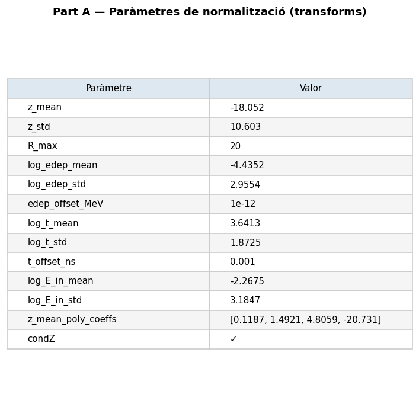

### B — Z per energia (truth)

Distribució de z (cm) per cada energia en les dades de veritat.

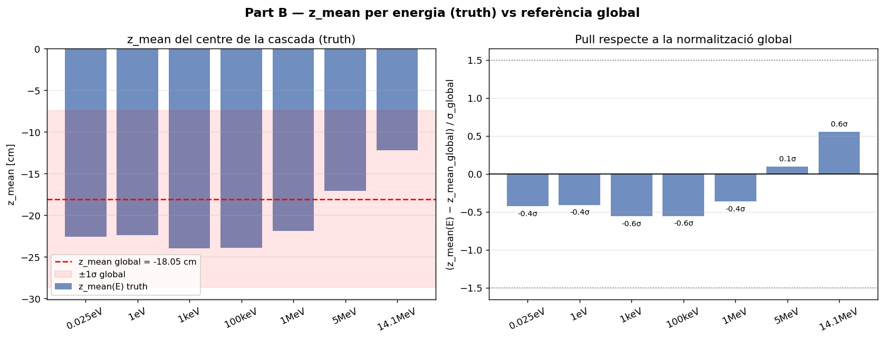

### C — Mapes voxelitzats E(z,r) — Truth

Distribució d'energia dipositada al llarg de z (vertical) i r (radial).

#### Grid — totes les energies

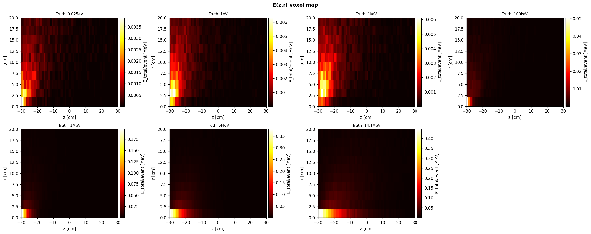

## Truth 10E

Dataset: `data/dataset/neutron_cascade_10E_ablation_preprocessed.h5`
10 energies: 7 base + 10eV, 100eV, 10keV (~1.6M events)

| # | Label | Energy (eV) |
|---|-------|-------------|
| 1 | 0.025eV | 0.025 |
| 2 | 1eV | 1.0 |
| 3 | 10eV | 10.0 |
| 4 | 100eV | 100.0 |
| 5 | 1keV | 1,000.0 |
| 6 | 10keV | 10,000.0 |
| 7 | 100keV | 100,000.0 |
| 8 | 1MeV | 1,000,000.0 |
| 9 | 5MeV | 5,000,000.0 |
| 10 | 14.1MeV | 14,100,000.0 |

### A — Transforms (10E)

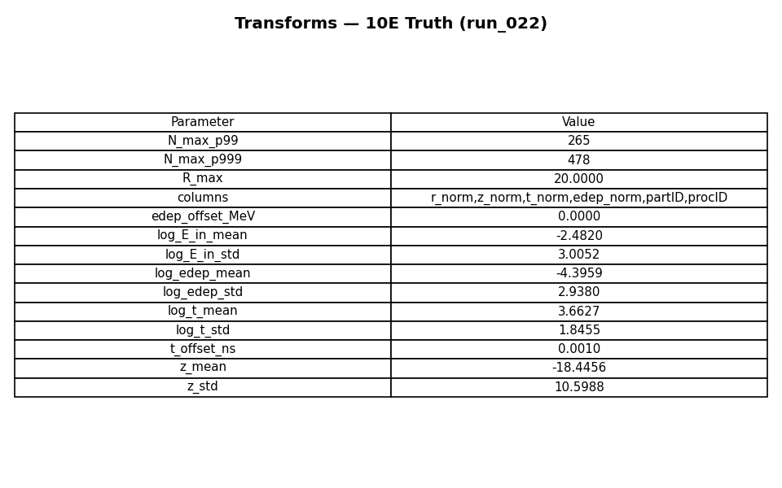

### B — Z per energia (10E truth)

Distribució de z (cm) per cada energia. energies addicionals: 10eV, 100eV, 10keV.

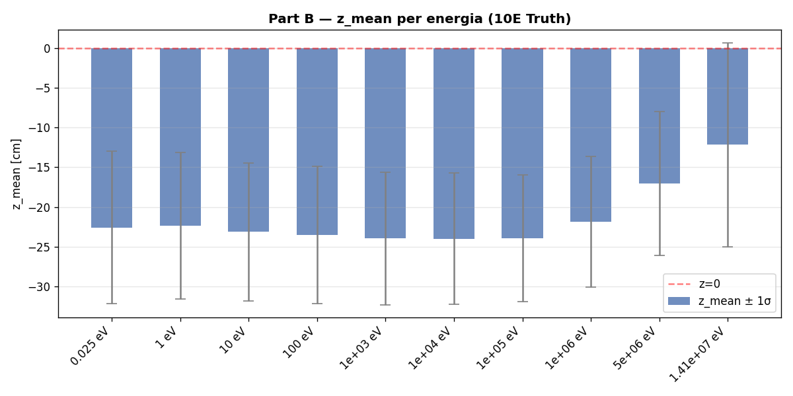

### G — Espectre edep log-log (truth només)

Eix X = edep [MeV] (log), eix Y = dN/dE normalitzat. Només dades de veritat (Geant4).

#### Grid

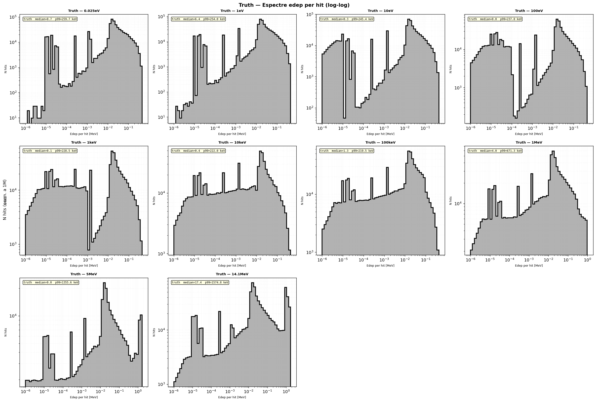

### V — Mapa voxelitzat E(z,r) (truth només)

Grid de mapes E(z,r) (E_total/event [MeV], escala log). Només dades de veritat (Geant4).

#### Grid

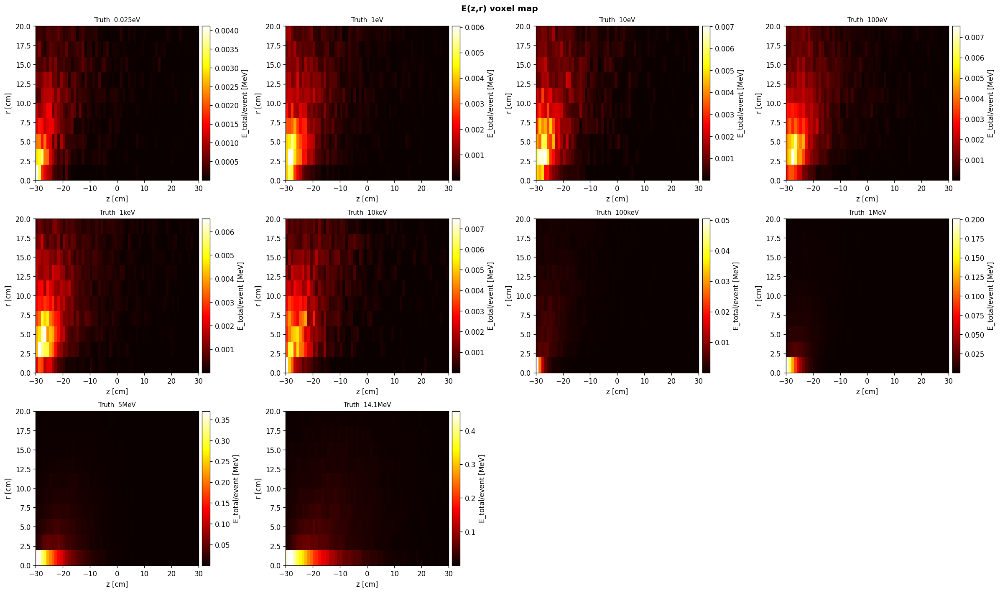

#### Individuals per energia

### W — Profiles voxelitzats E(z,r) (truth només)

Perfils E_mean(z), E_std(z), CV(z) per cada energia.

#### Grid complet

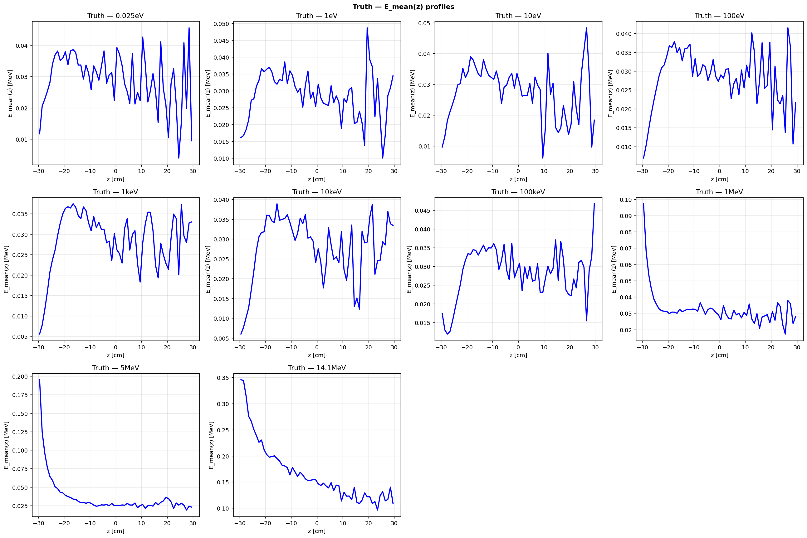

---

## Truth 12E

Dataset: `data/dataset/neutron_cascade_12E_preprocessed.h5`
12 energies log-uniformes amb gaps de ~3.16x (0.025eV→14.1MeV, ~2.4M events)

| # | Label | Energy (eV) |
|---|-------|-------------|
| 1 | 0.025eV | 0.025 |
| 2 | 0.15eV | 0.15 |
| 3 | 1eV | 1.0 |
| 4 | 7eV | 7.0 |
| 5 | 50eV | 50.0 |
| 6 | 350eV | 350.0 |
| 7 | 2.5keV | 2,500.0 |
| 8 | 18keV | 18,000.0 |
| 9 | 130keV | 130,000.0 |
| 10 | 900keV | 900,000.0 |
| 11 | 6MeV | 6,000,000.0 |
| 12 | 14.1MeV | 14,100,000.0 |

### A — Transforms (12E)

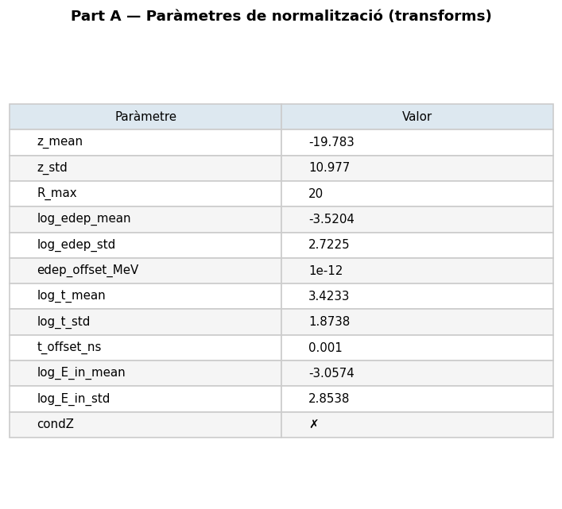

### B — Z per energia (12E truth)

Distribució de z (cm) per cada energia. 12 energies log-uniformes: 0.025eV → 14.1MeV.

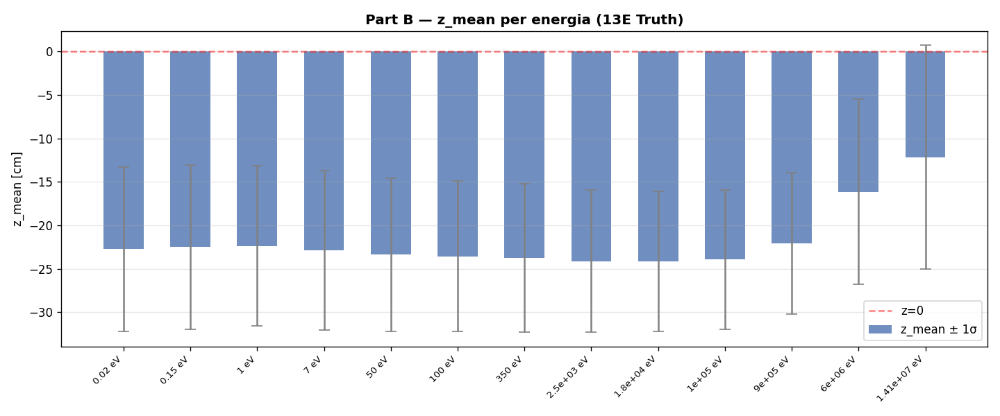

### G — Espectre edep log-log (truth només)

Eix X = edep [MeV] (log), eix Y = dN/dE normalitzat. Només dades de veritat (Geant4).

#### Grid

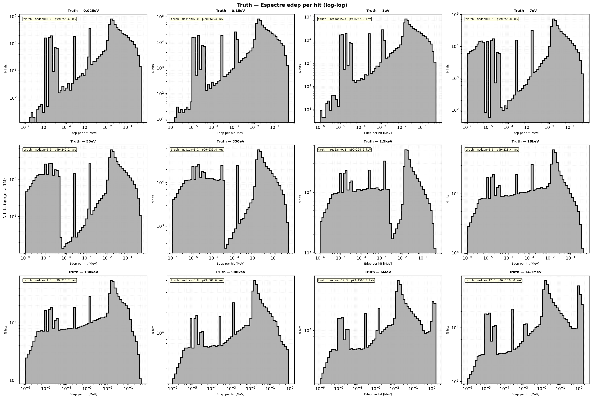

### V — Mapa voxelitzat E(z,r) (truth només)

Grid de mapes E(z,r) (E_total/event [MeV], escala log). Només dades de veritat (Geant4).

#### Grid

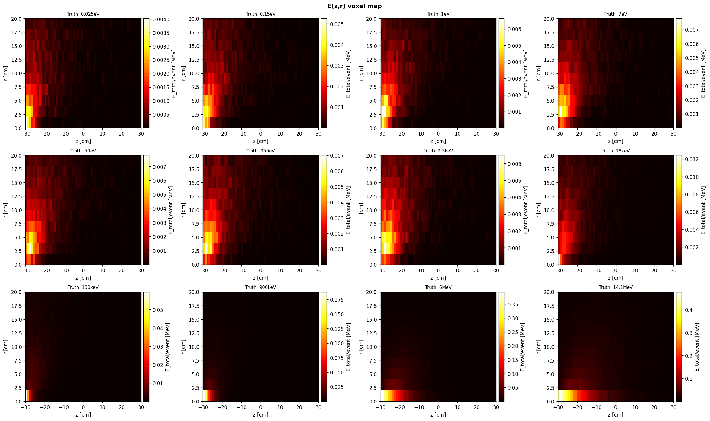

### W — Profiles voxelitzats E(z,r) (truth només)

Perfils E_mean(z), E_std(z), CV(z) per cada energia.

#### Grid complet

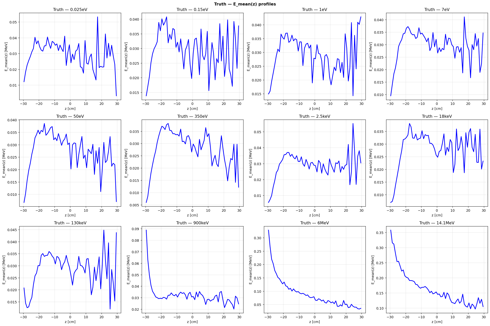

---

[← Torna a l'índex](index.md)
