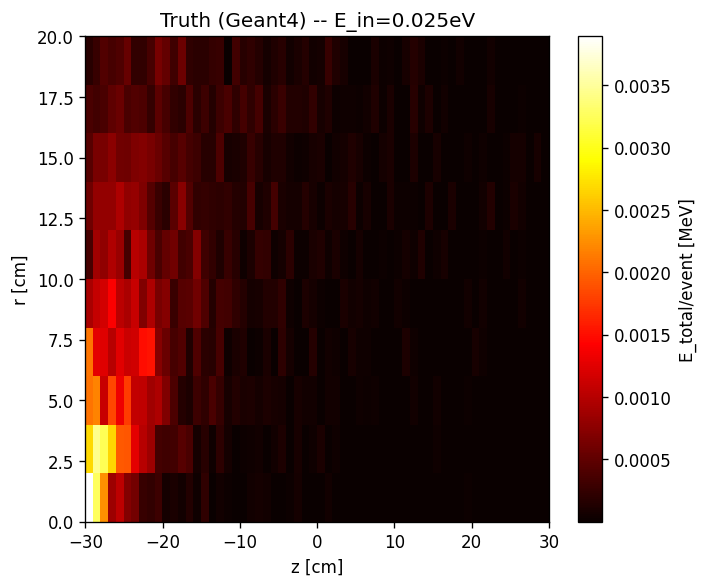
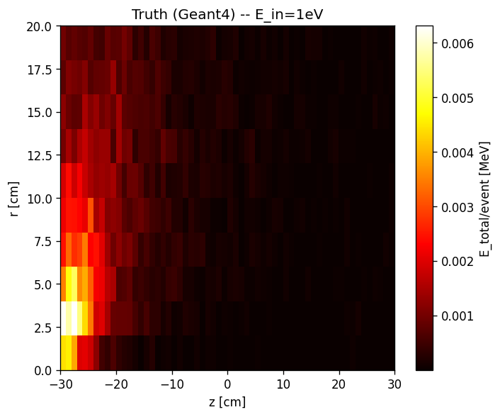
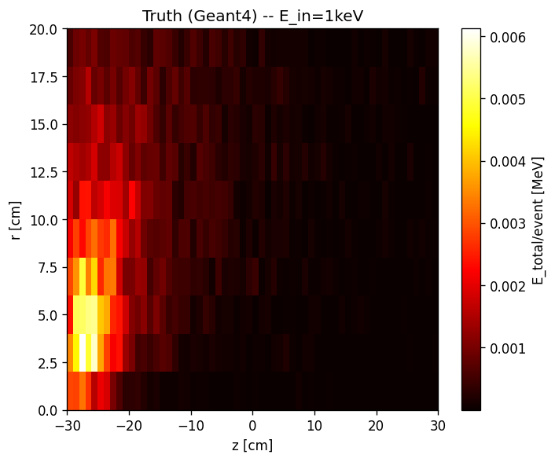
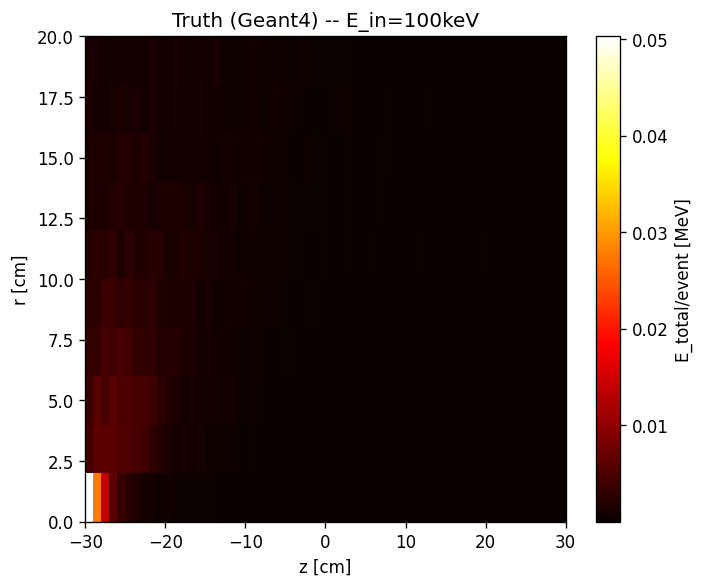
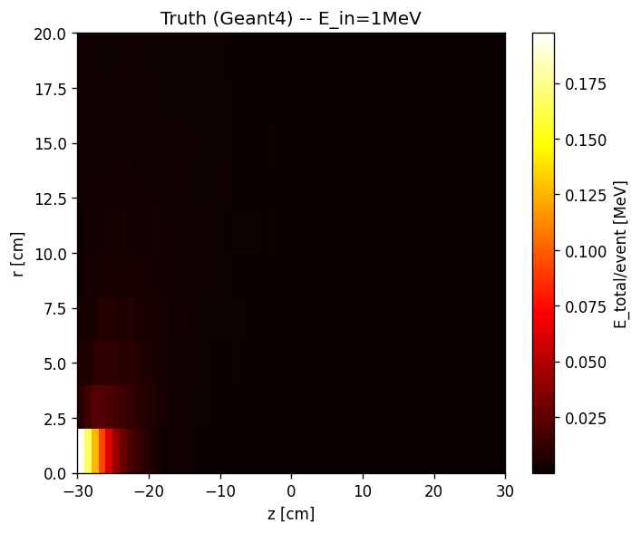
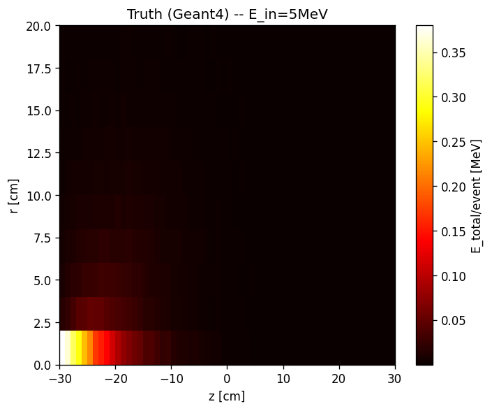
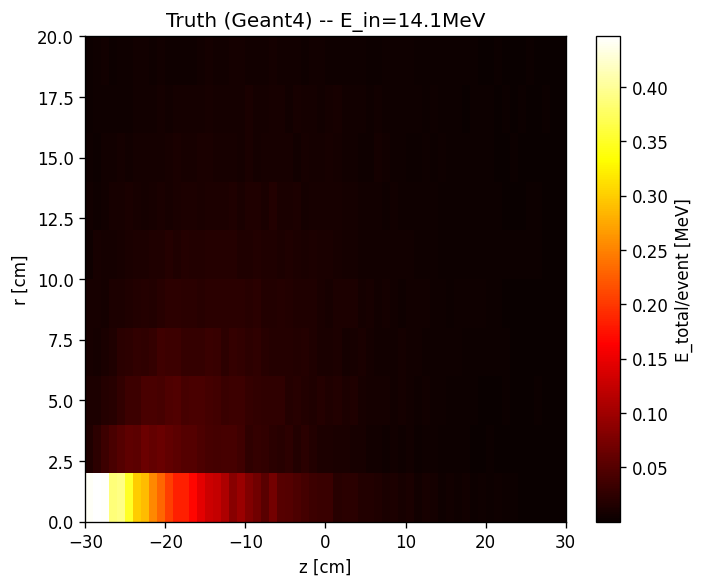

# Truth — Dades de referència (Geant4)

Totes les figures del directori `images/truth/` són comunes a **tots** els runs. Són les dades de veritat (Geant4) que serveixen de referència per comparar els models generatius.

## A — Transforms

Paràmetres de normalització utilitzats en el preprocessing.

## B — Z per energia (truth)

Distribució de z (cm) per cada energia en les dades de veritat.

## C — Mapes voxelitzats E(z,r) — Truth

Distribució d'energia dipositada al llarg de z (vertical) i r (radial).

### Grid — totes les energies

### Individuals per energia

#### 0.025eV

#### 1eV

#### 1keV

#### 100keV

#### 1MeV

#### 5MeV

#### 14.1MeV

---

[← Torna a l'índex](index.md)
